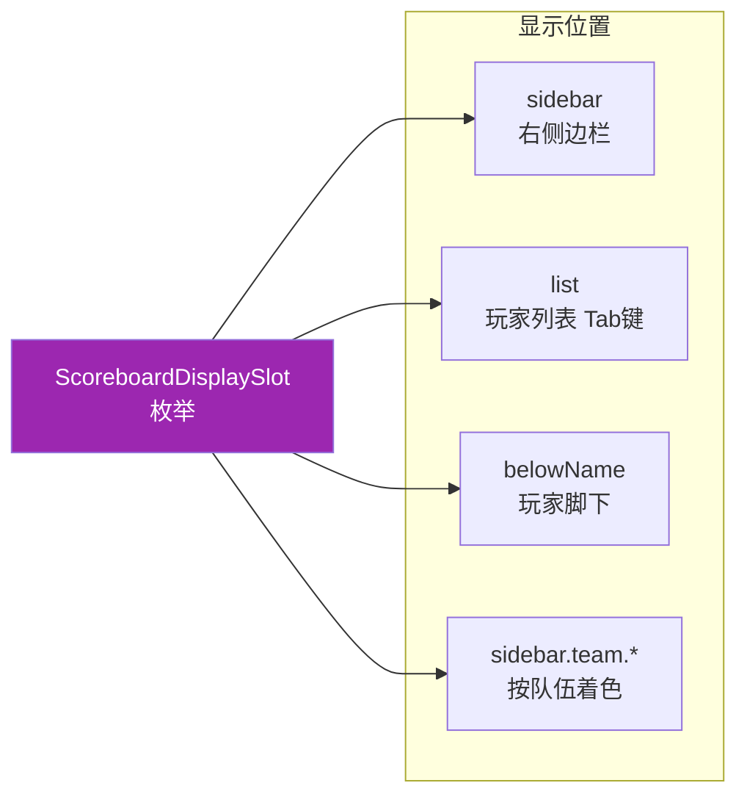
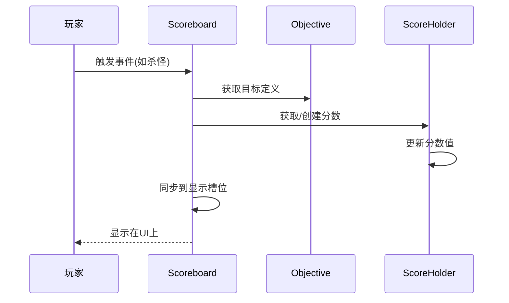

# 记分板系统 (Scoreboard System)

## 目标

读完这篇文章后，你将理解 Minecraft 记分板系统的核心概念，并能在源码中找到对应的实现代码。

## 前置知识

- 了解 Minecraft 服务端基本架构
- 熟悉 Java 接口和类的概念

## 核心概念

### 什么是记分板？

想象一下学校的成绩单。记分板就像 Minecraft 世界里的"成绩单"，它可以：

- 记录玩家的分数（就像记录考试成绩）
- 把玩家分成不同的队伍（就像班级的学习小组）
- 在屏幕上显示各种信息

### 记分板系统的三大核心组件

| 组件 | 生活类比 | 作用 |
|------|----------|------|
| `Scoreboard` | 班主任/成绩册 | 管理所有目标和分数 |
| `ScoreboardObjective` | 考试科目 | 定义要记录什么（如"Kills"、"Deaths"） |
| `Team` | 学习小组 | 把玩家分组，定义组内规则 |
| `ScoreHolder` | 学生 | 分数的持有者（玩家或实体） |

## 图解（Mermaid）

### 记分板整体结构

```mermaid
graph TB
    subgraph Scoreboard[记分板管理器]
        S1[objectives<br/>目标集合]
        S2[scores<br/>分数集合]
        S3[teams<br/>队伍集合]
        S4[objectiveSlots<br/>显示槽位]
    end
    
    subgraph ScoreboardObjective[目标]
        O1[name: "Kills"]
        O2[criterion: DUMMY]
        O3[displayName: "击杀数"]
        O4[renderType: INTEGER]
    end
    
    subgraph Team[队伍]
        T1[name: "RedTeam"]
        T2[displayName: "红队"]
        T3[color: RED]
        T4[players: [玩家A, 玩家B]]
    end
    
    subgraph ScoreHolder[分数持有者]
        H1["玩家 (PlayerEntity)"]
        H2["实体 (Entity)"]
        H3["通配符 (*)"]
    end
    
    S1 --> O1
    S2 --> H1
    S2 --> H2
    S3 --> T1
    H1 --> T1
    
    classDef primary fill:#4CAF50,color:white
    classDef secondary fill:#2196F3,color:white
    classDef tertiary fill:#FF9800,color:white
    class S1,S2,S3,S4 primary
    class O1,O2,O3,O4 secondary
    class T1,T2,T3,T4 tertiary
```

### 分数显示位置



### 分数流动过程



## 核心代码

### Scoreboard.java - 核心记分板类

```java
// 记分板管理所有目标、队伍和分数
public class Scoreboard {
    // 存储所有目标
    private final Object2ObjectMap<String, ScoreboardObjective> objectives;
    
    // 存储所有分数 (持有者 -> 目标 -> 分数)
    private final Map<String, Scores> scores;
    
    // 存储所有队伍
    private final Object2ObjectMap<String, Team> teams;
    
    // 显示槽位映射
    private final Map<ScoreboardDisplaySlot, ScoreboardObjective> objectiveSlots;
    
    // 添加新目标
    public ScoreboardObjective addObjective(
        String name,              // 目标名称 (唯一标识)
        ScoreboardCriterion criterion, // 计分规则
        Text displayName,         // 显示名称
        RenderType renderType     // 显示类型 (数字/爱心)
    ) {
        ScoreboardObjective objective = new ScoreboardObjective(
            this, name, criterion, displayName, renderType, ...
        );
        objectives.put(name, objective);
        return objective;
    }
    
    // 获取玩家的分数
    public ScoreAccess getOrCreateScore(ScoreHolder holder, ScoreboardObjective objective) {
        Scores scores = getScores(holder.getNameForScoreboard());
        return scores.getOrCreate(objective);
    }
    
    // 添加队伍
    public Team addTeam(String name) {
        Team team = new Team(this, name);
        teams.put(name, team);
        return team;
    }
    
    // 设置目标显示位置
    public void setObjectiveSlot(ScoreboardDisplaySlot slot, ScoreboardObjective objective) {
        objectiveSlots.put(slot, objective);
    }
}
```

### ScoreboardObjective.java - 目标定义

```java
public class ScoreboardObjective {
    private final Scoreboard scoreboard;
    private final String name;           // 内部名称
    private final ScoreboardCriterion criterion; // 计分规则
    private Text displayName;            // 显示名称
    private ScoreboardCriterion.RenderType renderType; // 显示类型
    
    // 获取带括号的显示名称 (用于悬浮显示)
    public Text toHoverableText() {
        return Texts.bracketed(displayName.copy().styled(
            style -> style.withHoverEvent(
                new HoverEvent(HoverEvent.Action.SHOW_TEXT, Text.literal(name))
            )
        ));
    }
}
```

### Team.java - 队伍系统

```java
public class Team extends AbstractTeam {
    private final Set<String> playerList;     // 队员列表
    private Text prefix;                     // 名称前缀
    private Text suffix;                     // 名称后缀
    private Formatting color;                 // 队伍颜色
    private boolean friendlyFire;             // 友军伤害
    private AbstractTeam.CollisionRule collisionRule; // 碰撞规则
    
    // 装饰玩家名称 (添加队伍前缀后缀)
    public MutableText decorateName(Text name) {
        return Text.empty()
            .append(prefix)
            .append(name)
            .append(suffix);
    }
}
```

### ScoreboardDisplaySlot.java - 显示位置枚举

```java
public enum ScoreboardDisplaySlot {
    LIST(0, "list"),           // Tab菜单
    SIDEBAR(1, "sidebar"),     // 右侧边栏
    BELOW_NAME(2, "below_name"), // 名字下方
    
    // 按队伍颜色显示的边栏
    TEAM_BLACK(3, "sidebar.team.black"),
    TEAM_DARK_BLUE(4, "sidebar.team.dark_blue"),
    // ... 其他颜色
    TEAM_WHITE(18, "sidebar.team.white");
}
```

### ScoreHolder.java - 分数持有者接口

```java
public interface ScoreHolder {
    String WILDCARD_NAME = "*";  // 通配符，用于操作所有玩家
    
    // 获取记分板使用的名称
    String getNameForScoreboard();
    
    // 获取显示名称
    default Text getDisplayName();
    
    // 从名称创建
    static ScoreHolder fromName(String name) {
        return new ScoreHolder() {
            @Override
            public String getNameForScoreboard() {
                return name;
            }
        };
    }
}
```

### ScoreboardCriterion.java - 计分规则

```java
public class ScoreboardCriterion {
    // 常用规则
    public static final ScoreboardCriterion DUMMY = create("dummy");
    public static final ScoreboardCriterion DEATH_COUNT = create("deathCount");
    public static final ScoreboardCriterion HEALTH = create("health", true, RenderType.HEARTS);
    
    // 显示类型
    public enum RenderType {
        INTEGER("integer"),  // 显示数字
        HEARTS("hearts");    // 显示爱心
    }
}
```

## 实战演示

### 创建一个击杀计分板

```java
// 1. 获取服务器的记分板
Scoreboard scoreboard = server.getScoreboard();

// 2. 创建目标
ScoreboardObjective kills = scoreboard.addObjective(
    "player_kills",                    // 内部名称
    ScoreboardCriterion.DUMMY,        // 手动更新规则
    Text.literal("玩家击杀"),         // 显示名称
    ScoreboardCriterion.RenderType.INTEGER,
    false,                            // 不自动更新
    null
);

// 3. 设置显示位置
scoreboard.setObjectiveSlot(ScoreboardDisplaySlot.SIDEBAR, kills);

// 4. 给玩家加分
ScoreHolder player = ScoreHolder.fromName(playerName);
ScoreAccess score = scoreboard.getOrCreateScore(player, kills);
score.setScore(score.getScore() + 1);

// 5. 创建队伍
Team redTeam = scoreboard.addTeam("RedTeam");
redTeam.setDisplayName(Text.literal("红队"));
redTeam.setColor(Formatting.RED);

// 6. 添加玩家到队伍
scoreboard.addScoreHolderToTeam(playerName, redTeam);
```

### 显示玩家名下的心形血量

```java
// 创建血量目标 (只读，自动更新)
ScoreboardObjective health = scoreboard.addObjective(
    "health",
    ScoreboardCriterion.HEALTH,      // 只读规则
    Text.literal("生命值"),
    ScoreboardCriterion.RenderType.HEARTS,  // 显示为爱心
    true,                             // 自动更新
    null
);

// 设置显示在名字下方
scoreboard.setObjectiveSlot(ScoreboardDisplaySlot.BELOW_NAME, health);
```

## 小结

记分板系统是 Minecraft 中强大的信息展示和玩家追踪工具：

1. **Scoreboard** 是核心管理器，协调所有组件
2. **ScoreboardObjective** 定义"记录什么"
3. **Team** 实现玩家分组和视觉装饰
4. **ScoreHolder** 代表分数的持有者
5. **ScoreboardDisplaySlot** 控制显示位置

## 练习

1. 在源码中找到 `ServerScoreboard` 类，对比它与 `Scoreboard` 的区别
2. 查看 `ScoreAccess` 接口，理解分数的读写控制
3. 尝试实现一个统计玩家跳舞次数的计分板

## 相关链接

- [统计系统](./stats-system.md) - 了解玩家数据统计
- [文本系统](./text-system.md) - 理解 Text 接口层次
- 源码路径: `..../source/net/minecraft/scoreboard/`
