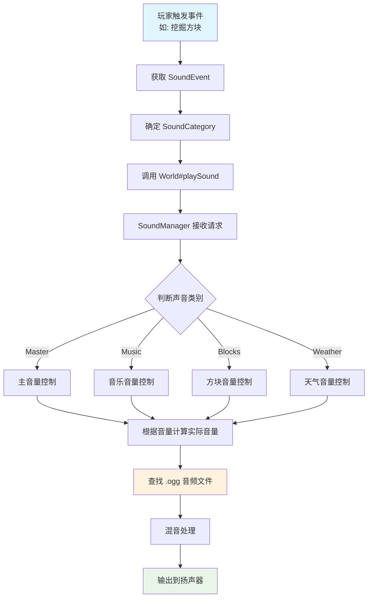
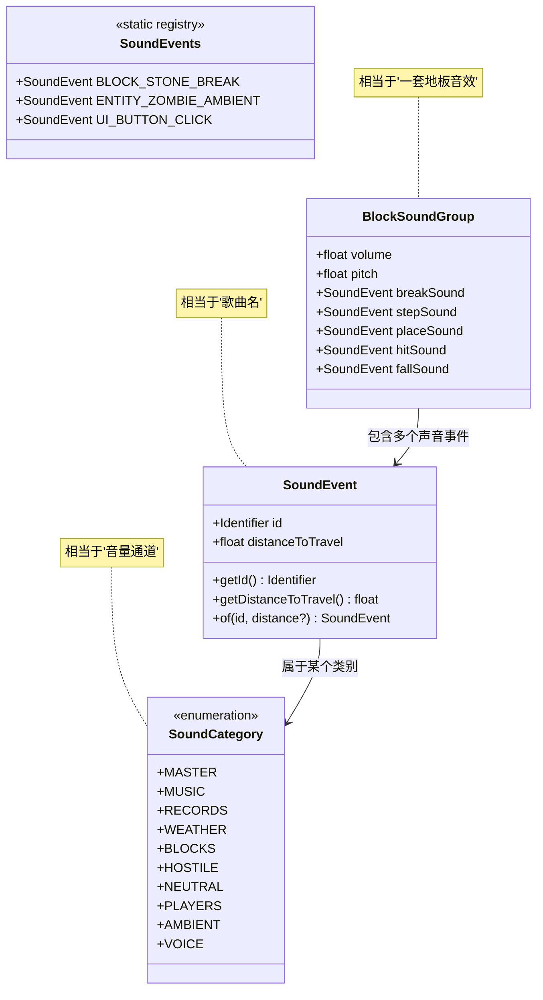
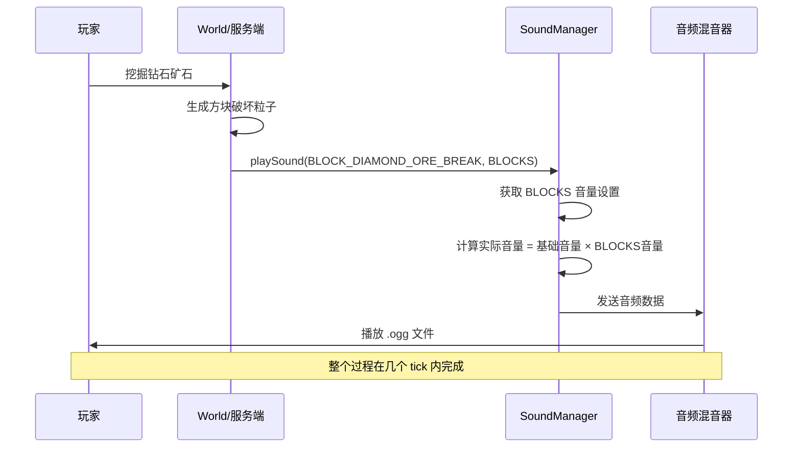

# Minecraft 声音系统详解

## 目标

学完本教程后，你将能够：
- 理解 Minecraft 声音系统的核心概念
- 掌握 SoundEvent、SoundCategory 等关键类的作用
- 学会在 mod 中注册和播放自定义声音
- 了解声音如何与游戏世界交互

## 前置知识

- Java 基础（类、接口、枚举）
- Minecraft 资源包概念（resources/assets）
- 游戏刻（tick）基础
- [实体系统](../Part-4-Entity/20-entity-intro.md)
- [物品系统](../Part-3-Block-Item/17-item-basics.md)

## 核心概念

### 什么是声音系统？

想象一下你在看一部电影：
- **画面** = 游戏的视觉效果（方块、生物、粒子）
- **声音** = 游戏的听觉反馈（脚步声、爆炸声、BGM）

Minecraft 的声音系统就像一个 **音响调音台**，负责管理和播放游戏中各种声音。每一个"音效"（比如挖掘石头、僵尸的呻吟）都对应一个 `SoundEvent` 对象。

### 生活比喻：声音系统 = 餐厅的背景音乐系统

想象你在餐厅里：
- **SoundEvent** = 歌曲列表中的某一首歌（如"生日快乐"）
- **SoundCategory** = 不同的音量通道（背景音乐、顾客谈话、厨房噪音）
- **SoundManager** = 音响调音台，决定每首歌从哪个喇叭播放、音量多大
- **播放器** = 服务员按按钮点歌

## 图解（Mermaid）

### 声音播放流程图



### 声音系统类关系图



### 声音播放时序图



## 核心代码

### 1. SoundEvent - 声音事件

`SoundEvent` 是声音系统的核心类，代表一个具体的声音。

```java
// 源码位置: net.minecraft.sound.SoundEvent
public class SoundEvent {
    private final Identifier id;              // 声音的唯一标识
    private final float distanceToTravel;    // 声音能传播的距离
    private final boolean staticDistance;      // 是否使用固定距离
    
    // 创建一个默认声音事件（传播距离 16 格）
    public static SoundEvent of(Identifier id) {
        return new SoundEvent(id, 16.0f, false);
    }
    
    // 创建一个自定义传播距离的声音事件
    public static SoundEvent of(Identifier id, float distanceToTravel) {
        return new SoundEvent(id, distanceToTravel, true);
    }
    
    public Identifier getId() { return this.id; }
}
```

**萌新理解**：SoundEvent 就像歌曲的"歌名"，告诉游戏"我要播放哪首歌"。

### 2. SoundCategory - 声音类别

`SoundCategory` 是一个枚举，定义了游戏中所有的音量通道。

```java
// 源码位置: net.minecraft.sound.SoundCategory
public enum SoundCategory {
    MASTER("master"),      // 总音量（所有声音的总开关）
    MUSIC("music"),        // 背景音乐
    RECORDS("record"),     // 唱片机音乐
    WEATHER("weather"),    // 天气声音（雨声、雷声）
    BLOCKS("block"),        // 方块声音（挖掘、放置）
    HOSTILE("hostile"),    // 敌对生物声音
    NEUTRAL("neutral"),    // 中立生物声音
    PLAYERS("player"),     // 玩家声音
    AMBIENT("ambient"),    // 环境声音（洞穴背景音）
    VOICE("voice");        // 语音/生物叫声
    
    private final String name;
}
```

**生活比喻**：
- 想象你的电脑音量设置面板
- "主音量"滑块 = MASTER
- "音乐"滑块 = MUSIC
- "系统音效"滑块 = BLOCKS

### 3. BlockSoundGroup - 方块音效组

每个方块都关联一个 `BlockSoundGroup`，定义方块相关的所有声音。

```java
// 源码位置: net.minecraft.sound.BlockSoundGroup
public class BlockSoundGroup {
    public static final BlockSoundGroup STONE = new BlockSoundGroup(
        1.0f, 1.0f,                    // volume, pitch
        SoundEvents.BLOCK_STONE_BREAK, // 破坏声音
        SoundEvents.BLOCK_STONE_STEP, // 踩上去的声音
        SoundEvents.BLOCK_STONE_PLACE,// 放置声音
        SoundEvents.BLOCK_STONE_HIT,  // 敲击声音
        SoundEvents.BLOCK_STONE_FALL   // 掉落声音
    );
    
    public static final BlockSoundGroup WOOD = new BlockSoundGroup(
        1.0f, 1.0f,
        SoundEvents.BLOCK_WOOD_BREAK,
        SoundEvents.BLOCK_WOOD_STEP,
        SoundEvents.BLOCK_WOOD_PLACE,
        SoundEvents.BLOCK_WOOD_HIT,
        SoundEvents.BLOCK_WOOD_FALL
    );
    
    // 金属方块：音调更高
    public static final BlockSoundGroup METAL = new BlockSoundGroup(
        1.0f, 1.5f,                    // 注意 pitch 是 1.5f
        SoundEvents.BLOCK_METAL_BREAK,
        SoundEvents.BLOCK_METAL_STEP,
        SoundEvents.BLOCK_METAL_PLACE,
        SoundEvents.BLOCK_METAL_HIT,
        SoundEvents.BLOCK_METAL_FALL
    );
}
```

### 4. 播放声音的常用方法

#### 在服务端/World 中播放

```java
// 在服务端播放声音（所有能听到的玩家都能听到）
world.playSound(
    player,                              // 可以为 null 表示对所有玩家播放
    x, y, z,                             // 声音播放的位置
    SoundEvents.ENTITY_ZOMBIE_AMBIENT,   // 要播放的声音
    SoundCategory.HOSTILE,               // 声音类别
    1.0f,                                // 音量 (0.0 - 无限)
    1.0f                                 // 音调 (0.5 - 2.0)
);

// 或者使用实体作为位置来源
world.playSound(
    null,                                // 对所有玩家播放
    entity.getX(), entity.getY(), entity.getZ(),
    SoundEvents.ENTITY_EXPLODE,
    SoundCategory.HOSTILE,
    1.0f, 1.0f
);
```

#### 在客户端播放（仅本地玩家能听到）

```java
// 在客户端播放（本地音效）
MinecraftClient.getInstance().getSoundManager()
    .play(BackgroundMusicSelector);  // 播放背景音乐

// 或者使用粒子/特效同时播放
world.addParticle(ParticleTypes.EXPLOSION, x, y, z, 0, 0, 0);
world.playSound(x, y, z, SoundEvents.ENTITY_GENERIC_EXPLODE, 
    SoundCategory.HOSTILE, 1.0f, 1.0f, true);  // 最后 true 表示随机偏移
```

## 实战演示

### 场景：创建一个自定义爆炸声音

#### 第一步：定义声音事件（服务端注册）

```java
// 在你的 Mod 初始化类中
public static final SoundEvent MY_CUSTOM_EXPLOSION = 
    SoundEvents.register("my_mod.custom_explosion");

// 或者使用辅助方法
private static SoundEvent register(String id) {
    return Registry.register(
        Registries.SOUND_EVENT,
        new Identifier("my_mod", id),
        SoundEvent.of(new Identifier("my_mod", id))
    );
}
```

#### 第二步：创建资源文件

在资源包中创建声音 JSON 文件：

```json
// resources/assets/my_mod/sounds.json
{
    "my_mod.custom_explosion": {
        "sounds": [
            "my_mod:explosion/custom_boom"
        ],
        "subtitle": "my_mod.subtitle.custom_explosion"
    }
}
```

#### 第三步：放置实际的音频文件

```
resources/assets/my_mod/sounds/explosion/
    └── custom_boom.ogg  ← 必须是 OGG Vorbis 格式！
```

#### 第四步：在代码中播放

```java
// 当玩家使用某个物品时爆炸
public boolean use(ItemStack stack, World world, 
                   PlayerEntity player) {
    if (!world.isClient) {
        // 播放爆炸声音
        world.playSound(
            null,  // 对所有玩家播放
            player.getX(), player.getY(), player.getZ(),
            ModSounds.MY_CUSTOM_EXPLOSION,
            SoundCategory.HOSTILE,  // 作为敌对生物类别
            2.0f,   // 大音量（爆炸声应该大声）
            0.8f    // 低音调（沉闷的爆炸声）
        );
        
        // 创建爆炸效果
        world.createExplosion(...);
    }
    return true;
}
```

### 场景：播放音符盒音乐

```java
// 播放一个音符
public void playNote(BlockPos pos) {
    world.playSound(
        null,
        pos.getX(), pos.getY(), pos.getZ(),
        SoundEvents.BLOCK_NOTE_BLOCK_HARP,  // 音符盒声音
        SoundCategory.RECORDS,               // 唱片机类别
        3.0f,                                // 大声
        1.0f                                 // 正常音调
    );
}

// 播放不同音调
float[] notePitches = {0.5f, 0.53f, 0.56f, 0.59f, ...};
float pitch = notePitches[noteIndex];
world.playSound(null, x, y, z, SoundEvents.BLOCK_NOTE_BLOCK_HARP, 
    SoundCategory.RECORDS, 1.0f, pitch);
```

## 常见问题与解决方案

### Q1: 为什么我的声音播放不出来？

**可能原因：**
1. 声音文件格式不对 → 必须是 `.ogg` 格式
2. sounds.json 配置错误 → 检查 JSON 语法
3. 资源包没有正确加载 → 确认资源包在正确位置

**排查步骤：**
```java
// 开启调试模式查看声音加载日志
// 在启动参数添加: --debug的声音会显示在控制台
```

### Q2: 如何让声音只在特定条件下播放？

```java
// 检查玩家设置
if (world.getGameRules().getBoolean(GameRules.DO_MOB_GRIEFING)) {
    world.playSound(...);
}

// 检查距离
double distance = player.squaredDistanceTo(sourcePos);
if (distance < 256) {  // 16格的平方
    world.playSound(...);
}
```

### Q3: 声音音量是如何计算的？

```java
// 实际音量 = SoundEvent音量 × SoundCategory音量 × 游戏设置音量
float actualVolume = baseVolume * categoryVolume * globalVolume;
actualVolume = Math.min(actualVolume, 1.0f);  // 最大1.0f
```

## 小结

| 概念 | 作用 | 生活比喻 |
|------|------|----------|
| `SoundEvent` | 代表一个具体声音 | 歌曲名称 |
| `SoundCategory` | 控制不同类别的音量 | 音量调节旋钮 |
| `BlockSoundGroup` | 一组方块相关的音效 | 地板材质音效套装 |
| `SoundEvents` | 所有原版声音的注册表 | 歌曲库 |
| `World#playSound` | 播放声音的方法 | 按下播放键 |

**核心要点：**
1. SoundEvent 是声音的"身份证"
2. SoundCategory 控制声音属于哪个音量通道
3. 播放声音需要：位置 + 声音事件 + 类别 + 音量 + 音调
4. 声音文件必须是 `.ogg` 格式

## 练习

### 练习 1：基础声音播放
创建一个 mod，在玩家右键点击你的方块时播放一个自定义声音。

**提示：**
1. 注册 SoundEvent
2. 创建 sounds.json
3. 放置 .ogg 文件
4. 在 onUse 方法中调用 world.playSound()

### 练习 2：不同类别的音量
尝试使用不同的 SoundCategory 播放同一个 SoundEvent，体验音量控制的效果。

### 练习 3：音符盒
创建一个可以发出不同音符的方块，模拟 Minecraft 原版的音符盒功能。

## 相关链接

### 内部链接
- [实体系统基础](../Part-4-Entity/20-entity-intro.md) - 声音常与实体交互
- [物品系统](../Part-3-Block-Item/17-item-basics.md) - 物品触发声音
- [粒子系统](./particle-system.md) - 声音与粒子配合使用
- [资源系统](../Part-8-Resource/40-resource-pack.md) - 声音文件配置

### 外部资源
- [Minecraft Wiki: sounds.json](https://minecraft.fandom.com/wiki/Sounds.json)
- [OGG Vorbis 格式转换工具](https://audio.online-convert.com/convert-to-ogg)
- [Fandom: Sound Events](https://minecraft.fandom.com/wiki/Sound_event)
