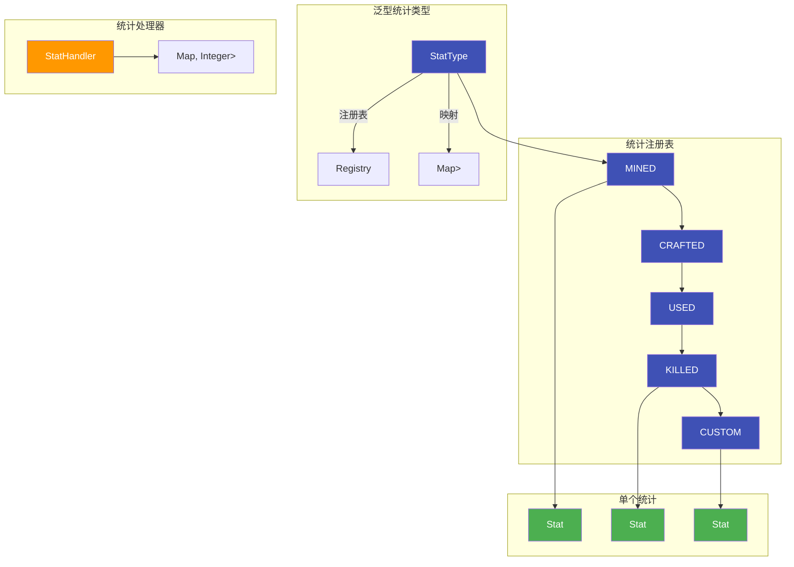
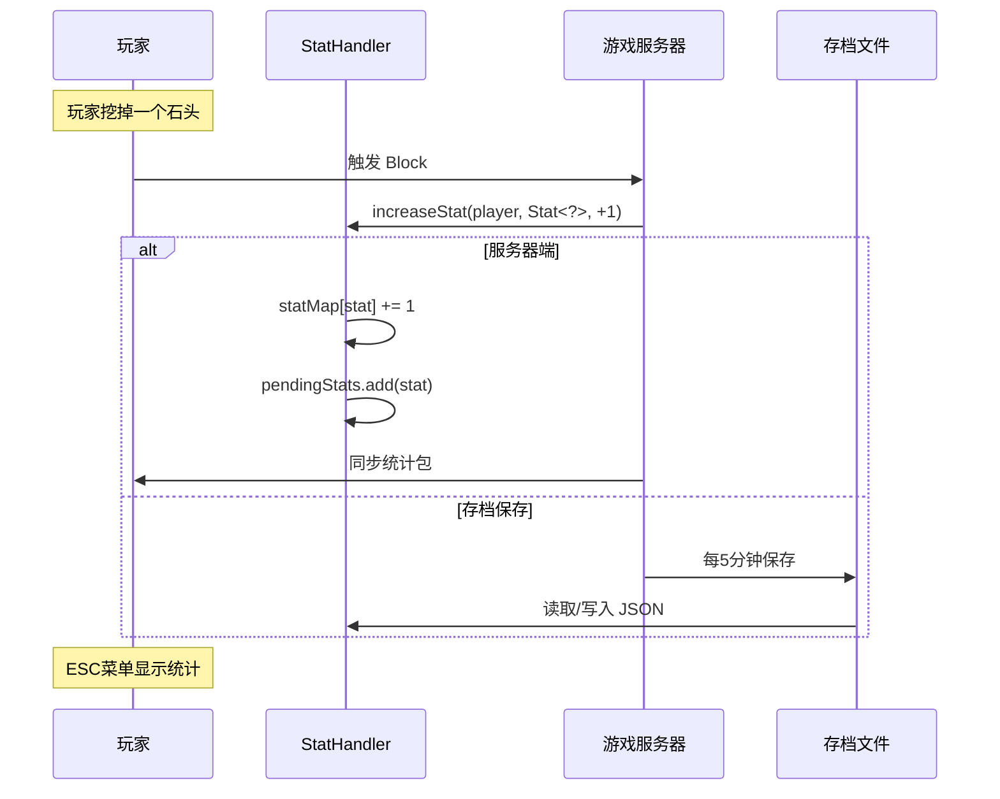
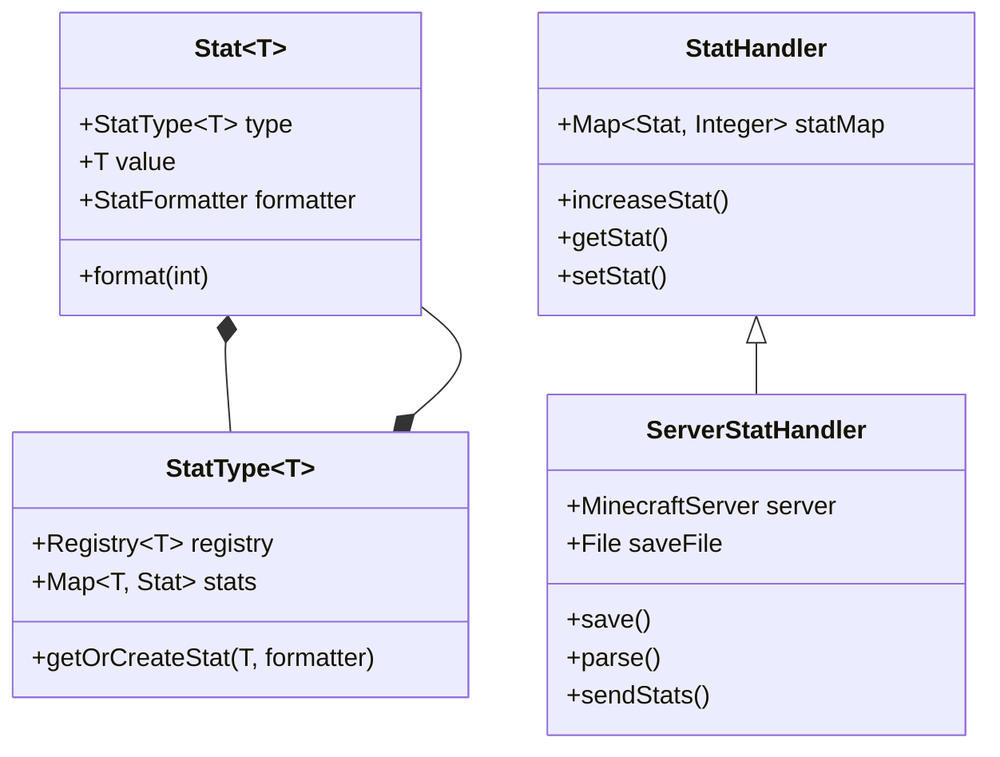

# 统计系统 (Stats System)

## 目标

读完这篇文章后，你将理解 Minecraft 的统计系统如何追踪玩家活动，并能在源码中找到相关实现。

## 前置知识

- 了解 Minecraft 服务端架构
- 熟悉泛型和注册表(Registry)的概念

## 核心概念

### 什么是统计系统？

想象一下手机上的"健康"App，它会自动记录你每天走了多少步、爬了几层楼。Minecraft 的统计系统就是游戏的"健康App"——**自动记录玩家的各种游戏活动**。

### 统计系统能记录什么？

| 类别 | 示例 | 说明 |
|------|------|------|
| 破坏方块 | 挖矿数、砍树数 | `MINED` 类型 |
| 合成物品 | 合成钻石剑次数 | `CRAFTED` 类型 |
| 使用物品 | 吃东西次数 | `USED` 类型 |
| 拾取物品 | 捡起圆石数量 | `PICKED_UP` 类型 |
| 击杀生物 | 杀猪数、杀僵尸数 | `KILLED` 类型 |
| 被杀次数 | 被怪物杀死次数 | `KILLED_BY` 类型 |
| 自定义统计 | 游戏时长、死亡次数 | `CUSTOM` 类型 |

## 图解（Mermaid）

### 统计系统架构



### 统计触发流程



### 常见统计类型层次



## 核心代码

### Stats.java - 统计常量定义

```java
public class Stats {
    // 基于方块的统计 (挖矿)
    public static final StatType<Block> MINED = registerType("mined", Registries.BLOCK);
    
    // 基于物品的统计
    public static final StatType<Item> CRAFTED = registerType("crafted", Registries.ITEM);
    public static final StatType<Item> USED = registerType("used", Registries.ITEM);
    public static final StatType<Item> BROKEN = registerType("broken", Registries.ITEM);
    public static final StatType<Item> PICKED_UP = registerType("picked_up", Registries.ITEM);
    public static final StatType<Item> DROPPED = registerType("dropped", Registries.ITEM);
    
    // 基于实体类型的统计
    public static final StatType<EntityType<?>> KILLED = registerType("killed", Registries.ENTITY_TYPE);
    public static final StatType<EntityType<?>> KILLED_BY = registerType("killed_by", Registries.ENTITY_TYPE);
    
    // 自定义统计
    public static final StatType<Identifier> CUSTOM = registerType("custom", Registries.CUSTOM_STAT);
    
    // 常用自定义统计
    public static final Identifier DEATHS = register("deaths", StatFormatter.DEFAULT);
    public static final Identifier MOB_KILLS = register("mob_kills", StatFormatter.DEFAULT);
    public static final Identifier PLAY_TIME = register("play_time", StatFormatter.TIME);
    
    // 距离统计
    public static final Identifier WALK_ONE_CM = register("walk_one_cm", StatFormatter.DISTANCE);
    public static final Identifier SPRINT_ONE_CM = register("sprint_one_cm", StatFormatter.DISTANCE);
    public static final Identifier FLY_ONE_CM = register("fly_one_cm", StatFormatter.DISTANCE);
    public static final Identifier SWIM_ONE_CM = register("swim_one_cm", StatFormatter.DISTANCE);
    
    // 伤害统计
    public static final Identifier DAMAGE_DEALT = register("damage_dealt", StatFormatter.DIVIDE_BY_TEN);
    public static final Identifier DAMAGE_TAKEN = register("damage_taken", StatFormatter.DIVIDE_BY_TEN);
    
    // 注册统计类型
    private static <T> StatType<T> registerType(String id, Registry<T> registry) {
        MutableText text = Text.translatable("stat_type.minecraft." + id);
        return Registry.register(Registries.STAT_TYPE, id, new StatType<T>(registry, text));
    }
    
    // 注册自定义统计
    private static Identifier register(String id, StatFormatter formatter) {
        Identifier identifier = Identifier.ofVanilla(id);
        Registry.register(Registries.CUSTOM_STAT, id, identifier);
        CUSTOM.getOrCreateStat(identifier, formatter);
        return identifier;
    }
}
```

### Stat.java - 单个统计定义

```java
public class Stat<T> extends ScoreboardCriterion {
    private final StatFormatter formatter;    // 显示格式器
    private final T value;                     // 统计值(如石头方块)
    private final StatType<T> type;             // 统计类型
    
    // 获取统计唯一名称
    public static <T> String getName(StatType<T> type, T value) {
        return Registries.STAT_TYPE.getId(type) + ":" + 
               type.getRegistry().getId(value);
    }
    
    // 格式化显示
    public String format(int value) {
        return formatter.format(value);
    }
}
```

### StatType.java - 统计类型

```java
public class StatType<T> implements Iterable<Stat<T>> {
    private final Registry<T> registry;      // 值类型的注册表
    private final Map<T, Stat<T>> stats = new IdentityHashMap<>();  // 缓存
    
    // 获取或创建统计
    public Stat<T> getOrCreateStat(T key, StatFormatter formatter) {
        return stats.computeIfAbsent(key, value -> new Stat<>(this, value, formatter));
    }
    
    // 迭代所有统计
    @Override
    public Iterator<Stat<T>> iterator() {
        return stats.values().iterator();
    }
}
```

### StatHandler.java - 客户端/服务端统计处理器

```java
public class StatHandler {
    // 存储 统计 -> 数值 的映射
    protected final Object2IntMap<Stat<?>> statMap = 
        Object2IntMaps.synchronize(new Object2IntOpenHashMap());
    
    // 增加统计值
    public void increaseStat(PlayerEntity player, Stat<?> stat, int value) {
        int newValue = (int) Math.min(
            (long) getStat(stat) + (long) value, 
            Integer.MAX_VALUE
        );
        setStat(player, stat, newValue);
    }
    
    // 获取统计值
    public <T> int getStat(StatType<T> type, T stat) {
        return type.hasStat(stat) ? getStat(type.getOrCreateStat(stat)) : 0;
    }
    
    public int getStat(Stat<?> stat) {
        return statMap.getInt(stat);
    }
}
```

### ServerStatHandler.java - 服务端持久化

```java
public class ServerStatHandler extends StatHandler {
    private final MinecraftServer server;
    private final File file;                   // 保存路径
    private final Set<Stat<?>> pendingStats;   // 待同步统计
    
    // 保存到文件
    public void save() {
        FileUtils.writeStringToFile(file, asString());
    }
    
    // 发送统计给客户端
    public void sendStats(ServerPlayerEntity player) {
        Object2IntOpenHashMap map = new Object2IntOpenHashMap();
        for (Stat<?> stat : takePendingStats()) {
            map.put(stat, getStat(stat));
        }
        player.networkHandler.sendPacket(new StatisticsS2CPacket(map));
    }
    
    // 从JSON解析
    public void parse(DataFixer dataFixer, String json) {
        JsonObject root = JsonParser.parseString(json).getAsJsonObject();
        JsonObject statsObj = root.getAsJsonObject("stats");
        
        for (Map.Entry<String, JsonElement> entry : statsObj.entrySet()) {
            StatType<?> type = Registries.STAT_TYPE.get(Identifier.of(entry.getKey()));
            JsonObject typeStats = entry.getValue().getAsJsonObject();
            
            for (Map.Entry<String, JsonElement> statEntry : typeStats.entrySet()) {
                Identifier id = Identifier.tryParse(statEntry.getKey());
                int value = statEntry.getValue().getAsInt();
                Stat<?> stat = type.getOrCreateStat(id);
                statMap.put(stat, value);
            }
        }
    }
}
```

### StatFormatter.java - 数值格式化

```java
public class StatFormatter {
    // 直接显示数字
    public static final StatFormatter DEFAULT = value -> String.valueOf(value);
    
    // 显示为时间 (秒数 -> 分:秒)
    public static final StatFormatter TIME = value -> {
        int i = value / 3600;
        int j = (value / 60) % 60;
        int k = value % 60;
        return (i != 0 ? i + "m " : "") + (j != 0 ? j + "s" : (k + "s"));
    };
    
    // 显示为距离 (厘米 -> 米/公里)
    public static final StatFormatter DISTANCE = value -> {
        if (value >= 100000) {
            return String.format("%.1f km", value / 10000 / 100.0);
        }
        return value / 100.0 + " m";
    };
    
    // 显示为伤害值 (除以10)
    public static final StatFormatter DIVIDE_BY_TEN = value -> 
        String.valueOf(value / 10.0);
}
```

## 实战演示

### 监听玩家挖矿事件

```java
// 在 Block 类中自动触发
public class Block {
    public void onBroken(World world, PlayerEntity player) {
        // 触发挖矿统计
        Stat<Block> stat = Stats.MINED.getOrCreateStat(this);
        player.incrementStat(stat);
    }
}

// 玩家端获取统计
public int getMinedCount(PlayerEntity player, Block block) {
    StatHandler handler = player.getStatHandler();
    return handler.getStat(Stats.MINED, block);
}
```

### 创建自定义统计

```java
public class MyMod {
    // 1. 定义自定义统计ID
    public static final Identifier CUSTOM_STAT_ID = Identifier.of("mymod", "jump_count");
    
    // 2. 注册统计 (在 mod 初始化时)
    public static Identifier JUMP_COUNT;
    
    public static void onInitialize() {
        // 通过 Stats.CUSTOM 注册
        JUMP_COUNT = Stats.register("mymod.jump_count", StatFormatter.DEFAULT);
    }
    
    // 3. 使用统计
    public void onPlayerJump(ServerPlayerEntity player) {
        StatHandler handler = player.getStatHandler();
        handler.incrementStat(player, Stats.CUSTOM.getOrCreateStat(JUMP_COUNT), 1);
    }
    
    // 4. 获取统计
    public int getJumpCount(ServerPlayerEntity player) {
        StatHandler handler = player.getStatHandler();
        return handler.getStat(Stats.CUSTOM.getOrCreateStat(JUMP_COUNT));
    }
}
```

### 显示玩家统计

```java
public void showPlayerStats(ServerPlayerEntity player, ServerPlayerEntity target) {
    StatHandler handler = target.getStatHandler();
    
    // 获取各种统计
    int kills = handler.getStat(Stats.MOB_KILLS);
    int deaths = handler.getStat(Stats.DEATHS);
    int playTime = handler.getStat(Stats.PLAY_TIME);
    
    // 创建显示文本
    MutableText message = Text.literal("玩家统计: \n")
        .append("击杀: ").append(String.valueOf(kills)).append("\n")
        .append("死亡: ").append(String.valueOf(deaths)).append("\n")
        .append("游戏时间: ").append(Stats.PLAY_TIME.format(playTime));
    
    player.sendMessage(message);
}
```

## 小结

统计系统是 Minecraft 追踪玩家活动的重要工具：

1. **Stats** 类定义所有内置统计常量
2. **StatType<T>** 泛型类处理不同类型(方块、物品、实体)的统计
3. **Stat** 表示单个统计项，包含类型、值和格式化器
4. **StatHandler** 维护玩家统计数据
5. **ServerStatHandler** 处理服务端持久化和同步

## 练习

1. 在源码中找到 `Stats.java`，列出所有 `CUSTOM` 类型的统计
2. 实现一个记录玩家说"你好"次数的 mod 统计
3. 研究 `StatFormatter` 的其他实现方式

## 相关链接

- [记分板系统](./scoreboard-system.md) - 了解记分板与统计的关系
- [文本系统](./text-system.md) - 学习如何格式化统计显示
- 源码路径: `..../source/net/minecraft/stat/`
