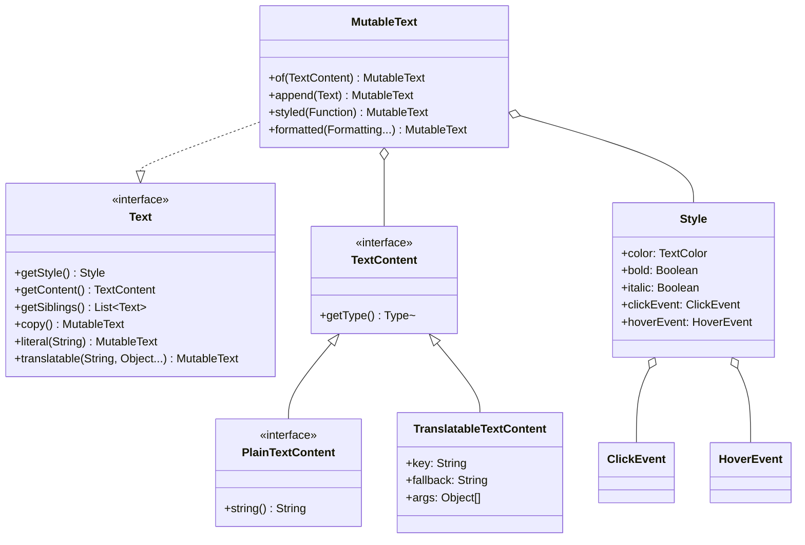
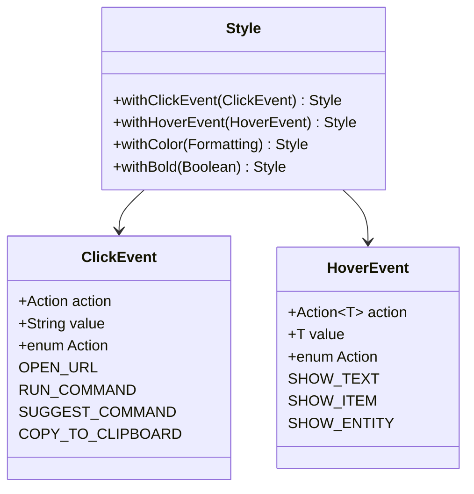

# 文本系统 (Text System)

## 目标

读完这篇文章后，你将理解 Minecraft 文本系统的层次结构，并能用它创建丰富多彩的聊天消息、物品描述和UI文字。

## 前置知识

- 了解 Java 接口和类的概念
- 熟悉 Builder 模式

## 核心概念

### 什么是文本系统？

想象一下手机的短信和微信消息。普通的短信只能显示纯文字，但微信可以：
- 发送表情
- 点击链接跳转
- 长按显示详情

Minecraft 的文本系统就像"增强版微信"，它让你的文字可以：
- 有颜色
- 加粗、斜体、删除线
- 点击执行命令
- 鼠标悬浮显示提示

### 文本系统的核心接口

| 接口/类 | 作用 | 生活类比 |
|----------|------|----------|
| `Text` | 文本顶层接口 | 一条完整的消息 |
| `MutableText` | 可变文本实现 | 可以修改的草稿 |
| `Style` | 样式定义 | 文字的"化妆" |
| `TextContent` | 内容类型 | 消息的"本质"(文字/翻译/分数) |
| `ClickEvent` | 点击事件 | 短信中的"快捷回复" |
| `HoverEvent` | 悬浮事件 | 长按显示的"气泡" |

## 图解（Mermaid）

### Text 接口层次



### 文本构建过程


### 文本树结构

```mermaid
graph TD
    T["Text 根节点<br/>Style: 红色+粗体"]
    T --> C1["PlainTextContent<br/>'你好 '"]
    T --> S1["Style: 蓝色"]
    S1 --> C2["PlainTextContent<br/>'世界'"]
    S1 --> S2["Style: 下划线"]
    S2 --> C3["PlainTextContent<br/>'!'"]
    
    classDef root fill:#E91E63,color:white
    classDef content fill:#4CAF50,color:white
    classDef style fill:#2196F3,color:white
    
    class T root
    class C1,C2,C3 content
    class S1,S2 style
```

### ClickEvent 和 HoverEvent



## 核心代码

### Text.java - 文本工厂

```java
public interface Text extends Message, StringVisitable {
    
    // ==================== 工厂方法 ====================
    
    // 创建纯文本
    public static MutableText literal(String string) {
        return MutableText.of(PlainTextContent.of(string));
    }
    
    // 创建可翻译文本
    public static MutableText translatable(String key) {
        return MutableText.of(new TranslatableTextContent(key, null, 
            TranslatableTextContent.EMPTY_ARGUMENTS));
    }
    
    // 创建带参数的可翻译文本
    public static MutableText translatable(String key, Object... args) {
        return MutableText.of(new TranslatableTextContent(key, null, args));
    }
    
    // 创建按键绑定文本 (如 "Ctrl" 会根据设置显示)
    public static MutableText keybind(String string) {
        return MutableText.of(new KeybindTextContent(string));
    }
    
    // 创建分数占位符
    public static MutableText score(String name, String objective) {
        return MutableText.of(new ScoreTextContent(name, objective));
    }
    
    // 创建选择器文本 (@a, @p 等)
    public static MutableText selector(String pattern, Optional<Text> separator) {
        return MutableText.of(new SelectorTextContent(pattern, separator));
    }
    
    // ==================== 核心方法 ====================
    
    // 获取样式
    public Style getStyle();
    
    // 获取内容
    public TextContent getContent();
    
    // 获取子文本列表
    public List<Text> getSiblings();
    
    // 深拷贝
    public MutableText copy();
}
```

### MutableText.java - 可变文本实现

```java
public class MutableText implements Text {
    private final TextContent content;     // 内容
    private final List<Text> siblings;    // 子文本
    private Style style;                  // 样式
    
    // 创建文本
    public static MutableText of(TextContent content) {
        return new MutableText(content, new ArrayList<>(), Style.EMPTY);
    }
    
    // 追加文本
    public MutableText append(Text text) {
        siblings.add(text);
        return this;
    }
    
    // 追加字符串
    public MutableText append(String text) {
        return append(Text.literal(text));
    }
    
    // 修改样式
    public MutableText styled(UnaryOperator<Style> styleUpdater) {
        setStyle(styleUpdater.apply(getStyle()));
        return this;
    }
    
    // 添加格式
    public MutableText formatted(Formatting... formattings) {
        setStyle(getStyle().withFormatting(formattings));
        return this;
    }
    
    // 设置颜色
    public MutableText withColor(int color) {
        setStyle(getStyle().withColor(color));
        return this;
    }
}
```

### Style.java - 样式定义

```java
public class Style {
    public static final Style EMPTY = new Style(null, null, null, null, 
        null, null, null, null, null, null);
    
    // 样式属性
    @Nullable final TextColor color;
    @Nullable final Boolean bold;
    @Nullable final Boolean italic;
    @Nullable final Boolean underlined;
    @Nullable final Boolean strikethrough;
    @Nullable final Boolean obfuscated;
    @Nullable final ClickEvent clickEvent;
    @Nullable final HoverEvent hoverEvent;
    @Nullable final String insertion;
    @Nullable final Identifier font;
    
    // ==================== 样式方法 ====================
    
    // 设置颜色
    public Style withColor(@Nullable TextColor color) { ... }
    public Style withColor(@Nullable Formatting color) { 
        return withColor(color != null ? TextColor.fromFormatting(color) : null);
    }
    public Style withColor(int rgbColor) {
        return withColor(TextColor.fromRgb(rgbColor));
    }
    
    // 设置格式
    public Style withBold(@Nullable Boolean bold) { ... }
    public Style withItalic(@Nullable Boolean italic) { ... }
    public Style withUnderline(@Nullable Boolean underline) { ... }
    public Style withStrikethrough(@Nullable Boolean strikethrough) { ... }
    public Style withObfuscated(@Nullable Boolean obfuscated) { ... }
    
    // 设置事件
    public Style withClickEvent(@Nullable ClickEvent event) { ... }
    public Style withHoverEvent(@Nullable HoverEvent event) { ... }
    public Style withInsertion(@Nullable String insertion) { ... }
    
    // 设置字体
    public Style withFont(@Nullable Identifier font) { ... }
    
    // 添加格式 (快捷方式)
    public Style withFormatting(Formatting formatting) {
        switch (formatting) {
            case BOLD -> return withBold(true);
            case ITALIC -> return withItalic(true);
            case UNDERLINE -> return withUnderline(true);
            case STRIKETHROUGH -> return withStrikethrough(true);
            case OBFUSCATED -> return withObfuscated(true);
            case RESET -> return EMPTY;
            default -> return withColor(formatting);
        }
    }
    
    // 合并父样式
    public Style withParent(Style parent) {
        return new Style(
            color != null ? color : parent.color,
            bold != null ? bold : parent.bold,
            italic != null ? italic : parent.italic,
            // ... 其他属性
        );
    }
}
```

### ClickEvent.java - 点击事件

```java
public class ClickEvent {
    private final Action action;
    private final String value;
    
    public enum Action implements StringIdentifiable {
        // 打开网址
        OPEN_URL("open_url", true),
        
        // 打开本地文件
        OPEN_FILE("open_file", false),
        
        // 执行命令
        RUN_COMMAND("run_command", true),
        
        // 建议命令 (输入到聊天框但不执行)
        SUGGEST_COMMAND("suggest_command", true),
        
        // 翻页 (用于书本)
        CHANGE_PAGE("change_page", true),
        
        // 复制到剪贴板
        COPY_TO_CLIPBOARD("copy_to_clipboard", true);
        
        private final boolean userDefinable;  // 玩家是否可以触发
    }
    
    // 创建打开链接
    public static ClickEvent openUrl(String url) {
        return new ClickEvent(Action.OPEN_URL, url);
    }
    
    // 创建执行命令
    public static ClickEvent runCommand(String command) {
        return new ClickEvent(Action.RUN_COMMAND, command);
    }
    
    // 创建建议命令
    public static ClickEvent suggestCommand(String command) {
        return new ClickEvent(Action.SUGGEST_COMMAND, command);
    }
}
```

### HoverEvent.java - 悬浮事件

```java
public class HoverEvent {
    private final EventData<?> data;
    
    public static class Action<T> implements StringIdentifiable {
        // 显示文本
        public static final Action<Text> SHOW_TEXT = 
            new Action<>("show_text", true, TextCodecs.CODEC, ...);
        
        // 显示物品
        public static final Action<ItemStackContent> SHOW_ITEM = 
            new Action<>("show_item", true, ItemStackContent.CODEC, ...);
        
        // 显示实体信息
        public static final Action<EntityContent> SHOW_ENTITY = 
            new Action<>("show_entity", true, EntityContent.CODEC, ...);
    }
    
    // 显示文本
    public static HoverEvent showText(Text text) {
        return new HoverEvent(Action.SHOW_TEXT, text);
    }
    
    // 显示物品
    public static HoverEvent showItem(ItemStack stack) {
        return new HoverEvent(Action.SHOW_ITEM, new ItemStackContent(stack));
    }
    
    // 显示实体
    public static HoverEvent showEntity(EntityType<?> type, UUID uuid, @Nullable Text name) {
        return new HoverEvent(Action.SHOW_ENTITY, new EntityContent(type, uuid, name));
    }
}
```

### PlainTextContent.java - 纯文本内容

```java
public interface PlainTextContent extends TextContent {
    // 空内容
    public static final PlainTextContent EMPTY = new PlainTextContent() {
        @Override public String string() { return ""; }
    };
    
    // 创建纯文本
    public static PlainTextContent of(String string) {
        return string.isEmpty() ? EMPTY : new Literal(string);
    }
    
    public String string();
    
    // 实现类
    public record Literal(String string) implements PlainTextContent {
        @Override
        public <T> Optional<T> visit(StringVisitable.Visitor<T> visitor) {
            return visitor.accept(this.string);
        }
        
        @Override
        public <T> Optional<T> visit(StringVisitable.StyledVisitor<T> visitor, Style style) {
            return visitor.accept(style, this.string);
        }
    }
}
```

### TranslatableTextContent.java - 可翻译文本

```java
public class TranslatableTextContent implements TextContent {
    private final String key;           // 翻译键 (如 "item.diamond.name")
    @Nullable
    private final String fallback;      // 备用文本
    private final Object[] args;        // 参数 (如 %1$s, %2$d)
    
    // 解析翻译并替换参数
    private void updateTranslations() {
        Language language = Language.getInstance();
        String translation = fallback != null 
            ? language.get(key, fallback) 
            : language.get(key);
        
        // 处理 %1$s, %2$d 等格式
        ImmutableList.Builder<StringVisitable> builder = ImmutableList.builder();
        forEachPart(translation, builder::add);
        this.translations = builder.build();
    }
    
    // 获取参数值
    public final StringVisitable getArg(int index) {
        Object arg = args[index];
        if (arg instanceof Text) {
            return (Text) arg;
        }
        return arg == null 
            ? StringVisitable.plain("null") 
            : StringVisitable.plain(arg.toString());
    }
}
```

## 实战演示

### 基本文本创建

```java
// 最简单的纯文本
Text simple = Text.literal("Hello World!");

// 可变文本构建
MutableText message = Text.literal("游戏开始!")
    .append("\n")
    .append(Text.literal("准备好了吗？").formatted(Formatting.YELLOW));

// 可翻译文本 (支持多语言)
Text deathMessage = Text.translatable("death.attack.cactus", 
    player.getName());
```

### 带样式的文本

```java
// 单一样式
Text red = Text.literal("红色文字").formatted(Formatting.RED);

// 多种格式
Text styled = Text.literal("粗体斜体红色")
    .formatted(Formatting.BOLD, Formatting.ITALIC, Formatting.RED);

// 使用 styled 方法链
MutableText complex = Text.literal("复杂样式")
    .styled(style -> style
        .withColor(Formatting.GOLD)
        .withBold(true)
        .withUnderline(true)
    );
```

### 带点击事件的文本

```java
// 创建可点击的链接
MutableText link = Text.literal("点击访问 Wiki")
    .styled(style -> style
        .withColor(Formatting.BLUE)
        .withUnderline(true)
        .withClickEvent(ClickEvent.openUrl("https://minecraft.wiki/"))
    );

// 创建可执行的命令
MutableText command = Text.literal("[打开箱子]")
    .styled(style -> style
        .withColor(Formatting.GREEN)
        .withClickEvent(ClickEvent.runCommand("/give @s chest"))
        .withHoverEvent(HoverEvent.showText(Text.literal("打开箱子")))
    );

// 建议命令
MutableText suggest = Text.literal("传送选项:")
    .append("\n")
    .append(Text.literal("- 回家").styled(s -> s
        .withClickEvent(ClickEvent.suggestCommand("/home"))
    ))
    .append("\n")
    .append(Text.literal("- 传送到主城").styled(s -> s
        .withClickEvent(ClickEvent.suggestCommand("/spawn"))
    ));
```

### 带悬浮提示的文本

```java
// 显示提示文本
MutableText tooltip = Text.literal("悬停查看详情")
    .styled(style -> style
        .withHoverEvent(HoverEvent.showText(
            Text.literal("这是一条提示信息！\n第二行内容")
                .formatted(Formatting.GRAY)
        ))
    );

// 显示物品信息
MutableText itemInfo = Text.literal("钻石剑")
    .styled(style -> style
        .withHoverEvent(HoverEvent.showItem(new ItemStack(Items.DIAMOND_SWORD)))
    );

// 显示实体信息
MutableText entityInfo = Text.literal("查看村民")
    .styled(style -> style
        .withHoverEvent(HoverEvent.showEntity(
            EntityTypes.VILLAGER, 
            villager.getUuid(),
            villager.getName()
        ))
    );
```

### 完整消息示例

```java
// 创建一个精美的游戏公告
public Text createGameAnnouncement(String winner, int kills, int time) {
    return Text.literal("")
        // 标题
        .append(Text.literal("═══════════════════════\n")
            .formatted(Formatting.GOLD))
        // 主标题
        .append(Text.literal("🏆 游戏结束 🏆\n")
            .styled(s -> s
                .withColor(Formatting.YELLOW)
                .withBold(true)
            ))
        // 获胜者
        .append(Text.literal("冠军: ")
            .formatted(Formatting.GRAY))
        .append(Text.literal(winner)
            .styled(s -> s
                .withColor(Formatting.GREEN)
                .withBold(true)
                .withHoverEvent(HoverEvent.showText(
                    Text.literal("查看 " + winner + " 的统计")
                ))
            ))
        // 击杀数
        .append("\n")
        .append(Text.literal("总击杀: ")
            .formatted(Formatting.GRAY))
        .append(Text.literal(String.valueOf(kills))
            .formatted(Formatting.RED))
        // 游戏时长
        .append("\n")
        .append(Text.literal("游戏时长: ")
            .formatted(Formatting.GRAY))
        .append(Stats.PLAY_TIME.format(time))
        // 分隔线
        .append("\n")
        .append(Text.literal("═══════════════════════")
            .formatted(Formatting.GOLD));
}

// 发送公告
player.sendMessage(createGameAnnouncement("Steve", 15, 3600));
```

### 物品名称与描述

```java
// 创建自定义物品显示
public Text createItemDisplay(ItemStack stack) {
    MutableText text = Text.literal("");
    
    // 物品名称
    text.append(stack.getName()
        .copy()
        .styled(s -> s.withColor(Formatting.WHITE)));
    
    // 耐久度
    if (stack.isDamageable()) {
        int damage = stack.getMaxDamage() - stack.getDamage();
        int max = stack.getMaxDamage();
        text.append("\n")
            .append(Text.literal("耐久度: " + damage + "/" + max)
                .styled(s -> s.withColor(Formatting.GRAY)));
    }
    
    // 物品lore
    text.append("\n")
        .append(Text.literal("§7稀有度: §b史诗")
            .formatted(Formatting.GRAY));
    
    return text;
}
```

## 小结

文本系统是 Minecraft 中最灵活的信息展示工具：

1. **Text 接口** 提供工厂方法创建各种文本
2. **MutableText** 允许链式构建复杂文本
3. **Style** 定义颜色、格式和事件
4. **ClickEvent** 处理点击交互
5. **HoverEvent** 提供悬浮信息
6. **TextContent** 区分不同类型的内容

## 练习

1. 创建一个点击后复制到剪贴板的文本
2. 实现一个显示玩家装备的悬浮提示
3. 创建一个带颜色的排行榜消息

## 相关链接

- [记分板系统](./scoreboard-system.md) - Text.score() 用于显示记分板
- [统计系统](./stats-system.md) - 了解如何用 Text 显示统计数据
- 源码路径: `..../source/net/minecraft/text/`
