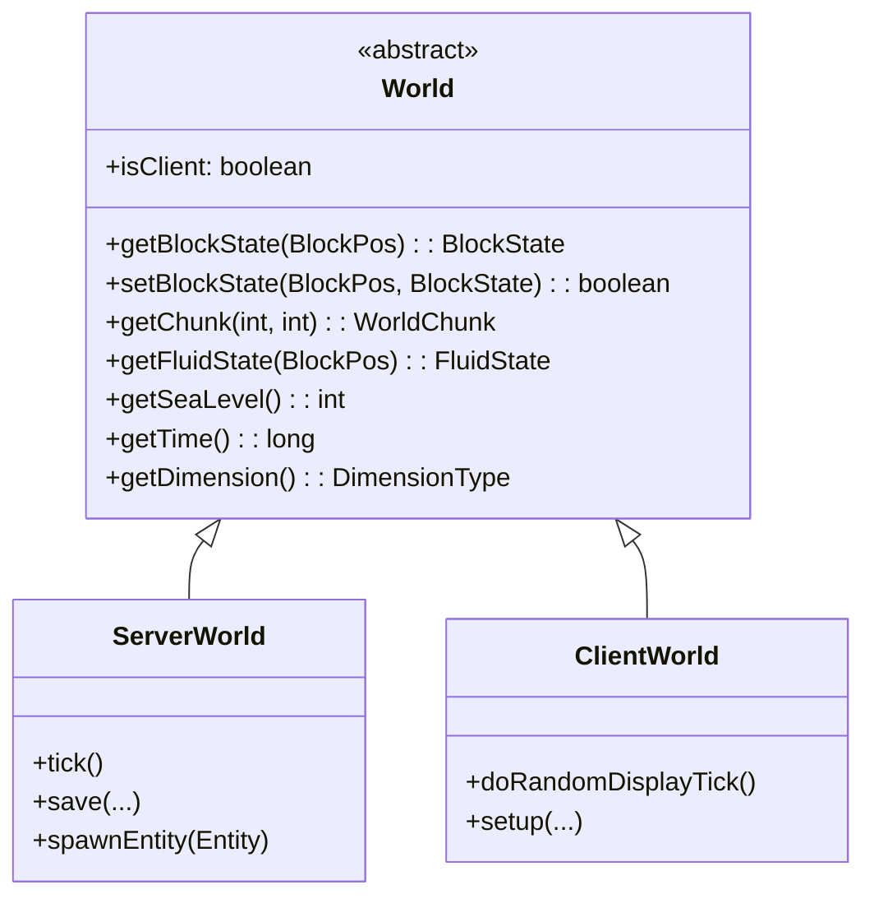

# 08 - 世界核心：World 类

## 目标

学完本章后，你将理解：
- World 类是什么，它在 Minecraft 中扮演什么角色
- ServerWorld 和 ClientWorld 的区别
- 坐标系统（BlockPos 和 ChunkPos）
- 如何在世界中查询和设置方块

## 前置知识

- [04-注册表系统.md](../Part-1-Foundation/04-registry-system.md) - 理解 Minecraft 的核心架构
- [05-客户端服务端架构.md](../Part-1-Foundation/05-client-server-arch.md) - 了解 isClient 字段的含义

## 核心概念

### World 类是什么？

想象一下 Minecraft 的世界是一个**巨大的图书馆**：
- **图书馆** = World（存放所有的"书籍"——方块、实体、生物群系）
- **World 类** = 图书馆管理员（负责管理图书馆里的一切）

World 类是 Minecraft 中**最核心的类之一**，它管理着：
- 所有的方块（Block）
- 所有的实体（Entity）
- 天气系统（下雨、下雪、雷暴）
- 时间系统（白天、黑夜）
- 光照计算
- 生物群系信息



### ServerWorld vs ClientWorld

```
                    ┌─────────────────────────────────────────────┐
                    │                  World (抽象类)                │
                    │  ─────────────────────────────────────────  │
                    │  • isClient: boolean  ← 关键字段！            │
                    │  • getBlockState()                          │
                    │  • setBlockState()                           │
                    │  • getChunk()                               │
                    └─────────────────────────────────────────────┘
                              △                    △
                              │                    │
              ┌───────────────┴──────┐    ┌───────┴───────────────┐
              │     ServerWorld      │    │      ClientWorld       │
              │  (服务端/服务器)      │    │   (客户端/你的电脑)     │
              ├─────────────────────┤    ├────────────────────────┤
              │ • 是"权威"           │    │ • 只是"显示"           │
              │ • 管理所有数据        │    │ • 接收服务端数据         │
              │ • 处理游戏逻辑        │    │ • 播放声音和粒子        │
              │ • 保存到硬盘          │    │ • 预测性移动           │
              └─────────────────────┘    └────────────────────────┘
```

**生活比喻**：
- ServerWorld = 老师（权威，负责批改作业）
- ClientWorld = 学生作业本（只是显示，最后还是老师说了算）

### 坐标系统

Minecraft 中有两种重要的坐标：

| 坐标类型 | 用途 | 示例 |
|---------|------|------|
| **BlockPos** | 精确的方块位置 | `(100, 64, 200)` 表示 x=100, y=64(高度), z=200 |
| **ChunkPos** | 区块的位置 | `(6, -12)` 表示第6个区块在X方向，第-12个区块在Z方向 |

```mermaid
flowchart LR
    subgraph World["世界坐标"]
        direction TB
        X["X轴 (东西)"]
        Y["Y轴 (高度)"]
        Z["Z轴 (南北)"]
    end

    X -->|"向北移动+|Z增加|
    X -->|"向南移动-|Z减少|
    X -->|"向东移动+|X增加|
    X -->|"向西移动-|X减少|
    Y -->|"向上+|Y增加|
    Y -->|"向下-|Y减少|
```

**BlockPos 和 ChunkPos 的转换**：
```
BlockPos (100, 64, 200)
    ↓  BlockPos  ÷ 16 取整
ChunkPos (6, 12)         ← 区块位置
    ↓
该区块内每个方块的局部坐标 = (4, 64, 8)
                       ↑  100÷16=6余4
```

## 核心代码

> ⚠️ **注意**：以下代码基于 CFR 反编译，实际源码可能略有差异。建议结合 Minecraft 源码仓库交叉验证。

### World 类的定义

源码路径：`net/minecraft/world/World.java`

```java
90:public abstract class World
91:implements WorldAccess,
92:AutoCloseable {
    // 关键字段：区分客户端和服务端
    123:    public final boolean isClient;
```

### 三个维度（主世界、下界、末地）

```java
94:    public static final RegistryKey<World> OVERWORLD =
95:        RegistryKey.of(RegistryKeys.WORLD, Identifier.ofVanilla("overworld"));
96:    public static final RegistryKey<World> NETHER =
97:        RegistryKey.of(RegistryKeys.WORLD, Identifier.ofVanilla("the_nether"));
98:    public static final RegistryKey<World> END =
99:        RegistryKey.of(RegistryKeys.WORLD, Identifier.ofVanilla("the_end"));
```

### 获取方块状态（最常用的方法）

```java
374:    @Override
375:    public BlockState getBlockState(BlockPos pos) {
376:        if (this.isOutOfHeightLimit(pos)) {
377:            return Blocks.VOID_AIR.getDefaultState();
378:        }
379:        // 通过 Chunk 来获取方块
380:        WorldChunk worldChunk = this.getChunk(
381:            ChunkSectionPos.getSectionCoord(pos.getX()),
382:            ChunkSectionPos.getSectionCoord(pos.getZ())
383:        );
384:        return worldChunk.getBlockState(pos);
385:    }
```

### 设置方块状态

```java
237:    @Override
238:    public boolean setBlockState(BlockPos pos, BlockState state, int flags) {
239:        // 检查是否超出高度限制
240:        if (this.isOutOfHeightLimit(pos)) {
241:            return false;
242:        }
243:        // 不允许在调试世界中修改方块
244:        if (!this.isClient && this.isDebugWorld()) {
245:            return false;
246:        }

247:        WorldChunk worldChunk = this.getWorldChunk(pos);
248:        BlockState blockState = worldChunk.setBlockState(pos, state, ...);
249:        // ... 更多逻辑（更新邻居方块、触发事件等）
250:        return true;
251:    }
```

### 世界边界限制

```java
183:    public boolean isInBuildLimit(BlockPos pos) {
184:        return !this.isOutOfHeightLimit(pos) && World.isValidHorizontally(pos);
185:    }

195:    public static boolean isValid(BlockPos pos) {
196:        return !World.isInvalidVertically(pos.getY()) && World.isValidHorizontally(pos);
197:    }
198:
199:    private static boolean isValidHorizontally(BlockPos pos) {
200:        // X 和 Z 必须在 -30000000 到 30000000 之间
201:        return pos.getX() >= -30000000 && pos.getZ() >= -30000000
202:            && pos.getX() < 30000000 && pos.getZ() < 30000000;
203:    }
```

**世界大小限制**：
- 水平方向：X, Z ∈ [-30000000, 30000000)
- 垂直方向：Y ∈ [-20000000, 20000000)
- 可建造高度：通常 -64 到 320

### 获取 Chunk

```java
217:    public WorldChunk getWorldChunk(BlockPos pos) {
218:        // 从 BlockPos 获取 Chunk
219:        return this.getChunk(
220:            ChunkSectionPos.getSectionCoord(pos.getX()),
221:            ChunkSectionPos.getSectionCoord(pos.getZ())
222:        );
223:    }
```

## 实战演示

### 练习：在源码中找到以下内容

1. **找到 ServerWorld 的定义**
   - 路径：`..../source/net/minecraft/server/world/ServerWorld.java`
   - 它继承自哪个类？
   - 它重写了哪些 World 类的方法？

2. **找到 ClientWorld 的定义**
   - 路径：`..../source/net/minecraft/client/world/ClientWorld.java`
   - 它的 `isClient` 字段是什么值？

3. **理解 getBlockState 的调用链**
   ```
   World.getBlockState(pos)
       ↓
   WorldChunk.getBlockState(pos)
       ↓
   ChunkSection.getBlockState(x, y, z)
   ```

## 小结

| 概念 | 说明 |
|------|------|
| World | 抽象类，管理游戏世界的所有内容 |
| ServerWorld | 服务端的 World 实现，是"权威" |
| ClientWorld | 客户端的 World 实现，只负责显示 |
| isClient | 区分客户端和服务端的关键字段 |
| BlockPos | 精确的方块坐标 (x, y, z) |
| ChunkPos | 区块坐标 |
| getBlockState() | 获取某个位置的方块状态 |
| setBlockState() | 设置某个位置的方块状态 |

**关键理解**：
- **ServerWorld 是权威**：服务端说什么就是什么
- **ClientWorld 只是接收者**：它不能决定游戏状态
- **所有对世界的操作都通过 World 类**：不管是获取还是设置方块

## 练习

### 思考题

### 思考题

1. 如果 `isClient = true`，哪些操作不应该执行？
2. 为什么 `setBlockState` 在服务端和客户端的行为不同？
3. 如果你要在玩家放置方块时执行一些逻辑，应该在 ServerWorld 还是 ClientWorld 中写？

### 动手题

在源码中找到以下代码，并截图或记录下来：

1. `World.java` 中 `isClient` 字段的定义
2. `World.java` 中三个维度常量的定义
3. `World.java` 中 `getSeaLevel()` 方法
4. 验证世界边界：找出 `isValidHorizontally` 方法，确认 X 和 Z 的有效范围

## 源码文件位置

| 文件 | 源码路径 | 说明 |
|------|----------|------|
| World.java | `net/minecraft/world/World.java` | 世界基类 |
| ServerWorld.java | `net/minecraft/server/world/ServerWorld.java` | 服务端世界 |
| ClientWorld.java | `net/minecraft/client/world/ClientWorld.java` | 客户端世界 |
| WorldBorder.java | `net/minecraft/world/border/WorldBorder.java` | 世界边界 |

## 相关链接

- [09-区块系统.md](./09-chunk-system.md) - World 是如何通过 Chunk 来存储方块的
- [12-光照系统.md](./12-lighting-system.md) - World 中的光照计算
- Minecraft Wiki: [World](https://minecraft.wiki/w/World)
