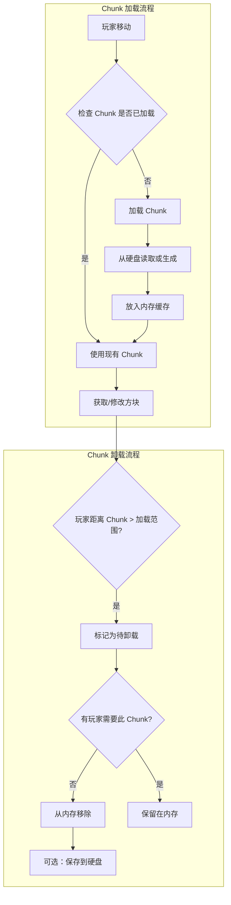
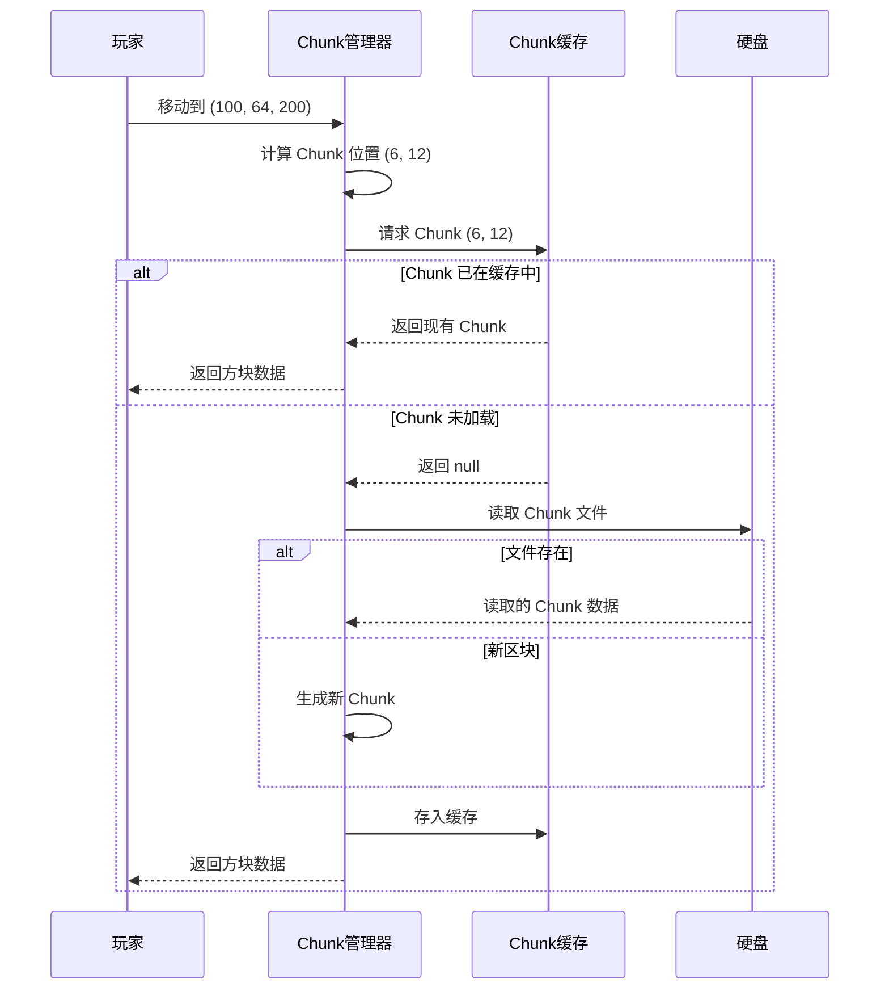
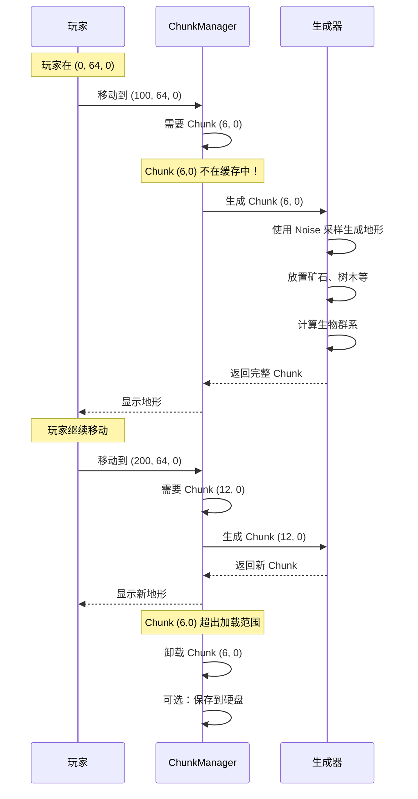

# 09 - 区块系统：Chunk 的奥秘

## 目标

学完本章后，你将理解：
- Chunk 是什么，为什么需要 Chunk
- ChunkSection 的结构（16x16x16 的方块层）
- 懒加载机制是如何工作的
- 方块数据是如何存储和访问的

## 前置知识

- [08-世界核心.md](./08-world-core.md) - 了解 World 类和坐标系统

## 核心概念

### Chunk 是什么？

想象你在一座巨大的城市中：

- **如果把整座城市都装进内存** → 电脑直接爆炸 💥
- **把城市分成很多街区，每个街区单独加载** → 完美！这就是 Chunk 的思想

**Chunk（区块）** = Minecraft 世界的一块**16×16×世界高度**的方块区域

```
        俯视图（从天空往下看）

    ┌──────────────────────────────┐
    │                              │
    │      ┌────────────┐          │
    │      │            │          │
    │      │   Chunk    │          │
    │      │  16 × 16   │          │
    │      │            │          │
    │      └────────────┘          │
    │                              │
    └──────────────────────────────┘

    侧视图（从侧面看）

         世界高度 (~380层)
    ┌─────────────────┐
    │▓▓▓▓▓▓▓▓▓▓▓▓▓▓▓▓▓▓│ ← 天空
    │                 │
    │   16 × 380     │ ← Chunk (垂直方向是整个可建造范围)
    │                 │
    │▒▒▒▒▒▒▒▒▒▒▒▒▒▒▒│ ← 基岩层
    └─────────────────┘
         16 格宽
```

### 为什么需要 Chunk？

**性能优化的关键**：

1. **按需加载**：只有玩家附近的 Chunk 才会加载
2. **节省内存**：不需要把整个世界都加载到内存
3. **分块保存**：存档时可以一个一个 Chunk 地保存
4. **并行处理**：多个 Chunk 可以同时生成



### ChunkSection：方块的"楼层"

每个 Chunk 被分成多个 **ChunkSection（区块截面）**：

- **每个 ChunkSection = 16×16×16 = 4096 个方块**
- **Chunk 的层数** = 世界高度 ÷ 16

```
    Chunk 的结构（俯视图，每层是 16×16）

    ┌────┬────┬────┬────┐
    │Sec │Sec │Sec │Sec │  ← Section 索引（从下往上）
    │ 0  │ 1  │ 2  │ 3  │     例如：高度 0-15 对应 Section 0
    ├────┼────┼────┼────┤     高度 16-31 对应 Section 1
    │Sec │Sec │Sec │Sec │     ...
    │ 4  │ 5  │ 6  │ 7  │
    ├────┼────┼────┼────┤
    │... │... │... │... │
    ├────┼────┼────┼────┤
    │Sec │Sec │Sec │Sec │
    │ 20 │ 21 │ 22 │ 23 │
    └────┴────┴────┴────┘

    世界高度 384（-64 到 320）：
    384 ÷ 16 = 24 个 Section
```

### 懒加载机制

**想象你在图书馆借书**：
- 你不会一次性把图书馆所有书都搬回家
- 只借你需要的书（懒加载）
- 看完了可以还回去（卸载）



## 核心代码

> ⚠️ **注意**：以下代码基于 CFR 反编译，实际源码可能略有差异。建议结合 Minecraft 源码仓库交叉验证。

### WorldChunk 类的定义

源码路径：`net/minecraft/world/chunk/WorldChunk.java`

```java
62:public class WorldChunk
63:extends Chunk {
64:    // 所属的世界
65:    final World world;
66:
67:    // 方块数据存储（ChunkSection 数组）
68:    protected final ChunkSection[] sectionArray;
69:
70:    // 高度图（快速查询高度）
71:    private final Map<Heightmap.Type, Heightmap> heightmaps;
72:
73:    // 方块实体（箱子、熔炉等）
74:    private final Map<BlockPos, BlockEntity> blockEntities;
75:}
```

### 获取方块状态

```java
159:    @Override
160:    public BlockState getBlockState(BlockPos pos) {
161:        int i = pos.getX();
162:        int j = pos.getY();
163:        int k = pos.getZ();
164:
165:        // 调试世界特殊处理
166:        if (this.world.isDebugWorld()) {
167:            // y=60 显示屏障，y=70 显示所有方块状态
168:            ...
169:        }
170:
171:        // 关键：找到这个方块属于哪个 Section
172:        int l = this.getSectionIndex(j);
173:
174:        // 检查 Section 是否有效且非空
175:        ChunkSection chunkSection = this.sectionArray[l];
176:        if (l >= 0 && l < this.sectionArray.length && !chunkSection.isEmpty()) {
177:            // 获取方块状态（x, y, z 需要 & 0xF 转换成局部坐标）
178:            return chunkSection.getBlockState(i & 0xF, j & 0xF, k & 0xF);
179:        }
180:
181:        return Blocks.AIR.getDefaultState();
182:    }
```

### 设置方块状态

```java
201:    @Override
202:    @Deprecated
203:    public BlockState setBlockState(BlockPos pos, BlockState state, boolean moved) {
204:        int i = pos.getY();

205:        // 获取对应的 Section
206:        ChunkSection chunkSection = this.getSection(this.getSectionIndex(i));
207:        boolean bl = chunkSection.isEmpty();
208:
209:        // 如果 Section 是空的且要放置空气方块，直接返回
210:        if (bl && state.isAir()) {
211:            return null;
212:        }
213:
214:        // 计算在 Section 内的局部坐标
215:        int j = pos.getX() & 0xF;  // x: 0-15
216:        int k = i & 0xF;            // y: 0-15 (Section 内)
217:        int l = pos.getZ() & 0xF;  // z: 0-15
218:
219:        // 设置方块
220:        BlockState blockState = chunkSection.setBlockState(j, k, l, state);
221:
222:        // 更新所有高度图！
223:        ((Heightmap)this.heightmaps.get(Heightmap.Type.MOTION_BLOCKING))
224:            .trackUpdate(j, i, l, state);
225:        ((Heightmap)this.heightmaps.get(Heightmap.Type.MOTION_BLOCKING_NO_LEAVES))
226:            .trackUpdate(j, i, l, state);
227:        ((Heightmap)this.heightmaps.get(Heightmap.Type.OCEAN_FLOOR))
228:            .trackUpdate(j, i, l, state);
229:        ((Heightmap)this.heightmaps.get(Heightmap.Type.WORLD_SURFACE))
230:            .trackUpdate(j, i, l, state);
231:
232:        // 处理方块实体（如果新方块需要）
233:        if (state.hasBlockEntity()) {
234:            BlockEntity blockEntity = this.getBlockEntity(pos, CreationType.CHECK);
235:            if (blockEntity == null) {
236:                Block block = state.getBlock();
237:                blockEntity = ((BlockEntityProvider)block).createBlockEntity(pos, state);
238:                if (blockEntity != null) {
239:                    this.addBlockEntity(blockEntity);
240:                }
241:            }
242:        }
243:
244:        return blockState; // 返回被替换的方块
245:    }
```

### ChunkSection 的结构

> ⚠️ **注意**：以下代码基于 CFR 反编译，实际源码可能略有差异。建议结合 Minecraft 源码仓库交叉验证。

源码路径：`net/minecraft/world/chunk/ChunkSection.java`

```java
21:public class ChunkSection {
22:    // 每个 Section 是 16×16×16 = 4096 个方块
23:    public static final int field_31406 = 16;
24:    public static final int field_31407 = 16;
25:    public static final int field_31408 = 4096;
26:
27:    // 方块数据的压缩存储
28:    private final PalettedContainer<BlockState> blockStateContainer;
29:
30:    // 生物群系数据
31:    private ReadableContainer<RegistryEntry<Biome>> biomeContainer;
32:
33:    // 方块计数（优化用）
34:    private short nonEmptyBlockCount;
35:    private short randomTickableBlockCount;
36:    private short nonEmptyFluidCount;
37:}
```

**为什么用 PalettedContainer？**

普通的 4096 个 BlockState 存储会很占内存。PalettedContainer 使用**调色板压缩**：
- 如果一个 Section 里 90% 都是石头 → 只需要记录"石头"和特殊位置的几个例外
- 内存占用从几 MB 降到几 KB！

## 实战演示

### 理解方块查询的完整流程

```
玩家获取 (100, 64, 200) 位置的方块：

1. World.getBlockState(BlockPos(100, 64, 200))
   ↓
2. World 根据 (100, 200) 计算 Chunk 位置
   - chunkX = 100 / 16 = 6
   - chunkZ = 200 / 16 = 12
   ↓
3. 获取或加载 Chunk (6, 12)
   ↓
4. WorldChunk.getBlockState(BlockPos(100, 64, 200))
   ↓
5. 计算 Section 索引
   - sectionIndex = (64 + 64) / 16 = 8  // Y + 偏移 / 16
   ↓
6. 计算 Section 内的局部坐标
   - localX = 100 & 0xF = 4
   - localY = 64 & 0xF = 0
   - localZ = 200 & 0xF = 8
   ↓
7. 从 ChunkSection[8] 获取 (4, 0, 8) 处的方块
```

### 懒加载的实际例子

当玩家在服务器中移动时：



## 小结

| 概念 | 说明 |
|------|------|
| Chunk | 16×16×世界高度的方块区域 |
| ChunkSection | 每个 16×16×16 的方块层 |
| PalettedContainer | 方块数据的压缩存储方式 |
| 懒加载 | 只加载玩家附近的 Chunk |
| ChunkPos | 区块的坐标（不是方块坐标） |

**关键理解**：
- **Chunk 是内存管理的基本单位**：Minecraft 不会一个方块一个方块地管理
- **Section 是访问的基本单位**：获取方块时要先找到对应的 Section
- **局部坐标很重要**：在 Chunk/Section 内部，方块坐标都是 0-15

## 练习

### 思考题

1. 为什么 Minecraft 选择 16×16 而不是其他大小作为 Chunk 的水平尺寸？
2. 如果一个 Section 全是空气，`isEmpty()` 会返回什么？这对性能有什么帮助？
3. 为什么修改方块时需要更新高度图？

### 动手题

在源码中找到以下内容：

1. **WorldChunk.java 第 159-183 行**：理解 `getBlockState` 的完整流程
2. **ChunkSection.java 第 21-41 行**：查看 ChunkSection 的结构
3. **计算练习**：如果方块坐标是 (100, -10, 200)：
   - 所在的 Chunk 是 (?, ?)
   - 在 Chunk 内的局部坐标是 (?, ?, ?)

## 源码文件位置

| 文件 | 源码路径 | 说明 |
|------|----------|------|
| Chunk.java | `net/minecraft/world/chunk/Chunk.java` | 区块主类 |
| WorldChunk.java | `net/minecraft/world/chunk/WorldChunk.java` | 世界区块 |
| ChunkSection.java | `net/minecraft/world/chunk/ChunkSection.java` | 区块切片 |
| ChunkProvider.java | `net/minecraft/world/chunk/ChunkProvider.java` | 区块提供者 |

## 相关链接

- [08-世界核心.md](./08-world-core.md) - 了解 World 如何调用 Chunk
- [10-生物群系系统.md](./10-biome-system.md) - Chunk 中存储的生物群系数据
- [11-地形生成.md](./11-terrain-gen.md) - Chunk 是如何生成的
- [13-高度图.md](./13-heightmap.md) - Chunk 中的高度图
- Minecraft Wiki: [Chunk](https://minecraft.wiki/w/Chunk)
