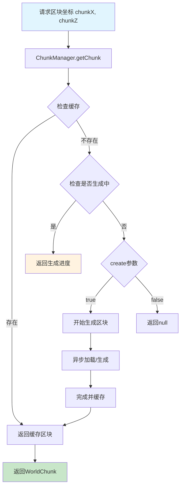
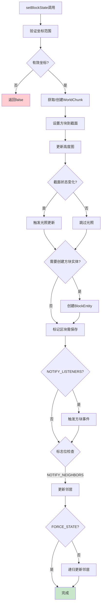

# 第 09 章：World核心类详解（World Core）

## 章节目标

通过本章学习，你将掌握：
- World 类的核心架构和设计理念
- 世界坐标系统和边界验证
- 区块的加载和访问机制
- 方块操作的完整流程
- 世界与实体的交互方式

## 前置知识

建议先阅读：
- [Part-1 基础/05-注册表系统](./Part-1-Foundation/05-registry-system.md) - 注册表机制
- [Part-1 基础/06-Tick系统](./Part-1-Foundation/08-tick-system.md) - 游戏刻概念

## 核心概念

### World = 巨大的图书馆档案柜

想象 World 是一个**巨大的图书馆档案柜**：

```
┌─────────────────────────────────────────────────────────────┐
│                    World = 图书馆档案柜                          │
├─────────────────────────────────────────────────────────────┤
│                                                              │
│  📚 档案柜 = World                                           │
│     │                                                        │
│     ├── 📁 抽屉 = Chunk（区块）                               │
│     │     ├── 📄 页面 = ChunkSection（截面）                   │
│     │     └── 📋 标签 = BlockState（方块状态）                  │
│     │                                                        │
│     ├── 🗂️ 索引卡 = Heightmap（高度图）                        │
│     └── 📦 特殊物品 = BlockEntity（方块实体）                    │
│                                                              │
└─────────────────────────────────────────────────────────────┘
```

**关键类比**：
- 档案柜（World）管理所有抽屉（Chunk）
- 每个抽屉（Chunk）包含详细的页面（方块数据）
- 索引系统（Heightmap）让你快速找到资料位置
- 特殊物品箱（BlockEntity）存储需要跟踪的信息

---

## 1. World 类的层次结构

### 1.1 类继承关系

```java
90:92:World.java
public abstract class World
    implements WorldAccess,
               AutoCloseable {
```

Minecraft 世界分为服务端世界和客户端世界：

```
World (抽象基类)
├── ServerWorld (服务端世界 - 管理所有游戏逻辑)
└── ClientWorld (客户端世界 - 仅负责渲染和本地模拟)
```

### 1.2 核心字段解析

```java
88:110:World.java
// 世界标识 - 定义维度类型
public static final RegistryKey<World> OVERWORLD = RegistryKey.of(RegistryKeys.WORLD, Identifier.ofVanilla("overworld"));
public static final RegistryKey<World> NETHER = RegistryKey.of(RegistryKeys.WORLD, Identifier.ofVanilla("the_nether"));
public static final RegistryKey<World> END = RegistryKey.of(RegistryKeys.WORLD, Identifier.ofVanilla("the_end"));

// 坐标边界常量
public static final int HORIZONTAL_LIMIT = 30000000;  // X/Z 轴限制
public static final int MAX_Y = 20000000;             // 最大高度
public static final int MIN_Y = -20000000;             // 最小高度

// 世界属性
protected final MutableWorldProperties properties;    // 可变属性
protected final RegistryEntry<DimensionType> dimensionEntry;  // 维度类型
protected final WorldBorder border;                   // 世界边界
protected final BiomeAccess biomeAccess;              // 生物群系访问
protected final RegistryKey<World> registryKey;       // 世界注册键

// 天气系统
protected float rainGradientPrev;  // 雨量渐变（上一刻）
protected float rainGradient;      // 雨量渐变（当前）
protected float thunderGradientPrev;
protected float thunderGradient;

// 标识
public final boolean isClient;     // 客户端/服务端标识
```

### 1.3 包结构

```
net.minecraft.world/
├── World.java              - 核心世界类
├── WorldAccess.java        - 世界访问接口
├── WorldProperties.java    - 世界属性
├── BiomeAccess.java       - 生物群系访问
├── Heightmap.java         - 高度图
├── storage/               - 世界保存加载
├── chunk/                 - 区块系统
├── entity/                 - 实体系统
├── biome/                  - 生物群系
├── dimension/              - 维度管理
├── tick/                   - Tick调度
├── gen/                    - 世界生成
└── block/                  - 方块交互
```

---

## 2. 坐标系统详解

### 2.1 坐标验证方法

```java
117:134:World.java
// 检查坐标是否在建筑高度限制内
public boolean isInBuildLimit(BlockPos pos) {
    return !this.isOutOfHeightLimit(pos) && World.isValidHorizontally(pos);
}

// 静态验证方法 - 检查坐标是否有效
public static boolean isValid(BlockPos pos) {
    return !World.isInvalidVertically(pos.getY()) && World.isValidHorizontally(pos);
}

// 水平坐标验证
private static boolean isValidHorizontally(BlockPos pos) {
    return pos.getX() >= -30000000 && pos.getZ() >= -30000000 
        && pos.getX() < 30000000 && pos.getZ() < 30000000;
}

// 垂直坐标验证
private static boolean isInvalidVertically(int y) {
    return y < -20000000 || y >= 20000000;
}
```

### 2.2 坐标系统图解

```
                    Minecraft 坐标系统
                    
         X轴 (东/西) ─────────────────────────►
          -30,000,000                      +30,000,000
              │                               │
              │     ┌─────────────────┐       │
              │     │                 │       │
              │     │   可建造区域     │       │
    Z轴       │     │   (Chunk区域)   │       │
   (南/北)    │     │                 │       │
    │         │     └─────────────────┘       │
    │         │                               │
    ▼         │                               │
 -30,000,000 ─┼───────────────────────────────► +30,000,000
              │                               │
              ▼                               ▼
         -20,000,000                      +20,000,000
                    Y轴 (高度)
                    
         实际可建造高度: -64 到 319 (主世界)
```

---

## 3. 区块访问机制

### 3.1 获取区块的方法

```java
146:164:World.java
// 获取指定位置的完整区块
public WorldChunk getWorldChunk(BlockPos pos) {
    return this.getChunk(
        ChunkSectionPos.getSectionCoord(pos.getX()), 
        ChunkSectionPos.getSectionCoord(pos.getZ())
    );
}

// 获取区块（按坐标）
@Override
public WorldChunk getChunk(int i, int j) {
    return (WorldChunk)this.getChunk(i, j, ChunkStatus.FULL);
}

// 通用获取方法
@Override
@Nullable
public Chunk getChunk(int chunkX, int chunkZ, ChunkStatus leastStatus, boolean create) {
    Chunk chunk = this.getChunkManager().getChunk(chunkX, chunkZ, leastStatus, create);
    if (chunk == null && create) {
        throw new IllegalStateException("Should always be able to create a chunk!");
    }
    return chunk;
}
```

### 3.2 区块加载流程图



---

## 4. 方块操作详解

### 4.1 设置方块状态

```java
172:207:World.java
// 公开API - 使用默认标志
@Override
public boolean setBlockState(BlockPos pos, BlockState state, int flags) {
    return this.setBlockState(pos, state, flags, 512);
}

// 完整实现
@Override
public boolean setBlockState(BlockPos pos, BlockState state, int flags, int maxUpdateDepth) {
    // 1. 验证高度限制
    if (this.isOutOfHeightLimit(pos)) {
        return false;
    }
    
    // 2. 调试世界不能修改
    if (!this.isClient && this.isDebugWorld()) {
        return false;
    }
    
    // 3. 获取目标区块
    WorldChunk worldChunk = this.getWorldChunk(pos);
    Block block = state.getBlock();
    
    // 4. 设置方块状态
    BlockState blockState = worldChunk.setBlockState(pos, state, (flags & Block.MOVED) != 0);
    
    if (blockState != null) {
        BlockState blockState2 = this.getBlockState(pos);
        
        if (blockState2 == state) {
            // 5. 通知监听器
            if ((flags & Block.NOTIFY_LISTENERS) != 0) {
                this.updateListeners(pos, blockState, state, flags);
            }
            
            // 6. 通知邻居
            if ((flags & Block.NOTIFY_NEIGHBORS) != 0) {
                this.updateNeighbors(pos, blockState.getBlock());
            }
            
            // 7. 递归更新邻居（可配置深度）
            if ((flags & Block.FORCE_STATE) == 0 && maxUpdateDepth > 0) {
                blockState.prepare(this, pos, i, maxUpdateDepth - 1);
                state.updateNeighbors(this, pos, i, maxUpdateDepth - 1);
            }
        }
        return true;
    }
    return false;
}
```

### 4.2 方块标志位说明

| 标志位 | 值 | 说明 | 典型用途 |
|-------|---|------|---------|
| `Block.MOVED` | 1 | 方块被移动（如活塞推动） | 活塞操作 |
| `Block.NOTIFY_NEIGHBORS` | 2 | 通知邻居方块更新 | 红石、工具使用 |
| `Block.NOTIFY_LISTENERS` | 4 | 触发方块事件监听器 | 一般放置 |
| `Block.FORCE_STATE` | 8 | 强制设置，跳过递归更新 | 批量操作 |
| `Block.SKIP_DROPS` | 16 | 跳过掉落物生成 | 爆炸、创造模式 |
| `Block.NO_REDRAW` | 32 | 不触发客户端重绘 | 批量修改 |

### 4.3 方块操作流程图



---

## 5. 方块实体管理

### 5.1 获取方块实体

```java
607:231:World.java
@Override
@Nullable
public BlockEntity getBlockEntity(BlockPos pos) {
    // 1. 检查高度限制
    if (this.isOutOfHeightLimit(pos)) {
        return null;
    }
    
    // 2. 服务端线程检查
    if (!this.isClient && Thread.currentThread() != this.thread) {
        return null;
    }
    
    // 3. 从区块获取
    return this.getWorldChunk(pos).getBlockEntity(pos, WorldChunk.CreationType.IMMEDIATE);
}
```

### 5.2 添加/移除方块实体

```java
234:247:World.java
// 添加方块实体
public void addBlockEntity(BlockEntity blockEntity) {
    BlockPos blockPos = blockEntity.getPos();
    if (this.isOutOfHeightLimit(blockPos)) {
        return;
    }
    this.getWorldChunk(blockPos).addBlockEntity(blockEntity);
}

// 移除方块实体
public void removeBlockEntity(BlockPos pos) {
    if (this.isOutOfHeightLimit(pos)) {
        return;
    }
    this.getWorldChunk(pos).removeBlockEntity(pos);
}
```

---

## 6. 爆炸系统

### 6.1 爆炸创建流程

```java
575:279:World.java
public Explosion createExplosion(
    @Nullable Entity entity,                    // 爆炸来源实体
    @Nullable DamageSource damageSource,        // 伤害来源
    @Nullable ExplosionBehavior behavior,      // 爆炸行为
    double x, double y, double z,              // 爆炸位置
    float power,                              // 爆炸威力
    boolean createFire,                        // 是否生成火焰
    ExplosionSourceType explosionSourceType,   // 爆炸源类型
    boolean particles,                         // 是否生成粒子
    // ... 其他参数
) {
    // 根据爆炸源决定破坏方式
    Explosion.DestructionType destructionType = switch (explosionSourceType.ordinal()) {
        case 0 -> Explosion.DestructionType.KEEP;  // NONE - 不破坏
        case 1 -> this.getDestructionType(GameRules.BLOCK_EXPLOSION_DROP_DECAY);
        case 2 -> {  // MOB - 生物爆炸
            if (this.getGameRules().getBoolean(GameRules.DO_MOB_GRIEFING)) {
                yield this.getDestructionType(GameRules.MOB_EXPLOSION_DROP_DECAY);
            }
            yield Explosion.DestructionType.KEEP;
        }
        case 3 -> this.getDestructionType(GameRules.TNT_EXPLOSION_DROP_DECAY);
        case 4 -> Explosion.DestructionType.TRIGGER_BLOCK;
    };
    
    // 创建爆炸对象
    Explosion explosion = new Explosion(this, entity, damageSource, behavior, 
                                        x, y, z, power, createFire, destructionType, ...);
    
    // 收集受影响的方块和实体
    explosion.collectBlocksAndDamageEntities();
    
    // 应用爆炸效果
    explosion.affectWorld(particles);
    
    return explosion;
}
```

### 6.2 爆炸源类型

```java
1067:288:World.java
public static enum ExplosionSourceType implements StringIdentifiable {
    NONE("none"),     // 无来源 - 床在末地爆炸
    BLOCK("block"),   // 方块 - 即时爆炸（如苦力怕）
    MOB("mob"),       // 生物 - 生物引爆
    TNT("tnt"),       // TNT
    TRIGGER("trigger");  // 触发器方块
}
```

---

## 7. 实战演示

### 7.1 创建自定义世界类型

```java
// 示例：创建一个只有虚空的世界
public class VoidWorld extends World {
    
    public VoidWorld() {
        super(new VoidWorldProperties(), Environment.NORMAL, 
              new RegistryEntry<>(DimensionTypes.OVERWORLD));
    }
    
    @Override
    public WorldChunk getChunk(int chunkX, int chunkZ, ChunkStatus leastStatus, boolean create) {
        // 返回虚空区块
        return new VoidWorldChunk(this, new ChunkPos(chunkX, chunkZ));
    }
    
    @Override
    public BlockState getBlockState(BlockPos pos) {
        return Blocks.AIR.getDefaultState();  // 始终返回空气
    }
    
    // ... 其他必要方法实现
}
```

### 7.2 遍历区块内所有方块

```java
// 遍历特定区块内的所有方块
public void iterateBlocksInChunk(ServerWorld world, int chunkX, int chunkZ) {
    WorldChunk chunk = world.getChunk(chunkX, chunkZ);
    
    // 获取区块坐标范围
    int startX = chunkX * 16;
    int startZ = chunkZ * 16;
    
    // 遍历所有截面
    for (ChunkSection section : chunk.getSectionArray()) {
        if (section.isEmpty()) continue;
        
        int sectionY = section.getY();  // 截面Y坐标
        
        // 遍历16x16x16范围内的所有方块
        for (int x = 0; x < 16; x++) {
            for (int y = 0; y < 16; y++) {
                for (int z = 0; z < 16; z++) {
                    BlockState state = section.getBlockState(x, y, z);
                    
                    if (!state.isAir()) {
                        BlockPos pos = new BlockPos(
                            startX + x,
                            (sectionY << 4) + y,
                            startZ + z
                        );
                        
                        // 处理非空气方块
                        processBlock(pos, state);
                    }
                }
            }
        }
    }
}

private void processBlock(BlockPos pos, BlockState state) {
    Block block = state.getBlock();
    // 自定义处理逻辑
    if (block == Blocks.DIAMOND_ORE) {
        System.out.println("发现钻石矿！位置: " + pos);
    }
}
```

### 7.3 天气控制

```java
// 设置天气
public void setWeather(ServerWorld world, int duration) {
    MutableWorldProperties props = world.getProperties();
    
    // 设置晴天，持续指定时间
    props.setClearWeather(duration);
    props.setRaining(false);
    props.setThundering(false);
}

// 设置暴风雨
public void setStorm(ServerWorld world, int duration) {
    MutableWorldProperties props = world.getProperties();
    
    props.setClearWeather(0);
    props.setRaining(true);
    props.setRainTime(duration);
    props.setThundering(false);
}

// 设置雷暴
public void setThunderstorm(ServerWorld world, int duration) {
    MutableWorldProperties props = world.getProperties();
    
    props.setClearWeather(0);
    props.setRaining(true);
    props.setRainTime(duration);
    props.setThundering(true);
    props.setThunderTime(duration);
}
```

---

## 8. 关键源码文件

| 文件 | 路径 | 说明 |
|-----|------|-----|
| `World.java` | `net.minecraft.world.World` | 核心世界类 |
| `WorldProperties.java` | `net.minecraft.world.WorldProperties` | 世界属性接口 |
| `MutableWorldProperties.java` | `net.minecraft.world.MutableWorldProperties` | 可变世界属性 |
| `WorldBorder.java` | `net.minecraft.world.border.WorldBorder` | 世界边界 |
| `BiomeAccess.java` | `net.minecraft.world.BiomeAccess` | 生物群系访问 |

---

## 课后自查

完成本章学习后，请检查你是否理解：

- [ ] World 类的三层继承结构
- [ ] 坐标系统的有效范围
- [ ] `getWorldChunk` vs `getChunk` 的区别
- [ ] 方块操作标志位的含义和使用场景
- [ ] 方块实体与世界的关联方式
- [ ] 爆炸源类型的区别

---

## 延伸阅读

- [09-Chunk区块系统](./10-chunk-system.md) - 深入了解区块数据结构
- [12-光照系统](./13-lighting-system.md) - 光照计算机制
