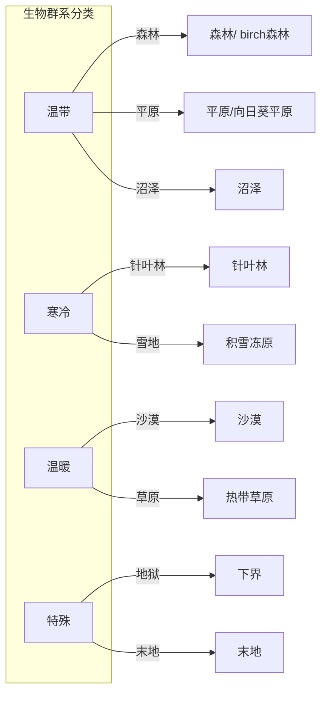
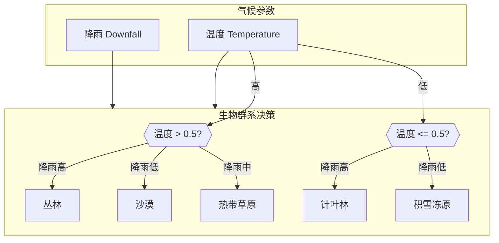
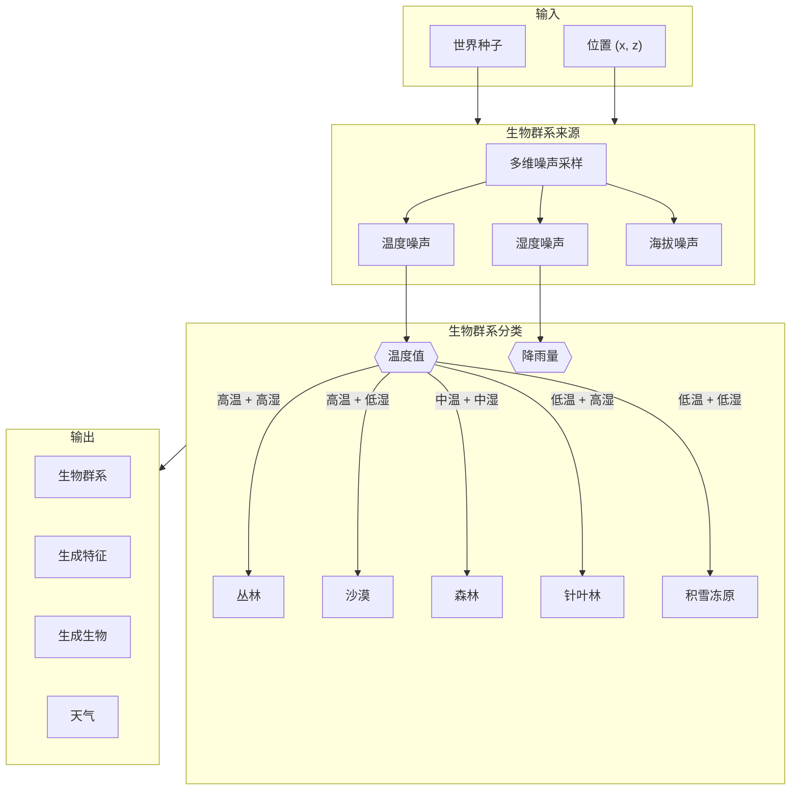

# 10 - 生物群系系统：Biome 的多彩世界

## 目标

学完本章后，你将理解：
- Biome 类是什么，它包含哪些信息
- 温度和降雨如何决定生物群系
- 生物群系是如何存储在 Chunk 中的
- 生物群系在游戏中的实际应用

## 前置知识

- [09-区块系统.md](./09-chunk-system.md) - 理解 Chunk 的结构
- [04-注册表系统.md](../Part-1-Foundation/04-registry-system.md) - 理解注册表机制

## 核心概念

### 生物群系是什么？

想象你在中国旅游：

- **东北哈尔滨** → 冬天很冷，下雪，有冰屋
- **海南三亚** → 常年温暖，海滩，椰子树
- **西藏高原** → 空气稀薄，草原，牦牛

**Minecraft 的生物群系** = 世界各地的"气候区"在游戏里的实现！

每个生物群系决定了：
- 地表的方块（草地、沙子、雪）
- 植被（树木、花、草）
- 天气（是否下雨、下雪）
- 可以生成的生物（猪、牛、羊只在草原）



### 温度和降雨：决定生物群系的关键

**生活比喻**：

| 温度 (Temperature) | 降雨 (Downfall) | 现实类比 | MC 生物群系 |
|-------------------|-----------------|---------|-------------|
| 高 | 高 | 热带雨林 | 丛林 |
| 高 | 低 | 沙漠 | 沙漠 |
| 中等 | 中等 | 温带 | 森林/平原 |
| 低 | 高 | 寒带 | 针叶林 |
| 很低 | 任意 | 冻土 | 积雪冻原 |



### Biome 类的结构

> ⚠️ **注意**：以下代码基于 CFR 反编译，实际源码可能略有差异。建议结合 Minecraft 源码仓库交叉验证。

源码路径：`net/minecraft/world/biome/Biome.java`

```java
public final class Biome {
    // 天气参数
    private final Weather weather;

    // 生成设置（矿石、树木等特征）
    private final GenerationSettings generationSettings;

    // 出生设置（什么生物在这里生成）
    private final SpawnSettings spawnSettings;

    // 视觉效果（天空颜色、粒子、声音等）
    private final BiomeEffects effects;
}
```

### 天气参数

```java
record Weather(
    boolean hasPrecipitation,    // 是否降水
    float temperature,           // 温度 (0.0 - 1.0)
    TemperatureModifier modifier, // 温度修正器
    float downfall              // 降雨量 (0.0 - 1.0)
)
```

**温度会随高度变化**：

```java
private float computeTemperature(BlockPos pos) {
    float baseTemp = this.weather.temperatureModifier
        .getModifiedTemperature(pos, this.getTemperature());

    // 高度超过 80 格，温度会下降
    if (pos.getY() > 80) {
        float noise = TEMPERATURE_NOISE.sample(pos.getX() / 8.0f,
                                          pos.getZ() / 8.0f, false) * 8.0;
        return baseTemp - (noise + (float)pos.getY() - 80.0f) * 0.05f / 40.0f;
    }
    return baseTemp;
}
```

### 降水的决定

```java
public boolean hasPrecipitation() {
    return this.weather.hasPrecipitation();
}

@Override
public Precipitation getPrecipitation(BlockPos pos) {
    if (!this.hasPrecipitation()) {
        return Precipitation.NONE;
    }
    // 温度低于某个阈值就是雪，否则是雨
    return this.isCold(pos) ? Precipitation.SNOW : Precipitation.RAIN;
}
```

## 核心代码

### 温度计算

```java
private float computeTemperature(BlockPos pos) {
    // 从天气设置获取基础温度
    float f = this.weather.temperatureModifier
        .getModifiedTemperature(pos, this.getTemperature());

    // 高处温度下降（海拔效应）
    if (pos.getY() > 80) {
        // 添加噪声来调节温度变化
        float g = (float)(TEMPERATURE_NOISE.sample(
            (float)pos.getX() / 8.0f,
            (float)pos.getZ() / 8.0f,
            false
        ) * 8.0);

        // 高度每增加 40 格，温度降低 0.05
        return f - (g + (float)pos.getY() - 80.0f) * 0.05f / 40.0f;
    }
    return f;
}
```

### 冰和雪的生成条件

```java
public boolean canSetIce(WorldView world, BlockPos blockPos) {
    return this.canSetIce(world, blockPos, true);
}

public boolean canSetIce(WorldView world, BlockPos pos, boolean doWaterCheck) {
    // 1. 不能是夏季生物群系
    if (this.doesNotSnow(pos)) {
        return false;
    }

    // 2. 位置必须在有效高度范围内
    if (pos.getY() >= world.getBottomY() && pos.getY() < world.getTopY()
        && world.getLightLevel(LightType.BLOCK, pos) < 10) {

        // 3. 必须是水方块
        BlockState blockState = world.getBlockState(pos);
        FluidState fluidState = world.getFluidState(pos);
        if (fluidState.getFluid() == Fluids.WATER
            && blockState.getBlock() instanceof FluidBlock) {

            // 4. 周围也要有水（角落可能不结冰）
            boolean bl = world.isWater(pos.west())
                      && world.isWater(pos.east())
                      && world.isWater(pos.north())
                      && world.isWater(pos.south());

            if (!doWaterCheck || bl) {
                return true;  // 结冰！
            }
        }
    }
    return false;
}
```

### 生物群系的视觉效果

```java
public int getGrassColorAt(double x, double z) {
    // 从效果设置获取颜色
    int baseColor = this.effects.getGrassColor()
        .orElseGet(this::getDefaultGrassColor);

    // 根据温度和降雨调整颜色
    return this.effects.getGrassColorModifier()
        .getModifiedGrassColor(x, z, baseColor);
}
```

### 生物群系如何存储在 Chunk 中

每个 **ChunkSection** 都存储了生物群系信息：

```java
public class ChunkSection {
    // 生物群系数据
    private ReadableContainer<RegistryEntry<Biome>> biomeContainer;
}
```

生物群系是以 **4x4x4 的块**为单位存储的（而不是每个方块一个）：

```java
public void populateBiomes(BiomeSupplier biomeSupplier, ...) {
    PalettedContainer<RegistryEntry<Biome>> palettedContainer =
        this.biomeContainer.slice();

    // 4x4x4 的网格
    for (int j = 0; j < 4; ++j) {
        for (int k = 0; k < 4; ++k) {
            for (int l = 0; l < 4; ++l) {
                // 计算生物群系
                palettedContainer.swapUnsafe(j, k, l,
                    biomeSupplier.getBiome(x + j, y + k, z + l, sampler));
            }
        }
    }
}
```

## 图解：生物群系生成流程



## 实战演示

### 生物群系的应用场景

1. **地表生成**（见 11-地形生成.md）
   - 草地颜色
   - 地表方块（草方块 vs 沙砾 vs 沙子）

2. **实体生成**
   ```java
   // 在什么生物群系可以生成什么生物
   Pool<SpawnSettings.SpawnEntry> getEntitySpawnList(
       RegistryEntry<Biome> biome,  // 生物群系
       SpawnGroup group             // 生物分类
   )
   ```

3. **方块放置**
   - 积雪冻原的村庄不会生成（太冷）
   - 丛林会生成藤蔓

4. **方块特性**
   - 下界不会生成冰（岩浆更多）
   - 冰刺高原有特殊的冰结构

## 小结

| 概念 | 说明 |
|------|------|
| Biome | 表示一个气候区的类 |
| Temperature | 温度参数，决定是否下雪 |
| Downfall | 降雨参数，影响湿度 |
| GenerationSettings | 该生物群系如何生成地形特征 |
| SpawnSettings | 该生物群系可以生成什么生物 |
| BiomeEffects | 视觉效果（颜色、粒子、声音） |

**关键理解**：
- **温度 + 降雨 = 生物群系**：这两个参数决定了具体的生物群系
- **高度影响温度**：高海拔地区温度更低
- **生物群系是分层的**：生成特征、出生设置、视觉效果各司其职

## 练习

### 思考题

1. 为什么在 Minecraft 中山顶可能是雪，而山脚是森林？
2. 如果你要添加一个新的"火山"生物群系，它应该有什么特点？
3. 生物群系和矿石生成有什么关系？

### 动手题

在源码中找到以下内容：

1. 查看 `Biome.java` 中 Biome 类的字段
2. 查看 `Biome.java` 中 Weather record 的定义
3. 理解 `Biome.java` 中温度计算逻辑
4. **在游戏中验证**：进入不同的生物群系，观察：
   - 天空颜色
   - 草的颜色
   - 天气（是否下雨/下雪）

## 源码文件位置

| 文件 | 源码路径 | 说明 |
|------|----------|------|
| Biome.java | `net/minecraft/world/biome/Biome.java` | 生物群系基类 |
| BiomeKeys.java | `net/minecraft/world/biome/BiomeKeys.java` | 生物群系键 |
| BiomeRegistry.java | `net/minecraft/registry/BiomeRegistry.java` | 生物群系注册表 |

## 相关链接

- [11-地形生成.md](./11-terrain-gen.md) - 生物群系如何影响地形生成
- [09-区块系统.md](./09-chunk-system.md) - 生物群系如何存储在 Chunk 中
- Minecraft Wiki: [Biome](https://minecraft.wiki/w/Biome)
