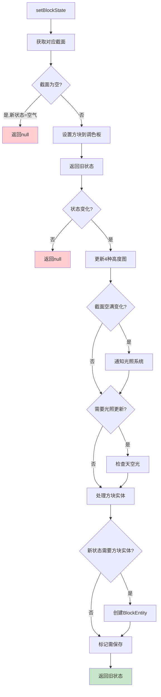
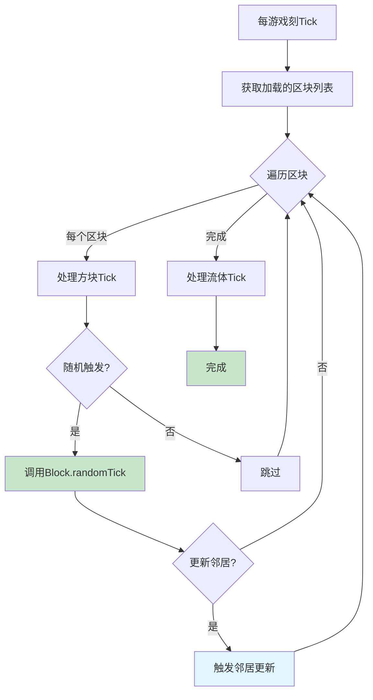

# 第 10 章：Chunk区块系统详解（Chunk System）

## 章节目标

通过本章学习，你将掌握：
- Chunk（区块）的数据结构和存储方式
- ChunkSection（截面）的组成原理
- PalettedContainer（调色板容器）的压缩机制
- 区块的加载、保存和调度流程
- ChunkManager 的管理和协调机制

## 前置知识

建议先阅读：
- [08-World核心类](./09-world-core.md) - 世界的基本概念
- [Part-1 基础/05-注册表系统](./Part-1-Foundation/05-registry-system.md) - 注册表机制

## 核心概念

### Chunk = 乐高积木的一小块

想象 Minecraft 世界是一块巨大的**乐高积木地板**：

```
┌─────────────────────────────────────────────────────────────┐
│              Minecraft 世界 = 乐高地板                            │
├─────────────────────────────────────────────────────────────┤
│                                                              │
│    ┌────────┐ ┌────────┐ ┌────────┐ ┌────────┐             │
│    │ Chunk │ │ Chunk │ │ Chunk │ │ Chunk │             │
│    │ (0,0) │ │ (1,0) │ │ (2,0) │ │ (3,0) │             │
│    └────────┘ └────────┘ └────────┘ └────────┘             │
│                                                              │
│    ┌────────┐ ┌────────┐ ┌────────┐ ┌────────┐             │
│    │ Chunk │ │ Chunk │ │ Chunk │ │ Chunk │             │
│    │ (0,1) │ │ (1,1) │ │ (2,1) │ │ (3,1) │  ← 你在这里 │
│    └────────┘ └────────┘ └────────┘ └────────┘             │
│                                                              │
│         每个 Chunk = 16 × 16 × 256 = 65,536 个方块位置        │
│                                                              │
└─────────────────────────────────────────────────────────────┘
```

**关键类比**：
- 乐高地板由小块（Chunk）拼接而成
- 每小块都是标准尺寸（16×16×256）
- 你只需要加载周围的小块就能游玩
- 远处的地块可以暂时不加载

---

## 1. 区块架构概述

### 1.1 区块数据结构

```
┌─────────────────────────────────────────────────────────────────┐
│                         WorldChunk                                │
├─────────────────────────────────────────────────────────────────┤
│  ChunkPos pos                    - 区块坐标 (cx, cz)             │
│  ChunkSection[] sectionArray     - 区块截面数组 (24个)            │
│  Map<Heightmap.Type, Heightmap>  - 高度图映射                    │
│  Map<BlockPos, BlockEntity>      - 方块实体映射                  │
│  ChunkTickScheduler<Block>        - 方块Tick调度器                │
│  ChunkTickScheduler<Fluid>        - 流体Tick调度器                 │
│  Int2ObjectMap<GameEventDispatcher> - 游戏事件调度器             │
├─────────────────────────────────────────────────────────────────┤
│                         ChunkSection                             │
├─────────────────────────────────────────────────────────────────┤
│  PalettedContainer<BlockState>   - 方块状态容器 (调色板压缩)      │
│  PalettedContainer<Biome>        - 生物群系容器                  │
│  ChunkNibbleArray skyLight       - 天空光照 (8bit → 4bit压缩)    │
│  ChunkNibbleArray blockLight     - 方块光照                      │
└─────────────────────────────────────────────────────────────────┘
```

### 1.2 类层次结构

```java
// Chunk.java - 区块基类
62:112:WorldChunk.java
public class WorldChunk extends Chunk {
    private final Map<BlockPos, WrappedBlockEntityTickInvoker> blockEntityTickers;
    private boolean loadedToWorld;
    final World world;
    
    @Nullable
    private Supplier<ChunkLevelType> levelTypeProvider;
    @Nullable
    private EntityLoader entityLoader;
    private final Int2ObjectMap<GameEventDispatcher> gameEventDispatchers;
    private final ChunkTickScheduler<Block> blockTickScheduler;
    private final ChunkTickScheduler<Fluid> fluidTickScheduler;
```

---

## 2. 方块状态操作

### 2.1 获取方块状态

```java
160:187:WorldChunk.java
@Override
public BlockState getBlockState(BlockPos pos) {
    int i = pos.getX();
    int j = pos.getY();
    int k = pos.getZ();
    
    // 调试世界的特殊处理
    if (this.world.isDebugWorld()) {
        BlockState blockState = null;
        if (j == 60) {
            blockState = Blocks.BARRIER.getDefaultState();
        }
        if (j == 70) {
            blockState = DebugChunkGenerator.getBlockState(i, k);
        }
        return blockState == null ? Blocks.AIR.getDefaultState() : blockState;
    }
    
    try {
        // 获取对应截面
        ChunkSection chunkSection;
        int l = this.getSectionIndex(j);
        
        // 检查截面索引有效性
        if (l >= 0 && l < this.sectionArray.length 
            && !(chunkSection = this.sectionArray[l]).isEmpty()) {
            // 从截面的调色板容器中获取方块状态
            return chunkSection.getBlockState(i & 0xF, j & 0xF, k & 0xF);
        }
        return Blocks.AIR.getDefaultState();
    } catch (Throwable throwable) {
        // 错误处理...
    }
}
```

### 2.2 设置方块状态

```java
210:269:WorldChunk.java
@Override
@Deprecated
public BlockState setBlockState(BlockPos pos, BlockState state, boolean moved) {
    int l, k, j = pos.getY();
    ChunkSection chunkSection = this.getSection(this.getSectionIndex(j));
    boolean bl = chunkSection.isEmpty();
    
    // 空的截面设置为空气，直接返回
    if (bl && state.isAir()) {
        return null;
    }
    
    // 计算相对于区块内的坐标
    int j1 = pos.getX() & 0xF;
    BlockState blockState = chunkSection.setBlockState(j1, k = i & 0xF, l = pos.getZ() & 0xF, state);
    
    // 状态没变化，返回null
    if (blockState == state) {
        return null;
    }
    
    // 更新高度图 - 4种类型的同步更新
    ((Heightmap)this.heightmaps.get(Heightmap.Type.MOTION_BLOCKING))
        .trackUpdate(j1, i, l, state);
    ((Heightmap)this.heightmaps.get(Heightmap.Type.MOTION_BLOCKING_NO_LEAVES))
        .trackUpdate(j1, i, l, state);
    ((Heightmap)this.heightmaps.get(Heightmap.Type.OCEAN_FLOOR))
        .trackUpdate(j1, i, l, state);
    ((Heightmap)this.heightmaps.get(Heightmap.Type.WORLD_SURFACE))
        .trackUpdate(j1, i, l, state);
    
    // 处理光照更新
    boolean bl2 = chunkSection.isEmpty();
    if (bl != bl2) {
        // 截面空满状态变化，通知光照提供者
        this.world.getChunkManager().getLightingProvider()
            .setSectionStatus(pos, bl2);
    }
    
    // 检查是否需要更新天空光照
    if (ChunkLightProvider.needsLightUpdate(this, pos, blockState, state)) {
        this.chunkSkyLight.isSkyLightAccessible(this, j1, i, l);
        this.world.getChunkManager().getLightingProvider().checkBlock(pos);
    }
    
    // 处理方块实体
    if (!chunkSection.getBlockState(j1, k, l).isOf(block)) {
        return null;
    }
    
    // 如果新状态需要方块实体
    if (state.hasBlockEntity()) {
        BlockEntity blockEntity = this.getBlockEntity(pos, CreationType.CHECK);
        if (blockEntity == null) {
            // 创建新的方块实体
            BlockEntity newEntity = ((BlockEntityProvider)block)
                .createBlockEntity(pos, state);
            if (newEntity != null) {
                this.addBlockEntity(newEntity);
            }
        }
    }
    
    // 标记区块需要保存
    this.needsSaving = true;
    return blockState;
}
```

### 2.3 区块操作流程图



---

## 3. 调色板系统 (PalettedContainer)

### 3.1 调色板压缩原理

Minecraft 使用**调色板压缩**来存储区块数据，大幅减少内存占用。

```
未压缩存储 vs 调色板压缩

未压缩（每个方块1个ID）：
┌────┬────┬────┬────┐
│  1 │  1 │  1 │  1 │   16×16×16 = 4,096 个整数
│  1 │  2 │  2 │  1 │   假设每个int=4字节 → 16KB/截面
│  1 │  2 │  2 │  1 │
│  1 │  1 │  1 │  1 │
└────┴────┴────┴────┘

调色板压缩：
┌──────────────────────────────┐
│  Palette: [石头=0, 泥土=1, 空气=2]
│  Data: [0,0,0,0,0,1,1,0,...]  ← 仅存储索引
│  总共需要: 调色板 + 压缩数据
└──────────────────────────────┘
```

### 3.2 调色板类型

```java
// Palette.java - 调色板接口
public interface Palette<T> {
    int getIndex(T object);
    T get(int index);
    void read(DataBitsReader reader);
    void write(DataBitsWriter writer);
}

// 单值调色板 - 所有方块相同
public class SingularPalette<T> implements Palette<T> {
    private final T value;  // 只有一种值
}

// ID列表调色板 - 简单索引
public class IdListPalette<T> implements Palette<T> {
    private final ArrayList<T> entries;  // 按ID顺序存储
}

// BiMap调色板 - 双向映射（常用）
public class BiMapPalette<T> implements Palette<T> {
    private final Int2ObjectMap<T> entries;    // ID → 对象
    private final Object2IntMap<T> idMap;      // 对象 → ID
}

// 数组调色板 - 固定大小数组
public class ArrayPalette<T> implements Palette<T> {
    private final T[] entries;  // 最多256种值
}
```

### 3.3 调色板选择策略

```
调色板选择逻辑（基于不同方块类型数量）：

┌─────────────────────────────────────────────────────────────┐
│  1种类型 → SingularPalette（单值调色板）                       │
│            存储：1个值 + 无数据数组                             │
│                                                              │
│  2-16种 → ArrayPalette（数组调色板）                          │
│            存储：数组 + 每方块4bits索引                        │
│                                                              │
│  17-256种 → BiMapPalette（双向映射调色板）                     │
│            存储：映射表 + 每方块1byte索引                       │
│                                                              │
│  >256种 → IdListPalette（ID列表调色板）                        │
│            存储：完整ID数组 + 每方块2bytes索引                   │
└─────────────────────────────────────────────────────────────┘
```

---

## 4. ChunkManager 区块管理

### 4.1 核心接口

```java
17:20:ChunkManager.java
public abstract class ChunkManager
    implements ChunkProvider,
               AutoCloseable {
```

### 4.2 主要方法

```java
// 获取区块
@Nullable
public abstract Chunk getChunk(int var1, int var2, ChunkStatus var3, boolean var4);

// Tick处理
public abstract void tick(BooleanSupplier var1, boolean var2);

// 调试信息
public abstract String getDebugString();

// 已加载区块数量
public abstract int getLoadedChunkCount();

// 光照提供者
public abstract LightingProvider getLightingProvider();

// 设置刷怪选项
public void setMobSpawnOptions(boolean spawnMonsters, boolean spawnAnimals);
```

### 4.3 区块加载状态

```
区块生命周期：

Loading ────────────────────────────► Unloading
   │                                        ▲
   ▼                                        │
┌─────────┐  ┌─────────┐  ┌─────────┐  ┌─────────┐
│ EMPTY   │→│ FULL    │→│ ENTITY   │→│ STALE   │
│ 空区块   │  │ 完整区块 │  │ 含实体   │  │ 陈旧区块 │
└─────────┘  └─────────┘  └─────────┘  └─────────┘
   │           │           │           │
   │           │           │           │
   ▼           ▼           ▼           ▼
ChunkStatus 等级：
 - EMPTY → FULL → ENTITY → STALE → EMPTY
```

---

## 5. 区块 Tick 调度

### 5.1 TickScheduler 结构

```java
512:520:WorldChunk.java
// 禁用Tick调度器
public void disableTickSchedulers(long time) {
    this.blockTickScheduler.disable(time);
    this.fluidTickScheduler.disable(time);
}

// 添加区块Tick调度器
public void addChunkTickSchedulers(ServerWorld world) {
    ((WorldTickScheduler)world.getBlockTickScheduler())
        .addChunkTickScheduler(this.pos, this.blockTickScheduler);
    ((WorldTickScheduler)world.getFluidTickScheduler())
        .addChunkTickScheduler(this.pos, this.fluidTickScheduler);
}
```

### 5.2 Tick调度流程图



---

## 6. 实战演示

### 6.1 遍历区块内特定方块

```java
// 查找区块内所有钻石矿石
public List<BlockPos> findDiamondOres(World world, int chunkX, int chunkZ) {
    List<BlockPos> diamonds = new ArrayList<>();
    WorldChunk chunk = world.getChunk(chunkX, chunkZ);
    
    int startX = chunkX * 16;
    int startZ = chunkZ * 16;
    
    for (ChunkSection section : chunk.getSectionArray()) {
        if (section.isEmpty()) continue;
        
        int sectionY = section.getY() << 4;
        
        // 优化：先检查调色板是否包含目标方块
        if (!section.getBlockStatePalette().contains(Blocks.DIAMOND_ORE)) {
            continue;
        }
        
        for (int x = 0; x < 16; x++) {
            for (int y = 0; y < 16; y++) {
                for (int z = 0; z < 16; z++) {
                    BlockState state = section.getBlockState(x, y, z);
                    if (state.isOf(Blocks.DIAMOND_ORE)) {
                        diamonds.add(new BlockPos(
                            startX + x,
                            sectionY + y,
                            startZ + z
                        ));
                    }
                }
            }
        }
    }
    
    return diamonds;
}
```

### 6.2 批量方块操作

```java
// 批量设置区块内所有方块为空气（清除区块）
public void clearChunk(World world, int chunkX, int chunkZ) {
    WorldChunk chunk = world.getChunk(chunkX, chunkZ);
    
    // 使用批量操作标志，避免频繁的光照更新
    int flags = Block.NOTIFY_LISTENERS | Block.MOVED;
    
    for (ChunkSection section : chunk.getSectionArray()) {
        if (section.isEmpty()) continue;
        
        // 标记截面为空
        section.fill(Blocks.AIR.getDefaultState());
    }
    
    // 清理所有方块实体
    chunk.getBlockEntities().clear();
    
    // 重置高度图
    for (Heightmap heightmap : chunk.getHeightmaps().values()) {
        heightmap.clear();
    }
    
    // 标记需要保存
    chunk.setNeedsSaving(true);
}
```

### 6.3 自定义区块加载器

```java
// 创建自定义区块加载器
public class CustomChunkManager extends ChunkManager {
    
    private final File worldDir;
    private final Map<Long, WorldChunk> loadedChunks;
    private final LightingProvider lightingProvider;
    
    public CustomChunkManager(File worldDir, Registry<Biome> biomeRegistry) {
        this.worldDir = worldDir;
        this.loadedChunks = new ConcurrentHashMap<>();
        this.lightingProvider = new LightingProvider(this);
    }
    
    @Override
    public Chunk getChunk(int chunkX, int chunkZ, ChunkStatus status, boolean create) {
        long pos = ChunkPos.toLong(chunkX, chunkZ);
        
        // 1. 检查缓存
        WorldChunk cached = loadedChunks.get(pos);
        if (cached != null && status.ordinal() <= cached.getStatus().ordinal()) {
            return cached;
        }
        
        // 2. 检查磁盘
        if (!create && !chunkExistsOnDisk(chunkX, chunkZ)) {
            return null;
        }
        
        // 3. 创建新区块
        WorldChunk newChunk = create ? loadOrGenerate(chunkX, chunkZ) : null;
        if (newChunk != null) {
            loadedChunks.put(pos, newChunk);
        }
        return newChunk;
    }
    
    private WorldChunk loadOrGenerate(int chunkX, int chunkZ) {
        // 尝试从磁盘加载
        File chunkFile = getChunkFile(worldDir, chunkX, chunkZ);
        if (chunkFile.exists()) {
            return loadChunk(chunkFile);
        }
        
        // 生成新区块
        return generateChunk(chunkX, chunkZ);
    }
}
```

---

## 7. 性能优化建议

### 7.1 区块访问优化

```
优化建议：
┌─────────────────────────────────────────────────────────────┐
│  ✅ 批量操作      │ 使用 setBlockState(pos, state, flags)    │
│                   │ 批量处理后统一触发更新                    │
├─────────────────────────────────────────────────────────────┤
│  ✅ 范围检查      │ 操作前检查坐标是否在区块内                 │
│                   │ BlockPos.isValidChunkCoord()            │
├─────────────────────────────────────────────────────────────┤
│  ✅ 缓存高度图    │ 使用 getHeightmap() 获取缓存              │
│                   │ 避免重复计算                             │
├─────────────────────────────────────────────────────────────┤
│  ✅ 延迟加载      │ 只加载需要的区块                          │
│                   │ 使用 getChunkAsync()                    │
└─────────────────────────────────────────────────────────────┘
```

### 7.2 内存优化

```java
// 监控区块内存使用
public void logChunkMemory(WorldChunk chunk) {
    // 估算内存占用
    int sections = 0;
    int nonEmptySections = 0;
    
    for (ChunkSection section : chunk.getSectionArray()) {
        sections++;
        if (!section.isEmpty()) {
            nonEmptySections++;
        }
    }
    
    // 每个截面的方块数据约 16KB
    int estimatedBytes = nonEmptySections * 16 * 1024;
    
    System.out.printf("Chunk %s: %d/%d sections, ~%d KB%n",
        chunk.getPos(), nonEmptySections, sections, 
        estimatedBytes / 1024);
}
```

---

## 8. 关键源码文件

| 文件 | 路径 | 说明 |
|-----|------|-----|
| `WorldChunk.java` | `net.minecraft.world.chunk.WorldChunk` | 完整区块类 |
| `Chunk.java` | `net.minecraft.world.chunk.Chunk` | 区块基类 |
| `ChunkSection.java` | `net.minecraft.world.chunk.ChunkSection` | 区块截面 |
| `ChunkManager.java` | `net.minecraft.world.chunk.ChunkManager` | 区块管理器 |
| `PalettedContainer.java` | `net.minecraft.world.chunk.storage.PalettedContainer` | 调色板容器 |
| `ChunkPos.java` | `net.minecraft.util.math.ChunkPos` | 区块坐标 |

---

## 课后自查

完成本章学习后，请检查你是否理解：

- [ ] Chunk 的三维结构（16×16×256）
- [ ] ChunkSection 的作用和数量
- [ ] 调色板压缩的工作原理
- [ ] 不同调色板类型的选择策略
- [ ] 区块加载状态（EMPTY→FULL→ENTITY）
- [ ] 高度图更新的触发时机

---

## 延伸阅读

- [10-生物群系系统](./11-biome-system.md) - 生物群系的存储和访问
- [11-地形生成](./12-terrain-gen.md) - 区块的生成过程
- [13-高度图系统](./14-heightmap.md) - 高度图的详细实现
