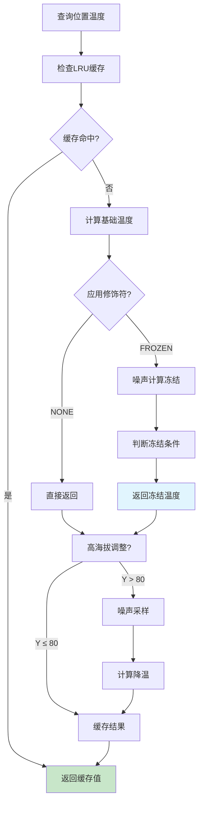

# 第 11 章：生物群系系统（Biome System）

## 章节目标

通过本章学习，你将掌握：
- Biome（生物群系）的数据结构和属性
- 生物群系的温度计算机制
- 生物群系效果（天空颜色、粒子、声音等）
- 生物群系在区块中的存储方式
- 如何在世界中访问和查询生物群系

## 前置知识

建议先阅读：
- [08-World核心类](./09-world-core.md) - 世界的基本概念
- [09-Chunk区块系统](./10-chunk-system.md) - 区块数据结构

## 核心概念

### Biome = 世界各地的气候区

想象 Minecraft 世界由许多不同的**气候区**组成：

```
┌─────────────────────────────────────────────────────────────┐
│              Minecraft 世界 = 地球仪                            │
├─────────────────────────────────────────────────────────────┤
│                                                              │
│     ┌──────────────────────────────────────────────┐        │
│     │              冻土/冰刺平原                       │        │
│     │                  ❄️ ❄️ ❄️                      │        │
│     └──────────────────────────────────────────────┘        │
│                        ↕ 温度渐降                            │
│     ┌──────────────────────────────────────────────┐        │
│     │              针叶林/雪地                       │        │
│     │                 🌲🌲🌲                         │        │
│     └──────────────────────────────────────────────┘        │
│                        ↕                                    │
│     ┌──────────────────────────────────────────────┐        │
│     │              森林/平原                          │        │
│     │               🌳🌻🌳                           │        │
│     └──────────────────────────────────────────────┘        │
│                        ↕                                    │
│     ┌──────────────────────────────────────────────┐        │
│     │              丛林/热带海滩                      │        │
│     │                 🌴🌺🏖️                        │        │
│     └──────────────────────────────────────────────┘        │
│                        ↕ 温度渐升                            │
│     ┌──────────────────────────────────────────────┐        │
│     │              沙漠/恶地                         │        │
│     │                 🏜️🏜️🏜️                        │        │
│     └──────────────────────────────────────────────┘        │
│                                                              │
└─────────────────────────────────────────────────────────────┘
```

**关键类比**：
- 每个气候区有独特的温度和天气
- 生物群系决定能生成什么动植物
- 生物群系决定天空颜色和背景音乐
- 相邻生物群系之间有过渡带

---

## 1. Biome 类结构

### 1.1 核心字段

```java
45:75:Biome.java
public final class Biome {
    private final Weather weather;                    // 天气配置
    private final GenerationSettings generationSettings;  // 生成设置
    private final SpawnSettings spawnSettings;        // 出生设置
    private final BiomeEffects effects;              // 生物群系效果
    private final ThreadLocal<Long2FloatLinkedOpenHashMap> temperatureCache;  // 温度缓存
}
```

### 1.2 生物群系组成

```
┌─────────────────────────────────────────────────────────────┐
│                        Biome                                    │
├─────────────────────────────────────────────────────────────┤
│                                                              │
│  ┌─────────────────┐   ┌─────────────────┐                 │
│  │     Weather      │   │  GenerationSettings│                │
│  │  ├─ temperature  │   │  ├─ features     │                │
│  │  ├─ downfall     │   │  ├─ spawners    │                │
│  │  └─ precipitation│   │  └─ carvers     │                │
│  └─────────────────┘   └─────────────────┘                 │
│                                                              │
│  ┌─────────────────┐   ┌─────────────────┐                 │
│  │   SpawnSettings  │   │   BiomeEffects  │                 │
│  │  ├─ spawners     │   │  ├─ sky color   │                │
│  │  ├─ creature     │   │  ├─ fog color   │                │
│  │  │   type        │   │  ├─ particles   │                │
│  │  └─ ambient      │   │  ├─ sounds      │                │
│  │     spawner      │   │  └─ music       │                │
│  └─────────────────┘   └─────────────────┘                 │
│                                                              │
└─────────────────────────────────────────────────────────────┘
```

---

## 2. 天气系统

### 2.1 Weather 配置

```java
231:233:Biome.java
public final record Weather(
    boolean hasPrecipitation,      // 是否有降水
    float temperature,             // 基础温度
    TemperatureModifier modifier,  // 温度修饰符
    float downfall                // 降水量
) {}
```

### 2.2 温度修饰符

```java
258:304:Biome.java
public static enum TemperatureModifier implements StringIdentifiable {
    // 无修饰符 - 直接使用基础温度
    NONE("none") {
        @Override
        public float getModifiedTemperature(BlockPos pos, float temperature) {
            return temperature;
        }
    },
    
    // 冻结修饰符 - 用于冻洋等冰冷生物群系
    FROZEN("frozen") {
        @Override
        public float getModifiedTemperature(BlockPos pos, float temperature) {
            // 基于噪声计算冻结效果
            double d = FROZEN_OCEAN_NOISE.sample(pos.getX() * 0.05, pos.getZ() * 0.05, false) * 7.0;
            double e = d + FOLIAGE_NOISE.sample(pos.getX() * 0.2, pos.getZ() * 0.2, false);
            
            // 如果深海且噪声低，设置为0.2（冻结）
            if (e < 0.3 && FOLIAGE_NOISE.sample(pos.getX() * 0.09, pos.getZ() * 0.09, false) < 0.8) {
                return 0.2f;
            }
            return temperature;
        }
    };
}
```

### 2.3 温度计算详解

```java
96:119:Biome.java
private float computeTemperature(BlockPos pos) {
    // 1. 应用温度修饰符
    float f = this.weather.temperatureModifier()
        .getModifiedTemperature(pos, this.getTemperature());
    
    // 2. 高海拔降温（每8格下降0.05）
    if (pos.getY() > 80) {
        float g = (float)(TEMPERATURE_NOISE.sample(
            (float)pos.getX() / 8.0f, 
            (float)pos.getZ() / 8.0f, 
            false) * 8.0);
        
        return f - (g + (float)pos.getY() - 80.0f) * 0.05f / 40.0f;
    }
    return f;
}

@Deprecated
private float getTemperature(BlockPos blockPos) {
    long l = blockPos.asLong();
    
    // 1. 使用线程本地缓存
    Long2FloatLinkedOpenHashMap cache = this.temperatureCache.get();
    float f = cache.get(l);
    
    // 2. 缓存命中
    if (!Float.isNaN(f)) {
        return f;
    }
    
    // 3. 计算并缓存
    float g = this.computeTemperature(blockPos);
    
    // 4. LRU缓存，大小限制1024
    if (cache.size() == 1024) {
        cache.removeFirstFloat();
    }
    cache.put(l, g);
    return g;
}
```

### 2.4 温度计算流程图



---

## 3. 生物群系效果

### 3.1 BiomeEffects 类

```java
public final class BiomeEffects {
    private final int skyColor;                   // 天空颜色
    private final int fogColor;                   // 雾颜色
    private final int waterColor;                 // 水颜色
    private final int waterFogColor;              // 水下雾颜色
    private final Optional<Integer> grassColor;    // 草颜色
    private final Optional<Integer> foliageColor;  // 树叶颜色
    private final GrassColorModifier modifier;     // 草颜色修饰符
    private final Optional<BiomeParticleConfig> particleConfig;  // 粒子配置
    private final Optional<RegistryEntry<SoundEvent>> loopSound;  // 循环音效
    private final Optional<BiomeMoodSound> moodSound;  // 心情音效
    private final Optional<BiomeAdditionsSound> additionsSound;  // 添加音效
    private final Optional<MusicSound> music;      // 背景音乐
}
```

### 3.2 颜色计算

```java
// 天空颜色通常是固定的，但会受雾气影响
public int getSkyColor(float temperature) {
    // 基于温度调整
    float f = 1.0F - (1.0F - temperature) / 4.0F;
    return MathHelper.lerp(f, 0x7FB3FF, 0x3F3F3F);  // 蓝色到深色
}

// 雾颜色随生物群系变化
public int getFogColor() {
    return fogColor;
}

// 水颜色示例：海洋是深蓝色，沼泽是绿色
```

### 3.3 粒子效果

```java
// 生物群系中的粒子（如下雨、幽匿尖啸叫声粒子）
public class BiomeParticleConfig {
    private final ParticleEffect particle;
    private final float probability;  // 每tick出现的概率
}

// 幽匿感测体生物群系
BiomeEffects effects = new BiomeEffects.Builder()
    .skyColor(0x2d1b4e)  // 深紫色天空
    .fogColor(0x2d1b4e)
    .waterColor(0x285e28)
    .particle(new BiomeParticleConfig(
        ParticleTypes. sculk Shriek, 0.1f
    ))
    .build();
```

---

## 4. 世界中的生物群系访问

### 4.1 BiomeAccess 类

```java
// World中的BiomeAccess用于查询生物群系
public class BiomeAccess {
    private final World world;
    private final ChunkNoiseSampler chunkNoiseSampler;
    
    // 获取指定位置的生物群系
    public RegistryEntry<Biome> getBiome(BlockPos pos) {
        return this.getBiome(
            this.getBiomeSource().getBiome(
                pos.getX(), pos.getY(), pos.getZ(),
                this.world.getDimension().usesCeiling(),
                this.chunkNoiseSampler
            )
        );
    }
}
```

### 4.2 区块中的生物群系存储

```java
// 每个ChunkSection存储生物群系调色板
public class ChunkSection {
    private final PalettedContainer<Biome> biomes;
}

// 获取区块某位置的生物群系
public RegistryEntry<Biome> getBiome(int x, int y, int z) {
    int sectionIndex = y >> 2;  // 每4Y一个生物群系采样
    ChunkSection section = sections[sectionIndex];
    
    if (section != null) {
        int localX = x & 15;
        int localY = y & 3;
        int localZ = z & 15;
        return section.biomes.get(localX, localY, localZ);
    }
    return defaultBiome;
}
```

### 4.3 查询生物群系的实用方法

```java
// 在World类中
public boolean hasRain(BlockPos pos) {
    // 1. 检查是否下雨
    if (!this.isRaining()) {
        return false;
    }
    
    // 2. 检查天空可见性（不是封闭空间）
    if (!this.isSkyVisible(pos)) {
        return false;
    }
    
    // 3. 检查上方是否有阻挡
    if (this.getTopPosition(Heightmap.Type.MOTION_BLOCKING, pos).getY() > pos.getY()) {
        return false;
    }
    
    // 4. 检查生物群系降水类型
    Biome biome = this.getBiome(pos).value();
    return biome.getPrecipitation(pos) == Biome.Precipitation.RAIN;
}

public boolean canSetBlock(BlockPos pos, BlockState state) {
    // 检查温度是否会导致冰/雪融化
    float temperature = this.getBiome(pos).value().getTemperature(pos);
    
    if (state.isOf(Blocks.ICE) && temperature > 0.5f) {
        return false;  // 温度太高，冰会融化
    }
    
    if (state.isOf(Blocks.SNOW) && temperature > 0.5f) {
        return false;  // 温度太高，雪会融化
    }
    
    if (state.isOf(Blocks.SNOW_BLOCK) && temperature > 0.5f) {
        return false;
    }
    
    return true;
}
```

---

## 5. 生成设置

### 5.1 GenerationSettings

```java
public final class GenerationSettings {
    private final List<RegistryEntryList<PlacedFeature>> features;  // 生成特征
    private final SpawnSettings spawnSettings;  // 生成设置
}
```

### 5.2 生物群系的特征列表

```java
// 生物群系定义示例
public class OverworldBiomes {
    
    // 平原生物群系的特征配置
    public static void registerPlains() {
        // 特征列表，每一步一个列表
        GenerationSettings settings = new GenerationSettings.Builder()
            .feature(GenerationStep.Carvers.AIR, PLACED_SPRING_OPEN)
            .feature(GenerationStep.Carvers.LIQUID, PLACED_DELTA)
            .feature(GenerationStep.Surface.STRUCTURES, PLACED_FOREST_ROCK)
            .feature(GenerationStep.Vegetation.TREES, PLACED_TREE)
            .feature(GenerationStep.Vegetation.TREE_REPLACERS, PLACED_BIRCH_TALL)
            .feature(GenerationStep.Vegetation.FLOWERS, PLACED_FLOWER_DEFAULT)
            .feature(GenerationStep.Vegetation.PATCHES, PLACED_GRASS_PATCH)
            .feature(GenerationStep.Vegetation.INTERNAL, PLACED_FOREST_FLOWERS)
            .build();
    }
}
```

---

## 6. 出生设置

### 6.1 SpawnSettings

```java
public final class SpawnSettings {
    private final float creatureSpawnProbability;  // 动物生成概率
    private final Map<EntityCategory, SpawnDensity> spawnDensity;  // 各类生物密度
    private final List<SpawnEntry> spawners;  // 刷怪列表
}
```

### 6.2 刷怪配置

```java
// 平原生物的刷怪配置示例
SpawnSettings settings = new SpawnSettings.Builder()
    .creatureSpawnProbability(0.1f)  // 10%概率生成动物
    .spawner(EntityCategory.CREATURE, 
        new SpawnEntry(EntityType.SHEEP, 12, 4, 4),
        new SpawnEntry(EntityType.PIG, 10, 4, 4),
        new SpawnEntry(EntityType.CHICKEN, 10, 4, 4),
        new SpawnEntry(EntityType.COW, 8, 4, 4)
    )
    .spawner(EntityCategory.AMBIENT,
        new SpawnEntry(EntityType.BAT, 10, 8, 8)
    )
    .build();
```

---

## 7. 实战演示

### 7.1 自定义生物群系

```java
// 创建自定义生物群系
public class CustomBiomeExample {
    
    public static RegistryEntry<Biome> createCrystalBiome() {
        // 1. 定义天气
        Weather weather = new Weather(
            true,           // 有降水
            0.3f,          // 低温
            TemperatureModifier.FROZEN,  // 冻结效果
            0.8f           // 高降水量
        );
        
        // 2. 定义效果
        BiomeEffects effects = new BiomeEffects.Builder()
            .skyColor(0x1a0533)        // 深紫色天空
            .fogColor(0x2d1b5e)        // 紫色雾气
            .waterColor(0x285e28)       // 深绿色水
            .waterFogColor(0x1a3d1a)   // 绿色水雾
            .grassColor(0x4a7c59)       // 暗绿色草
            .foliageColor(0x2d5a3d)     // 暗绿色树叶
            .particle(new BiomeParticleConfig(
                ParticleTypes.END_ROD, 0.05f  // 末影棒粒子
            ))
            .loopSound(SoundEvents.AMBIENT_CAVE)  // 洞穴环境音
            .build();
        
        // 3. 定义生成设置
        GenerationSettings genSettings = new GenerationSettings.Builder()
            .feature(GenerationStep.Surface.STRUCTURES, CRYSTAL_SPIKE)
            .feature(GenerationStep.Vegetation.CARVERS, CRYSTAL_CAVE)
            .build();
        
        // 4. 定义出生设置
        SpawnSettings spawnSettings = new SpawnSettings.Builder()
            .creatureSpawnProbability(0.05f)
            .spawner(EntityCategory.CREATURE,
                new SpawnEntry(EntityType.STRIDER, 5, 1, 2)
            )
            .build();
        
        // 5. 构建生物群系
        return new Biome.Builder()
            .weather(weather)
            .effects(effects)
            .generationSettings(genSettings)
            .spawnSettings(spawnSettings)
            .build();
    }
}
```

### 7.2 查询并根据生物群系行动

```java
// 根据生物群系执行不同操作
public void processBlockByBiome(World world, BlockPos pos) {
    RegistryEntry<Biome> biomeEntry = world.getBiome(pos);
    Biome biome = biomeEntry.value();
    
    // 检查是否是寒冷生物群系
    if (biome.getTemperature(pos) < 0.15f) {
        // 冻结效果
        world.setBlockState(pos, Blocks.ICE.defaultState());
    }
    // 检查是否是干燥生物群系
    else if (biome.getTemperature(pos) > 1.0f) {
        // 沙子效果
        world.setBlockState(pos, Blocks.SAND.defaultState());
    }
    // 正常生物群系
    else {
        // 草方块效果
        world.setBlockState(pos, Blocks.GRASS_BLOCK.defaultState());
    }
    
    // 根据降水类型设置方块
    if (biome.getPrecipitation(pos) == Biome.Precipitation.SNOW) {
        world.setBlockState(pos.above(), Blocks.SNOW.defaultState());
    }
}
```

---

## 8. 关键源码文件

| 文件 | 路径 | 说明 |
|-----|------|-----|
| `Biome.java` | `net.minecraft.world.biome.Biome` | 生物群系核心类 |
| `BiomeEffects.java` | `net.minecraft.world.biome.BiomeEffects` | 生物群系效果 |
| `Weather.java` | `net.minecraft.world.biome.Weather` | 天气配置 |
| `GenerationSettings.java` | `net.minecraft.world.biome.GenerationSettings` | 生成设置 |
| `SpawnSettings.java` | `net.minecraft.world.biome.SpawnSettings` | 出生设置 |
| `BiomeAccess.java` | `net.minecraft.world.BiomeAccess` | 生物群系访问 |

---

## 课后自查

完成本章学习后，请检查你是否理解：

- [ ] Biome 类的四大组成部分
- [ ] 温度计算的三层机制（基础→修饰符→高海拔）
- [ ] 温度缓存的LRU策略
- [ ] BiomeEffects 包含的视觉效果
- [ ] 生物群系在区块中的存储方式
- [ ] 如何创建自定义生物群系

---

## 延伸阅读

- [11-地形生成](./12-terrain-gen.md) - 生物群系与地形生成的关系
- [Part-5-AI/34-ai-control-system.md](../Part-5-AI/34-ai-control-system.md) - 生物如何根据生物群系生成
