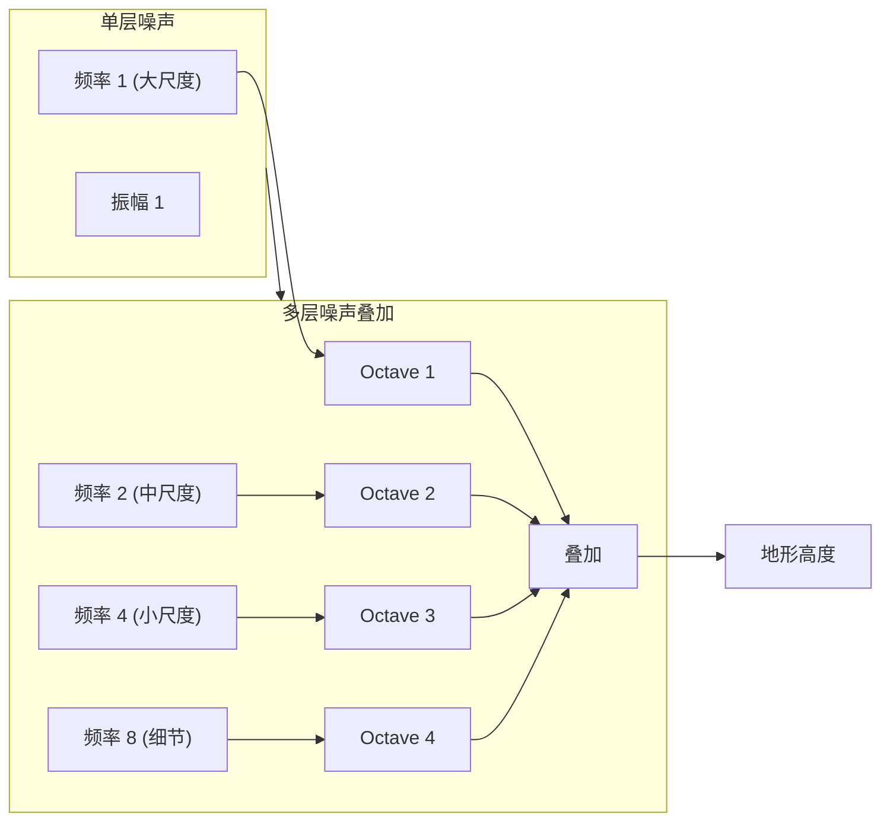
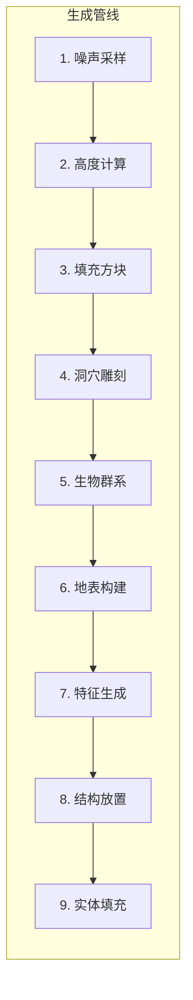
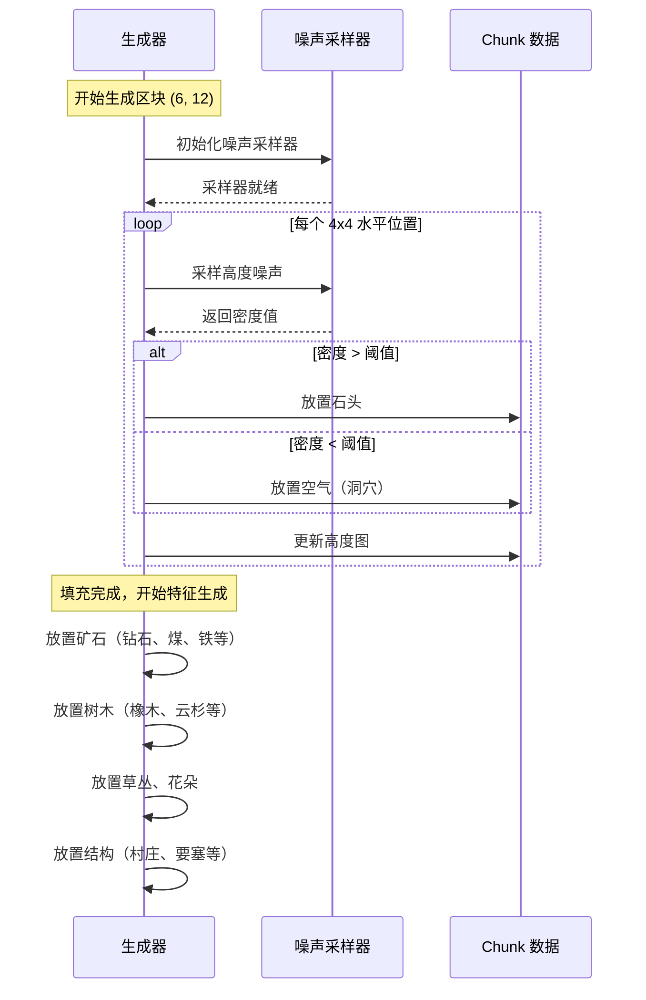

# 11 - 地形生成：从噪声到山川河流

## 目标

学完本章后，你将理解：
- ChunkGenerator 的作用和工作流程
- Noise（噪声）采样的基本概念
- 地形生成的管线（噪声 → 高度 → 地表 → 洞穴 → 特征）
- 矿石、树木等特征是如何生成的

## 前置知识

- [09-区块系统.md](./09-chunk-system.md) - 理解 Chunk 的结构
- [10-生物群系系统.md](./10-biome-system.md) - 理解生物群系

## 核心概念

### 地形生成是什么？

想象你是一个雕塑家：

- **没有图纸的雕塑家** → 随机乱刻 → 乱七八糟
- **用模具的雕塑家** → 用规则形状 → 死板无趣
- **用噪声的雕塑家** → 用"随机但有规律"的方式 → 自然美观！

**地形生成** = Minecraft 用**数学噪声**创造"自然"地形的过程

```
真实世界：                      Minecraft 生成：
┌─────────────────┐            ┌─────────────────┐
│  岩石          │            │   石头          │
│    ⛰️          │            │     ▓▓▓         │
│  泥土 🪨        │            │   ▓▓▓▓▓▓       │
│    🌲🌲         │            │   🌲▓▓▓🌲       │
│  草地 🟩         │            │   ███████       │
│                 │            │                 │
└─────────────────┘            └─────────────────┘
```

### 噪声（Noise）是什么？

**生活比喻**：

- **纯随机** = 你随便往纸上撒盐 → 完全没有规律
- **噪声** = 你用特殊工具撒盐 → 仍然随机，但有"感觉"

```
纯随机:     ░░▒▒░░▒▒▒░░░▒░░▒▒▒░░░▒░░░▒▒▒░
            (完全没有规律)

Perlin噪声: ███▒▒░░░▒▒▒███▒▒░░░▒▒▒███▒▒░░
            (有起伏感，像山丘)
```

**Minecraft 使用的噪声类型**：
1. **Perlin Noise** - 基础噪声
2. **Simplex Noise** - Perlin 的改进版
3. **Octave Noise** - 多层噪声叠加（细节+大尺度）



### 地形生成的管线（Pipeline）



**每个步骤详解**：

| 步骤 | 名称 | 作用 |
|------|------|------|
| 1 | 噪声采样 | 计算每个位置的"基础高度" |
| 2 | 高度计算 | 加上岛屿、悬崖等大尺度特征 |
| 3 | 填充方块 | 用石头/深板岩填充 |
| 4 | 洞穴雕刻 | 用空气/岩浆替换 |
| 5 | 生物群系 | 确定每个区域的生物群系 |
| 6 | 地表构建 | 草地、砂砾、沙子等 |
| 7 | 特征生成 | 矿石、树木、花草 |
| 8 | 结构放置 | 村庄、要塞、沙漠神殿 |
| 9 | 实体填充 | 猪、牛、羊等生物 |

## 核心代码

> ⚠️ **注意**：以下代码基于 CFR 反编译，实际源码可能略有差异。建议结合 Minecraft 源码仓库交叉验证。

### ChunkGenerator 抽象类

源码路径：`net/minecraft/world/gen/chunk/ChunkGenerator.java`

```java
85:/**
 * In charge of shaping, adding biome specific surface blocks, and carving chunks,
 * as well as populating the generated chunks with features and entities.
 */
90:public abstract class ChunkGenerator {
91:    // 生物群系来源
92:    protected final BiomeSource biomeSource;

94:    // 特征列表
95:    private final Supplier<List<PlacedFeatureIndexer.IndexedFeatures>> indexedFeaturesListSupplier;

97:    // 生成设置获取器
98:    private final Function<RegistryEntry<Biome>, GenerationSettings> generationSettingsGetter;
99:}
```

### 噪声地形生成器

> ⚠️ **注意**：以下代码基于 CFR 反编译，实际源码可能略有差异。建议结合 Minecraft 源码仓库交叉验证。

源码路径：`net/minecraft/world/gen/chunk/NoiseChunkGenerator.java`

```java
70:public final class NoiseChunkGenerator
71:extends ChunkGenerator {
72:    // 生成设置
73:    private final RegistryEntry<ChunkGeneratorSettings> settings;

75:    // 水位采样器
76:    private final Supplier<AquiferSampler.FluidLevelSampler> fluidLevelSampler;
77:}
```

### 填充噪声

```java
274:    private Chunk populateNoise(Blender blender, ..., Chunk chunk, ...) {

280:        // 创建噪声采样器
281:        ChunkNoiseSampler chunkNoiseSampler = chunk
282:            .getOrCreateChunkNoiseSampler(chunkx ->
283:                this.createChunkNoiseSampler(...));

285:        chunkNoiseSampler.sampleStartDensity();

287:        // 遍历区块内的每个位置
288:        for (int o = 0; o < 16/k; ++o) {        // k = 水平格子大小
289:            chunkNoiseSampler.sampleEndDensity(o);

291:            for (int p = 0; p < 16/k; ++p) {

293:                for (int r = cellHeight - 1; r >= 0; --r) {
294:                    // 对每个垂直单元进行采样
295:                    chunkNoiseSampler.onSampledCellCorners(r, p);

297:                    for (int s = l - 1; s >= 0; --s) {
298:                        // 采样噪声值
299:                        BlockState blockState = chunkNoiseSampler.sampleBlockState();

301:                        // 如果噪声值低于阈值，放置空气
302:                        if (blockState == null) {
303:                            blockState = this.settings.value().defaultBlock();
304:                        }

306:                        // 设置方块
307:                        chunkSection.setBlockState(y, u, ab, blockState, false);

309:                        // 更新高度图
310:                        heightmap.trackUpdate(y, t, ab, blockState);
310:                        heightmap2.trackUpdate(y, t, ab, blockState);
311:                    }
312:                }
313:            }
314:        }
315:    }
```

### 特征生成

```java
262:    public void generateFeatures(StructureWorldAccess world, Chunk chunk, ...) {

265:        ChunkPos chunkPos = chunk.getPos();

267:        // 创建随机数生成器（用于特征放置）
268:        ChunkRandom chunkRandom = new ChunkRandom(new Xoroshiro128PlusPlusRandom(...));

270:        // 设置种群种子
271:        long l = chunkRandom.setPopulationSeed(
272:            world.getSeed(), blockPos.getX(), blockPos.getZ());

274:        // 收集周围的生物群系
275:        Set<RegistryEntry<Biome>> set = new ObjectArraySet<>();
276:        ChunkPos.stream(chunkSectionPos.toChunkPos(), 1).forEach(pos -> {
277:            // 收集相邻区块的生物群系
278:            ...
279:        });

281:        // 遍历每个生成步骤
282:        for (int k = 0; k < GenerationStep.Feature.values().length; ++k) {

284:            // 遍历每个特征
285:            for (PlacedFeature placedFeature : indexedFeatures.features()) {

287:                // 使用随机数决定是否放置
288:                chunkRandom.setDecoratorSeed(l, m, k);

290:                // 生成特征（树木、矿石等）
291:                placedFeature.generate(world, this, chunkRandom, blockPos);
292:            }
293:        }
294:    }
```

### Debug 噪声可视化

```java
140:    @Override
141:    public void getDebugHudText(List<String> text, NoiseConfig noiseConfig, BlockPos pos) {
142:        DecimalFormat decimalFormat = new DecimalFormat("0.000");

144:        NoiseRouter noiseRouter = noiseConfig.getNoiseRouter();
145:        DensityFunction.UnblendedNoisePos unblendedNoisePos =
146:            new DensityFunction.UnblendedNoisePos(pos.getX(), pos.getY(), pos.getZ());

148:        // 显示各种噪声值
149:        text.add("T: " + decimalFormat.format(noiseRouter.temperature().sample(unblendedNoisePos)));
150:        text.add("V: " + decimalFormat.format(noiseRouter.vegetation().sample(unblendedNoisePos)));
151:        text.add("C: " + decimalFormat.format(noiseRouter.continents().sample(unblendedNoisePos)));
152:        text.add("E: " + decimalFormat.format(noiseRouter.erosion().sample(unblendedNoisePos)));
153:        text.add("D: " + decimalFormat.format(noiseRouter.depth().sample(unblendedNoisePos)));
154:    }
```

## 图解：噪声采样过程



## 实战演示

### 生成步骤的可视化

```
区块生成过程（俯视图）：

步骤 1: 噪声高度
████████░░░░████████░░░░████████
██████░░░░░░░░░░░░░░░░░████████
████████░░░░████████░░░░████████

步骤 2: 填充方块后
████████████████████████░░░░████
████████████████████████░░░░████
████████████████████████░░░░████

步骤 3: 洞穴雕刻后
████████░░████████░░░░░░░░░████
████░░░░░░░░░░░░░░░░░░░░░████
████████░░████████░░░░░░░░████

步骤 4: 地表构建后（草地）
░░░░░░░░░░░░░░░░░░░░░░░░░░░░
▓▓▓▓▓▓▓▓▓▓▓▓▓▓▓▓▓▓▓▓▓▓▓▓▓▓▓▓
░░░░░░░░░░░░░░░░░░░░░░░░░░░░
░░░░▓▓▓▓▓▓░░░░░░▓▓▓▓▓▓░░░░░░
░░░░░░░░░░░░░░░░░░░░░░░░░░░░

步骤 5: 特征生成后
░░░░░░░░░░░░░░░░░░░░░░░░░░░░
▓▓▓▓▓▓▓▓▓▓▓▓▓▓▓▓▓▓▓▓▓▓▓▓▓▓▓▓
░░🌲░░░░░░░░░░░░░░░░🌲░░░░░░░
░░░░▓▓🌲▓▓▓░░░░░░▓▓▓▓▓▓░░░░░░
░░░░░░░░░░░░░░░░░░░░░░░░░░░░
```

## 小结

| 概念 | 说明 |
|------|------|
| ChunkGenerator | 地形生成的核心类 |
| Noise | 数学函数，产生"自然随机"的值 |
| Octave | 多层噪声叠加，产生细节 |
| populateNoise | 用噪声填充方块 |
| generateFeatures | 生成矿石、树木等特征 |
| Heightmap | 快速查询地形高度 |

**关键理解**：
- **噪声是地形的基础**：所有地形都是噪声值决定的
- **生成是分层的**：不是一次性生成，而是多步骤
- **种子决定一切**：同一个种子产生同样的世界

## 练习

### 思考题

1. 为什么 Minecraft 的地形看起来"自然"而不是随机？
2. 如果两个玩家使用相同的种子，他们的世界会一样吗？
3. 为什么矿石要在最后步骤生成，而不是一开始？

### 动手题

1. **在源码中找到**：
   - `NoiseChunkGenerator.java` 第 274-335 行：理解 `populateNoise` 的完整流程
   - `ChunkGenerator.java` 第 262-339 行：理解 `generateFeatures`

2. **使用 /locate 命令**：
   - 找到最近的村庄：`/locate village`
   - 找到最近的堡垒：`/locate fortress`
   - 观察这些结构周围的生物群系

3. **生成特定种子**：
   - 使用种子 `12345` 创建一个新世界
   - 记录某个坐标的地形特征
   - 用相同种子创建另一个世界，验证地形是否相同

## 源码文件位置

| 文件 | 源码路径 | 说明 |
|------|----------|------|
| ChunkGenerator.java | `net/minecraft/world/gen/chunk/ChunkGenerator.java` | 区块生成器 |
| NoiseGenerator.java | `net/minecraft/world/gen/noise/NoiseGenerator.java` | 噪声生成器 |
| FlatChunkGenerator.java | `net/minecraft/world/gen/FlatChunkGenerator.java` | 平坦世界生成器 |

## 相关链接

- [09-区块系统.md](./09-chunk-system.md) - 生成的 Chunk 如何存储
- [10-生物群系系统.md](./10-biome-system.md) - 生物群系如何影响生成
- [13-高度图.md](./13-heightmap.md) - 生成时更新的高度图
- Minecraft Wiki: [Terrain generation](https://minecraft.wiki/w/Terrain_generation)
