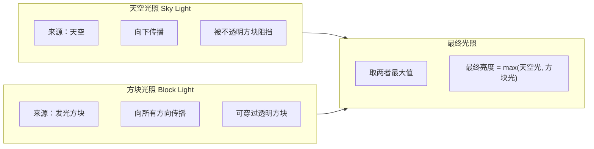
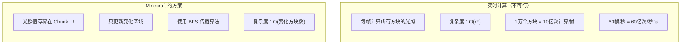
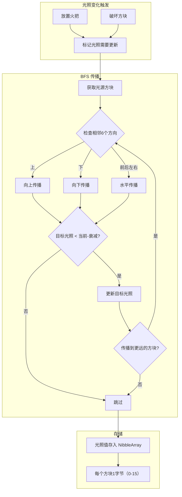

# 12 - 光照系统：明暗的艺术

## 目标

学完本章后，你将理解：
- 方块光照和天空光照的区别
- 光照传播的算法原理
- 为什么不能直接计算光照（性能问题）
- Minecraft 如何存储和更新光照

## 前置知识

- [09-区块系统.md](./09-chunk-system.md) - 理解 Chunk 的存储结构
- [08-世界核心.md](./08-world-core.md) - 了解 World 类

## 核心概念

### 光照是什么？

**生活比喻**：

想象你在一个漆黑的房间里：
- **手电筒** = 发光的方块（火把、南瓜灯）
- **窗户** = 天空光照的来源
- **墙壁和家具** = 会阻挡光照的方块

**Minecraft 的光照系统** = 模拟现实世界光线的传播！

```
现实世界：                    Minecraft：
┌─────────────────┐         ┌─────────────────┐
│  太阳光        │         │ 天空光照        │
│     ↓           │         │     ↓           │
│ ▓▓▓▓▓▓▓▓      │         │ ▓▓▓▓▓▓▓▓      │ ← 方块阻挡
│      ↓         │         │      ↓         │
│   手电筒       │         │   火把        │
│     ↓           │         │     ↓           │
│ ░░░░░░░░       │         │ ░░░░░░░░       │ ← 光照到达
└─────────────────┘         └─────────────────┘
```

### 两种光照



| 类型 | 来源 | 特点 | 例子 |
|------|------|------|------|
| **天空光照** | 天空 | 只向下，阻挡即消失 | 白天 |
| **方块光照** | 发光方块 | 向所有方向，可穿透明方块 | 火把、岩浆 |

### 为什么不直接计算光照？

**生活比喻**：

想象你要计算一个城市的交通流量：
- **实时计算** = 每辆车每秒钟都在变 → 计算量爆炸 💥
- **预计算+增量更新** = 只计算变化的区域 → 完美！



## 核心代码

> ⚠️ **注意**：以下代码基于 CFR 反编译，实际源码可能略有差异。建议结合 Minecraft 源码仓库交叉验证。

### LightingProvider

源码路径：`net/minecraft/world/chunk/light/LightingProvider.java`

```java
21:public class LightingProvider
22:implements LightingView {
23:    // 世界引用
24:    protected final HeightLimitView world;

26:    // 方块光照提供者
27:    @Nullable
27:    private final ChunkLightProvider<?, ?> blockLightProvider;

29:    // 天空光照提供者
30:    @Nullable
30:    private final ChunkLightProvider<?, ?> skyLightProvider;
32:}
```

### 光照计算

```java
149:    public int getLight(BlockPos pos, int ambientDarkness) {
150:        // 天空光照（减去环境暗度）
151:        int skyLight = this.skyLightProvider == null
152:            ? 0
153:            : this.skyLightProvider.getLightLevel(pos) - ambientDarkness;
155:        // 方块光照
156:        int blockLight = this.blockLightProvider == null
157:            ? 0
158:            : this.blockLightProvider.getLightLevel(pos);
160:        // 取最大值
161:        return Math.max(blockLight, skyLight);
162:    }
```

### 光照更新

```java
36:    @Override
37:    public void checkBlock(BlockPos pos) {
38:        // 通知两个光照提供者检查这个方块
39:        if (this.blockLightProvider != null) {
40:            this.blockLightProvider.checkBlock(pos);
41:        }
42:        if (this.skyLightProvider != null) {
43:            this.skyLightProvider.checkBlock(pos);
44:        }
45:    }

54:    @Override
55:    public int doLightUpdates() {
56:        int updates = 0;
58:        // 方块光照更新
59:        if (this.blockLightProvider != null) {
60:            updates += this.blockLightProvider.doLightUpdates();
61:        }
63:        // 天空光照更新
64:        if (this.skyLightProvider != null) {
65:            updates += this.skyLightProvider.doLightUpdates();
66:        }
68:        return updates;
69:    }
```

### 区块光照提供者

> ⚠️ **注意**：以下代码基于 CFR 反编译，实际源码可能略有差异。建议结合 Minecraft 源码仓库交叉验证。

源码路径：`net/minecraft/world/chunk/light/ChunkLightProvider.java`

```java
27:public abstract class ChunkLightProvider<M extends ChunkToNibbleArrayMap<M>,
28:                                       S extends LightStorage<M>>
29:implements ChunkLightingView {

31:    // 最大光照等级
32:    public static final int MAX_LIGHT = 15;

34:    // 光照衰减量（每穿过一个方块减少1）
35:    public static final int LIGHT_DECAY = 1;

37:    // 六面方向
38:    protected static final Direction[] DIRECTIONS = Direction.values();
39:}
```

### 光照是否需要更新

```java
50:    public static boolean needsLightUpdate(BlockView blockView, BlockPos pos,
51:                                            BlockState oldState, BlockState newState) {
52:        // 如果方块状态没变，不需要更新
53:        if (newState == oldState) {
54:            return false;
55:        }
56:
57:        // 检查透明度、光照值、是否有方向透明度变化
58:        return newState.getOpacity(blockView, pos) != oldState.getOpacity(blockView, pos)
59:            || newState.getLuminance() != oldState.getLuminance()
60:            || newState.hasSidedTransparency()
61:            || oldState.hasSidedTransparency();
62:    }
```

### 传播算法核心

光照使用 **BFS（广度优先搜索）** 传播：

```java
99:    protected void enqueueLightUpdate(long blockPos, long flags) {
100:        // 将方块加入传播队列
101:        this.lightQueue.enqueue(blockPos);
102:        this.lightQueue.enqueue(flags);
103:    }
```

```java
184:    private int processLightQueue() {
185:        int updates = 0;
186:
187:        // 处理待传播的光照
188:        while (!this.lightQueue.isEmpty()) {
189:            long blockPos = this.lightQueue.dequeueLong();
190:            long flags = this.lightQueue.dequeueLong();
191:
192:            // 传播光照到相邻方块
193:            this.propagateLight(blockPos, flags);
194:            updates++;
195:        }
196:
197:        return updates;
198:    }
```

## 图解：光照传播流程



### 天空光照 vs 方块光照传播规则

```
                    天空光照                    方块光照
                    ─────────                  ─────────
方向                只向下 ↓                   所有方向 ↑↓←→↔

阻挡规则            不透明方块 = 完全阻挡        不透明方块 = 完全阻挡
                                        透明方块 = 部分衰减

示例:

                    天空        火把
                      ↓          ↓
    ▓▓▓▓▓▓▓▓    ▓▓▓▓▓▓▓▓

    天空:15→14→13→▓▓(阻挡)    火把:15→14→13→▓▓(阻挡)
                              火把:15→14→13→░░(透明,13→12)
```

## 实战演示

### 光照计算示例

```
场景：放置一个火把

初始状态（全是天空光15）：
    15 15 15 15 15 15 15
    15 15 15 15 15 15 15
    15 15 15 15 15 15 15
    15 15 15 15 15 15 15

放置火把在中心 (3,2)：
    15 15 15 15 15 15 15
    15 15 14 14 14 15 15
    15 14 15 15 14 14 15  ← 火把位置 = 15
    15 14 14 14 14 14 15
    15 15 15 15 15 15 15

放置一个方块在火把上方 (3,1)：
    15 15 15 15 15 15 15
    15 15 ▓▓ 14 14 15 15  ← 方块阻挡天空光
    15 14 15 15 14 14 15  ← 火把不受影响
    15 14 14 14 14 14 15
    15 15 15 15 15 15 15
```

### 为什么火把在地下也很亮？

```
                        地面 (天空光)
                         ↓
    ▓▓▓▓▓▓▓▓▓▓▓▓▓▓▓▓▓▓▓▓▓▓▓

    地下挖开后的天空光:
    0 → (通过12格空气衰减) → 3 (天空光)

    放置火把后:
    火把 15 → 相邻 14 → 相邻 13 → 相邻 12

    最终 = max(3, 12) = 12 (火把赢了!)
```

## 小结

| 概念 | 说明 |
|------|------|
| 天空光照 | 从天空向下传播，被阻挡即消失 |
| 方块光照 | 从发光方块向所有方向传播 |
| NibbleArray | 压缩存储光照值（每方块4位） |
| BFS传播 | 从光源向外逐层传播光照 |
| 增量更新 | 只更新变化的区域 |

**关键理解**：
- **光照是预计算的**：不实时计算，而是存储在Chunk中
- **天空光和方块光独立**：最终取两者最大值
- **变化触发更新**：放置/破坏方块时才重新计算

## 练习

### 思考题

1. 为什么在地底深处放一个火把，周围的亮度会很高？
2. 如果你放置一个不透明方块，会影响哪些方块的光照？
3. 为什么树叶是半透明的（不完全阻挡光照）？

### 动手题

1. **在源码中找到**：
   - `LightingProvider.java` 第 149-162 行：理解最终光照计算
   - `ChunkLightProvider.java` 第 50-62 行：理解何时需要更新光照

2. **在游戏中测试**：
   - 在完全黑暗的地方放置一个火把
   - 观察光照如何向周围传播
   - 尝试在水下放置火把，观察效果

3. **光照问题调试**：
   - 在源码中找到 `getSkyLight` 和 `getBlockLight` 方法
   - 理解它们如何从存储中读取光照值

## 源码文件位置

| 文件 | 源码路径 | 说明 |
|------|----------|------|
| LightingProvider.java | `net/minecraft/world/LightingProvider.java` | 光照提供者 |
| LightChunk.java | `net/minecraft/world/chunk/light/LightChunk.java` | 光照区块 |

## 相关链接

- [09-区块系统.md](./09-chunk-system.md) - 光照值如何存储在 Chunk 中
- [13-高度图.md](./13-heightmap.md) - 天空光与高度图的关系
- Minecraft Wiki: [Light](https://minecraft.wiki/w/Light)
