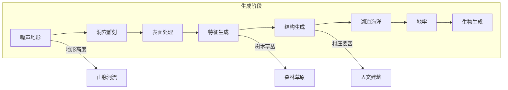
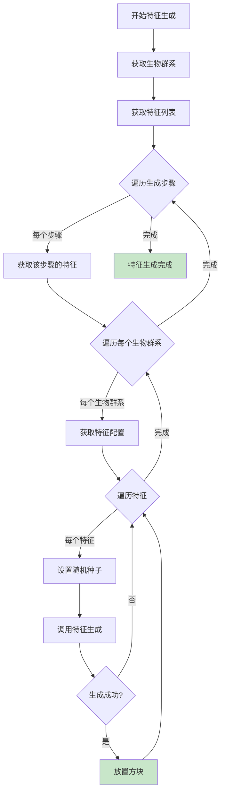

# 第 12 章：地形生成详解（Terrain Generation）

## 章节目标

通过本章学习，你将掌握：
- 噪声（Noise）在地形生成中的应用
- ChunkGenerator 的架构和实现
- 特征（Feature）和结构（Structure）的生成流程
- 世界生成流水线（Generation Pipeline）
- 如何自定义地形生成算法

## 前置知识

建议先阅读：
- [09-Chunk区块系统](./10-chunk-system.md) - 区块数据结构
- [10-生物群系系统](./11-biome-system.md) - 生物群系生成
- [Part-1 基础/05-注册表系统](./Part-1-Foundation/05-registry-system.md) - 注册表机制

## 核心概念

### 地形生成 = 噪声的艺术

想象地形生成是一位**艺术家**用噪声作为画笔：

```
┌─────────────────────────────────────────────────────────────┐
│              地形生成 = 噪声艺术家                               │
├─────────────────────────────────────────────────────────────┤
│                                                              │
│  🎨 艺术家 = ChunkGenerator                                 │
│     │                                                        │
│     ├── 🖌️ 画笔 = NoiseSampler (噪声采样器)                   │
│     │     │                                                  │
│     │     ├── 🌊 波浪 = Perlin Noise (基础地形)              │
│     │     ├── 🏔️ 山峰 = Ridge Noise (山脉)                   │
│     │     └── 🔲 方块 = Voronoi (洞穴)                       │
│     │                                                        │
│     ├── 🎭 调色板 = BiomeSource (生物群系)                   │
│     └── ✏️ 细节 = Feature (特征/树木、花草等)                  │
│                                                              │
└─────────────────────────────────────────────────────────────┘
```

**关键类比**：
- 不同类型的噪声叠加创造自然地形
- 生物群系决定调色板（颜色=方块类型）
- 特征是地形上的装饰（树木、花草）
- 结构是大尺度的建筑（村庄、要塞）

---

## 1. 生成流水线概述

### 1.1 世界生成阶段



### 1.2 生成阶段详解

```
阶段 1: 噪声地形 (Noise Terrain)
├─ Perlin噪声生成基础高度
├─ Ridge噪声叠加山脉
└─ 基础方块放置

阶段 2: 洞穴雕刻 (Carving)
├─ Cave Carver - 洞穴洞穴
└─ Ravine Carver - 峡谷

阶段 3: 表面处理 (Surface)
├─ 顶层方块替换
└─ 冰山、浮冰生成

阶段 4: 特征生成 (Features)
├─ 树木
├─ 花草
└─ 矿石

阶段 5: 结构生成 (Structures)
├─ 村庄
├─ 要塞
└─ 沙漠神殿

阶段 6: 湖泊海洋 (Lakes)
├─ 湖泊
└─ 海洋填充

阶段 7: 地牢 (Underground)
└─ 刷怪笼

阶段 8: 生物生成 (Mobs)
└─ 动物生成
```

---

## 2. ChunkGenerator 架构

### 2.1 核心类结构

```java
90:104:ChunkGenerator.java
public abstract class ChunkGenerator {
    protected final BiomeSource biomeSource;  // 生物群系源
    private final Supplier<List<PlacedFeatureIndexer.IndexedFeatures>> indexedFeaturesListSupplier;
    private final Function<RegistryEntry<Biome>, GenerationSettings> generationSettingsGetter;
    
    public ChunkGenerator(BiomeSource biomeSource) {
        this(biomeSource, biomeEntry -> biomeEntry.value().getGenerationSettings());
    }
}
```

### 2.2 NoiseChunkGenerator

```java
public abstract class NoiseChunkGenerator extends ChunkGenerator {
    // 噪声填充 - 核心生成方法
    public abstract CompletableFuture<Chunk> populateNoise(
        Blender blender, 
        NoiseConfig noiseConfig,
        StructureAccessor structureAccessor, 
        Chunk chunk
    );
    
    // 获取指定位置的高度
    public abstract int getHeight(
        int x, int z, 
        Heightmap.Type type, 
        HeightlimitView world, 
        NoiseConfig noiseConfig
    );
}
```

### 2.3 噪声填充实现

```java
274:335:NoiseChunkGenerator.java
private Chunk populateNoise(Blender blender, NoiseConfig noiseConfig,
                          StructureAccessor structureAccessor, Chunk chunk) {
    
    // 1. 创建噪声采样器
    ChunkNoiseSampler sampler = chunk.getOrCreateChunkNoiseSampler(
        chunkx -> this.createChunkNoiseSampler(chunkx, noiseConfig, structureAccessor, blender));
    
    sampler.sampleStartDensity();
    
    // 2. 遍历区块内的每个位置
    for (int o = 0; o < 16/k; ++o) {
        sampler.sampleEndDensity(o);
        
        for (int p = 0; p < 16/k; ++p) {
            for (int r = cellHeight - 1; r >= 0; --r) {
                sampler.onSampledCellCorners(r, p);
                
                for (int s = l - 1; s >= 0; --s) {
                    // 3. 采样噪声值
                    BlockState blockState = sampler.sampleBlockState();
                    
                    // 4. 如果噪声值低于阈值，放置空气
                    if (blockState == null) {
                        blockState = this.settings.value().defaultBlock();
                    }
                    
                    // 5. 设置方块
                    chunkSection.setBlockState(y, u, ab, blockState, false);
                    
                    // 6. 更新高度图
                    heightmap.trackUpdate(y, t, ab, blockState);
                }
            }
        }
    }
    
    return chunk;
}
```

---

## 3. 噪声系统

### 3.1 噪声类型

```
┌─────────────────────────────────────────────────────────────┐
│                    噪声类型图鉴                                 │
├─────────────────────────────────────────────────────────────┤
│                                                              │
│  📊 Perlin Noise          📊 Ridge Noise           📊 Voronoi│
│  ┌─────────────────┐      ┌─────────────────┐     ┌─────────────────┐│
│  │ ████████        │      │     ████████    │     │  ┌───┬───┬───┐││
│  │ ██████          │      │   ██████████    │     │  │ A │ B │ C │││
│  │ ████████        │      │ ██████████████   │     │  ├───┼───┼───┤││
│  │ ████            │      │   ██████████      │     │  │ D │ E │ F │││
│  │ ████████████████ │      │     ████████     │     │  ├───┼───┼───┤││
│  └─────────────────┘      └─────────────────┘     │  │ G │ H │ I │││
│  用途: 基础地形            │ 用途: 山脉、山丘       │  └───┴───┴───┘││
│                            │                        │  用途: 洞穴    │
│  📊 Worley Noise         │                        │                │
│  ┌─────────────────┐     │                        │                │
│  │    █   █   █    │     │                        │                │
│  │  █   █   █   █  │     │                        │                │
│  │    █   █   █    │     │                        │                │
│  │  █   █   █   █  │     │                        │                │
│  │    █   █   █    │     │                        │                │
│  └─────────────────┘     │                        │                │
│  用途: 洞穴、气孔        │                        │                │
│                                                              │
└─────────────────────────────────────────────────────────────┘
```

### 3.2 噪声配置

```java
// NoiseConfig 包含生成地形所需的所有噪声设置
public class NoiseConfig {
    private final NoiseSettings noiseSettings;      // 噪声设置
    private final OctaveSimplexNoise aquiferNoise;  // 含水层噪声
    private final DensityFunction continentalness;  // 大陆度
    private final DensityFunction erosion;          // 侵蚀度
    private final DensityFunction ridge;           // 山脊噪声
    private final DensityFunction slide;           // 坡度调整
    private final DensityFunction finalDensity;   // 最终密度
}

// NoiseSettings 定义噪声采样的参数
public class NoiseSettings {
    private final int minY;              // 最小Y
    private final int height;            // 总高度
    private final int sizeHorizontal;    // 水平采样间隔
    private final int sizeVertical;      // 垂直采样间隔
    private final List<Noise> noises;    // 噪声层
}
```

---

## 4. 特征生成系统

### 4.1 Feature 生成流程

```java
262:339:ChunkGenerator.java
public void generateFeatures(StructureWorldAccess world, Chunk chunk, 
                             StructureAccessor structureAccessor) {
    ChunkPos chunkPos = chunk.getPos();
    
    // 1. 跳过生成区域外的区块
    if (SharedConstants.isOutsideGenerationArea(chunkPos)) {
        return;
    }
    
    // 2. 设置随机种子
    ChunkRandom chunkRandom = new ChunkRandom(
        new Xoroshiro128PlusPlusRandom(RandomSeed.getSeed()));
    long l = chunkRandom.setPopulationSeed(world.getSeed(), blockPos.getX(), blockPos.getZ());
    
    // 3. 按生成步骤执行
    for (int k = 0; k < j; ++k) {
        // 生成结构
        if (structureAccessor.shouldGenerateStructures()) {
            List<Structure> structures = map.getOrDefault(k, Collections.emptyList());
            for (Structure structure : structures) {
                chunkRandom.setDecoratorSeed(l, m, k);
                structureAccessor.getStructureStarts(chunkSectionPos, structure)
                    .forEach(start -> start.place(world, structureAccessor, this, 
                                                  chunkRandom, blockBox, chunkPos));
            }
        }
        
        // 生成特征
        List<PlacedFeatureIndexer.IndexedFeatures> indexedFeatures = list.get(k);
        for (RegistryEntry<Biome> biome : set) {
            List<RegistryEntryList<PlacedFeature>> features = 
                generationSettingsGetter.apply(biome).getFeatures();
            if (k < features.size()) {
                for (PlacedFeature feature : features.get(k)) {
                    chunkRandom.setDecoratorSeed(l, p, k);
                    feature.generate(world, this, chunkRandom, blockPos);
                }
            }
        }
    }
}
```

### 4.2 特征生成流程图



---

## 5. 结构生成系统

### 5.1 Structure 类型

```
┌─────────────────────────────────────────────────────────────┐
│                 Minecraft 结构类型                               │
├─────────────────────────────────────────────────────────────┤
│                                                              │
│  🏘️ 村庄类      │ Village, Pillager Outpost                │
│  🏛️ 要塞类      │ Fortress, Stronghold                      │
│  🏚️ 废墟类      │ Ruined Portal, Shipwreck                 │
│  ⛏️ 矿井类      │ Mineshaft                                │
│  🏰 遗迹类      │ Desert Pyramid, Jungle Temple, Igloo      │
│  🌊 水域类      │ Ocean Monument, Ocean Ruin                │
│  🌳 树林类      │ Swamp Hut, Witch Hut                     │
│  🌟 末地类      │ End City, End Gateway                    │
│                                                              │
└─────────────────────────────────────────────────────────────┘
```

### 5.2 结构生成流程

```java
// Structure.java 中的生成入口
public List<StructurePiece> generate(
        StructureWorldAccess world,
        StructureGeneratorContext context) {
    
    // 1. 获取结构起点位置
    BlockPos startPos = this.getStartPosition(world, context);
    
    // 2. 验证位置是否有效
    if (!this.isValidPosition(startPos, world, context)) {
        return Collections.emptyList();
    }
    
    // 3. 创建结构起点
    StructureStart start = this.createStructureStart(
        new StructureReferences(world.getSeed())
    );
    
    // 4. 递归生成所有部件
    return this.generatePieces(start, world, context, startPos);
}
```

---

## 6. 矿石生成详解

### 6.1 OreFeature 实现

```java
public class OreFeature extends Feature<OreConfiguration> {
    @Override
    public boolean place(WorldGenLevel world, ChunkGenerator generator,
                         RandomSource random, BlockPos origin,
                         OreConfiguration config) {
        
        float pdfValue = 0.0f;
        BlockPos.MutableBlockPos mutable = new BlockPos.MutableBlockPos();
        
        // 使用泊松分布放置矿石块
        for (int i = 0; i < config.size(); i++) {
            // 生成随机位置
            int x = random.nextInt(16);
            int y = random.nextInt(config.height().maxInclusive() - 
                                   config.height().minInclusive()) + 
                   config.height().minInclusive();
            int z = random.nextInt(16);
            
            mutable.set(origin.getX() + x, y, origin.getZ() + z);
            
            // 检查并放置
            if (canReplace(world.getBlockState(mutable), config.target(), 
                           config.floor(), config.ceil())) {
                world.setBlock(mutable, config.state(), 2);
            }
        }
        return true;
    }
}
```

### 6.2 矿石配置示例

```json
{
    "type": "minecraft:ore",
    "config": {
        "size": 9,                    // 矿脉大小
        "discard_chance_on_air_exposure": 0.0,
        "targets": [
            {
                "target": {
                    "type": "minecraft:stone_ore_replaceables"
                },
                "state": {
                    "Name": "minecraft:iron_ore"
                }
            },
            {
                "target": {
                    "type": "minecraft:deepslate_ore_materials"
                },
                "state": {
                    "Name": "minecraft:deepslate_iron_ore"
                }
            }
        ]
    }
}
```

---

## 7. 树木生成详解

### 7.1 TreeFeature 实现

```java
public class TreeFeature extends Feature<TreeConfiguration> {
    @Override
    public boolean place(WorldGenLevel world, ChunkGenerator generator,
                         RandomSource random, BlockPos origin, 
                         TreeConfiguration config) {
        
        // 1. 检查空间是否足够
        if (!isSpaceAvailable(world, origin, config)) {
            return false;
        }
        
        // 2. 放置树干
        placeTrunk(world, origin, config);
        
        // 3. 放置树叶
        placeLeaves(world, origin, config);
        
        // 4. 放置装饰（花、蘑菇等）
        placeDecorations(world, origin, config);
        
        return true;
    }
    
    private boolean isSpaceAvailable(WorldGenLevel world, BlockPos pos,
                                   TreeConfiguration config) {
        int height = config.height();
        
        // 检查从地面到树干顶部的高度是否足够
        for (int y = 0; y <= height + 1; y++) {
            int requiredSpace = getRequiredSpaceAt(world, pos, y, config);
            
            if (!hasRequiredSpace(world, pos, y, requiredSpace, config)) {
                return false;
            }
        }
        
        return true;
    }
}
```

### 7.2 树木配置

```json
{
    "type": "minecraft:tree",
    "config": {
        "trunk_provider": {
            "type": "minecraft:simple_state_provider",
            "state": {
                "Name": "minecraft:oak_log",
                "Properties": { "axis": "y" }
            }
        },
        "leaves_provider": {
            "type": "minecraft:simple_state_provider",
            "state": {
                "Name": "minecraft:oak_leaves",
                "Properties": { "distance": "7", "persistent": "false" }
            }
        },
        "minimum_size": {
            "type": "minecraft:two_layers_feature_size",
            "limit": 1,
            "lower_size": 0,
            "upper_size": 1
        },
        "height": 5,
        "decorators": [
            { "type": "minecraft:leave_vine" },
            { "type": "minecraft:trunk_vine" }
        ]
    }
}
```

---

## 8. 自定义地形生成

### 8.1 创建自定义 ChunkGenerator

```java
// 自定义区块生成器
public class CustomChunkGenerator extends NoiseChunkGenerator {
    
    public CustomChunkGenerator(BiomeSource biomeSource) {
        super(biomeSource);
    }
    
    @Override
    public int getHeight(int x, int z, Heightmap.Type type, 
                         HeightlimitView world, NoiseConfig noiseConfig) {
        // 自定义高度计算
        double noise = sampleHeightNoise(x, z, noiseConfig);
        
        // 应用生物群系调整
        Biome biome = world.getBiome(new BlockPos(x, 64, z)).value();
        int baseHeight = (int)(noise * biome.getTemperature());
        
        return baseHeight;
    }
    
    private double sampleHeightNoise(int x, int z, NoiseConfig config) {
        // 简化的噪声采样
        return Math.sin(x * 0.01) * Math.cos(z * 0.01) * 50;
    }
}
```

### 8.2 自定义特征

```java
// 自定义特征示例：放置发光方块
public class GlowBlockFeature extends Feature<GlowBlockConfiguration> {
    
    public GlowBlockFeature(Codec<GlowBlockConfiguration> codec) {
        super(codec);
    }
    
    @Override
    public boolean place(WorldGenLevel world, ChunkGenerator generator,
                        RandomSource random, BlockPos origin,
                        GlowBlockConfiguration config) {
        
        // 放置一个发光方块
        BlockPos pos = origin.above();
        
        if (world.isAir(pos)) {
            world.setBlockState(pos, config.block(), 2);
            return true;
        }
        
        return false;
    }
}

// 特征配置
public record GlowBlockConfiguration(BlockState block) {
    public static final Codec<GlowBlockConfiguration> CODEC = 
        BlockState.CODEC.fieldOf("block")
            .xmap(GlowBlockConfiguration::new, GlowBlockConfiguration::block)
            .codec();
}
```

---

## 9. 关键源码文件

| 文件 | 路径 | 说明 |
|-----|------|-----|
| `ChunkGenerator.java` | `net.minecraft.world.gen.chunk.ChunkGenerator` | 区块生成器基类 |
| `NoiseChunkGenerator.java` | `net.minecraft.world.gen.chunk.NoiseChunkGenerator` | 噪声区块生成器 |
| `Feature.java` | `net.minecraft.world.gen.feature.Feature` | 特征基类 |
| `OreFeature.java` | `net.minecraft.world.gen.feature.OreFeature` | 矿石特征 |
| `TreeFeature.java` | `net.minecraft.world.gen.feature.TreeFeature` | 树木特征 |
| `Structure.java` | `net.minecraft.world.gen.structure.Structure` | 结构基类 |

---

## 课后自查

完成本章学习后，请检查你是否理解：

- [ ] 世界生成流水线的8个阶段
- [ ] 噪声类型及其在地形中的应用
- [ ] ChunkGenerator 的核心职责
- [ ] 特征（Feature）的生成流程
- [ ] 结构（Structure）的生成流程
- [ ] 如何创建自定义地形生成器

---

## 延伸阅读

- [25-feature-system.md](../../analysis/25-feature-system.md) - 特征系统深度分析
- [26-structure-system.md](../../analysis/26-structure-system.md) - 结构系统深度分析
