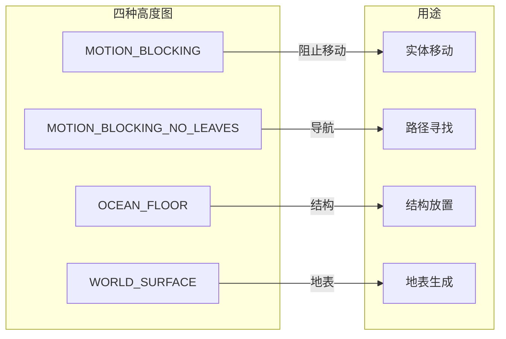
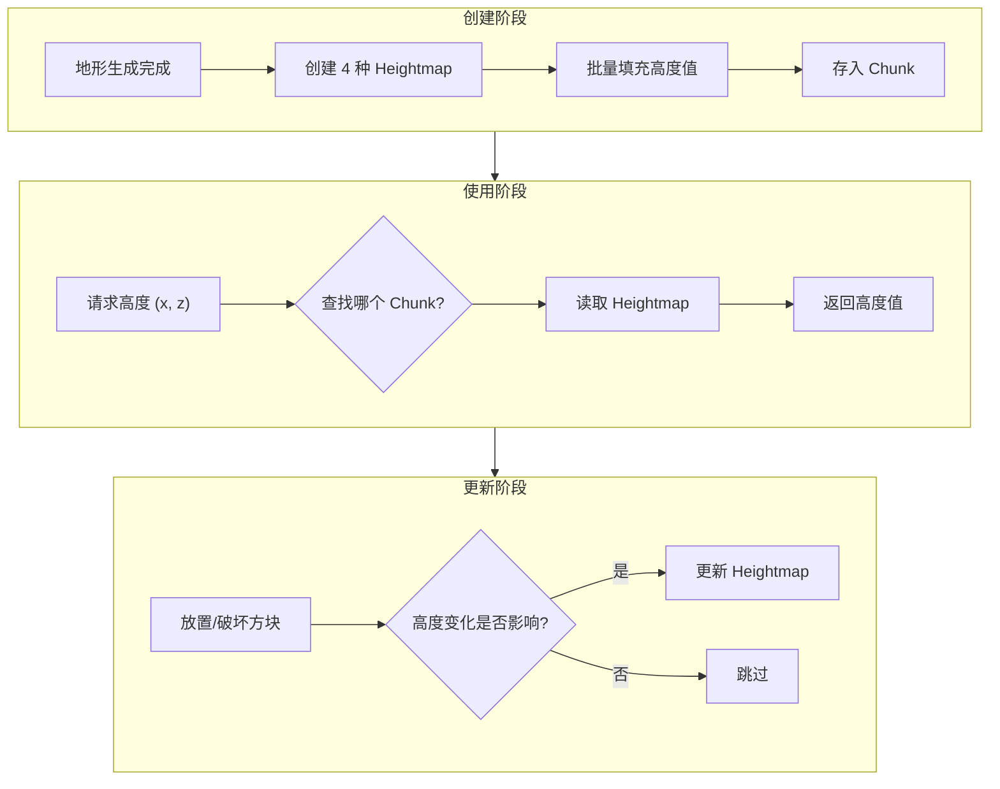

# 13 - 高度图：快速查找地形高度

## 目标

学完本章后，你将理解：
- 什么是高度图（Heightmap）
- 四种高度图类型的区别和用途
- 高度图是如何工作的
- 为什么高度图能提升性能

## 前置知识

- [09-区块系统.md](./09-chunk-system.md) - 理解 Chunk 的存储结构
- [11-地形生成.md](./11-terrain-gen.md) - 了解地形生成过程

## 核心概念

### 高度图是什么？

**生活比喻**：

想象你要在一张 **16×16 的方格纸** 上记录每个格子的"最高山有多高"：

- **没有高度图**：每次想知道某个位置的最高点，必须翻遍整座山的所有石头
- **有高度图**：看一眼记录表，马上就知道

**高度图** = 记录每个 (x, z) 位置最高非空气方块高度的数据结构

```
    地形侧视图（一个Column）

        高度
    Y=80   __
    Y=75   ▓▓  ← 最高点（高度图记录这里）
    Y=70   ▓▓
    Y=60   ▓▓
    Y=50   ██  ← 地表（如果考虑地表）
    Y=40   ▒▒
    Y=0    ▒▒

    高度图记录：(x=5, z=3) → 75
```

### 为什么需要高度图？

**性能优化的关键**：

想象你要做这些操作：
1. 找一个地方放置 TNT（需要实体站立的地方）
2. 确定玩家在哪里出生
3. 计算天空光照
4. 生成村庄

**如果没有高度图**：
- 每次都要从下往上扫描整个列（可能几百个方块）💥
- 100×100 = 10000 次扫描 = 爆炸

**有高度图**：
- 直接查表，O(1) 时间复杂度
- 瞬间返回结果！

## 四种高度图

Minecraft 中有 **四种高度图**，每种有不同的用途：



### 1. MOTION_BLOCKING（运动阻挡）

**定义**：阻挡运动的最顶层方块

```java
132:    MOTION_BLOCKING("MOTION_BLOCKING", Purpose.CLIENT,
133:        state -> state.blocksMovement() || !state.getFluidState().isEmpty())
```

**判断条件**：
- 方块 `blocksMovement() == true`（阻挡移动）
- 或方块上有非空的流体

**用途**：
- 实体站立位置
- 玩家出生点
- 实体移动检测

```
示例：

    🧍玩家    ← 站立在 MOTION_BLOCKING 上

    树叶 ░░    ← 不阻挡运动，不算
    石头 ▓▓    ← 阻挡运动，算！
```

### 2. MOTION_BLOCKING_NO_LEAVES（不含树叶的运动阻挡）

**定义**：和 MOTION_BLOCKING 类似，但忽略树叶

```java
133:    MOTION_BLOCKING_NO_LEAVES("MOTION_BLOCKING_NO_LEAVES", Purpose.LIVE_WORLD,
134:        state -> (state.blocksMovement() || !state.getFluidState().isEmpty())
135:                   && !(state.getBlock() instanceof LeavesBlock))
```

**用途**：
- 路径寻找（生物导航时会穿过树叶）
- 生物 AI 判断

```
示例：

    树叶 ░░    ← 忽略，不算
    石头 ▓▓    ← 算！

    生物导航时会穿过树叶
```

### 3. OCEAN_FLOOR（海底）

**定义**：海底的最顶层方块（考虑阻挡呼吸的方块）

```java
131:    OCEAN_FLOOR("OCEAN_FLOOR", Purpose.LIVE_WORLD,
132:        SUFFOCATES)
```

**判断条件**：
- 方块 `blocksMovement()`（和活塞有关）

**用途**：
- 结构放置（村庄不会建在水下太深的地方）
- 海底地形生成
- 海洋生物群系生成

```
示例：

    沙子 ░░    ← 海底

    水 💧💧💧💧
    💧💧💧💧

    石头 ▓▓    ← 不算
```

### 4. WORLD_SURFACE（世界表面）

**定义**：非空气方块的最顶层

```java
129:    WORLD_SURFACE("WORLD_SURFACE", Purpose.CLIENT,
130:        NOT_AIR)
```

**判断条件**：
- `!state.isAir()`（只要不是空气就行）

**用途**：
- 发送给客户端的地形高度
- 地形生成时的地表高度
- 生物群系采样位置

```
示例：

    草方块 ██  ← 算！
    空气 ░░    ← 不算

    所以 WORLD_SURFACE = 草方块的位置
```

## 核心代码

> ⚠️ **注意**：以下代码基于 CFR 反编译，实际源码可能略有差异。建议结合 Minecraft 源码仓库交叉验证。

### Heightmap 类

> ⚠️ **注意**：以下代码基于 CFR 反编译，实际源码可能略有差异。建议结合 Minecraft 源码仓库交叉验证。

源码路径：`net/minecraft/world/Heightmap.java`

```java
25:public class Heightmap {
26:    // 存储空间（压缩的整数数组）
27:    private final PaletteStorage storage;

29:    // 判断条件（什么算"阻挡"）
30:    private final Predicate<BlockState> blockPredicate;

32:    // 所属的 Chunk
33:    private final Chunk chunk;
34:}
```

### 存储结构

```java
36:    public Heightmap(Chunk chunk, Type type) {
37:        this.blockPredicate = type.getBlockPredicate();
38:        this.chunk = chunk;

40:        // 每个高度用 log2(maxHeight) 位存储
41:        int bits = MathHelper.ceilLog2(chunk.getHeight() + 1);

43:        // 16×16 = 256 个位置，每个位置一个高度
44:        this.storage = new PackedIntegerArray(bits, 256);
45:    }
```

**存储计算**：
- 16×16 = 256 个位置
- 每个位置存储一个高度值
- 所需位数 = log2(世界高度)
- 主世界：log2(384) ≈ 9 位

### 获取高度

```java
92:    public int get(int x, int z) {
93:        // x, z 是 0-15 的局部坐标
94:        return this.get(Heightmap.toIndex(x, z));
95:    }

97:    public int method_35334(int x, int z) {
98:        // 返回高度 - 1（下方一格）
99:        return this.get(Heightmap.toIndex(x, z)) - 1;
100:    }

102:    private int get(int index) {
103:        // 从存储中读取，并加上 Chunk 的底部 Y 坐标
104:        return this.storage.get(index) + this.chunk.getBottomY();
105:    }
```

### 更新高度

```java
68:    public boolean trackUpdate(int x, int y, int z, BlockState state) {
69:        // 获取当前记录的高度
70:        int currentHeight = this.get(x, z);

72:        // 如果修改的方块高度 <= 记录高度-2，不需要更新
73:        if (y <= currentHeight - 2) {
74:            return false;
75:        }

77:        // 如果新方块满足条件，更新高度
78:        if (this.blockPredicate.test(state)) {
79:            if (y >= currentHeight) {
80:                this.set(x, z, y + 1);
81:                return true;
82:            }
83:        }

84:        // 如果移除的是最高点，需要重新搜索
85:        else if (currentHeight - 1 == y) {
86:            // 从当前位置向下搜索新的最高点
87:            BlockPos.Mutable mutable = new BlockPos.Mutable();
88:            for (int j = y - 1; j >= this.chunk.getBottomY(); --j) {
89:                mutable.set(x, j, z);
90:                BlockState below = this.chunk.getBlockState(mutable);

93:                if (this.blockPredicate.test(below)) {
94:                    this.set(x, z, j + 1);
95:                    return true;
96:                }
97:            }
98:            // 整个列都是空气
99:            this.set(x, z, this.chunk.getBottomY());
100:            return true;
101:        }

103:        return false;
104:    }
```

### 批量填充高度图

```java
40:    public static void populateHeightmaps(Chunk chunk, Set<Type> types) {
41:        // 从区块最高点开始向下搜索
42:        int startY = chunk.getHighestNonEmptySectionYOffset() + 16;

44:        BlockPos.Mutable mutable = new BlockPos.Mutable();

46:        // 遍历 16×16 的每个位置
47:        for (int x = 0; x < 16; ++x) {
48:            for (int z = 0; z < 16; ++z) {

50:                // 向下搜索每个高度图类型
51:                for (int y = startY - 1; y >= chunk.getBottomY(); --y) {
52:                    mutable.set(x, y, z);
53:                    BlockState state = chunk.getBlockState(mutable);

55:                    if (state.isOf(Blocks.AIR)) continue;

57:                    // 检查每种高度图类型
58:                    for (Type type : types) {
59:                        if (type.getBlockPredicate().test(state)) {
60:                            type.getHeightmap(chunk).set(x, z, y + 1);
61:                        }
62:                    }

64:                    // 找到一个就够了
65:                    break;
66:                }
67:            }
68:        }
69:    }
```

## 图解：高度图工作流程



### 高度图 vs 实时扫描

```
场景：获取位置 (5, 64) 的 MOTION_BLOCKING 高度

方式 1: 实时扫描（没有高度图）
─────────────────────────────────
y=320: 空气      ← 不是
y=319: 空气      ← 不是
...
y=100: 石头      ← 不是（太高了）
...
y=75: 树叶       ← 不是（不阻挡）
y=74: 石头       ← 不是（太高了）
...
y=65: 空气       ← 不是
y=64: 草方块     ← 是！阻挡运动！
搜索了 320-64 = 256 个方块！💥

方式 2: 高度图（有了高度图）
─────────────────────────────────
从存储中直接读取 (5, 3) 的值 → 64
O(1) 时间复杂度！⚡
```

## 实战演示

### 高度图的典型应用

1. **玩家出生点**
   ```java
   BlockPos spawnPos = world.getTopPosition(
       Heightmap.Type.MOTION_BLOCKING,  // 需要站立的地方
       BlockPos.ofFloored(x, 0, z)
   );
   ```

2. **结构生成**
   ```java
   int groundLevel = chunk.getHeightmap(Type.OCEAN_FLOOR).get(x, z);
   // 确保结构不会建在海底太深的地方
   ```

3. **天空光照计算**
   ```java
   int skyLight = 15 - (world.getTopY() - y);
   // 使用高度计算初始天空光照
   ```

### World.getTopY

```java
363:    @Override
364:    public int getTopY(Heightmap.Type heightmap, int x, int z) {
365:        // 超出边界？返回海平面 + 1
366:        if (x < -30000000 || z < -30000000
367:            || x >= 30000000 || z >= 30000000) {
368:            return this.getSeaLevel() + 1;
369:        }

371:        // 检查 Chunk 是否已加载
372:        if (this.isChunkLoaded(
373:            ChunkSectionPos.getSectionCoord(x),
374:            ChunkSectionPos.getSectionCoord(z))) {

376:            // 直接从 Heightmap 读取
377:            return this.getChunk(
378:                ChunkSectionPos.getSectionCoord(x),
379:                ChunkSectionPos.getSectionCoord(z)
380:            ).sampleHeightmap(heightmap, x & 0xF, z & 0xF) + 1;
381:        }

383:        // Chunk 未加载，返回底部 Y
384:        return this.getBottomY();
385:    }
```

## 小结

| 高度图类型 | 判断条件 | 用途 |
|-----------|---------|------|
| MOTION_BLOCKING | 阻挡移动/有流体 | 实体站立、移动检测 |
| MOTION_BLOCKING_NO_LEAVES | 同上，但忽略树叶 | 路径寻找、AI导航 |
| OCEAN_FLOOR | blocksMovement | 结构放置、海底生成 |
| WORLD_SURFACE | 非空气 | 地表、生物群系 |

**关键理解**：
- **高度图是预计算的**：不需要每次扫描
- **四种类型各有用途**：不同场景需要不同的高度定义
- **每个 Chunk 维护自己的高度图**：节省内存

## 练习

### 思考题

1. 为什么需要四种高度图而不是一种？
2. 如果你在树叶上放置一个告示牌，高度图会如何变化？
3. 高度图的更新策略是什么？为什么不每次都完整重新计算？

### 动手题

1. **在源码中找到**：
   - `Heightmap.java` 第 126-134 行：查看四种高度图的定义
   - `Heightmap.java` 第 68-103 行：理解 `trackUpdate` 的逻辑
   - `World.java` 第 363-385 行：理解 `getTopY` 方法

2. **游戏测试**：
   - 在森林中找到一棵树
   - 比较 MOTION_BLOCKING 和 MOTION_BLOCKING_NO_LEAVES 的高度
   - 验证树叶是否被 MOTION_BLOCKING_NO_LEAVES 忽略

3. **计算练习**：
   - 如果世界高度是 384（-64 到 320）
   - 每个高度图条目需要多少位？
   - 16×16 的高度图需要多少字节存储？

## 源码文件位置

| 文件 | 源码路径 | 说明 |
|------|----------|------|
| Heightmap.java | `net/minecraft/world/Heightmap.java` | 高度图基类 |
| WorldChunk.java | `net/minecraft/world/chunk/WorldChunk.java` | 包含高度图管理 |

## 相关链接

- [09-区块系统.md](./09-chunk-system.md) - 高度图存储在 Chunk 中
- [11-地形生成.md](./11-terrain-gen.md) - 高度图在生成中的应用
- [12-光照系统.md](./12-lighting-system.md) - 高度图与天空光照
- Minecraft Wiki: [Heightmap](https://minecraft.wiki/w/Heightmap)
