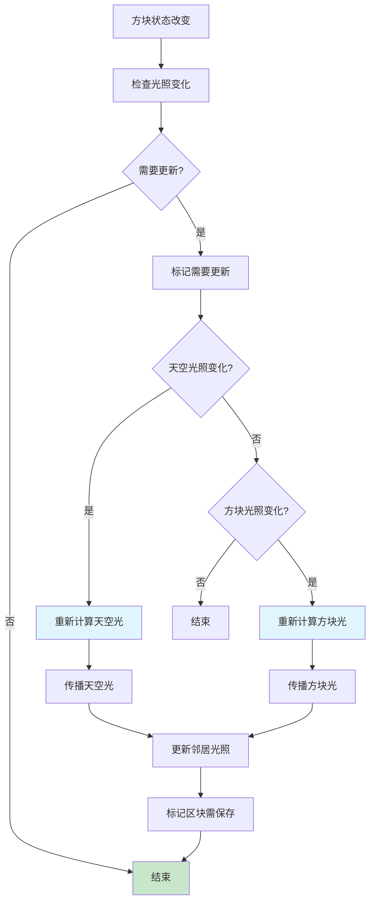

# 第 13 章：光照系统详解（Lighting System）

## 章节目标

通过本章学习，你将掌握：
- Minecraft 光照系统的基本概念
- 天空光照（Sky Light）和方块光照（Block Light）的区别
- 光照计算算法
- 光照更新的触发机制
- 光照对游戏玩法的影响

## 前置知识

建议先阅读：
- [08-World核心类](./09-world-core.md) - 世界的基本概念
- [09-Chunk区块系统](./10-chunk-system.md) - 区块数据结构

## 核心概念

### 光照 = 世界的明暗规则

想象 Minecraft 的光照系统是一套**明暗规则**：

```
┌─────────────────────────────────────────────────────────────┐
│              Minecraft 光照系统 = 明暗规则                       │
├─────────────────────────────────────────────────────────────┤
│                                                              │
│  ☀️ 天空光照 (Sky Light)     🕯️ 方块光照 (Block Light)        │
│     │                              │                         │
│     ├── 从天空向下传播              ├── 从光源向外衰减            │
│     ├── 最大值: 15                 ├── 最大值: 15             │
│     └── 不穿过不透明方块            └── 穿过透明方块会衰减        │
│                                                              │
│  ════════════════════════════════════════════════════════     │
│                                                              │
│  光照值范围: 0-15                                            │
│  ┌─────┬─────┬─────┬─────┬─────┐                           │
│  │  0  │  1  │ ... │ 14  │ 15  │                           │
│  │ 黑暗 │ 微光 │     │ 明亮 │ 阳光 │                           │
│  └─────┴─────┴─────┴─────┴─────┘                           │
│                                                              │
└─────────────────────────────────────────────────────────────┘
```

**关键类比**：
- 天空光照像是从天花板照下来的自然光
- 方块光照像是蜡烛、火把的光源
- 光照值越高，周围越亮
- 完全黑暗（0）会有危险生物生成

---

## 1. 光照系统概述

### 1.1 光照类型

```
┌─────────────────────────────────────────────────────────────┐
│                    光照类型对比                                 │
├─────────────────────────────────────────────────────────────┤
│                                                              │
│  ☀️ 天空光照 (Sky Light)                                     │
│  ├─ 来源: 天空（太阳、月亮）                                   │
│  ├─ 传播: 从上向下（Y轴正方向）                               │
│  ├─ 最大值: 15                                               │
│  ├─ 阻挡物: 不透明方块完全阻挡                                │
│  └─ 用途: 自然照明，影响生物生成                              │
│                                                              │
│  🕯️ 方块光照 (Block Light)                                  │
│  ├─ 来源: 火把、灯笼、熔炉、岩浆等                           │
│  ├─ 传播: 从光源向所有方向                                    │
│  ├─ 最大值: 15                                               │
│  ├─ 衰减: 每个透明方块 -1                                    │
│  └─ 用途: 人造照明                                           │
│                                                              │
│  🌡️ 环境光照 (Ambient Occlusion)                             │
│  └─ 用途: 角落阴影，增强立体感                                 │
│                                                              │
└─────────────────────────────────────────────────────────────┘
```

### 1.2 光照计算公式

```java
// 最终光照值计算
int finalLight = min(skyLight + blockLight, 15);

// 光照来源:
// - 天空光照: 从天空向下，最大15，穿过不透明方块变为0
// - 方块光照: 从光源向外衰减，每格-1
```

---

## 2. LightingProvider 光照提供者

### 2.1 核心类结构

```java
public class LightingProvider {
    private final ChunkProvider chunkProvider;    // 区块提供者
    private final LightType[] types;            // 光照类型数组
    private final ChunkLightProvider[] lightProviders;  // 光照处理器
    
    // 检查单个方块的光照
    public void checkBlock(BlockPos pos) {
        this.checkBlock(pos, LightType.SKY);
        this.checkBlock(pos, LightType.BLOCK);
    }
    
    // 设置截面状态（空/非空）
    public void setSectionStatus(BlockPos pos, boolean isEmpty) {
        // 通知光照提供者区块状态变化
    }
}
```

### 2.2 光照类型

```java
public enum LightType {
    SKY("sky"),   // 天空光照
    BLOCK("block"); // 方块光照
}
```

---

## 3. 光照传播算法

### 3.1 天空光照传播

```java
// 天空光照计算
// 1. 从区块顶部开始，向下传播
// 2. 如果方块不透明，光照值变为0
// 3. 如果方块透明，光照值 = max(0, 上方光照值 - 衰减)

// 示例:
// 天空(15) → 空气(15) → 玻璃(14) → 石头(0)

// 实现伪代码
public int computeSkyLight(Chunk chunk, int x, int y, int z) {
    // 获取上方方块的光照
    int aboveLight = y >= chunk.getMaxY() - 1 
        ? 15  // 天空直接照射
        : getSkyLight(chunk, x, y + 1, z);
    
    // 当前方块的透明度
    int transparency = getTransparency(chunk.getBlockState(x, y, z));
    
    // 计算当前光照值
    return Math.max(0, aboveLight - (15 - transparency));
}
```

### 3.2 方块光照传播

```java
// 方块光照计算
// 1. 从光源开始，向所有方向传播
// 2. 每传播一格，光照值 -1
// 3. 直到光照值为0，或遇到不透明方块

// 示例:
// 火把(14) → 空气(13) → 空气(12) → ... → 空气(1) → 石头(0)

// 实现伪代码
public int computeBlockLight(Chunk chunk, int x, int y, int z) {
    // 获取光源值
    BlockState state = chunk.getBlockState(x, y, z);
    int sourceLight = getBlockSourceLight(state);  // 火把=14，其他=0
    
    // 如果是光源，直接返回
    if (sourceLight > 0) {
        return sourceLight;
    }
    
    // 从邻居获取最大光照
    int maxNeighborLight = 0;
    for (Direction dir : Direction.values()) {
        int neighborLight = getBlockLight(chunk, x + dir.getX(), 
                                          y + dir.getY(), z + dir.getZ());
        maxNeighborLight = Math.max(maxNeighborLight, neighborLight);
    }
    
    // 衰减
    int transparency = getTransparency(state);
    return Math.max(0, maxNeighborLight - (15 - transparency));
}
```

### 3.3 光照传播流程图

```mermaid
flowchart TD
    A[开始光照计算] --> B[检查光照类型]
    
    B --> C{SKY还是BLOCK?}
    
    C -->|SKY| D[获取上方光照]
    C -->|BLOCK| E[检查是否是光源]
    
    D --> F[计算衰减]
    F --> G[返回天空光照值]
    
    E -->|是光源| H[返回光源值]
    E -->|不是光源| I[获取邻居光照]
    
    I --> J[选择最大值]
    J --> K[计算衰减]
    K --> L[返回光照值]
    
    G --> M[计算最终光照]
    H --> M
    L --> M
    
    M --> N[min(skyLight + blockLight, 15)]
    
    style G fill:#c8e6c9
    style H fill:#c8e6c9
    style L fill:#c8e6c9
```

---

## 4. 光照存储

### 4.1 存储格式

```java
// 每个 ChunkSection 存储两种光照数据
public class ChunkSection {
    // 天空光照: 16×16×16 / 2 = 2048 bytes (4bit/方块 → 2bit打包)
    private final ChunkNibbleArray skyLight;
    
    // 方块光照: 16×16×16 / 2 = 2048 bytes
    private final ChunkNibbleArray blockLight;
}

// ChunkNibbleArray - 4位压缩存储
// 每2个方块的光照值打包成1个字节
// 高4位: 第一个方块
// 低4位: 第二个方块
```

### 4.2 存储效率对比

```
存储方式对比：

未压缩存储:
- 16×16×16 方块
- 每个方块需要1个字节存储光照
- 总计: 4,096 字节

Nibble压缩存储:
- 4个光照等级只需要2个字节 (每方块4bit)
- 总计: 2,048 字节
- 节省: 50%
```

---

## 5. 光照更新机制

### 5.1 更新触发时机

```
光照更新的触发场景：

┌─────────────────────────────────────────────────────────────┐
│ 触发时机                    │ 说明                            │
├─────────────────────────────────────────────────────────────┤
│ 方块放置                    │ 阻挡/添加光照                    │
│ 方块破坏                    │ 移除/暴露光照                    │
│ 方块状态改变                │ 影响透明度的状态变化              │
│ 活塞推动方块                │ 方块位置变化                     │
│ 流体流动                    │ 流体影响光照                     │
│ 区块加载                    │ 初始化光照数据                   │
└─────────────────────────────────────────────────────────────┘
```

### 5.2 延迟光照更新

```java
// 在 WorldChunk.setBlockState 中的光照更新
@Override
public BlockState setBlockState(BlockPos pos, BlockState state, boolean moved) {
    // ... 方块设置逻辑 ...
    
    // 检查是否需要更新光照
    if (ChunkLightProvider.needsLightUpdate(this, pos, blockState, state)) {
        // 标记天空光照需要检查
        this.chunkSkyLight.isSkyLightAccessible(this, j1, i, l);
        
        // 触发光照更新
        this.world.getChunkManager().getLightingProvider().checkBlock(pos);
    }
}
```

### 5.3 光照更新流程图



---

## 6. 特殊光照规则

### 6.1 透明方块对光照的影响

```
┌─────────────────────────────────────────────────────────────┐
│ 透明方块光照衰减表                                            │
├─────────────────────────────────────────────────────────────┤
│                                                              │
│ 方块类型           │ 透明度  │ 光照衰减                       │
├───────────────────┼─────────┼──────────────────────────────┤
│ 空气               │ 15      │ 几乎不衰减                    │
│ 树叶               │ 14      │ 每格 -1                       │
│ 玻璃               │ 15      │ 几乎不衰减                    │
│ 染色玻璃           │ 15      │ 几乎不衰减                    │
│ 冰块               │ 13      │ 轻微衰减                       │
│ 水                 │ 13      │ 轻微衰减                       │
│ 楼梯/半砖          │ 15      │ 几乎不衰减                    │
│ 告示牌             │ 15      │ 几乎不衰减                    │
│ 铁栏杆             │ 15      │ 几乎不衰减                    │
│                                                              │
│ 不透明方块         │ 0       │ 完全阻挡天空光                │
│ (石头、泥土等)     │          │                               │
│                                                              │
└─────────────────────────────────────────────────────────────┘
```

### 6.2 光源方块

```java
// Minecraft 中的光源方块
public class LightBlocks {
    // 火把 - 方块光14
    torch = 14,
    soul_torch = 14,
    
    // 灯笼/灯笼 - 方块光14
    lantern = 14,
    soul_lantern = 14,
    
    // 海灯/灯笼 - 方块光14
    sea_lantern = 14,
    
    // 荧石 - 方块光11
    glowstone = 11,
    
    // 岩浆块 - 方块光13 (1.16+不再发光)
    magma_block = 0,
    
    // 蜡烛 - 方块光14
    candle = 14,
    
    // 熔炉(燃烧) - 方块光13
    furnace = 13,
    
    // 红石灯 - 方块光9
    redstone_lamp = 9,
    
    // 下界要塞灯笼 - 方块光15
    soul_lantern = 15,
}
```

---

## 7. 实战演示

### 7.1 获取光照值

```java
// 获取指定位置的光照值
public void getLightLevels(ServerWorld world, BlockPos pos) {
    // 获取天空光照
    int skyLight = world.getLight(pos.up());
    
    // 获取方块光照
    int blockLight = world.getLight(pos);
    
    // 获取综合光照（天空光+方块光）
    int combinedLight = world.getLuminance(pos);
    
    System.out.printf("位置 %s: 天空光=%d, 方块光=%d, 综合光=%d%n",
        pos, skyLight, blockLight, combinedLight);
}

// 获取方块是否被天空照亮
public boolean isSkyLit(ServerWorld world, BlockPos pos) {
    return world.getLight(pos.up()) >= 15;
}

// 获取是否有足够的方块光照
public boolean hasBlockLight(ServerWorld world, BlockPos pos) {
    return world.getLight(pos) >= 1;
}
```

### 7.2 创建自定义光源

```java
// 创建自定义发光方块
public class CustomGlowBlock extends Block {
    
    public CustomGlowBlock(Settings settings) {
        super(settings.luminance(state -> 15));  // 设置亮度为15
    }
}

// 或者通过方块状态设置不同亮度
public class VariableGlowBlock extends Block {
    
    // 定义亮度属性
    public static final IntProperty POWER = IntProperty.of("power", 0, 15);
    
    public VariableGlowBlock(Settings settings) {
        super(settings);
    }
    
    @Override
    public BlockState getStateForPlacement(BlockPlacementContext context) {
        return this.getDefaultState().with(POWER, 15);
    }
    
    // 根据属性返回不同亮度
    @Override
    public int getLuminance(BlockState state) {
        return state.get(POWER);  // 根据power属性返回亮度
    }
}
```

### 7.3 光照检查工具

```java
// 创建光照可视化工具
public class LightLevelDebugTool {
    
    public static void visualizeLightLevels(ServerWorld world, BlockPos center, int radius) {
        for (int y = -radius; y <= radius; y++) {
            for (int x = -radius; x <= radius; x++) {
                for (int z = -radius; z <= radius; z++) {
                    BlockPos pos = center.add(x, y, z);
                    int light = world.getLight(pos);
                    char symbol = getLightSymbol(light);
                    System.out.print(symbol);
                }
                System.out.println();
            }
            System.out.println("---");
        }
    }
    
    private static char getLightSymbol(int light) {
        if (light >= 15) return '☀';
        if (light >= 12) return '🌟';
        if (light >= 9) return '✦';
        if (light >= 6) return '◇';
        if (light >= 3) return '·';
        return ' ';
    }
}
```

---

## 8. 性能优化

### 8.1 光照计算优化

```
优化策略：

┌─────────────────────────────────────────────────────────────┐
│ 1. 延迟更新                                                │
│    - 批量方块操作时，最后统一更新光照                        │
│    - 使用标志位控制是否立即更新                             │
├─────────────────────────────────────────────────────────────┤
│ 2. 范围限制                                                │
│    - 只更新受影响的区块范围                                  │
│    - 使用BFS但限制最大传播距离                              │
├─────────────────────────────────────────────────────────────┤
│ 3. 缓存                                                    │
│    - 光照值已缓存于ChunkSection中                          │
│    - 避免重复计算                                          │
├─────────────────────────────────────────────────────────────┤
│ 4. 多线程                                                  │
│    - 独立区块可并行计算                                     │
│    - 使用工作队列调度                                       │
└─────────────────────────────────────────────────────────────┘
```

### 8.2 光照计算性能对比

```
光照计算相对耗时（以单个方块操作为基准）：

┌────────────────────────────┬─────────────────────────────┐
│ 操作类型                    │ 相对耗时                     │
├────────────────────────────┼─────────────────────────────┤
│ 简单空气放置                │ 1x                          │
│ 放置火把（方块光14）        │ 5x                          │
│ 放置大量火把                │ 50-100x (级联更新)           │
│ 活塞推动方块                │ 10x                         │
│ 区块首次加载                │ 1000x (全区块计算)          │
└────────────────────────────┴─────────────────────────────┘
```

---

## 9. 关键源码文件

| 文件 | 路径 | 说明 |
|-----|------|-----|
| `LightingProvider.java` | `net.minecraft.world.level.lighting.LightingProvider` | 光照提供者 |
| `ChunkLightProvider.java` | `net.minecraft.world.level.lighting.ChunkLightProvider` | 区块光照处理 |
| `SkyLightView.java` | `net.minecraft.world.level.lighting.SkyLightView` | 天空光照视图 |
| `BlockLightView.java` | `net.minecraft.world.level.lighting.BlockLightView` | 方块光照视图 |
| `ChunkNibbleArray.java` | `net.minecraft.world.chunk.storage.ChunkNibbleArray` | 光照数据存储 |

---

## 课后自查

完成本章学习后，请检查你是否理解：

- [ ] 天空光照和方块光照的区别
- [ ] 光照值范围（0-15）
- [ ] 光照传播算法
- [ ] 光照数据存储方式
- [ ] 光照更新的触发机制
- [ ] 透明方块对光照的影响

---

## 延伸阅读

- [09-Chunk区块系统](./10-chunk-system.md) - 区块数据结构
- [11-地形生成](./12-terrain-gen.md) - 地形生成中的光照处理
