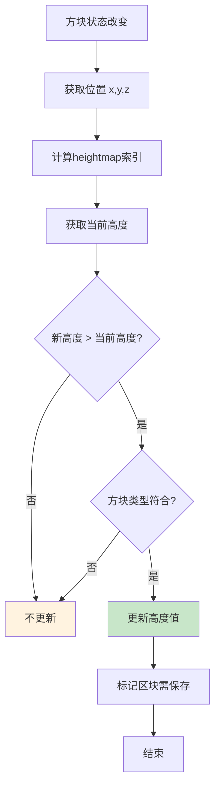

# 第 14 章：高度图系统详解（Heightmap）

## 章节目标

通过本章学习，你将掌握：
- Heightmap（高度图）的概念和用途
- 高度图的类型和计算方式
- 高度图的数据结构
- 高度图的更新机制
- 如何利用高度图优化查找操作

## 前置知识

建议先阅读：
- [08-World核心类](./09-world-core.md) - 世界的基本概念
- [09-Chunk区块系统](./10-chunk-system.md) - 区块数据结构

## 核心概念

### Heightmap = 地图的等高线

想象高度图就像是**地图上的等高线**：

```
┌─────────────────────────────────────────────────────────────┐
│              Heightmap = 地图等高线                            │
├─────────────────────────────────────────────────────────────┤
│                                                              │
│  🗺️ 传统地图          📊 Heightmap数据                      │
│  ┌───────────┐        ┌─────────────────────────────┐       │
│  │ ══════    │ ← 等高 │ [12, 12, 12, 14, 15, 15] │       │
│  │   ═══     │        │ [12, 13, 14, 14, 15, 15] │       │
│  │  ═════    │        │ [11, 12, 13, 13, 14, 14] │       │
│  │    ═══    │        │ [10, 11, 12, 12, 13, 13] │       │
│  │     ═     │        │ [ 9, 10, 11, 11, 12, 12] │       │
│  │      ═══  │        │ [ 8,  9, 10, 10, 11, 11] │       │
│  └───────────┘        └─────────────────────────────┘       │
│       ↕                                                    │
│  快速定位最高点  ←───  每个坐标对应一个高度值                  │
│                                                              │
└─────────────────────────────────────────────────────────────┘
```

**关键类比**：
- 高度图存储每个X,Z位置的最高点Y坐标
- 避免逐列扫描所有方块
- 大幅加速"找到地面"等操作
- 类似地图的等高线功能

---

## 1. 高度图类型

### 1.1 四种高度图类型

```java
public enum Type {
    // 阻挡运动的最高点（含液体和所有阻挡物）
    MOTION_BLOCKING,
    
    // 阻挡运动的最高点（不含树叶）
    MOTION_BLOCKING_NO_LEAVES,
    
    // 海洋底部（不含气泡柱生物）
    OCEAN_FLOOR,
    
    // 世界表面（空气与固体交界）
    WORLD_SURFACE;
}
```

### 1.2 高度图类型对比

```
┌─────────────────────────────────────────────────────────────┐
│                 高度图类型对比                                  │
├─────────────────────────────────────────────────────────────┤
│                                                              │
│  类型                    │ 检测的方块                         │
│  ────────────────────────┼───────────────────────────────    │
│  MOTION_BLOCKING         │ 所有阻挡运动的方块                 │
│                         │ 包括：固体、液体、树叶、告示牌      │
│  ────────────────────────┼───────────────────────────────    │
│  MOTION_BLOCKING         │ 固体方块                          │
│  _NO_LEAVES             │ 不包括：树叶、藤蔓                  │
│  ────────────────────────┼───────────────────────────────    │
│  OCEAN_FLOOR            │ 不含气泡柱生物的方块               │
│                         │ 包括：石头、砂砾、砂子              │
│                         │ 不包括：海龟蛋、灯笼鱼              │
│  ────────────────────────┼───────────────────────────────    │
│  WORLD_SURFACE          │ 所有非空气方块                     │
│                         │ 即空气与固体的交界                 │
│                                                              │
└─────────────────────────────────────────────────────────────┘
```

### 1.3 使用场景

| 高度图类型 | 典型用途 |
|-----------|---------|
| `MOTION_BLOCKING` | 实体移动、AI寻路、实体碰撞检测 |
| `MOTION_BLOCKING_NO_LEAVES` | 区块加载高度判断 |
| `OCEAN_FLOOR` | 海底神殿生成、溺尸生成、钓鱼 |
| `WORLD_SURFACE` | 放置方块高度、树生成、地形表面处理 |

---

## 2. 高度图数据结构

### 2.1 Heightmap 类结构

```java
public class Heightmap {
    private final Chunk getChunk();          // 所属区块
    private final Type type;                // 高度图类型
    private final Long2ObjectMap<Heightmap> child;  // 子高度图
    private final long[] data;              // 高度数据数组
    
    // 每个64×64区块使用一个long[]数组存储
    // 每个long的高24位存储Y坐标
}
```

### 2.2 数据存储格式

```java
// 高度图存储示意
// 每个区块（16×16）被分成4个64×64的块

// data数组结构:
// data[0] → (z=0-15, x=0-15) 的高度
// data[1] → (z=0-15, x=16-31) 的高度
// data[2] → (z=16-31, x=0-15) 的高度
// data[3] → (z=16-31, x=16-31) 的高度

// 每个long的格式:
// [高8位: 标志位] [中24位: Y坐标] [低32位: 未使用]

// 获取高度
public int getHeight(int x, int z) {
    return this.data[index(x, z)] & 0xFFFFFFL;  // 取低24位
}

// 更新高度
public void trackUpdate(int x, int y, int z, BlockState state) {
    int i = index(x, z);
    if (y > (int)(this.data[i] & 0xFFFFFFL)) {
        if (this.accepts(state)) {
            // 更新高度值
            this.data[i] = y + (this.data[i] & 0xFF000000L);
        }
    }
}
```

### 2.3 存储示意图

```
┌─────────────────────────────────────────────────────────────┐
│               Heightmap 数据存储结构                            │
├─────────────────────────────────────────────────────────────┤
│                                                              │
│  Chunk (16×16) 划分为 4 个 8×8 子块                         │
│                                                              │
│  ┌───────────────────────┐                                  │
│  │       │       │       │                                  │
│  │  64×64 │ 64×64 │  区块    │                           │
│  │  data[0] │ data[1] │  X=0-15 │                          │
│  ├──────┼───────┼─────────┤                                  │
│  │  64×64 │ 64×64 │                                  │
│  │  data[2] │ data[3] │  X=16-31 │                          │
│  │       │       │                                  │
│  └───────────────────────┘                                  │
│         Z=0-15        Z=16-31                              │
│                                                              │
│  每个64×64 = 4096个位置 × 4字节 ≈ 16KB                      │
│                                                              │
└─────────────────────────────────────────────────────────────┘
```

---

## 3. 高度图操作

### 3.1 获取高度

```java
// Heightmap.java
public int getHeight(int x, int z) {
    return this.data[index(x, z)] & 0xFFFFFFL;
}

// World.java 中使用
public int getHeight(Heightmap.Type type, int x, int z) {
    int sectionX = x >> 4;
    int sectionZ = z >> 4;
    
    WorldChunk chunk = this.getChunk(sectionX, sectionZ);
    Heightmap heightmap = chunk.getHeightmap(type);
    
    return heightmap.getHeight(x & 15, z & 15);
}
```

### 3.2 更新高度

```java
// Heightmap.java
public void trackUpdate(int x, int y, int z, BlockState state) {
    int i = index(x, z);
    
    // 只有当新高度更高时才更新
    if (y > (int)(this.data[i] & 0xFFFFFFL)) {
        // 检查方块是否符合此高度图的类型
        if (this.accepts(state)) {
            // 更新高度值，保留高8位的标志
            this.data[i] = y + (this.data[i] & 0xFF000000L);
        }
    }
}

// 检查方块是否应该被此高度图追踪
public boolean accepts(BlockState state) {
    return switch (this.type) {
        case MOTION_BLOCKING -> 
            !state.isIn(BlockTags.LEAVES) && state.isSolid();
        case MOTION_BLOCKING_NO_LEAVES -> state.isSolid();
        case OCEAN_FLOOR -> !state.isIn(BlockTags.BUBBLE_COLUMNS);
        case WORLD_SURFACE -> !state.isAir();
    };
}
```

### 3.3 高度图流程图



---

## 4. 高度图在区块中的位置

### 4.1 WorldChunk 中的高度图

```java
62:112:WorldChunk.java
public class WorldChunk extends Chunk {
    
    // 高度图映射
    private final Map<Heightmap.Type, Heightmap> heightmaps;
    
    // 获取特定类型的高度图
    public Heightmap getHeightmap(Heightmap.Type type) {
        return this.heightmaps.get(type);
    }
}
```

### 4.2 高度图初始化

```java
// 在WorldChunk构造时初始化
public WorldChunk(net.minecraft.world.World world, ChunkPos pos) {
    this.heightmaps = new java.util.EnumMap<>(Heightmap.Type.class);
    
    for (Heightmap.Type type : Heightmap.Type.values()) {
        String requirement = switch (type) {
            case MOTION_BLOCKING -> "contains(lambda) or #minecraft:leaves";
            case MOTION_BLOCKING_NO_LEAVES -> "contains(lambda)";
            case OCEAN_FLOOR -> "!#minecraft:features_cannot_replace";
            case WORLD_SURFACE -> "true";
        };
        
        this.heightmaps.put(
            type, 
            new Heightmap(this, type, requirement)
        );
    }
}
```

---

## 5. 高度图应用场景

### 5.1 实体放置

```java
// 找一个安全的位置放置实体
public BlockPos findSafePosition(ServerWorld world, int x, int z) {
    // 获取地形表面高度
    int surfaceHeight = world.getHeight(
        Heightmap.Type.MOTION_BLOCKING, 
        x, z
    );
    
    // 在表面上方几格放置
    BlockPos spawnPos = new BlockPos(x, surfaceHeight + 2, z);
    
    // 确保下方是固体
    if (world.getBlockState(spawnPos.below()).isSolid()) {
        return spawnPos;
    }
    
    // 尝试更低的位置
    for (int y = surfaceHeight; y > world.getBottomY(); y--) {
        BlockState below = world.getBlockState(new BlockPos(x, y - 1, z));
        if (below.isSolid()) {
            return new BlockPos(x, y, z);
        }
    }
    
    return null;
}
```

### 5.2 建筑生成

```java
// 在地形上建造结构
public void generateStructure(World world, StructurePlaceSettings settings) {
    BlockPos origin = settings.getOrigin();
    ChunkPos chunkPos = new ChunkPos(origin);
    
    // 获取区块
    WorldChunk chunk = world.getChunk(chunkPos.x, chunkPos.z);
    
    // 计算结构范围内的高度
    int minX = origin.getX();
    int maxX = origin.getX() + structureWidth;
    int minZ = origin.getZ();
    int maxZ = origin.getZ() + structureDepth;
    
    // 找到平均地形高度
    int totalHeight = 0;
    int count = 0;
    
    for (int x = minX; x <= maxX; x++) {
        for (int z = minZ; z <= maxZ; z++) {
            totalHeight += world.getHeight(Heightmap.Type.WORLD_SURFACE, x, z);
            count++;
        }
    }
    
    int avgHeight = totalHeight / count;
    
    // 在平均高度放置结构
    BlockPos structureBase = new BlockPos(origin.getX(), avgHeight, origin.getZ());
    placeStructure(world, structureBase, settings);
}
```

### 5.3 寻路优化

```java
// 路径查找中的高度查询
public class PathHeightmap {
    
    private final Heightmap heightmap;
    
    public PathNode getNode(int x, int z) {
        int height = heightmap.getHeight(x, z);
        return new PathNode(x, height, z);
    }
    
    public boolean canMoveBetween(PathNode from, PathNode to) {
        // 检查高度差
        int heightDiff = Math.abs(from.y - to.y);
        return heightDiff <= maxStepHeight;  // 最大跳跃高度
    }
}
```

---

## 6. 高度图与区块加载

### 6.1 延迟高度图更新

```java
// 区块加载时不计算完整高度图
// 只在需要时才计算

public int getHeight(Heightmap.Type type, int x, int z) {
    // 尝试从高度图获取
    WorldChunk chunk = this.getChunk(x >> 4, z >> 4);
    Heightmap heightmap = chunk.getHeightmap(type);
    
    if (heightmap != null) {
        return heightmap.getHeight(x & 15, z & 15);
    }
    
    // 回退：手动扫描
    return this.getHighestY(Heightmap.Type.WORLD_SURFACE, x, z);
}
```

### 6.2 高度图重建

```java
// 重建区块的高度图
public void rebuildHeightmap(WorldChunk chunk, Heightmap.Type type) {
    Heightmap heightmap = chunk.getHeightmap(type);
    if (heightmap == null) {
        return;
    }
    
    int startX = chunk.getPos().x * 16;
    int startZ = chunk.getPos().z * 16;
    
    // 重置高度图
    heightmap.clear();
    
    // 扫描整个区块
    for (int x = 0; x < 16; x++) {
        for (int z = 0; z < 16; z++) {
            int worldX = startX + x;
            int worldZ = startZ + z;
            
            // 找到最高点
            int height = findHighestY(chunk, x, z, type);
            if (height > 0) {
                heightmap.trackUpdate(x, height, z, 
                    chunk.getBlockState(x, height, z));
            }
        }
    }
}
```

---

## 7. 实战演示

### 7.1 高度图可视化

```java
// 可视化一个区域的高度
public void visualizeHeightmap(World world, int centerX, int centerZ, int radius) {
    System.out.println("高度图可视化:");
    
    for (int z = -radius; z <= radius; z++) {
        StringBuilder line = new StringBuilder();
        
        for (int x = -radius; x <= radius; x++) {
            int height = world.getHeight(
                Heightmap.Type.WORLD_SURFACE, 
                centerX + x, 
                centerZ + z
            );
            
            // 用字符表示高度
            char symbol;
            if (height >= 100) symbol = '#';
            else if (height >= 80) symbol = '*';
            else if (height >= 60) symbol = '+';
            else if (height >= 40) symbol = '=';
            else if (height >= 20) symbol = '-';
            else symbol = '.';
            
            line.append(symbol).append(' ');
        }
        
        System.out.println(line);
    }
}
```

### 7.2 创建自定义高度检查

```java
// 检查某个位置是否在"建筑高度"内
public boolean isBuildable(World world, BlockPos pos) {
    int maxHeight = world.getTopY();
    int groundLevel = world.getHeight(
        Heightmap.Type.MOTION_BLOCKING, 
        pos.getX(), 
        pos.getZ()
    );
    
    // 建筑限制: 地面以上到最大高度
    if (pos.getY() < groundLevel || pos.getY() >= maxHeight) {
        return false;
    }
    
    // 高度不超过256
    return pos.getY() < 256;
}
```

### 7.3 获取多个高度信息

```java
// 获取位置的多高度信息
public class HeightInfo {
    public int worldSurface;    // WORLD_SURFACE
    public int motionBlocking;   // MOTION_BLOCKING
    public int oceanFloor;      // OCEAN_FLOOR
    
    public static HeightInfo get(World world, int x, int z) {
        HeightInfo info = new HeightInfo();
        info.worldSurface = world.getHeight(
            Heightmap.Type.WORLD_SURFACE, x, z);
        info.motionBlocking = world.getHeight(
            Heightmap.Type.MOTION_BLOCKING, x, z);
        info.oceanFloor = world.getHeight(
            Heightmap.Type.OCEAN_FLOOR, x, z);
        return info;
    }
}
```

---

## 8. 关键源码文件

| 文件 | 路径 | 说明 |
|-----|------|-----|
| `Heightmap.java` | `net.minecraft.world.Heightmap` | 高度图核心类 |
| `WorldChunk.java` | `net.minecraft.world.chunk.WorldChunk` | 包含高度图的区块 |
| `HeightmapType.java` | `net.minecraft.world.Heightmap$Type` | 高度图类型枚举 |

---

## 课后自查

完成本章学习后，请检查你是否理解：

- [ ] 四种高度图类型的区别
- [ ] 高度图的存储结构
- [ ] 高度图的更新机制
- [ ] 高度图的应用场景
- [ ] 如何在代码中使用高度图

---

## 延伸阅读

- [08-World核心类](./09-world-core.md) - 世界管理高度图
- [09-Chunk区块系统](./10-chunk-system.md) - 区块中高度图的位置
