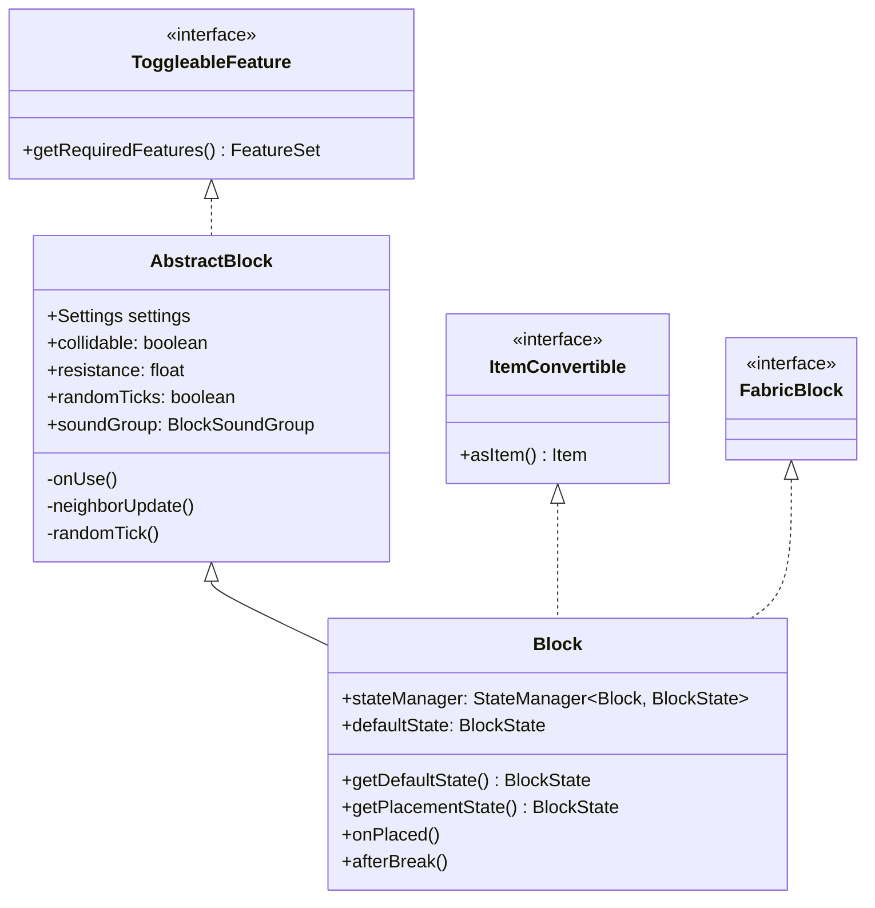
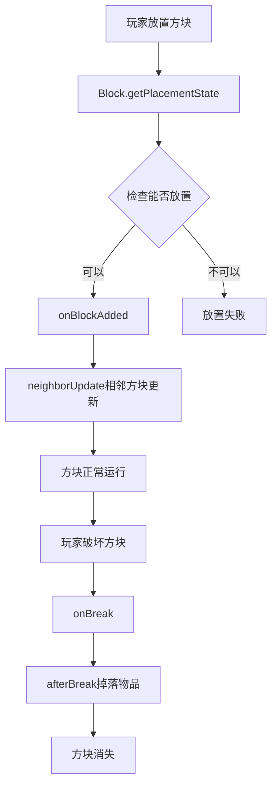

# 14 - Block 类：方块的基础

## 目标

学完本章节后，你将理解：
- Block 类是什么，它在 Minecraft 中扮演什么角色
- Block 和 AbstractBlock 的关系
- 方块的物理属性（硬度、爆炸抗性等）
- 如何创建一个自定义方块

## 前置知识

- [04-注册表系统.md](../Part-1-Foundation/04-registry-system.md) - 理解 Minecraft 的注册表机制
- [08-世界核心.md](../Part-2-World/08-world-core.md) - 了解方块在世界中的位置

## 核心概念

### Block 类是什么？

想象 Minecraft 世界是一堆积木。每个积木块就是 **Block（方块）**。

- 一个 Block 类 = 一种积木模板
- 比如"石头"模板只有一个，但世界上有无数块石头
- 所有石头共享相同的属性（颜色、硬度、形状）

### Block vs AbstractBlock

```
AbstractBlock（抽象方块）
    │
    ├── 定义方块的通用属性和逻辑
    │   ├── 硬度、爆炸抗性
    │   ├── 碰撞箱、透明度
    │   ├── 放置/破坏行为
    │   └── 与其他方块的交互
    │
    └── Block（具体方块）
            │
            ├── 继承 AbstractBlock
            ├── 每种具体方块（如石头、木头）
            └── 定义自己的特性
```

**简单理解**：
- `AbstractBlock` = 积木的"设计图模板"
- `Block` = 具体用设计图做出的积木

### 方块属性（方块的基本特性）

| 属性 | 说明 | 比喻 |
|------|------|------|
| **hardness** | 硬度，破坏所需时间 | 积木的"坚固程度" |
| **resistance** | 爆炸抗性 | 积木能承受多少锤子敲击 |
| **soundGroup** | 音效组 | 积木碰撞的声音 |
| **collidable** | 是否有碰撞箱 | 积木能否被穿过 |
| **randomTicks** | 是否随机刻更新 | 积木是否会自己变化 |

## 图解（Mermaid）

### Block 继承关系图



### 方块生命周期图



## 核心代码

> ⚠️ **注意**：以下代码基于 CFR 反编译，实际源码可能略有差异。建议结合 Minecraft 源码仓库交叉验证。

### 创建最简单的方块

```java
// 在你的 mod 主类中
public class MyMod implements ModInitializer {

    // 定义方块
    public static final Block MY_BLOCK = Registry.register(
        Registries.BLOCK,
        Identifier.of("mymod", "my_block"),
        new Block(AbstractBlock.Settings.create()
            .strength(1.5f, 6.0f)  // 硬度1.5, 爆炸抗性6.0
            .sounds(BlockSoundGroup.STONE)  // 石头音效
        )
    );

    @Override
    public void onInitialize() {
        // 方块已被注册
    }
}
```

### 常见的方块属性设置

```java
// 1. 石头类方块
new Block(AbstractBlock.Settings.create()
    .strength(1.5f, 6.0f)
    .sounds(BlockSoundGroup.STONE)
);

// 2. 泥土类方块
new Block(AbstractBlock.Settings.create()
    .strength(0.5f)
    .sounds(BlockSoundGroup.GRASS)
    .ticksRandomly()  // 需要随机刻
);

// 3. 透明方块（如空气、树叶）
new Block(AbstractBlock.Settings.create()
    .noCollision()     // 无碰撞箱
    .nonOpaque()       // 不阻挡光线
);

// 4. 需要特定工具的方块
new Block(AbstractBlock.Settings.create()
    .strength(3.0f, 3.0f)
    .requiresTool()    // 需要镐子
);

// 5. 可燃方块（如木头）
new Block(AbstractBlock.Settings.create()
    .strength(2.0f)
    .burnable()        // 可以被火烧掉
);

// 6. 液体方块
new Block(AbstractBlock.Settings.create()
    .liquid()
    .noCollision()
);
```

### 方块音效组（BlockSoundGroup）

```java
// 常用音效组
BlockSoundGroup.WOOD      // 木头
BlockSoundGroup.STONE      // 石头
BlockSoundGroup.GRASS      // 草
BlockSoundGroup.SAND       // 沙子
BlockSoundGroup.METAL      // 金属
BlockSoundGroup.GLASS      // 玻璃
BlockSoundGroup.WOOL       // 羊毛
BlockSoundGroup.BAMBOO     // 竹子
BlockSoundGroup.SNOW       // 雪
BlockSoundGroup.LAVA       // 岩浆
```

## 实战演示

### 案例：创建一个会发光的方块

```java
public static final Block GLOWING_BLOCK = Registry.register(
    Registries.BLOCK,
    Identifier.of("mymod", "glowing_block"),
    new Block(AbstractBlock.Settings.create()
        .strength(1.0f)
        .luminance(state -> 15)  // 亮度等级15（最亮）
        .sounds(BlockSoundGroup.METAL)
    )
);
```

### 案例：创建一个"随机tick"的草方块

```java
// 草会在附近没有草时变成泥土
public static final Block GRASS = Registry.register(
    Registries.BLOCK,
    Identifier.of("mymod", "my_grass"),
    new Block(AbstractBlock.Settings.create()
        .strength(0.6f)
        .sounds(BlockSoundGroup.GRASS)
        .ticksRandomly()  // 开启随机刻
    )
);

// 然后在方块类中重写 randomTick 方法
public class MyGrassBlock extends Block {
    public MyGrassBlock(Settings settings) {
        super(settings);
    }

    @Override
    protected void randomTick(BlockState state, ServerWorld world,
                              BlockPos pos, Random random) {
        // 检查上方是否有其他方块
        if (!world.isSkyVisible(pos)) {
            // 变成泥土
            world.setBlockState(pos, Blocks.DIRT.getDefaultState());
        }
    }
}
```

## 小结

1. **Block 类**是 Minecraft 世界的基本构建单位
2. **AbstractBlock** 定义方块的通用属性和方法
3. 方块的**属性**通过 `Settings` 配置：
   - `strength()` - 硬度和爆炸抗性
   - `sounds()` - 音效
   - `ticksRandomly()` - 随机刻更新
   - `luminance()` - 发光强度
4. 所有方块都需要**注册**到 `Registries.BLOCK`
5. 方块在世界中以 **BlockState** 的形式存在

## 练习

### 思考题

1. 思考：为什么凋零 Boss 的基座要用"命令方块"而不用普通石头？
2. 为什么有的方块需要 `ticksRandomly()`，有的不需要？

### 动手题

1. 创建一个自定义方块，设置不同的硬度和音效
2. 尝试创建一个会发光的方块
3. 进阶：创建一个每 10 秒自动消失的方块

### 源码文件位置

| 文件 | 源码路径 | 说明 |
|------|----------|------|
| Block.java | `net/minecraft/block/Block.java` | 方块基类 |
| AbstractBlock.java | `net/minecraft/block/AbstractBlock.java` | 抽象方块实现 |
| Blocks.java | `net/minecraft/block/Blocks.java` | 所有原版方块定义 |
| BlockSettings.java | `net/minecraft/block/BlockSettings.java` | 方块设置 |

## 相关链接

- [04-注册表系统.md](../Part-1-Foundation/04-registry-system.md) - 理解注册表机制
- [08-世界核心.md](../Part-2-World/08-world-core.md) - 了解方块在世界中的位置
- [15-BlockState.md](./15-block-state.md) - 了解方块状态
- Minecraft Wiki: [方块](https://minecraft.fandom.com/wiki/Block)
