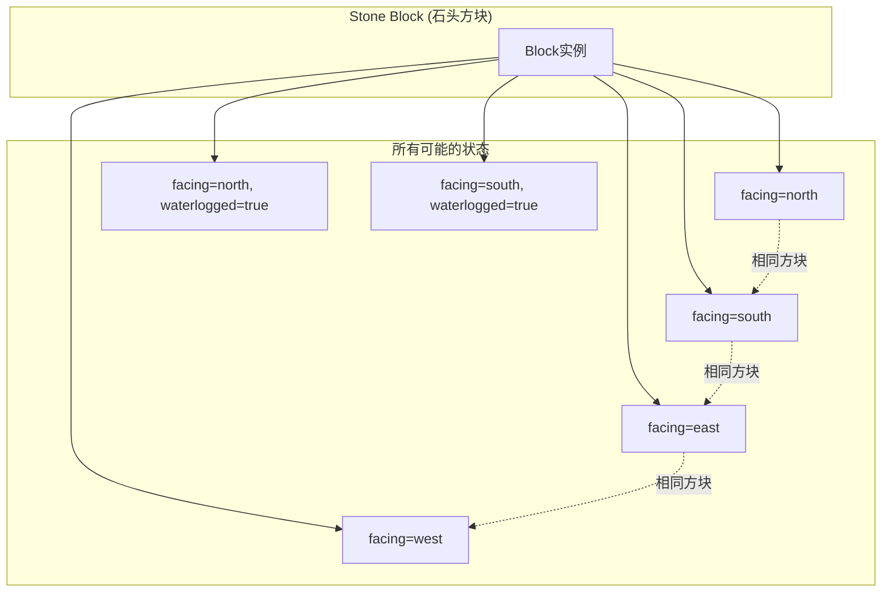

# 15 - BlockState：方块的不同状态

## 目标

学完本章节后，你将理解：
- BlockState 是什么（同一个方块的不同"样子"）
- Property 接口及其作用
- 常见的状态属性类型
- 如何为自定义方块添加状态

## 前置知识

- [14-Block基础.md](./14-block-basics.md) - 了解 Block 类

## 核心概念

### BlockState 是什么？

想象你有**一套积木**，虽然都是"楼梯"这个种类，但它们有4种不同的朝向：
- 楼梯朝北
- 楼梯朝南
- 楼梯朝东
- 楼梯朝西

在 Minecraft 中：
- **Block（石头）** = 一种积木模板，全世界只有一份
- **BlockState（石头被放置的状态）** = 这块积木的具体样子

```
┌─────────────────┐
│                 │
│  石头方块 (Block)  │
│  └── 东向 (BlockState)
│  └── 西向 (BlockState)
│  └── 南向 (BlockState)
│  └── 北向 (BlockState)
│                 │
└─────────────────┘
```

**关键点**：
- 一个 Block 类 → 多个 BlockState 实例
- BlockState 定义了方块的具体状态
- 状态改变 = 生成新的 BlockState 对象

### Property 接口：状态的"开关"

**Property（属性）** = 描述 BlockState 的某个维度

```
楼梯的 Property:
├── facing (朝向): north, south, east, west, up, down
├── half (半高): top, bottom
└── waterlogged (有水): true, false

木门的 Property:
├── facing (朝向): north, south, east, west
├── half (半高): upper, lower
├── hinge (铰链): left, right
├── powered (充能): true, false
└── open (打开): true, false
```

### 常见 Property 类型

| Property 类型 | 可选值 | 例子 |
|---------------|--------|------|
| `BooleanProperty` | true/false | 铁门是否打开 |
| `IntProperty` | 0-15 | 红石信号的强度 |
| `EnumProperty` | 自定义枚举 | 楼梯朝向、旗帜图案 |

## 图解（Mermaid）

### BlockState 状态映射图



### 楼梯状态示意图

```
         俯视图（顶层视角）

    ┌───────────────┐
    │               │
    │   楼梯方块      │
    │    facing     │
    │      ↑        │
    │     north     │
    │               │
    └───────────────┘

facing 可选值:
- north (北)
- south (南)
- east  (东)
- west  (西)
- up    (上)
- down  (下)
```

## 核心代码

> ⚠️ **注意**：以下代码基于 CFR 反编译，实际源码可能略有差异。建议结合 Minecraft 源码仓库交叉验证。

### 预定义的常用 Property

```java
// 位置: net.minecraft.state.property.Properties

// 布尔属性
BooleanProperty.create("waterlogged");    // 有水
BooleanProperty.create("powered");        // 充能
BooleanProperty.create("open");          // 打开

// 整数属性
IntProperty.create("power", 0, 15);      // 红石强度 0-15
IntProperty.create("layer", 1, 8);       // 雪层高度

// 枚举属性
DirectionProperty.create("facing");      // 朝向（自动包含6个方向）
DirectionProperty.create("facing",
    Direction.Plane.HORIZONTAL);         // 只包含4个水平方向
```

### 为自定义方块添加状态

```java
// 1. 定义属性
public class MyStairsBlock extends Block {

    // 创建属性
    public static final DirectionProperty FACING = DirectionProperty.create(
        "facing",
        Direction.Plane.HORIZONTAL    // 水平四个方向
    );

    public static final EnumProperty<Half> HALF = EnumProperty.create(
        "half",
        Half.class                    // Half.TOP, Half.BOTTOM
    );

    public MyStairsBlock(Settings settings) {
        super(settings);
        // 设置默认状态
        setDefaultState(getDefaultState()
            .with(FACING, Direction.NORTH)  // 默认朝北
            .with(HALF, Half.BOTTOM)         // 默认下半部分
        );
    }

    // 2. 注册属性
    @Override
    protected void appendProperties(StateManager.Builder<Block, BlockState> builder) {
        builder.add(FACING, HALF);
    }
}
```

### 读取和设置状态

```java
// 获取当前状态
BlockState state = world.getBlockState(pos);

// 读取属性值
Direction facing = state.get(FACING);      // 获取朝向
Half half = state.get(HALF);              // 获取半高

// 检查属性值
if (state.get(HALF) == Half.TOP) {
    // 这是上半部分
}

// 设置新状态（返回新的 BlockState）
BlockState newState = state.with(FACING, Direction.SOUTH);
world.setBlockState(pos, newState);

// 检查是否有某属性
if (state.contains(FACING)) {
    // 这个状态有 facing 属性
}
```

### 状态更新和邻居方块

```java
@Override
protected BlockState getStateForNeighborUpdate(
    BlockState state,           // 当前方块状态
    Direction direction,        // 变化的邻居方向
    BlockState neighborState,   // 邻居的新状态
    WorldAccess world,         // 世界
    BlockPos pos,              // 当前方块位置
    BlockPos neighborPos       // 邻居位置
) {
    // 当邻居改变时，更新自己的状态

    // 例如：铁轨根据相邻铁轨方向更新
    if (state.get(FACING) == direction.getOpposite()) {
        // 连接到邻居
        return state.with(FACING, direction);
    }

    return state;  // 状态不变
}
```

## 实战演示

### 案例：创建一个可以切换开关状态的方块

```java
public class ToggleBlock extends Block {

    public static final BooleanProperty POWERED = BooleanProperty.of("powered");

    public ToggleBlock(Settings settings) {
        super(settings);
        setDefaultState(getDefaultState().with(POWERED, false));
    }

    @Override
    protected void appendProperties(StateManager.Builder<Block, BlockState> builder) {
        builder.add(POWERED);
    }

    // 右键切换状态
    @Override
    protected ActionResult onUse(BlockState state, World world,
                                BlockPos pos, PlayerEntity player,
                                BlockHitResult hit) {
        if (!world.isClient) {
            // 切换状态
            boolean newPowered = !state.get(POWERED);
            world.setBlockState(pos, state.with(POWERED, newPowered));
        }
        return ActionResult.SUCCESS;
    }
}
```

### 案例：台阶方块的双层状态

```java
// 台阶有上半部分和下半部分
public class SlabBlock extends Block {

    public static final EnumProperty<SlabType> TYPE = EnumProperty.create(
        "type",
        SlabType.class  // SlabType.TOP, SlabType.BOTTOM, SlabType.DOUBLE
    );

    public SlabBlock(Settings settings) {
        super(settings);
        setDefaultState(getDefaultState().with(TYPE, SlabType.BOTTOM));
    }

    @Override
    protected void appendProperties(StateManager.Builder<Block, BlockState> builder) {
        builder.add(TYPE);
    }
}
```

## 小结

1. **BlockState** = 方块在世界的具体状态
2. **Property** = 状态的"维度"（朝向、半高、是否开启等）
3. 每个 Block 可以有多个 Property，每个 Property 有多个可能的值
4. 状态总数 = 所有 Property 可选值数量的**乘积**
5. 状态改变使用 `.with()` 方法，返回新的 BlockState

## 练习

### 思考题

1. 一个楼梯方块有 `facing`(4个值) 和 `half`(2个值)，总共有多少种状态？
2. 为什么状态改变要返回新的 BlockState 而不是修改现有对象？

### 动手题

1. 创建一个有"开启/关闭"两种状态的方块
2. 创建一个有3种颜色状态的方块
3. 进阶：创建一个双开门方块，需要同时考虑左右两扇门

### 源码文件位置

| 文件 | 源码路径 | 说明 |
|------|----------|------|
| BlockState.java | `net/minecraft/block/BlockState.java` | 方块状态 |
| StateManager.java | `net/minecraft/block/StateManager.java` | 状态管理器 |
| Property.java | `net/minecraft/block/properties/Property.java` | 属性基类 |

## 相关链接

- [14-Block基础.md](./14-block-basics.md) - 了解 Block 类
- [16-BlockEntity.md](./16-block-entity.md) - 了解需要存储额外数据的方块
- Minecraft Wiki: [Block_state](https://minecraft.fandom.com/wiki/Block_state)
