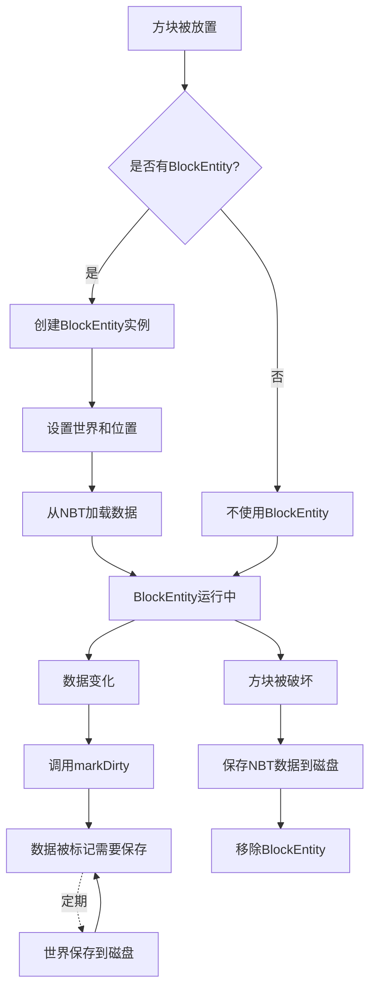
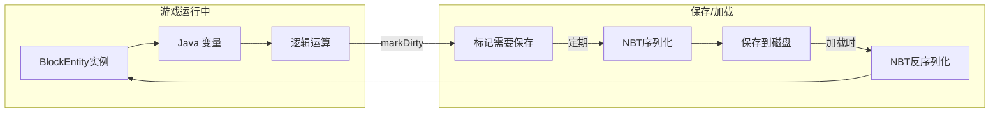

# 16 - BlockEntity：需要存储数据的方块

## 目标

学完本章节后，你将理解：
- BlockEntity 是什么（需要存储额外数据的方块）
- BlockEntity 和 BlockState 的区别
- 如何创建和使用 BlockEntity
- NBT 数据存储的基本概念

## 前置知识

- 理解 [BlockState](./15-block-state.md)
- 了解 Java 类的继承
- 知道什么是"序列化/反序列化"

## 核心概念（用生活比喻）

### BlockEntity 是什么？

**BlockState 的局限**：
- 状态是固定的、有限的
- 只能描述方块的"外观/行为模式"
- **不能存储可变的数据**

**生活中的例子**：想象一个**公告牌**
- BlockState 能告诉你：公告牌是木头做的、固定在墙上
- BlockEntity 能告诉你：公告牌上写着什么字

```
┌─────────────────────────────────────┐
│  公告牌 (Block)                      │
│                                     │
│  BlockState:                        │
│    - material = wood                │
│    - facing = north                 │
│    - waterlogged = false            │
│                                     │
│  BlockEntity 数据:                   │
│    - text = "Hello World!"          │
│    - author = "Steve"               │
│    - created = 2024-01-15          │
└─────────────────────────────────────┘
```

### 什么方块需要 BlockEntity？

| 方块 | 为什么需要 BlockEntity |
|------|----------------------|
| 箱子 | 存储物品（Inventory） |
| 熔炉 | 存储燃料、烧炼进度 |
| 告示牌 | 存储文字内容 |
| 命令方块 | 存储命令内容 |
| 末地传送门 | 存储关联的末影水晶 |
| 音符盒 | 存储演奏的音符 |

### BlockEntity vs Block vs BlockState

```
Block（方块类型）
    │
    ├── 定义：这是"箱子"这种方块
    ├── 所有箱子共享同一份代码
    │
    └── BlockState（方块状态）
            │
            ├── 存储：朝向、是否打开
            ├── 数量有限（几种固定状态）
            │
            └── BlockEntity（箱子实例）
                    │
                    ├── 存储：箱子里的物品
                    ├── 每个位置的箱子都独立
                    └── 数据可变（随时变化）
```

## 图解（Mermaid）

### 方块实体生命周期图



### BlockEntity 数据流向图



## 核心代码

### 创建 BlockEntity 的步骤

#### 1. 创建 BlockEntity 类

```java
// 位置: net.minecraft.block.entity.BlockEntity
public class MyChestBlockEntity extends BlockEntity {
    
    // 存储物品的容器
    private final DefaultedList<ItemStack> inventory = 
        DefaultedList.ofSize(27, ItemStack.EMPTY);
    
    // 构造函数（必须这样写）
    public MyChestBlockEntity(BlockPos pos, BlockState state) {
        super(BlockEntityType.CHEST, pos, state);
    }
    
    // 读取NBT数据（加载存档时调用）
    @Override
    protected void readNbt(NbtCompound nbt, RegistryWrapper.WrapperLookup lookup) {
        super.readNbt(nbt, lookup);
        // 读取物品数据
        Inventories.readNbt(nbt, inventory, lookup);
    }
    
    // 写入NBT数据（保存存档时调用）
    @Override
    protected void writeNbt(NbtCompound nbt, RegistryWrapper.WrapperLookup lookup) {
        super.writeNbt(nbt, lookup);
        // 保存物品数据
        Inventories.writeNbt(nbt, inventory, lookup);
    }
}
```

#### 2. 创建对应的 Block（需要实现 BlockEntityProvider）

```java
public class MyChestBlock extends BlockWithEntity {
    
    // 创建 BlockEntity 实例
    @Override
    public BlockEntity createBlockEntity(BlockPos pos, BlockState state) {
        return new MyChestBlockEntity(pos, state);
    }
    
    // ... 其他方法
}
```

#### 3. 注册 BlockEntityType

```java
public class MyMod implements ModInitializer {
    
    // 第一步：定义 BlockEntityType
    public static final BlockEntityType<MyChestBlockEntity> MY_CHEST = 
        BlockEntityType.Builder.create(
            MyChestBlockEntity::new,           // 工厂方法
            ModBlocks.MY_CHEST                 // 关联的方块
        ).build();
    
    @Override
    public void onInitialize() {
        // 注册 BlockEntityType
        Registry.register(
            Registries.BLOCK_ENTITY_TYPE,
            Identifier.of("mymod", "my_chest"),
            MY_CHEST
        );
    }
}
```

### NBT 数据存储详解

```java
// 常用的 NBT 操作

// 写入基本类型
nbt.putString("name", "Steve");
nbt.putInt("age", 25);
nbt.putBoolean("active", true);
nbt.putFloat("health", 20.0f);
nbt.putIntArray("positions", new int[]{1, 2, 3});

// 读取基本类型
String name = nbt.getString("name");
int age = nbt.getInt("age");
boolean active = nbt.getBoolean("active");

// 嵌套 NBT（复合标签）
NbtCompound complexData = new NbtCompound();
complexData.putString("player", "Steve");
complexData.putInt("score", 100);
nbt.put("data", complexData);

// 读取嵌套数据
NbtCompound data = nbt.getCompound("data");
String player = data.getString("player");

// 物品列表
NbtList items = new NbtList();
for (ItemStack stack : inventory) {
    items.add(stack.encode(registryLookup, new NbtCompound()));
}
nbt.put("Items", items);
```

### Tickable 接口（定时逻辑）

如果 BlockEntity 需要每帧/定时执行逻辑：

```java
public class MyFurnaceBlockEntity extends BlockEntity implements Tickable {
    
    private int burnTime = 0;
    private int cookTime = 0;
    
    @Override
    public void tick() {
        if (world == null || world.isClient) return;
        
        // 每tick执行的逻辑
        if (burnTime > 0) {
            burnTime--;
            cookTime++;
            
            if (cookTime >= 200) {  // 10秒
                // 完成烧炼
                cookTime = 0;
            }
            
            // 标记数据已改变
            markDirty();
        }
    }
}

// 注册时需要包含 tick 类型
public static final BlockEntityType<MyFurnaceBlockEntity> MY_FURNACE = 
    BlockEntityType.Builder.create(
        MyFurnaceBlockEntity::new,
        ModBlocks.MY_FURNACE
    ).build();
```

### 客户端-服务端数据同步

```java
public class MyBlockEntity extends BlockEntity {
    
    // 需要同步的数据
    private int syncedValue = 0;
    
    // 1. 返回初始同步数据（发送到客户端）
    @Override
    public NbtCompound toInitialChunkDataNbt(RegistryWrapper.WrapperLookup lookup) {
        NbtCompound nbt = super.toInitialChunkDataNbt(lookup);
        nbt.putInt("syncedValue", syncedValue);
        return nbt;
    }
    
    // 2. 返回更新数据包（可选，用于增量更新）
    @Override
    public Packet<ClientPlayPacketListener> toUpdatePacket() {
        return BlockEntityUpdateS2CPacket.create(this);
    }
    
    // 3. 触发同步（在服务端调用）
    public void updateSyncedValue(int newValue) {
        this.syncedValue = newValue;
        if (world != null && !world.isClient) {
            world.getChunkManager().markForUpdate(pos);
        }
        markDirty();
    }
}
```

## 实战演示

### 案例：创建自定义箱子

```java
public class CustomChestBlock extends BlockWithEntity {
    
    @Override
    public BlockEntity createBlockEntity(BlockPos pos, BlockState state) {
        return new CustomChestBlockEntity(pos, state);
    }
    
    // 打开箱子 GUI
    @Override
    protected ActionResult onUse(BlockState state, World world, 
                                BlockPos pos, PlayerEntity player,
                                BlockHitResult hit) {
        if (world.isClient) return ActionResult.SUCCESS;
        
        BlockEntity be = world.getBlockEntity(pos);
        if (be instanceof CustomChestBlockEntity chest) {
            player.openHandledScreen(chest);
        }
        return ActionResult.SUCCESS;
    }
}

// 完整的箱子 BlockEntity
public class CustomChestBlockEntity extends BlockEntity implements NamedScreenHandlerFactory {
    
    private final DefaultedList<ItemStack> items = DefaultedList.ofSize(27, ItemStack.EMPTY);
    
    public CustomChestBlockEntity(BlockPos pos, BlockState state) {
        super(ModBlockEntities.CUSTOM_CHEST, pos, state);
    }
    
    @Override
    protected void readNbt(NbtCompound nbt, RegistryWrapper.WrapperLookup lookup) {
        super.readNbt(nbt, lookup);
        Inventories.readNbt(nbt, items, lookup);
    }
    
    @Override
    protected void writeNbt(NbtCompound nbt, RegistryWrapper.WrapperLookup lookup) {
        super.writeNbt(nbt, lookup);
        Inventories.writeNbt(nbt, items, lookup);
    }
    
    @Override
    public @Nullable ScreenHandler createMenu(int syncId, PlayerInventory playerInventory, 
                                              PlayerEntity player) {
        return GenericContainerScreenHandler.syncData(syncId, playerInventory, this);
    }
    
    @Override
    public Text getDisplayName() {
        return Text.literal("Custom Chest");
    }
    
    // 提供给 GUI 访问
    public DefaultedList<ItemStack> getItems() {
        return items;
    }
}
```

## 小结

1. **BlockEntity** = 需要存储额外可变数据的方块
2. 每个位置的 BlockEntity 都是**独立实例**
3. 数据通过 **NBT** 格式保存和加载
4. 关键方法：
   - `readNbt()` - 加载数据
   - `writeNbt()` - 保存数据
   - `markDirty()` - 标记需要保存
5. 使用 `BlockEntityProvider` 接口来创建 BlockEntity

## 练习

1. 创建一个简单的箱子 BlockEntity
2. 为箱子添加"锁定"功能（输入密码才能打开）
3. 思考：为什么熔炉不需要在每个 tick 都保存数据？
4. 进阶：创建一个"计分板方块"，可以存储和显示分数

### 源码文件位置

| 文件 | 源码路径 | 说明 |
|------|----------|------|
| BlockEntity.java | `net/minecraft/block/entity/BlockEntity.java` | 方块实体基类 |
| BlockEntityType.java | `net/minecraft/block/entity/BlockEntityType.java` | 方块实体类型 |
| ChestBlockEntity.java | `net/minecraft/block/entity/ChestBlockEntity.java` | 箱子方块实体示例 |

## 相关链接

- [Block 基础](./14-block-basics.md)
- [BlockState](./15-block-state.md)
- [物品基础](./17-item-basics.md)
