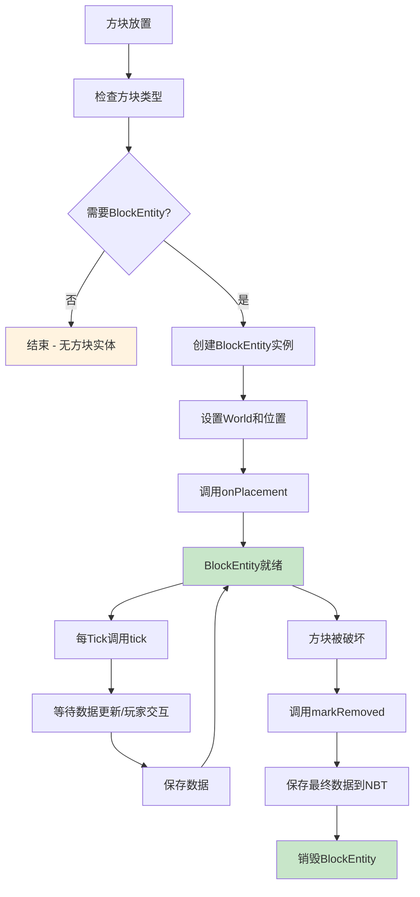

# 第 17 章：方块实体详解（Block Entity）

## 章节目标

通过本章学习，你将掌握：
- BlockEntity（方块实体）的概念和使用场景
- BlockEntity 的生命周期
- BlockEntityType 的注册机制
- NBT 数据持久化
- 客户端同步机制
- 创建自定义 BlockEntity

## 前置知识

建议先阅读：
- [14-方块基础](./15-block-basics.md) - Block 类的基本概念
- [15-方块状态](./16-block-state.md) - BlockState 状态管理

## 核心概念

### BlockEntity = 方块的"记忆"

想象方块实体是方块的**记忆系统**：

```
┌─────────────────────────────────────────────────────────────┐
│              BlockEntity = 方块的"记忆"                          │
├─────────────────────────────────────────────────────────────┤
│                                                              │
│  📦 普通方块                                                │
│     └── 只有 BlockState（无记忆）                             │
│     ├── 石头: 永远是石头                                    │
│     ├── 泥土: 永远是泥土                                    │
│     └── 放哪都一样                                         │
│                                                              │
│  🧠 方块实体                                                │
│     └── 有记忆（BlockEntity）                                │
│     ├── 箱子: 记住里面有什么                                │
│     ├── 熔炉: 记住烧到哪一步                                │
│     ├── 告示牌: 记住写的字                                   │
│     └── 信标: 记住激活等级                                  │
│                                                              │
│  ⚠️ BlockState ≠ BlockEntity                               │
│     BlockState 是"当前状态"，BlockEntity 是"历史数据"          │
│                                                              │
└─────────────────────────────────────────────────────────────┘
```

**关键类比**：
- BlockEntity = 方块携带的数据卡片
- 当方块被放置时创建，破坏时保存数据
- 用于存储 BlockState 无法表示的复杂数据
- 每个方块实体都属于特定类型

---

## 1. BlockEntity 概述

### 1.1 BlockEntity 类结构

```java
73:518:BlockEntity.java
public abstract class BlockEntity
implements RenderDataBlockEntity,
           AttachmentTarget {
    
    // 方块实体类型
    private final BlockEntityType<?> type;
    
    // 所属世界（可能为null）
    @Nullable
    protected World world;
    
    // 方块位置
    protected final BlockPos pos;
    
    // 缓存的方块状态
    private BlockState cachedState;
    
    // 组件数据 (1.21新特性)
    private ComponentMap components = ComponentMap.EMPTY;
}
```

### 1.2 需要 BlockEntity 的场景

```
┌─────────────────────────────────────────────────────────────┐
│                 需要 BlockEntity 的场景                          │
├─────────────────────────────────────────────────────────────┤
│                                                              │
│  场景                              │ 示例                    │
│  ──────────────────────────────────┼─────────────────────  │
│  存储物品/流体                      │ 箱子、熔炉、桶         │
│  存储进度                          │ 酿造台、切石机          │
│  存储文本                          │ 告示牌、箱子名称        │
│  存储红石信号                      │ 比较器、活塞            │
│  存储玩家交互数据                   │ 末影箱、床             │
│  存储特殊状态                      │ 音符盒、命令方块        │
│  存储动画状态                      │ 珊瑚、拴绳             │
│                                                              │
│  ⚠️ 大多数方块不需要 BlockEntity!                           │
│     只有需要存储"超出 BlockState 容量"的数据时才需要           │
│                                                              │
└─────────────────────────────────────────────────────────────┘
```

---

## 2. BlockEntityType 注册

### 2.1 预定义方块实体类型

```java
87:226:BlockEntityType.java
public class BlockEntityType<T extends BlockEntity>
implements FabricBlockEntityType {
    
    // 预定义的方块实体类型
    public static final BlockEntityType<FurnaceBlockEntity> FURNACE = 
        BlockEntityType.create("furnace", 
            Builder.create(FurnaceBlockEntity::new, Blocks.FURNACE));
    
    public static final BlockEntityType<ChestBlockEntity> CHEST = 
        BlockEntityType.create("chest", 
            Builder.create(ChestBlockEntity::new, Blocks.CHEST));
    
    public static final BlockEntityType<TrappedChestBlockEntity> TRAPPED_CHEST = 
        BlockEntityType.create("trapped_chest", 
            Builder.create(TrappedChestBlockEntity::new, Blocks.TRAPPED_CHEST));
    
    // ... 更多预定义类型
}
```

### 2.2 常见方块实体类型

| 类型 | ID | 关联方块 | 用途 |
|------|-----|---------|------|
| FURNACE | furnace | 熔炉 | 存储燃料和烧炼进度 |
| CHEST | chest | 箱子/陷阱箱 | 存储物品 |
| ENDER_CHEST | ender_chest | 末影箱 | 存储玩家私有物品 |
| JUKEBOX | jukebox | 唱片机 | 存储唱片 |
| DISPENSER | dispenser | 发射器/投掷器 | 存储物品 |
| SIGN | sign | 所有告示牌 | 存储文本 |
| MOB_SPAWNER | mob_spawner | 刷怪笼 | 存储刷怪配置 |
| PISTON | piston | 活塞 | 存储推进状态 |
| BEACON | beacon | 信标 | 存储激活等级 |
| HOPPER | hopper | 漏斗 | 存储物品 |
| COMPARATOR | comparator | 比较器 | 存储比较模式 |

---

## 3. BlockEntity 生命周期

### 3.1 创建与销毁

```java
// BlockEntity 创建
public abstract class BlockEntity {
    
    // 构造函数 - 在子类中实现
    protected BlockEntity(BlockEntityType<?> type, BlockPos pos, BlockState state) {
        this.type = type;
        this.pos = pos;
        this.cachedState = state;
    }
    
    // 初始化 - 刚创建时调用
    public void onPlacement() {
        // 子类重写
    }
    
    // 世界设置
    public void setWorld(World world) {
        this.world = world;
    }
    
    // 销毁 - 被移除前调用
    public void markRemoved() {
        this.removed = true;
    }
}
```

### 3.2 Tick 机制

```java
// 方块实体可以接收 tick
public abstract class BlockEntity {
    
    // 每 tick 调用
    public void tick() {
        // 子类重写
    }
    
    // 伪代码: World 每 tick 调用
    for (BlockEntity entity : loadedBlockEntities) {
        if (entity instanceof TickingBlockEntity) {
            ((TickingBlockEntity) entity).tick();
        }
    }
}
```

### 3.3 生命周期流程图



---

## 4. NBT 数据持久化

### 4.1 数据写入

```java
// BlockEntity.java
public final NbtCompound createNbt(RegistryWrapper.WrapperLookup registryLookup) {
    NbtCompound nbt = new NbtCompound();
    this.writeNbt(nbt, registryLookup);
    
    // 1.21 组件系统
    Components.CODEC.encodeStart(registryLookup.getOps(NbtOps.INSTANCE), this.components)
        .resultOrPartial(...)
        .ifPresent(nbt::copyFrom);
    
    return nbt;
}

// 子类重写 writeNbt
public class ChestBlockEntity extends LootableContainerBlockEntity {
    
    @Override
    public void writeNbt(NbtCompound nbt) {
        super.writeNbt(nbt);
        
        // 保存物品栏
        NbtList items = new NbtList();
        for (int i = 0; i < this.inventory.size(); i++) {
            ItemStack stack = this.inventory.getStack(i);
            if (!stack.isEmpty()) {
                NbtCompound itemNbt = new NbtCompound();
                stack.writeNbt(itemNbt);
                itemNbt.putInt("Slot", i);
                items.add(itemNbt);
            }
        }
        nbt.put("Items", items);
        
        // 保存自定义名称
        if (this.customName != null) {
            nbt.putString("CustomName", Text.Serializer.toJson(this.customName));
        }
    }
}
```

### 4.2 数据读取

```java
// BlockEntity.java
public static BlockEntity createFromNbt(BlockPos pos, BlockState state,
    NbtCompound nbt, RegistryWrapper.WrapperLookup registryLookup) {
    
    // 获取类型
    String string = nbt.getString("id");
    Identifier id = Identifier.tryParse(string);
    
    // 获取对应的 BlockEntityType
    BlockEntityType<?> type = BlockEntityType.get(id);
    if (type == null) {
        return null;
    }
    
    // 创建实例
    BlockEntity blockEntity = type.instantiate(pos, state);
    if (blockEntity == null) {
        return null;
    }
    
    // 1.21 组件系统
    if (nbt.contains("components", NbtElement.COMPOUND_TYPE)) {
        Components.CODEC.decodeStart(registryLookup.getOps(NbtOps.INSTANCE), 
            nbt.getCompound("components"))
            .resultOrPartial(...)
            .ifPresent(blockEntity::setComponents);
    }
    
    return blockEntity;
}

// 子类重写 readNbt
public class ChestBlockEntity extends LootableContainerBlockEntity {
    
    @Override
    public void readNbt(NbtCompound nbt) {
        super.readNbt(nbt);
        
        // 读取物品栏
        NbtList items = nbt.getList("Items", NbtElement.COMPOUND_TYPE);
        for (NbtElement element : items) {
            NbtCompound itemNbt = (NbtCompound) element;
            int slot = itemNbt.getInt("Slot");
            if (slot >= 0 && slot < this.inventory.size()) {
                this.inventory.setStack(slot, ItemStack.fromNbt(itemNbt));
            }
        }
        
        // 读取自定义名称
        if (nbt.contains("CustomName", NbtElement.STRING_TYPE)) {
            this.customName = Text.Serializer.fromJson(nbt.getString("CustomName"));
        }
    }
}
```

---

## 5. 客户端同步

### 5.1 同步机制概述

```
客户端 ↔ 服务端 同步流程：

┌─────────────────┐                     ┌─────────────────┐
│     服务端        │                     │     客户端        │
│                 │                     │                 │
│ BlockEntity     │ ──── NBT数据 ─────▶ │ 显示数据         │
│ 更新了数据       │                     │                 │
│                 │                     │                 │
│ 标记为脏         │                     │                 │
│ markDirty()     │                     │                 │
│                 │                     │                 │
└────────┬────────┘                     └────────▲────────┘
         │                                       │
         │        toUpdatePacket()              │
         └───────────────────────────────────────┘
                 BlockEntityUpdateS2CPacket
```

### 5.2 标记更新

```java
public abstract class BlockEntity {
    
    // 标记为脏 - 需要同步
    public void markDirty() {
        this.changed = true;
        
        if (this.world != null) {
            // 标记区块需要保存
            this.world.markChunkDirty(this.pos, this);
            
            // 通知客户端需要更新
            this.world.getChunkManager().markForUpdate(this.pos);
        }
    }
}
```

### 5.3 同步数据包

```java
// BlockEntity 更新包
public class BlockEntity extends ... {
    
    // 创建同步数据包
    @Nullable
    public Packet<ClientPlayPacketListener> toUpdatePacket() {
        return BlockEntityUpdateS2CPacket.create(this);
    }
    
    // 返回初始数据
    public NbtCompound toInitialChunkDataNbt(RegistryWrapper.WrapperLookup registryLookup) {
        return this.createNbt(registryLookup);
    }
}

// 客户端接收并处理
public class ClientPlayPacketListener {
    
    public void onBlockEntityUpdate(BlockEntityUpdateS2CPacket packet) {
        BlockPos pos = packet.getPos();
        NbtCompound nbt = packet.getNbt();
        
        // 获取对应的 BlockEntity
        ClientWorld world = this.world;
        BlockEntity entity = world.getBlockEntity(pos);
        
        if (entity != null) {
            // 更新数据
            entity.fromClientNbt(nbt);
        }
    }
}
```

---

## 6. 创建自定义 BlockEntity

### 6.1 定义方块实体类

```java
// 自定义方块实体
public class MyCustomBlockEntity extends BlockEntity {
    
    // 存储的数据
    private int counter = 0;
    private String message = "";
    
    // 构造函数
    public MyCustomBlockEntity(BlockPos pos, BlockState state) {
        super(ModBlockEntities.MY_CUSTOM, pos, state);
    }
    
    // 写入 NBT
    @Override
    protected void writeNbt(NbtCompound nbt) {
        super.writeNbt(nbt);
        nbt.putInt("Counter", counter);
        nbt.putString("Message", message);
    }
    
    // 读取 NBT
    @Override
    public void readNbt(NbtCompound nbt) {
        super.readNbt(nbt);
        counter = nbt.getInt("Counter");
        message = nbt.getString("Message");
    }
    
    // 每 tick 调用
    @Override
    public void tick() {
        if (world != null && !world.isClient) {
            counter++;
            
            // 每60tick同步一次
            if (counter % 60 == 0) {
                markDirty();
            }
        }
    }
}
```

### 6.2 定义方块实体类型

```java
// 定义方块实体类型
public class MyModBlockEntities {
    
    public static final BlockEntityType<MyCustomBlockEntity> MY_CUSTOM = 
        BlockEntityType.Builder.<MyCustomBlockEntity>create(
            MyCustomBlockEntity::new,   // 工厂方法
            ModBlocks.MY_CUSTOM_BLOCK  // 关联的方块
        )
        .build(null);  // 数据修复器
    
    public static void register() {
        Registry.register(
            Registries.BLOCK_ENTITY_TYPE,
            Identifier.of("mymod", "my_custom"),
            MY_CUSTOM
        );
    }
}
```

### 6.3 定义对应的方块

```java
// 自定义方块（使用 BlockWithEntity）
public class MyCustomBlock extends BlockWithEntity {
    
    public MyCustomBlock(Settings settings) {
        super(settings);
    }
    
    // 创建方块实体
    @Override
    public BlockEntity createBlockEntity(BlockPos pos, BlockState state) {
        return new MyCustomBlockEntity(pos, state);
    }
    
    // 放置时的逻辑
    @Override
    public BlockState getPlacementState(BlockPlacementContext context) {
        return this.getDefaultState();
    }
    
    // 交互逻辑
    @Override
    public ActionResult onUse(BlockState state, World world, BlockPos pos,
                             PlayerEntity player, Hand hand, BlockHitResult hit) {
        if (!world.isClient) {
            // 获取方块实体
            MyCustomBlockEntity entity = (MyCustomBlockEntity) world.getBlockEntity(pos);
            
            // 增加计数器
            entity.incrementCounter();
            entity.markDirty();
            
            // 发送消息
            player.sendMessage(Text.literal("计数器: " + entity.getCounter()));
        }
        return ActionResult.SUCCESS;
    }
}
```

---

## 7. BlockEntity 与组件系统

### 7.1 1.21 组件集成

```java
// 1.21 引入的组件系统
public abstract class BlockEntity implements ComponentHolder {
    
    private ComponentMap components = ComponentMap.EMPTY;
    
    @Override
    public ComponentMap getComponents() {
        return components;
    }
    
    @Override
    public <T> T get(ComponentType<T> type) {
        return components.get(type);
    }
    
    @Override
    public <T> T set(ComponentType<T> type, @Nullable T value) {
        // 创建新的组件映射
        return null;
    }
}
```

### 7.2 组件使用示例

```java
// 使用组件存储数据
public class MyBlockEntity extends BlockEntity {
    
    public void setEnergy(int amount) {
        this.set(DataComponentTypes.CUSTOM_DATA, 
            CustomData.builder()
                .add("energy", IntComponent.of(amount))
                .build()
        );
    }
    
    public int getEnergy() {
        CustomData data = this.get(DataComponentTypes.CUSTOM_DATA);
        if (data != null) {
            return data.getInt("energy").orElse(0);
        }
        return 0;
    }
}
```

---

## 8. 性能注意事项

### 8.1 性能陷阱

```
BlockEntity 性能注意事项：

┌─────────────────────────────────────────────────────────────┐
│  ⚠️ 不要在 tick() 中执行耗时操作                            │
│     - 大量计算                                              │
│     - 文件 I/O                                              │
│     - 网络请求                                              │
├─────────────────────────────────────────────────────────────┤
│  ⚠️ 不要创建大量 BlockEntity                                │
│     - 每个 BlockEntity 都有内存开销                          │
│     - 考虑使用区域存储而非每个方块存储                       │
├─────────────────────────────────────────────────────────────┤
│  ⚠️ 频繁标记脏更新会影响性能                                 │
│     - 合并多次更新为一次                                     │
│     - 使用定时同步而非每帧同步                               │
├─────────────────────────────────────────────────────────────┤
│  ✅ 使用 @OnlyIn 确保只在正确端执行                          │
└─────────────────────────────────────────────────────────────┘
```

### 8.2 优化建议

```java
// 优化: 合并多次更新
public class OptimizedBlockEntity extends BlockEntity {
    
    private boolean needsSync = false;
    private int syncCooldown = 0;
    
    @Override
    public void tick() {
        if (world != null && !world.isClient) {
            syncCooldown--;
            
            if (needsSync && syncCooldown <= 0) {
                markDirty();
                needsSync = false;
                syncCooldown = 20;  // 1秒冷却
            }
        }
    }
    
    // 调用此方法而非直接 markDirty()
    public void scheduleSync() {
        needsSync = true;
    }
}
```

---

## 9. 关键源码文件

| 文件 | 路径 | 说明 |
|-----|------|-----|
| `BlockEntity.java` | `net.minecraft.block.entity.BlockEntity` | 方块实体基类 |
| `BlockEntityType.java` | `net.minecraft.block.entity.BlockEntityType` | 方块实体类型 |
| `BlockEntityUpdateS2CPacket.java` | `net.minecraft.network.packet.s2c.play.BlockEntityUpdateS2CPacket` | 同步包 |
| `LootableContainerBlockEntity.java` | `net.minecraft.block.entity.LootableContainerBlockEntity` | 物品容器基类 |
| `FurnaceBlockEntity.java` | `net.minecraft.block.entity.FurnaceBlockEntity` | 熔炉示例 |
| `ChestBlockEntity.java` | `net.minecraft.block.entity.ChestBlockEntity` | 箱子示例 |

---

## 课后自查

完成本章学习后，请检查你是否理解：

- [ ] BlockEntity 与 BlockState 的区别
- [ ] 需要 BlockEntity 的典型场景
- [ ] BlockEntity 的生命周期
- [ ] NBT 数据持久化
- [ ] 客户端同步机制
- [ ] 如何创建自定义 BlockEntity

---

## 延伸阅读

- [17-物品基础](./18-item-basics.md) - Item 类的基本概念
- [18-ItemStack物品堆叠](./19-item-stack.md) - ItemStack 的使用
- [19-组件系统](./20-item-component.md) - 1.21 新组件系统
