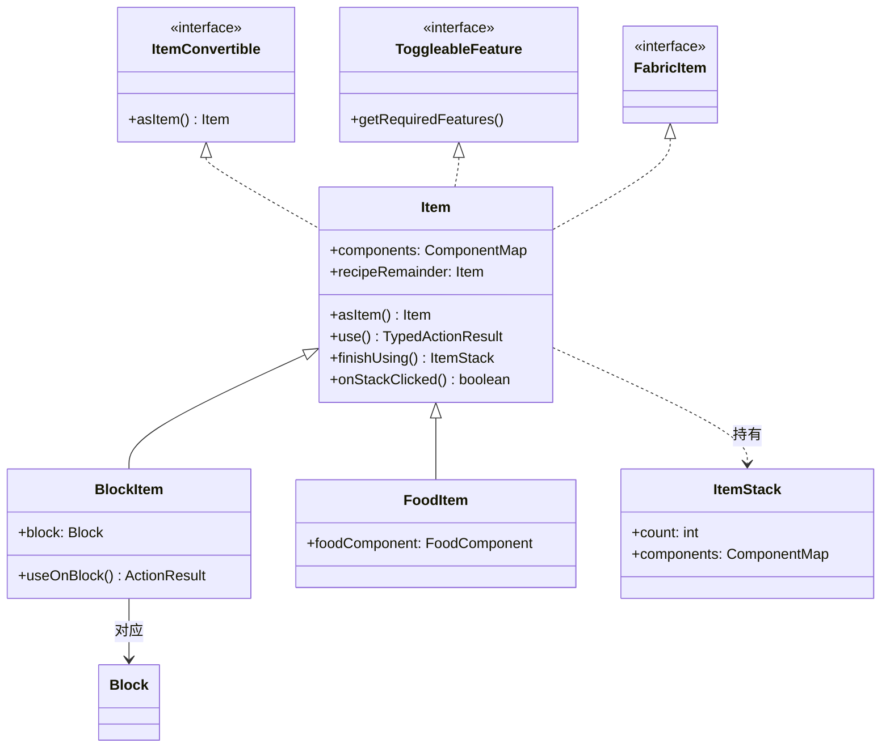
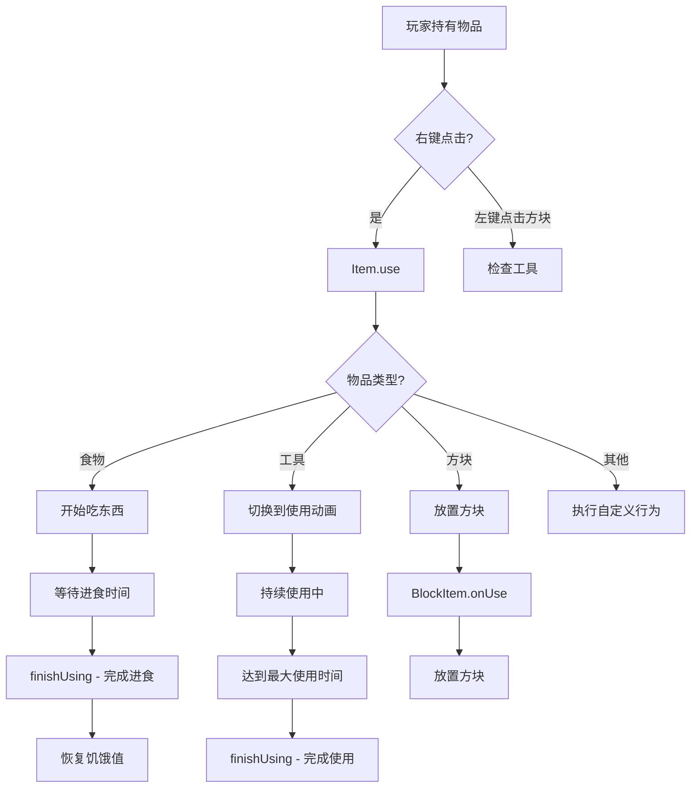

# 17 - Item 类：物品的基础

## 目标

学完本章节后，你将理解：
- Item 类是什么（玩家可以持有/使用的物品）
- Item vs BlockItem（物品和方块物品的区别）
- 物品的基本属性设置
- ItemGroup（创造模式物品栏分类）

## 前置知识

- 理解 [Block 基础](./14-block-basics.md)
- 了解 Java 继承和多态概念

## 核心概念（用生活比喻）

### Item 类是什么？

**物品（Item）** = 玩家可以**拿在手里**的东西

| 物品 | 能做什么 |
|------|----------|
| 苹果 | 吃（恢复饥饿值） |
| 钻石剑 | 攻击生物 |
| 橡木原木 | 可以放置变成方块 |
| 桶 | 装水/倒水 |

**简单区分**：
- **可以放置的物品** = 方块对应的物品 = **BlockItem**
- **不能放置的物品** = 纯物品 = **Item**

### Item vs BlockItem

```
Item (物品基类)
    │
    ├── 食物 (FoodItem)
    │   └── 苹果、金萝卜、蛋糕...
    │
    ├── 工具 (DiggerItem / SwordItem)
    │   └── 镐子、斧头、剑...
    │
    └── BlockItem (方块物品)
            │
            └── 石头、木头、泥土...
                │
                ├── 对应一个 Block
                └── 可以放置到世界中
```

### 生活中的比喻

想象你在超市买东西：

```
┌─────────────────────────────────────┐
│                                     │
│  物品 (Item)                        │
│    │                                │
│    ├── 可以吃的 = 食物               │
│    │   └── 有饱腹度、恢复生命效果     │
│    │                                │
│    ├── 可以用的 = 工具               │
│    │   └── 有耐久度、攻击/挖掘加成   │
│    │                                │
│    └── 可以放的 = BlockItem          │
│        └── 对应一个方块              │
│                                     │
└─────────────────────────────────────┘
```

### Item 类的关键特性

| 特性 | 说明 | 例子 |
|------|------|------|
| **maxCount** | 最大堆叠数 | 64（普通物品）/ 1（工具） |
| **maxDamage** | 最大耐久度 | 工具武器有耐久度 |
| **food** | 食物组件 | 苹果、金胡萝卜 |
| **rarity** | 稀有度颜色 | 普通/优秀/稀有/史诗 |
| **fireproof** | 防火 | 打火石、岩浆桶 |

## 图解（Mermaid）

### Item 继承关系图



### 物品使用流程图



## 核心代码

### 创建简单的物品

```java
public class MyMod implements ModInitializer {
    
    // 1. 基础物品（无特殊功能）
    public static final Item MY_ITEM = Registry.register(
        Registries.ITEM,
        Identifier.of("mymod", "my_item"),
        new Item(new Item.Settings()
            .maxCount(64)  // 最大堆叠64个
        )
    );
    
    // 2. 有耐久度的物品
    public static final Item MY_TOOL = Registry.register(
        Registries.ITEM,
        Identifier.of("mymod", "my_tool"),
        new Item(new Item.Settings()
            .maxDamage(100)  // 100点耐久
        )
    );
    
    // 3. 食物物品（直接使用食物组件）
    public static final Item MY_FOOD = Registry.register(
        Registries.ITEM,
        Identifier.of("mymod", "my_food"),
        new Item(new Item.Settings()
            .food(new FoodComponent.Builder()
                .hunger(4)      // 恢复4点饥饿
                .saturationModifier(2.0f)  // 饱和度加成
                .meat()         // 狼可以吃
                .alwaysEdible() // 饱腹时也能吃
                .build()
            )
        )
    );
    
    @Override
    public void onInitialize() {
        // 物品已注册
    }
}
```

### Item.Settings 常用配置

```java
// 1. 普通物品（默认64个堆叠）
new Item.Settings()

// 2. 工具类（只能堆叠1个，有耐久度）
new Item.Settings()
    .maxCount(1)
    .maxDamage(250)  // 钻石耐久

// 3. 稀有度设置（影响名称颜色）
new Item.Settings()
    .rarity(Rarity.RARE)   // 蓝色
    .rarity(Rarity.EPIC)   // 紫色

// 4. 防火物品（不会被岩浆烧毁）
new Item.Settings()
    .fireproof()

// 5. 合成后保留物品
new Item.Settings()
    .recipeRemainder(Items.BUCKET)  // 用桶装牛奶后保留空桶

// 6. 组合耐力加成
new Item.Settings()
    .food(new FoodComponent.Builder()
        .hunger(10)
        .saturationModifier(10f)
        .snack()
        .build()
    )
```

### 自定义物品行为

```java
// 创建有自定义行为的物品
public class MagicWandItem extends Item {
    
    public MagicWandItem(Settings settings) {
        super(settings);
    }
    
    // 右键使用物品
    @Override
    public TypedActionResult<ItemStack> use(World world, PlayerEntity player, Hand hand) {
        if (!world.isClient) {
            // 在服务端执行逻辑
            
            // 造成闪电伤害
            LightningEntity lightning = new LightningEntity(
                EntityType.LIGHTNING_BOLT, world);
            lightning.setPosition(player.getX(), player.getY(), player.getZ());
            world.spawnEntity(lightning);
            
            // 消耗物品耐久
            ItemStack stack = player.getStackInHand(hand);
            stack.damage(1, player, EquipmentSlot.MAINHAND);
        }
        
        return TypedActionResult.success(player.getStackInHand(hand));
    }
    
    // 物品在背包中每tick被调用
    @Override
    public void inventoryTick(ItemStack stack, World world, 
                             Entity entity, int slot, boolean selected) {
        if (entity instanceof PlayerEntity player && selected) {
            // 玩家手持这个物品时发光
            player.addStatusEffect(new StatusEffectInstance(
                StatusEffects.GLOWING, 20, 0));
        }
    }
}
```

### BlockItem（方块对应的物品）

```java
// BlockItem 会自动创建对应的物品
// 大多数情况下，Minecraft 会自动为注册的方块创建物品
// 但你也可以手动创建

// 1. 自动生成（推荐）
// 注册 Block 时，Minecraft 会自动注册对应的 BlockItem

// 2. 手动创建（需要自定义行为时）
public static final Block MY_CUSTOM_BLOCK = new Block(...);
public static final BlockItem MY_CUSTOM_BLOCK_ITEM = Registry.register(
    Registries.ITEM,
    Identifier.of("mymod", "my_custom_block"),
    new BlockItem(MY_CUSTOM_BLOCK, new Item.Settings()) {
        // 自定义放置行为
        @Override
        public ActionResult useOnBlock(ItemUsageContext context) {
            // 可以在放置前做特殊检查
            World world = context.getWorld();
            BlockPos pos = context.getBlockPos();
            
            // 例如：检查是否在水中
            if (world.getBlockState(pos).getFluidState().isOf(Fluids.WATER)) {
                return ActionResult.FAIL;  // 阻止放置
            }
            
            return super.useOnBlock(context);
        }
    }
);
```

### ItemGroup（创造模式物品栏）

```java
// 创建自定义物品栏分类
public static final ItemGroup MY_ITEM_GROUP = ItemGroup.create(
    Identifier.of("mymod", "my_tab")
)
    .displayName(Text.literal("我的物品"))
    .icon(() -> new ItemStack(MY_ITEM))
    .entries((displayContext, entries) -> {
        // 添加物品到分类
        entries.add(MY_ITEM);
        entries.add(MY_TOOL);
        entries.add(MY_FOOD);
    });

// 或者添加到现有分类
Registry.register(Registries.ITEM_GROUP, 
    Identifier.of("mymod", "my_tab"), 
    MY_ITEM_GROUP);
```

## 实战演示

### 案例：创建一个"修复图纸"

```java
public class RepairBlueprintItem extends Item {
    
    public RepairBlueprintItem(Settings settings) {
        super(settings);
    }
    
    @Override
    public TypedActionResult<ItemStack> use(World world, PlayerEntity player, Hand hand) {
        ItemStack blueprint = player.getStackInHand(hand);
        
        if (world.isClient) {
            return TypedActionResult.pass(blueprint);
        }
        
        // 获取主手的物品
        ItemStack mainHandItem = player.getMainStack();
        
        if (mainHandItem.isEmpty()) {
            player.sendMessage(Text.literal("请在主手拿一个物品！"));
            return ActionResult.FAIL;
        }
        
        if (!mainHandItem.isDamageable()) {
            player.sendMessage(Text.literal("这个物品不能被修复！"));
            return ActionResult.FAIL;
        }
        
        // 修复物品（恢复50%耐久）
        int maxDamage = mainHandItem.getMaxDamage();
        int currentDamage = mainHandItem.getDamage();
        int repairAmount = maxDamage / 2;
        mainHandItem.setDamage(Math.max(0, currentDamage - repairAmount));
        
        // 消耗图纸
        blueprint.decrement(1);
        
        player.sendMessage(Text.literal("物品已修复！"));
        return ActionResult.SUCCESS;
    }
}
```

## 小结

1. **Item 类** = 玩家可以持有的物品
2. **BlockItem** = 专门用于放置方块的 Item 子类
3. 物品属性通过 `Item.Settings` 配置
4. 常见物品类型：
   - 普通物品（可堆叠）
   - 工具（单格、有耐久）
   - 食物（可食用）
5. 自定义行为通过重写 `use()` 等方法实现
6. ItemGroup 用于在创造模式物品栏中分类显示

## 练习

1. 创建一个可以无限使用的"火把"
2. 创建一个吃下去会获得随机效果的"魔法糖果"
3. 思考：为什么岩浆桶使用后会保留空桶？
4. 进阶：创建一个可以存储药水效果的"药水瓶子"

### 源码文件位置

| 文件 | 源码路径 | 说明 |
|------|----------|------|
| Item.java | `net/minecraft/item/Item.java` | 物品基类 |
| Items.java | `net/minecraft/item/Items.java` | 所有原版物品定义 |
| BlockItem.java | `net/minecraft/item/BlockItem.java` | 方块物品 |
| ItemGroup.java | `net/minecraft/creative/ItemGroup.java` | 创造模式物品栏 |

## 相关链接

- [Block 基础](./14-block-basics.md)
- [BlockEntity](./16-block-entity.md)
- [ItemStack 下一章](./18-item-stack.md)
