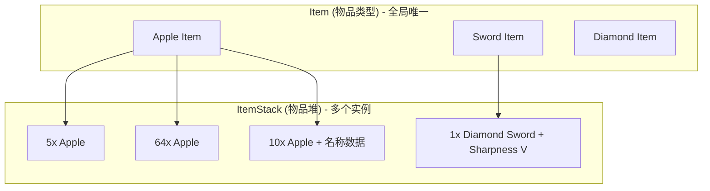
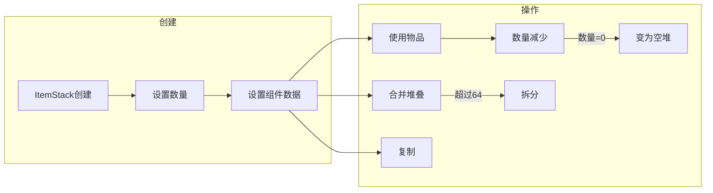
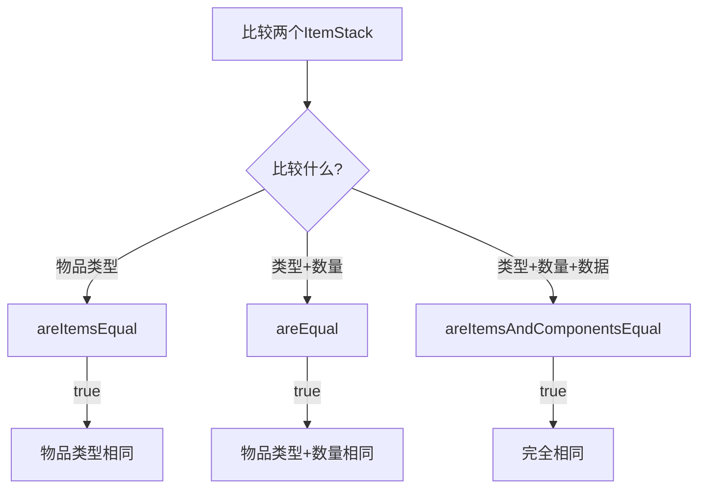

# 18 - ItemStack：物品堆叠

## 目标

学完本章节后，你将理解：
- ItemStack 是什么（带有数量和数据的物品）
- ItemStack 和 Item 的关系
- 物品数量限制和耐久度管理
- 物品复制和比较

## 前置知识

- 理解 [Item 基础](./17-item-basics.md)
- 了解 Java 基本类型和对象

## 核心概念（用生活比喻）

### ItemStack 是什么？

**ItemStack（物品堆）** = **物品类型** + **数量** + **附加数据**

想象你在背包里放东西：
- **Item（物品类型）** = 这是一堆"苹果"
- **ItemStack（物品堆）** = 这一堆有 **5个** 苹果
- **附加数据** = 这5个苹果是 **附魔附魔金苹果**

```
┌─────────────────────────────────────┐
│                                     │
│  背包中的一个格子                     │
│                                     │
│  ItemStack（物品堆）                 │
│  ├── Item: 苹果                      │
│  ├── Count: 5                       │
│  └── Components:                    │
│      ├── 附魔: 保护 I              │
│      └── 自定义名称: "金苹果"        │
│                                     │
└─────────────────────────────────────┘
```

### Item vs ItemStack

| 概念 | Item | ItemStack |
|------|------|-----------|
| **定义** | 物品的"类型" | 具体的物品"实例" |
| **数量** | 只有一种 | 有具体数量 |
| **数据** | 无 | 有附加数据（附魔、自定义名称等） |
| **比喻** | "苹果"的概念 | "5个苹果" |
| **全局** | 只有一个实例 | 可以有很多实例 |

```
Item（苹果种类 - 只有一个）
    │
    └── ItemStack（具体苹果）
        ├── 1个苹果
        ├── 5个苹果 ← 不同数量
        ├── 5个附魔金苹果 ← 有附魔数据
        └── 1个名为"毒苹果"的苹果 ← 有名称数据
```

### 重要特性

1. **最大堆叠数**：大多数物品最多64个
2. **耐久度**：工具类物品最多1个，有耐久度属性
3. **不可变比较**：不要用 `==` 比较 ItemStack，要用 `isOf()` 或 `areEqual()`

## 图解（Mermaid）

### Item 和 ItemStack 的关系图



### ItemStack 生命周期图



### 物品比较方法图



## 核心代码

### 创建 ItemStack

```java
// 1. 从 Item 创建
ItemStack stack1 = new ItemStack(Items.DIAMOND);
// 数量为1

// 2. 指定数量
ItemStack stack2 = new ItemStack(Items.DIAMOND, 16);
// 16个钻石

// 3. 从 Block 创建
ItemStack stack3 = new ItemStack(Blocks.STONE);
// 对应石头的物品

// 4. 从另一个 ItemStack 复制
ItemStack stack4 = stack1.copy();
// 完全相同的副本
```

### ItemStack 基本操作

```java
// 1. 数量操作
ItemStack stack = new ItemStack(Items.DIAMOND, 32);

stack.getCount();          // 获取数量: 32
stack.setCount(10);        // 设置数量: 10
stack.increment(5);        // 增加5个: 15
stack.decrement(3);        // 减少3个: 12

// 2. 判断是否为空
stack.isEmpty();           // 是否为空
!stack.isEmpty()          // 是否有物品

// 3. 获取物品类型
stack.getItem();          // 获取Item: Diamond Item
stack.isOf(Items.DIAMOND); // 是否是钻石

// 4. 复制
ItemStack copy = stack.copy();           // 完整复制
ItemStack copyCount = stack.copyWithCount(5); // 复制指定数量
```

### 耐久度管理

```java
// 有耐久度的物品
ItemStack sword = new ItemStack(Items.DIAMOND_SWORD, 1);

// 获取耐久信息
sword.getMaxDamage();    // 最大耐久度: 1561
sword.getDamage();       // 当前损坏值
sword.isDamaged();       // 是否已损坏

// 设置/修改耐久
sword.setDamage(500);    // 设置损坏值
sword.getDamage();       // 返回: 500

// 消耗耐久（造成伤害）
sword.damage(1, player, EquipmentSlot.MAINHAND);
// 当耐久耗尽，物品会消失

// 检查耐久相关
sword.isDamageable();     // 是否可损坏
sword.isDamaged();       // 是否已损坏
```

### 物品比较

```java
ItemStack stack1 = new ItemStack(Items.DIAMOND, 10);
ItemStack stack2 = new ItemStack(Items.DIAMOND, 10);
ItemStack stack3 = new ItemStack(Items.DIAMOND, 5);
ItemStack stack4 = new ItemStack(Items.IRON_INGOT, 10);

// 1. 比较物品类型（忽略数量和数据）
ItemStack.areItemsEqual(stack1, stack2);  // true
ItemStack.areItemsEqual(stack1, stack3);   // true（类型相同）
ItemStack.areItemsEqual(stack1, stack4);   // false（类型不同）

// 2. 比较类型+数量（忽略其他数据）
ItemStack.areEqual(stack1, stack2);        // true
ItemStack.areEqual(stack1, stack3);        // false（数量不同: 10 vs 5）

// 3. 完全比较（类型+数量+所有组件）
ItemStack.areItemsAndComponentsEqual(stack1, stack2);  // true

// 4. 使用 isOf（推荐用于检查物品类型）
stack1.isOf(Items.DIAMOND);                 // true
stack4.isOf(Items.DIAMOND);                 // false

// ⚠️ 重要：不要用 == 比较！
stack1 == stack2   // ❌ 错误！比较的是引用，不是内容
```

### 物品拆分和合并

```java
ItemStack stack = new ItemStack(Items.DIAMOND, 32);

// 拆分（从原堆移除指定数量，返回新的ItemStack）
ItemStack split = stack.split(10);
// stack 现在有 22 个
// split 有 10 个

// 安全拆分（如果数量不足，只返回实际存在的数量）
ItemStack safeSplit = stack.split(100);
// safeSplit 最多有 stack 原有的数量

// 复制清空（复制内容后清空原堆）
ItemStack transfer = stack.copyAndEmpty();
// transfer 有原 stack 的内容
// stack 现在为空

// 合并（需要手动处理）
ItemStack target = new ItemStack(Items.DIAMOND, 50);
ItemStack source = new ItemStack(Items.DIAMOND, 20);

// 尝试合并
int toTransfer = Math.min(source.getCount(), target.getMaxCount() - target.getCount());
if (toTransfer > 0) {
    target.increment(toTransfer);
    source.decrement(toTransfer);
}
```

### 物品组件操作（1.21新版）

```java
ItemStack stack = new ItemStack(Items.DIAMOND_SWORD);

// 设置组件
stack.set(DataComponentTypes.ENCHANTMENTS, 
    new ItemEnchantmentsComponent(Map.of(
        Enchantments.SHARPNESS, 5
    ))
);

// 获取组件
ItemEnchantmentsComponent enchants = stack.get(DataComponentTypes.ENCHANTMENTS);

// 检查组件
if (stack.contains(DataComponentTypes.ENCHANTMENTS)) {
    // 有附魔
}

// 移除组件
stack.remove(DataComponentTypes.ENCHANTMENTS);

// 自定义名称
stack.set(DataComponentTypes.CUSTOM_NAME, Text.literal("我的钻石剑"));
stack.get(DataComponentTypes.CUSTOM_NAME);  // 获取自定义名称
```

### NBT 序列化（存档）

```java
// 保存到 NBT
NbtCompound nbt = new NbtCompound();
stack.encode(registryLookup, nbt);

// 从 NBT 加载
RegistryWrapper.WrapperLookup registries = ...;
Optional<ItemStack> loaded = ItemStack.fromNbt(registries, nbt);
loaded.ifPresent(s -> {
    // 使用加载的物品
});

// 或者使用简便方法
ItemStack fromNbt = ItemStack.fromNbtOrEmpty(registries, nbt);
```

## 实战演示

### 案例：创建物品交易系统

```java
public class TradeManager {
    
    public static boolean trade(PlayerEntity player, ItemStack cost, ItemStack reward) {
        // 检查玩家背包
        Inventory inventory = player.getInventory();
        
        // 查找是否有足够的支付物品
        for (int i = 0; i < inventory.size(); i++) {
            ItemStack slot = inventory.getStack(i);
            
            if (ItemStack.areItemsEqual(slot, cost)) {
                // 找到了匹配物品
                int haveCount = slot.getCount();
                int needCount = cost.getCount();
                
                if (haveCount >= needCount) {
                    // 扣除支付物品
                    slot.decrement(needCount);
                    
                    // 添加奖励物品（先尝试合并到已有堆）
                    ItemStack remaining = inventory.addStack(reward.copy());
                    
                    // 如果背包满了，在玩家脚下生成
                    if (!remaining.isEmpty()) {
                        Block.dropStack(player.getWorld(), player.getBlockPos(), remaining);
                    }
                    
                    return true;
                }
            }
        }
        
        return false; // 物品不足
    }
}
```

### 案例：耐久度检查和处理

```java
public class ToolChecker {
    
    public static boolean isToolUsable(ItemStack tool, int minDurability) {
        if (tool.isEmpty() || !tool.isDamageable()) {
            return false;
        }
        
        int remaining = tool.getMaxDamage() - tool.getDamage();
        return remaining >= minDurability;
    }
    
    public static void repairTool(ItemStack tool, int amount) {
        if (!tool.isDamageable()) return;
        
        int newDamage = Math.max(0, tool.getDamage() - amount);
        tool.setDamage(newDamage);
    }
    
    public static ItemStack damageAndBreak(ItemStack tool, int amount, 
                                          LivingEntity holder, 
                                          EquipmentSlot slot) {
        // 造成伤害并检查是否损坏
        tool.damage(amount, holder, slot);
        
        // 如果物品损坏（耐久耗尽），返回空
        if (tool.isEmpty()) {
            return ItemStack.EMPTY;
        }
        
        return tool;
    }
}
```

## 小结

1. **ItemStack** = Item（物品类型）+ Count（数量）+ Components（数据）
2. 数量通过 `getCount()`/`setCount()` 操作
3. 耐久度通过 `getDamage()`/`setDamage()`/`damage()` 操作
4. 比较使用 `isOf()`、`areItemsEqual()`、`areEqual()`，**不要用 `==`**
5. 拆分用 `split()`，复制用 `copy()`
6. 组件（1.21新）用于存储附魔、名称等数据

## 练习

1. 创建一个函数，检查玩家背包是否有足够的指定物品
2. 创建一个函数，自动将两个可堆叠的 ItemStack 合并
3. 思考：为什么耐久工具最大堆叠是1？
4. 进阶：创建一个"物品复制"功能，消耗经验等级来复制物品

### 源码文件位置

| 文件 | 源码路径 | 说明 |
|------|----------|------|
| ItemStack.java | `net/minecraft/item/ItemStack.java` | 物品堆叠 |
| DataComponentTypes.java | `net/minecraft/component/DataComponentTypes.java` | 组件类型(1.21) |

## 相关链接

- [Item 基础](./17-item-basics.md)
- [物品组件（1.21新）下一章](./19-item-component.md)
- [BlockEntity 中的物品存储](./16-block-entity.md)
