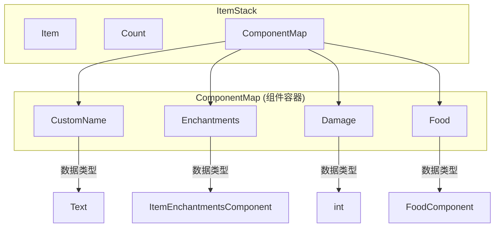
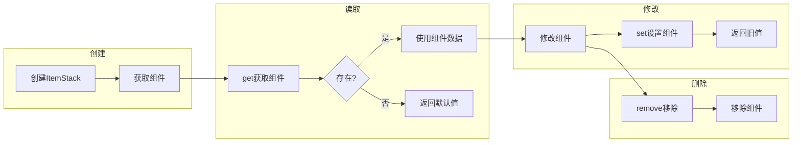

# 19 - ComponentMap：1.21新版物品数据系统

## 目标

学完本章节后，你将理解：
- ComponentMap 是什么（Minecraft 1.21 引入的新系统）
- 组件（Component）和旧版 NBT 的区别
- 常见的组件类型及其用途
- 如何在 ItemStack 中使用组件

## 前置知识

- 理解 [ItemStack](./18-item-stack.md)
- 了解基本的 Java 泛型和接口概念

## 核心概念（用生活比喻）

### 什么是 Component（组件）？

在 Minecraft 1.21 之前，物品的数据存储用的是 **NBT（Named Binary Tag）** 系统。现在，Minecraft 引入了一个更现代化的系统：**Component（组件）**。

**旧版（NBT）**：用文件夹和文件来存储数据

```
物品数据（NBT）
├── display
│   ├── Name: "金苹果"
│   └── Lore: ["传说中...", "增加生命"]
├── ench
│   ├── {id: 0, lvl: 1}
│   └── {id: 1, lvl: 2}
└── Damage: 0
```

**新版（Component）**：用结构化标签来存储

```
ItemStack.components
├── CustomName: Text("金苹果")
├── Lore: [Text("传说中..."), Text("增加生命")]
├── Enchantments: {protection: 1, sharpness: 2}
└── Damage: 0
```

### 为什么要用 Component？

| 对比项 | NBT（旧） | Component（新） |
|--------|-----------|-----------------|
| **类型安全** | 需要手动解析 | 编译时检查 |
| **默认值** | 需要手动处理 | 自动处理 |
| **性能** | 每次都要序列化 | 可以缓存 |
| **可读性** | 字符串键 | 类型化访问 |
| **验证** | 运行时检查 | 编译时检查 |

### 生活中的比喻

想象图书馆的书：

- **NBT 方式**：把所有书都放在一个大箱子里，贴上各种纸条标签，找东西要一个个翻
- **Component 方式**：每个书架有固定的分类（小说区、漫画区、杂志区），每本书自带作者、页数、分类标签

### ComponentMap 是什么？

**ComponentMap** = 存储组件的"容器"

```java
// ItemStack 持有一个 ComponentMap
ItemStack stack = new ItemStack(Items.DIAMOND_SWORD);
// stack.components 是这个物品堆的所有组件
```

## 图解（Mermaid）

### Component 系统架构图



### 组件操作流程图



## 核心代码

### DataComponentTypes 常用类型

```java
// 位置: net.minecraft.component.DataComponentTypes

// 1. 自定义名称
DataComponentTypes.CUSTOM_NAME      // Text
DataComponentTypes.ITEM_NAME        // Text

// 2. 附魔相关
DataComponentTypes.ENCHANTMENTS     // ItemEnchantmentsComponent
DataComponentTypes.STORED_ENCHANTMENTS  // ItemEnchantmentsComponent
DataComponentTypes.ENCHANTMENT_GLINT_OVERRIDE // Boolean

// 3. 耐久度相关
DataComponentTypes.DAMAGE          // int (当前损坏值)
DataComponentTypes.MAX_DAMAGE       // int (最大耐久)
DataComponentTypes.UNBREAKABLE     // Unit (无耐久限制标记)

// 4. 食物相关
DataComponentTypes.FOOD             // FoodComponent
DataComponentTypes.CONSUMABLE      // ConsumableComponent

// 5. 工具相关
DataComponentTypes.TOOL            // ToolComponent
DataComponentTypes.BROKEN          // Unit (已损坏标记)

// 6. 桶类
DataComponentTypes.BUCKET_CONTENTS  // Fluid

// 7. 其他
DataComponentTypes.LORE            // List<Text>
DataComponentTypes.RARITY          // Rarity
DataComponentTypes.HIDE_TOOLTIP    // Unit
```

### 在 ItemStack 中使用组件

```java
// 1. 获取组件
ItemStack stack = new ItemStack(Items.DIAMOND_SWORD);

// 获取附魔组件
ItemEnchantmentsComponent enchants = stack.get(DataComponentTypes.ENCHANTMENTS);

// 安全获取（不存在时返回默认值）
int damage = stack.getOrDefault(DataComponentTypes.DAMAGE, 0);

// 检查组件是否存在
if (stack.contains(DataComponentTypes.ENCHANTMENTS)) {
    // 有附魔
}

// 2. 设置组件
stack.set(DataComponentTypes.DAMAGE, 100);  // 设置损坏值
stack.set(DataComponentTypes.CUSTOM_NAME, Text.literal("我的钻石剑"));
stack.set(DataComponentTypes.UNBREAKABLE, Unit.INSTANCE);  // 设置为不可破坏

// 3. 移除组件
stack.remove(DataComponentTypes.ENCHANTMENTS);  // 移除所有附魔
stack.remove(DataComponentTypes.CUSTOM_NAME);  // 移除自定义名称
```

### 创建带组件的 ItemStack

```java
// 方法1：创建后设置
ItemStack stack = new ItemStack(Items.DIAMOND_SWORD);
stack.set(DataComponentTypes.ENCHANTMENTS, 
    new ItemEnchantmentsComponent(Map.of(
        Enchantments.SHARPNESS, 5,
        Enchantments.FIRE_ASPECT, 2
    ))
);
stack.set(DataComponentTypes.CUSTOM_NAME, Text.literal("附魔剑"));

// 方法2：在 Item 定义默认组件
public static final Item MY_ITEM = Registry.register(
    Registries.ITEM,
    Identifier.of("mymod", "my_item"),
    new Item(new Item.Settings()
        .component(DataComponentTypes.RARITY, Rarity.EPIC)  // 默认稀有度
        .component(DataComponentTypes.CUSTOM_NAME, 
            Text.literal("史诗物品"))
    )
);
```

### 组件修改器（高级）

```java
// 使用 apply 方法进行链式修改
ItemStack stack = new ItemStack(Items.DIAMOND_SWORD);

// 添加附魔（不覆盖现有附魔）
stack.apply(DataComponentTypes.ENCHANTMENTS, 
    ItemEnchantmentsComponent.DEFAULT,     // 默认空附魔
    Map.of(Enchantments.SHARPNESS, 3),    // 要添加的附魔
    (existing, additions) -> {
        // 合并附魔
        Map<RegistryEntry<Enchantment>, Integer> merged = 
            new java.util.HashMap<>(existing.asMap());
        additions.forEach((ench, lvl) -> 
            merged.merge(ench, lvl, Integer::max));
        return new ItemEnchantmentsComponent(merged);
    }
);

// 移除附魔
stack.apply(DataComponentTypes.ENCHANTMENTS,
    ItemEnchantmentsComponent.DEFAULT,
    Set.of(Enchantments.SHARPNESS),       // 要移除的附魔类型
    (existing, removals) -> {
        Map<RegistryEntry<Enchantment>, Integer> filtered = 
            new java.util.HashMap<>(existing.asMap());
        removals.forEach(filtered::remove);
        return new ItemEnchantmentsComponent(filtered);
    }
);
```

### 创建自定义组件类型（进阶）

```java
// 1. 定义组件类型
public static final ComponentType<MyData> MY_DATA = 
    ComponentType.<MyData>builder()
        .codec(MyData.CODEC)  // 序列化编解码器
        .build();

// 2. 创建组件值类
public class MyData {
    public static final MapCodec<MyData> CODEC = RecordCodecBuilder.mapCodec(
        instance -> instance.group(
            Codecs.VAR_INT.fieldOf("value").forGetter(MyData::value),
            Codec.STRING.fieldOf("name").forGetter(MyData::name)
        ).apply(instance, MyData::new)
    );
    
    private final int value;
    private final String name;
    
    public MyData(int value, String name) {
        this.value = value;
        this.name = name;
    }
    
    public int value() { return value; }
    public String name() { return name; }
}

// 3. 在 ItemStack 中使用
ItemStack stack = new ItemStack(Items.DIAMOND);
stack.set(MY_DATA, new MyData(42, "答案"));
```

## 常见组件详解

### 附魔组件

```java
ItemStack enchantedBook = new ItemStack(Items.ENCHANTED_BOOK);

// 获取附魔
ItemEnchantmentsComponent enchants = enchantedBook.get(
    DataComponentTypes.STORED_ENCHANTMENTS);

// 遍历附魔
for (Map.Entry<RegistryEntry<Enchantment>, Integer> entry : 
    enchants.getEnchantmentMap().entrySet()) {
    Enchantment enchant = entry.getKey().value();
    int level = entry.getValue();
    System.out.println(enchant.getTranslationKey() + " " + level);
}

// 添加附魔
enchantedBook.set(DataComponentTypes.STORED_ENCHANTMENTS,
    new ItemEnchantmentsComponent(Map.of(
        Enchantments.MENDING, 1
    ))
);
```

### 食物组件

```java
ItemStack stack = new ItemStack(Items.GOLDEN_APPLE);

// 获取食物数据
FoodComponent food = stack.get(DataComponentTypes.FOOD);
if (food != null) {
    int hunger = food.getHunger();        // 饱食度
    float sat = food.getSaturation();     // 饱和度
    boolean meat = food.isMeat();         // 狼可吃
    boolean always = food.canAlwaysEat();  // 饱食时可吃
}
```

### 工具组件

```java
ItemStack pickaxe = new ItemStack(Items.DIAMOND_PICKAXE);

// 获取工具数据
ToolComponent tool = pickaxe.get(DataComponentTypes.TOOL);
if (tool != null) {
    // 获取对特定方块的挖掘速度
    float speed = tool.getSpeed(Blocks.STONE.defaultState());
    // 检查是否为正确工具
    boolean correct = tool.isCorrectForDrops(Blocks.COBBLESTONE.defaultState());
}
```

## 与旧版 NBT 的对比

### 获取物品显示名称

```java
// 旧版 NBT
NbtCompound display = stack.getNbt().getCompound("display");
String name = display.getString("Name");

// 新版 Component
Text name = stack.getName();  // 直接获取
// 或获取自定义名称
Text customName = stack.get(DataComponentTypes.CUSTOM_NAME);
```

### 获取物品耐久

```java
// 旧版 NBT
int damage = stack.getNbt().getInt("Damage");

// 新版 Component
int damage = stack.getDamage();
// 或
int damage = stack.getOrDefault(DataComponentTypes.DAMAGE, 0);
```

### 设置耐久

```java
// 旧版 NBT
stack.getNbt().putInt("Damage", 100);

// 新版 Component
stack.set(DataComponentTypes.DAMAGE, 100);
```

## 小结

1. **Component** = Minecraft 1.21 引入的新版物品数据系统
2. **ComponentMap** = 存储组件的容器，每个 ItemStack 都有一个
3. **DataComponentTypes** = 预定义的各种组件类型
4. 组件操作：获取用 `get()`，设置用 `set()`，移除用 `remove()`
5. 相比 NBT，组件系统更类型安全、性能更好
6. 组件在 Item 创建时定义默认值，可以在 ItemStack 层级覆盖

## 练习

1. 创建一个物品，初始带有自定义名称和lore
2. 创建一个函数，将一个物品的所有附魔复制到另一个物品
3. 思考：为什么组件比 NBT 更高效？
4. 进阶：创建一个自定义组件类型，用于存储物品的"使用次数"

### 源码文件位置

| 文件 | 源码路径 | 说明 |
|------|----------|------|
| ItemStack.java | `net/minecraft/item/ItemStack.java` | 物品堆叠(包含组件) |
| DataComponentTypes.java | `net/minecraft/component/DataComponentTypes.java` | 组件类型定义 |
| ComponentMap.java | `net/minecraft/component/ComponentMap.java` | 组件映射 |

## 相关链接

- [ItemStack](./18-item-stack.md)
- [BlockEntity 中的组件](./16-block-entity.md)
- [Minecraft Wiki: Components](https://minecraft.fandom.com/wiki/Component)
