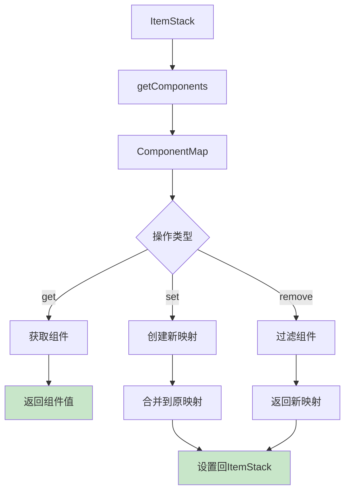

# 第 20 章：组件系统详解（Data Components）

## 章节目标

通过本章学习，你将掌握：
- Minecraft 1.21 组件系统的核心概念
- 组件类型（ComponentType）的定义
- 组件映射（ComponentMap）的操作
- 常见内置组件的用法
- 组件在 ItemStack 和 BlockEntity 中的应用
- 创建自定义组件

## 前置知识

建议先阅读：
- [17-物品基础](./18-item-basics.md) - Item 类的基本概念
- [18-ItemStack物品堆叠](./19-item-stack.md) - ItemStack 的使用
- [16-方块实体](./17-block-entity.md) - BlockEntity 的数据存储

## 核心概念

### Component = 物品的"属性卡片"

想象组件系统是 Minecraft 的**属性卡片系统**：

```
┌─────────────────────────────────────────────────────────────┐
│              组件系统 = 属性卡片集合                               │
├─────────────────────────────────────────────────────────────┤
│                                                              │
│  📇 ItemStack 的属性卡片                                      │
│     │                                                        │
│     ├── 📄 卡片1: 附魔                                      │
│     │     └── Enchantments: [Sharpness III, Unbreaking V]   │
│     │                                                        │
│     ├── 📄 卡片2: 耐久度                                    │
│     │     └── Damage: 150 / 1561                           │
│     │                                                        │
│     ├── 📄 卡片3: 自定义名称                                │
│     │     └── CustomName: "传奇之剑"                        │
│     │                                                        │
│     └── 📄 卡片4: 存储数据                                  │
│           └── CustomData: {owner: "Player123"}              │
│                                                              │
│  ✅ 组件系统取代了旧的 NBT 数据方式                          │
│     更类型安全、更易用、更高效                               │
│                                                              │
└─────────────────────────────────────────────────────────────┘
```

**关键类比**：
- ComponentType = 卡片类型定义（如"附魔卡片"）
- Component = 卡片内容（如"锋利III"）
- ComponentMap = 卡片集合（如整个物品的所有属性）

---

## 1. 组件系统概述

### 1.1 为什么需要组件系统？

```
┌─────────────────────────────────────────────────────────────┐
│                 旧系统 vs 组件系统                                │
├─────────────────────────────────────────────────────────────┤
│                                                              │
│  旧系统 (NBT)            │  新系统 (Components)              │
│  ────────────────────────┼───────────────────────────────   │
│  使用 NbtCompound 存储     │ 使用强类型组件                    │
│  需要手动序列化/反序列化   │ 自动编解码                       │
│  类型不安全               │ 类型安全                          │
│  难以扩展               │ 易于扩展                          │
│  性能较低               │ 性能优化                          │
│                                                              │
│  旧方式:                                                       │
│  nbt.putInt("Damage", 100);                                │
│  int damage = nbt.getInt("Damage");                          │
│                                                              │
│  新方式:                                                       │
│  stack.set(DataComponentTypes.DAMAGE, 100);                   │
│  int damage = stack.getDamage();                             │
│                                                              │
└─────────────────────────────────────────────────────────────┘
```

### 1.2 组件层次结构

```
ComponentHolder (接口)
├── ItemStack
├── Item
├── BlockEntity
└── 其他需要组件的数据结构

ComponentMap (组件容器)
├── ComponentMapImpl (实现)
└── EMPTY (空映射)
```

---

## 2. 组件类型

### 2.1 ComponentType 接口

```java
// 组件类型定义
public interface ComponentType<T> {
    // 获取编解码器
    Codec<T> getCodec();
    
    // 获取网络传输编解码器
    PacketCodec<RegistryByteBuf, T> getPacketCodec();
}
```

### 2.2 预定义组件类型

```java
// DataComponentTypes 包含所有内置组件类型
public class DataComponentTypes {
    
    // 基础组件
    public static final ComponentType<Integer> DAMAGE = ...;
    public static final ComponentType<Integer> MAX_DAMAGE = ...;
    public static final ComponentType<Integer> COUNT = ...;
    public static final ComponentType<Integer> MAX_COUNT = ...;
    
    // 名称组件
    public static final ComponentType<Text> CUSTOM_NAME = ...;
    public static final ComponentType<Text> ITEM_NAME = ...;
    public static final ComponentType<List<Text>> LORE = ...;
    
    // 附魔组件
    public static final ComponentType<EquipmentEnchantments> ENCHANTMENTS = ...;
    public static final ComponentType<Integer> ENCHANTMENT_LEVEL = ...;
    
    // 工具组件
    public static final ComponentType<Integer> DURABILITY = ...;
    public static final ComponentType<ItemStack> REPAIR_COST = ...;
    
    // 食物组件
    public static final ComponentType<FoodComponent> FOOD = ...;
    
    // 桶组件
    public static final ComponentType<FluidVariant> BUCKET_ENTITY_DATA = ...;
    
    // 存储组件
    public static final ComponentType<CustomData> CUSTOM_DATA = ...;
    
    // 更多组件...
}
```

---

## 3. ComponentMap 操作

### 3.1 ComponentHolder 接口

```java
// 组件持有者接口
public interface ComponentHolder {
    
    // 获取所有组件
    ComponentMap getComponents();
    
    // 获取组件
    <T> T get(ComponentType<T> type);
    
    // 获取默认值
    <T> T getOrDefault(ComponentType<T> type, T fallback);
    
    // 设置组件
    <T> T set(ComponentType<T> type, @Nullable T value);
    
    // 移除组件
    <T> T remove(ComponentType<? extends T> type);
}
```

### 3.2 基本操作

```java
// 创建带组件的 ItemStack
ItemStack stack = new ItemStack(Items.DIAMOND_SWORD);

// 获取组件
int damage = stack.get(DataComponentTypes.DAMAGE);  // 可能为 null

// 获取带默认值
int damage = stack.getOrDefault(DataComponentTypes.DAMAGE, 0);

// 设置组件
stack.set(DataComponentTypes.DAMAGE, 150);

// 移除组件
stack.remove(DataComponentTypes.CUSTOM_NAME);

// 检查是否有组件
boolean hasEnchantments = stack.getComponents()
    .contains(DataComponentTypes.ENCHANTMENTS);
```

### 3.3 组件操作流程图



---

## 4. 常见组件详解

### 4.1 耐久度组件

```java
// Damage 组件 - 当前耐久度损失
public static final ComponentType<Integer> DAMAGE = ...;

// MaxDamage 组件 - 最大耐久度
public static final ComponentType<Integer> MAX_DAMAGE = ...;

// ItemStack 辅助方法
public int getDamage() {
    Integer damage = this.get(DataComponentTypes.DAMAGE);
    return damage != null ? damage : 0;
}

public void setDamage(int damage) {
    this.set(DataComponentTypes.DAMAGE, damage);
}

public boolean isDamaged() {
    return this.getDamage() > 0;
}

public boolean isBroken() {
    Integer maxDamage = this.get(DataComponentTypes.MAX_DAMAGE);
    if (maxDamage == null) return false;
    return this.getDamage() >= maxDamage;
}

// 使用示例
ItemStack sword = new ItemStack(Items.DIAMOND_SWORD);
sword.setDamage(100);  // 设置损失100点耐久

int currentDamage = sword.getDamage();  // 100
int maxDamage = sword.getOrDefault(DataComponentTypes.MAX_DAMAGE, 0);  // 1561
```

### 4.2 自定义名称组件

```java
// CustomName 组件 - 自定义显示名称
public static final ComponentType<Text> CUSTOM_NAME = ...;

// 设置自定义名称
stack.set(DataComponentTypes.CUSTOM_NAME, Text.literal("传奇之剑"));

// 获取自定义名称
Text customName = stack.get(DataComponentTypes.CUSTOM_NAME);
if (customName != null) {
    player.sendMessage(customName);
}

// 移除自定义名称
stack.remove(DataComponentTypes.CUSTOM_NAME);

// 显示名称（优先使用自定义名称，否则使用默认名称）
public Text getName() {
    Text customName = this.get(DataComponentTypes.CUSTOM_NAME);
    if (customName != null) {
        return customName;
    }
    return this.getItem().getName();
}
```

### 4.3 附魔组件

```java
// Enchantments 组件 - 附魔列表
public static final ComponentType<EquipmentEnchantments> ENCHANTMENTS = ...;

// EquipmentEnchantments 结构
public record EquipmentEnchantments(
    ImmutableMap<RegistryEntry<Enchantment>, Integer> enchantments,
    ImmutableMap<RegistryEntry<Enchantment>, Integer> storedEnchantments
) {}

// 使用示例
ItemStack sword = new ItemStack(Items.DIAMOND_SWORD);

// 添加附魔
EnchantmentHelper.set(
    sword,
    Map.of(
        Registries.ENCHANTMENT.get(Identifier.of("minecraft", "sharpness")), 5,
        Registries.ENCHANTMENT.get(Identifier.of("minecraft", "unbreaking")), 3
    )
);

// 获取附魔
Map<RegistryEntry<Enchantment>, Integer> enchantments = 
    EnchantmentHelper.get(sword);

// 检查特定附魔
boolean hasSharpness = EnchantmentHelper.getLevel(
    Registries.ENCHANTMENT.get(Identifier.of("minecraft", "sharpness")),
    sword
) > 0;

// 移除附魔
EnchantmentHelper.clear(sword);
```

### 4.4 自定义数据组件

```java
// CustomData 组件 - 存储任意数据
public static final ComponentType<CustomData> CUSTOM_DATA = ...;

// CustomData 包装类
public class CustomData {
    public static CustomData of(Map<String, NbtElement> values) {...}
    public static CustomData of(String key, NbtElement value) {...}
    
    public <T> T get(String key, Function<NbtElement, T> decoder) {...}
    public CustomData put(String key, NbtElement value) {...}
    public CustomData remove(String key) {...}
    
    public NbtCompound getPersistentData() {...}
}

// 使用示例
ItemStack compass = new ItemStack(Items.COMPASS);

// 存储自定义数据
CustomData data = CustomData.of(Map.of(
    "target_x", NbtInt.of(100),
    "target_z", NbtInt.of(200),
    "owner", NbtString.of("Player123")
));
compass.set(DataComponentTypes.CUSTOM_DATA, data);

// 读取自定义数据
CustomData storedData = compass.get(DataComponentTypes.CUSTOM_DATA);
if (storedData != null) {
    int targetX = storedData.get("target_x", NbtElement::copy);
    int targetZ = storedData.get("target_z", NbtElement::copy);
}
```

---

## 5. ItemStack 辅助方法

### 5.1 便捷方法

```java
// ItemStack 中为常用组件提供了便捷方法
public class ItemStack {
    
    // 耐久度
    public int getDamage() {
        return this.getOrDefault(DataComponentTypes.DAMAGE, 0);
    }
    
    public void setDamage(int damage) {
        this.set(DataComponentTypes.DAMAGE, damage);
    }
    
    public boolean isDamaged() {
        return this.getDamage() > 0;
    }
    
    public int getMaxDamage() {
        return this.getOrDefault(DataComponentTypes.MAX_DAMAGE, 0);
    }
    
    // 名称
    public Text getName() {...}
    public Text getCustomName() {...}
    public void setCustomName(Text name) {...}
    public boolean hasCustomName() {...}
    
    // 附魔
    public boolean hasEnchantments() {...}
    public Map<RegistryEntry<Enchantment>, Integer> getEnchantments() {...}
    
    // 数量
    public int getCount() {...}
    public void setCount(int count) {...}
}
```

### 5.2 类型安全的检查

```java
// 使用泛型确保类型安全
public <T> T getDamage() {
    Integer value = this.get(DataComponentTypes.DAMAGE);
    return (T) (Object) value;  // 不推荐，应使用具体方法
}

// 推荐方式：使用具体方法
public int getDamageValue() {
    Integer value = this.get(DataComponentTypes.DAMAGE);
    return value != null ? value : 0;
}

// 检查组件类型
public boolean hasComponents() {
    return !this.getComponents().isEmpty();
}

public boolean has(ComponentType<?> type) {
    return this.getComponents().contains(type);
}
```

---

## 6. BlockEntity 中的组件

### 6.1 BlockEntity 组件使用

```java
// BlockEntity 现在也支持组件系统
public abstract class BlockEntity implements ComponentHolder {
    private ComponentMap components = ComponentMap.EMPTY;
    
    @Override
    public ComponentMap getComponents() {
        return components;
    }
}

// 自定义 BlockEntity 使用组件
public class MyBlockEntity extends BlockEntity {
    
    public void setEnergy(int amount) {
        this.set(DataComponentTypes.CUSTOM_DATA, 
            CustomData.of("energy", NbtInt.of(amount)));
    }
    
    public int getEnergy() {
        CustomData data = this.get(DataComponentTypes.CUSTOM_DATA);
        if (data != null) {
            return data.get("energy", NbtInt::copy).orElse(0);
        }
        return 0;
    }
}
```

### 6.2 组件持久化

```java
// BlockEntity 组件的持久化
public class MyBlockEntity extends BlockEntity {
    
    @Override
    protected void writeNbt(NbtCompound nbt, RegistryWrapper.WrapperLookup lookup) {
        super.writeNbt(nbt, lookup);
        
        // 组件会被自动序列化
    }
    
    @Override
    public void readNbt(NbtCompound nbt, RegistryWrapper.WrapperLookup lookup) {
        super.readNbt(nbt, lookup);
        
        // 组件会被自动反序列化
    }
}
```

---

## 7. 创建自定义组件

### 7.1 注册自定义组件类型

```java
// 1. 定义组件类型
public class MyModComponents {
    
    public static final ComponentType<MyData> MY_CUSTOM_DATA = 
        ComponentType.<MyData>builder()
            .codec(MyData.CODEC)
            .packetCodec(MyData.PACKET_CODEC)
            .cache()
            .build();
}

// 2. 组件数据类
public record MyData(String value, int count) {
    public static final Codec<MyData> CODEC = RecordCodecBuilder.create(
        instance -> instance.group(
            Codec.STRING.fieldOf("value").forGetter(MyData::value),
            Codec.INT.fieldOf("count").forGetter(MyData::count)
        ).apply(instance, MyData::new)
    );
    
    public static final PacketCodec<RegistryByteBuf, MyData> PACKET_CODEC = 
        PacketCodec.tuple(
            PacketCodecs.STRING, MyData::value,
            PacketCodecs.VARINT, MyData::count,
            MyData::new
        );
}
```

### 7.2 使用自定义组件

```java
// 使用自定义组件
public class MyMod {
    
    public static final Item MY_ITEM = new Item(new Settings()) {
        @Override
        public void appendTooltip(ItemStack stack, World world,
                                 List<Text> tooltip, TooltipContext context) {
            // 显示自定义数据
            MyData data = stack.get(MyModComponents.MY_CUSTOM_DATA);
            if (data != null) {
                tooltip.add(Text.literal("Value: " + data.value()));
                tooltip.add(Text.literal("Count: " + data.count()));
            }
        }
    };
    
    @Override
    public void onInitialize() {
        // 注册组件类型
        Registry.register(
            Registries.DATA_COMPONENT_TYPE,
            Identifier.of("mymod", "my_custom_data"),
            MyModComponents.MY_CUSTOM_DATA
        );
        
        // 注册物品
        Registry.register(
            Registries.ITEM,
            Identifier.of("mymod", "my_item"),
            MY_ITEM
        );
    }
}
```

---

## 8. 组件与数据包

### 8.1 数据包中的组件

```java
// 组件可以通过数据包设置
// 在数据包的 item_modifiers 中

{
    "type": "mymod:custom_item",
    "components": {
        "mymod:my_custom_data": {
            "value": "example",
            "count": 10
        },
        "minecraft:custom_name": "§6Golden Item",
        "minecraft:enchantments": {
            "levels": {
                "minecraft:sharpness": 3
            }
        }
    }
}
```

### 8.2 组件转换器

```java
// 组件转换器用于兼容旧数据
public class ComponentPatchApplier {
    
    // 应用组件补丁
    public static ItemStack applyPatch(ItemStack stack, 
                                     Map<Identifier, NbtElement> patches) {
        for (Map.Entry<Identifier, NbtElement> entry : patches.entrySet()) {
            ComponentType<?> type = Registries.DATA_COMPONENT_TYPE.get(entry.getKey());
            if (type != null) {
                // 应用补丁
                applyPatch(stack, type, entry.getValue());
            }
        }
        return stack;
    }
}
```

---

## 9. 性能优化

### 9.1 组件缓存

```java
// 组件系统内部使用缓存优化
public class ComponentType<T> {
    
    private final boolean cache;
    
    // 常用组件启用缓存
    public static final ComponentType<Integer> DAMAGE = 
        ComponentType.<Integer>builder()
            .codec(Codecs.VARINT)
            .cache()  // 启用缓存
            .build();
}
```

### 9.2 避免频繁修改

```
性能优化建议：

┌─────────────────────────────────────────────────────────────┐
│  ✅ 批量修改                                               │
│     - 多次修改使用同一 ItemStack                           │
│     - 减少创建新映射的次数                                │
├─────────────────────────────────────────────────────────────┤
│  ✅ 使用便捷方法                                           │
│     - stack.setDamage() 而非 set(DAMAGE, value)           │
│     - 使用预定义常量而非动态查找                          │
├─────────────────────────────────────────────────────────────┤
│  ✅ 避免不必要的组件创建                                   │
│     - 只有需要时才设置组件                                │
│     - 组件为 null 时表示未设置                           │
├─────────────────────────────────────────────────────────────┤
│  ✅ 合理使用 CUSTOM_DATA                                  │
│     - 大量数据存储考虑使用单一 CUSTOM_DATA                │
│     - 而非多个小组件                                      │
└─────────────────────────────────────────────────────────────┘
```

---

## 10. 关键源码文件

| 文件 | 路径 | 说明 |
|-----|------|-----|
| `ComponentType.java` | `net.minecraft.component` | 组件类型 |
| `ComponentMap.java` | `net.minecraft.component` | 组件映射 |
| `ComponentHolder.java` | `net.minecraft.component` | 组件持有者 |
| `DataComponentTypes.java` | `net.minecraft.component` | 内置组件类型 |
| `CustomData.java` | `net.minecraft.nbt` | 自定义数据 |
| `Components.java` | `net.minecraft.nbt` | 组件序列化 |

---

## 课后自查

完成本章学习后，请检查你是否理解：

- [ ] 组件系统与旧 NBT 系统的区别
- [ ] ComponentType 的定义方式
- [ ] ComponentMap 的基本操作
- [ ] 常见内置组件的用法
- [ ] 组件在 ItemStack 和 BlockEntity 中的应用
- [ ] 如何创建自定义组件

---

## 延伸阅读

- [17-物品基础](./18-item-basics.md) - Item 类的详细说明
- [18-ItemStack物品堆叠](./19-item-stack.md) - ItemStack 的使用
- [16-方块实体](./17-block-entity.md) - BlockEntity 的数据存储
