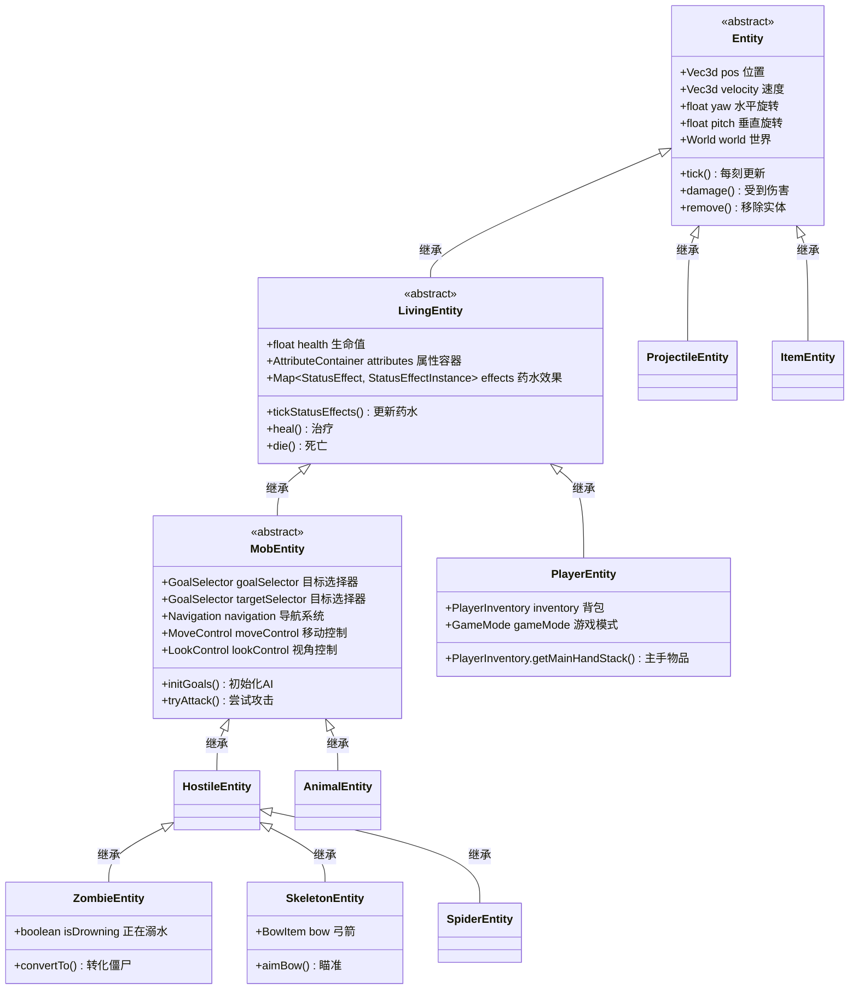

# 第20章 Entity（实体）——游戏世界里的"活物"

> **注意**：以下代码示例基于 CFR 反编译结果，实际 Minecraft 源码可能有所差异。在使用时请以游戏源码为准。

## 目标

- 理解 Entity 是什么
- 了解 Entity 和 Block（方块）的区别
- 掌握实体类型分类
- 学会看实体继承关系图

## 前置知识

- 了解 Java 面向对象编程的基础（类、继承）
- 了解 Minecraft 基本概念（玩家、生物、物品等）

## 核心概念

### 什么是 Entity？

**Entity（实体）** 是 Minecraft 中最核心的概念之一——它代表世界上所有"会动的东西"。

想象你家的动物园：
- **Entity** 就像是动物园里所有会动的动物
- **Block（方块）** 就像是动物园里的石头围栏、植物——它们不会自己动

### 实体 vs 方块

| 特性 | Entity（实体） | Block（方块） |
|------|----------------|---------------|
| 位置 | 漂浮在世界中（有点坐标） | 固定在格子中（有方块坐标） |
| 移动 | 可以自己移动 | 不能移动 |
| 碰撞箱 | 任意大小 | 固定 1x1x1 |
| 保存方式 | NBT 数据 | BlockState |
| 示例 | 猪、僵尸、玩家、箭矢 | 石头、泥土、草方块 |

### 实体家族图谱

```
                                    ┌─────────────────┐
                                    │    Entity       │  ← 万物之父，所有实体的祖宗
                                    │   (实体基类)     │
                                    └────────┬────────┘
                                             │
           ┌─────────────────────────────────┼─────────────────────────────────┐
           │                                 │                                 │
           ▼                                 ▼                                 ▼
┌─────────────────────┐          ┌─────────────────────┐          ┌─────────────────────┐
│   LivingEntity      │          │   ProjectileEntity  │          │   AreaEffectCloudEntity │
│  (有生命的实体)      │          │    (抛射物实体)      │          │   (区域效果云)        │
│                     │          │                     │          │                      │
│ 有生命值、会受伤      │          │ 箭矢、火球、珍珠等   │          │ 药水云、经验球等       │
└─────────┬───────────┘          └─────────────────────┘          └─────────────────────┘
          │
          │
          ▼
┌─────────────────────┐
│    MobEntity        │
│   (生物实体)         │
│                     │
│ 可移动、有AI、能攻击  │
└─────────┬───────────┘
          │
    ┌─────┴─────┬──────────────┐
    ▼           ▼              ▼
┌───────┐  ┌────────┐   ┌──────────┐
│ 僵尸  │  │ 蜘蛛   │   │ 骷髅射手  │
│Zombie │  │Spider  │   │Skeleton  │
└───────┘  └────────┘   └──────────┘
```

### Minecraft 中的实体分类

```
Entity 实体大家族
│
├── 🧍 LivingEntity（活着的）
│   ├── 👤 PlayerEntity（玩家）
│   ├── 🐷 MobEntity（会动的生物）
│   │   ├── 🟢 HostileEntity（敌对生物）
│   │   │   ├── 🧟 Zombie（僵尸）
│   │   │   ├── 💀 Skeleton（骷髅）
│   │   │   ├── 🕷️ Spider（蜘蛛）
│   │   │   └── 🔮 Creeper（苦力怕）
│   │   └── 🟡 PassiveEntity（被动生物）
│   │       ├── 🐄 Cow（牛）
│   │       ├── 🐑 Sheep（羊）
│   │       └── 🐷 Pig（猪）
│   └── 🐟 WaterMobEntity（水生生物）
│
├── 🎯 ProjectileEntity（抛射物）
│   ├── 🏹 Arrow（箭）
│   ├── 🔥 Fireball（火球）
│   └── 💎 EnderPearl（末影珍珠）
│
├── 📦 ItemEntity（物品实体）
│   └── 💼 地上掉落的物品
│
├── 🧱 FallingBlockEntity（掉落中的方块）
│   └── 🪨 沙子、沙砾
│
└── 🚃 VehicleEntity（载具）
    ├── 🚂 Minecart（矿车）
    └── 🚤 Boat（船）
```

## 图解

### Entity 继承关系图（详细版）



### 生活中的比喻

```
Entity 就像是"演员"：
- 方块（Block）是舞台上的布景——固定不动
- 实体（Entity）是舞台上的演员——可以走来走去

LivingEntity = 有血条的演员（能被打）
MobEntity = 会自己动的演员（有AI）
PlayerEntity = 玩家控制的角色
```

## 核心代码

> **注意**：以下代码基于 CFR 反编译结果，可能与实际源码略有差异。

### Entity 基类的核心字段

```java
// Entity.java - 位置和旋转
public abstract class Entity {
    // 位置
    private Vec3d pos;                    // 当前坐标 (x, y, z)
    private BlockPos blockPos;            // 所在方块坐标

    // 速度
    private Vec3d velocity;               // 当前速度向量

    // 旋转角度
    private float yaw;                    // 水平旋转（左右看）
    private float pitch;                  // 垂直旋转（上下看）

    // 碰撞箱
    private Box boundingBox;              // 实体占用的空间

    // 世界引用
    protected World world;                 // 这个实体所在的世界
}
```

### 实体类型定义示例

```java
// EntityType.java - 实体类型的定义
public static final EntityType<ZombieEntity> ZOMBIE =
    EntityType.register("zombie",
        Builder.create(ZombieEntity::new, SpawnGroup.MONSTER)
            .dimensions(0.6f, 1.95f)           // 宽0.6格，高1.95格
            .eyeHeight(1.74f)                  // 眼睛高度
            .vehicleAttachment(-0.7f)          // 骑乘位置
            .maxTrackingRange(8)               // 最大追踪距离（8个区块）
            .trackingTickInterval(3)            // 追踪更新间隔
    );
```

### 创建实体

```java
// 在世界中生成一个僵尸
EntityType<ZombieEntity> ZOMBIE = EntityType.ZOMBIE;

// 方式1：使用 spawn 方法
ZOMBIE.spawn(serverWorld, new BlockPos(100, 64, 200), SpawnReason.NATURAL);

// 方式2：创建后手动放置
ZombieEntity zombie = ZOMBIE.create(world);
if (zombie != null) {
    zombie.setPosition(100, 64, 200);
    world.spawnEntity(zombie);
}
```

## 实战演示

### 场景：理解 Entity 的位置和移动

```java
public class MyEntity extends MobEntity {

    @Override
    public void tick() {
        super.tick();

        // 获取当前位置
        Vec3d pos = this.getPos();
        double x = pos.x;
        double y = pos.y;
        double z = pos.z;

        // 获取旋转角度
        float yaw = this.getYaw();    // 左右看（0-360度）
        float pitch = this.getPitch(); // 上下看（-90到90度）

        // 获取速度
        Vec3d velocity = this.getVelocity();

        // 让实体向某个方向移动
        // 例如：向前移动
        Vec3d forward = this.getRotationVector();
        this.setVelocity(forward.multiply(0.5)); // 每次移动0.5格
    }
}
```

### 场景：获取实体类型

```java
public class EntityHelper {

    // 判断实体是什么类型
    public static String getEntityTypeName(Entity entity) {
        EntityType<?> type = entity.getType();
        return type.getName().getString();
    }

    // 检查是不是敌对生物
    public static boolean isHostile(Entity entity) {
        if (entity instanceof MobEntity mob) {
            return mob.getType().getSpawnGroup() == SpawnGroup.MONSTER;
        }
        return false;
    }

    // 检查是不是动物
    public static boolean isAnimal(Entity entity) {
        if (entity instanceof AnimalEntity) {
            return true;
        }
        return false;
    }
}
```

## 小结

1. **Entity 是 Minecraft 中所有"会动的东西"的基类**
   - 包括玩家、生物、抛射物、掉落物品等

2. **Entity 和 Block 的核心区别**
   - Entity 有精确的位置坐标，可以移动
   - Block 固定在方块格子中

3. **实体继承层次**
   - `Entity` → `LivingEntity` → `MobEntity` → 各种具体生物
   - 越往下，功能越多，但也越复杂

4. **每个 EntityType 定义了一个实体**
   - 包括大小、碰撞箱、生成群体等属性

5. **创建实体需要使用 EntityType**
   - 不能直接 new，要用 `entityType.create(world)`

## 练习

### 练习 1：找出所有敌对生物

```java
// 在 EntityType 中找到所有 MONSTER 群体的实体
// 提示：查看 SpawnGroup 枚举
```

### 练习 2：创建自定义实体

```java
// 使用 EntityType.Builder 创建一个新的实体类型
// 设置尺寸为 1x1x1，看看在游戏中长什么样
```

### 练习 3：追踪玩家位置

```java
// 编写代码，每秒输出玩家当前坐标
// 提示：使用 tick() 方法配合 age 字段
```

## 相关链接

### 源码文件位置

| 文件 | 源码路径 | 说明 |
|------|----------|------|
| Entity.java | `net/minecraft/entity/Entity.java` | 实体基类 |
| EntityType.java | `net/minecraft/entity/EntityType.java` | 实体类型 |
| EntityType.java | `net/minecraft/entity/EntityTypes.java` | 所有原版实体定义 |

- **上一章**：[第19章 ItemComponent组件系统](../Part-3-Block-Item/19-item-component.md)
- **下一章**：[第21章 实体生命周期](./21-entity-lifecycle.md)
- **相关源码**：
  - `net/minecraft/entity/Entity.java` - 实体基类
  - `net/minecraft/entity/EntityType.java` - 实体类型注册
- **扩展阅读**：
  - [Minecraft Wiki - Entity](https://minecraft.fandom.com/wiki/Entity)
