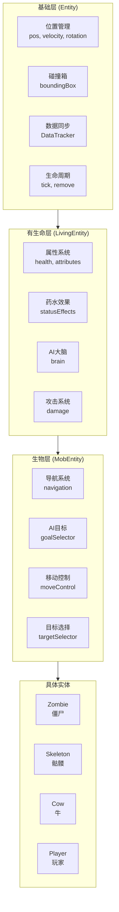

# 第 21 章：实体系统入门（Entity Introduction）

> 本章将带你了解 Minecraft 中实体（Entity）的基础概念——那些在游戏中"活着的"对象

---

## 章节目标

- 理解什么是 Entity 以及它在 Minecraft 中的作用
- 掌握 Entity 的继承层次结构
- 了解 Entity 的核心组件（位置、速度、碰撞箱）
- 能够识别不同类型的 Entity

## 前置知识

- 了解 Java 面向对象编程（类、继承、接口）
- 熟悉 Minecraft 世界由方块（Block）和实体（Entity）组成的基本概念

## 核心概念

### 什么是 Entity？

**Entity = 游戏里的"活物"**

想象 Minecraft 世界是一座城市：
- **方块（Block）** = 城市的建筑物、道路——静态不变的
- **实体（Entity）** = 城市里的人、动物、汽车——会移动的

Entity 就是在世界中移动和交互的对象，包括：
- 玩家（Player）
- 生物（Mob）：僵尸、骷髅、牛、羊...
- 投射物（Projectile）：箭矢、火球、珍珠...
- 载具（Vehicle）：矿车、船
- 其他：物品掉落、经验球、 TNT...

```java
// Entity.java 核心定义
public abstract class Entity implements DataTracked, Nameable, EntityLike {
    private final EntityType<?> type;      // 实体的"类型"
    private Vec3d pos;                    // 当前位置
    private Vec3d velocity;              // 当前速度
    private Box boundingBox;              // 碰撞箱
    // ... 更多字段
}
```

## Entity 继承层次

Minecraft 的 Entity 系统采用**清晰的继承层次**：

```
┌─────────────────────────────────────────────────────────────────┐
│                         Entity (基类)                            │
│  所有实体的祖先，定义位置、速度、旋转、碰撞等基础功能          │
└─────────────────────────────────────────────────────────────────┘
                              │
        ┌─────────────────────┼─────────────────────┐
        ▼                     ▼                     ▼
┌───────────────┐    ┌───────────────┐    ┌───────────────┐
│  ItemEntity   │    │ Projectile   │    │ LivingEntity │
│  (物品掉落)  │    │  (投射物)    │    │ (有生命的)   │
└───────────────┘    └───────────────┘    └───────┬───────┘
                                                │
                              ┌─────────────────┼─────────────────┐
                              ▼                 ▼                 ▼
                    ┌───────────────┐   ┌───────────────┐  ┌───────────────┐
                    │  MobEntity   │   │  PlayerEntity│  │ AmbientEntity│
                    │   (生物)    │   │   (玩家)    │  │  (环境生物) │
                    └───────┬───────┘   └───────────────┘  └───────────────┘
                            │
          ┌─────────────────┼─────────────────┐
          ▼                 ▼                 ▼
    ┌───────────┐     ┌───────────┐     ┌───────────┐
    │  Zombie  │     │  Cow      │     │  Creeper  │
    │  (僵尸)  │     │  (牛)    │     │ (苦力怕) │
    └───────────┘     └───────────┘     └───────────┘
```

### 继承层次详解

| 层次 | 类名 | 职责 | 示例 |
|------|------|------|------|
| 1 | `Entity` | 基础功能：位置、速度、碰撞 | 所有实体 |
| 2 | `LivingEntity` | 有生命的：生命值、药水效果、AI | 玩家、生物 |
| 3 | `MobEntity` | 生物：AI 目标、导航、攻击 | 僵尸、骷髅 |
| 4 | `HostileEntity` | 敌对生物 | 僵尸、蜘蛛 |
| 4 | `AnimalEntity` | 动物 | 牛、猪、羊 |

## Entity 核心组件

### 1. 位置（Position）

```java
// Entity.java
public double x, y, z;           // 当前坐标
public double prevX, prevY, prevZ; // 上一 tick 位置（用于插值）

// 获取位置
public Vec3d getPos() {
    return new Vec3d(this.x, this.y, this.z);
}

// 设置位置
public void setPosition(Vec3d pos) {
    this.setPosition(pos.getX(), pos.getY(), pos.getZ());
}
```

### 2. 速度（Velocity）

```java
// 速度向量
private Vec3d velocity;

// 设置速度（每 tick 的位移量）
public void setVelocity(double x, double y, double z) {
    this.velocity = new Vec3d(x, y, z);
}

// 常见速度值
// 行走速度 ≈ 0.1 blocks/tick
// 冲刺速度 ≈ 0.2 blocks/tick
// 掉落速度 ≈ 0.08 blocks/tick² (重力加速度)
```

### 3. 旋转（Rotation）

```java
public float yaw;     // 水平旋转 (0-360°)
public float pitch;   // 垂直旋转 (-90° 到 90°)

// 方向说明
// yaw: 0°=南, 90°=西, 180°=北, 270°=东
// pitch: 0°=水平, -90°=向上看, 90°=向下看
```

### 4. 碰撞箱（Bounding Box）

```java
// 碰撞箱决定了实体占据的空间
private Box boundingBox;

// 碰撞箱计算
protected Box calculateBoundingBox() {
    return this.dimensions.getBoxAt(this.pos);
}

// 常见碰撞箱尺寸
// 玩家: 0.6 x 1.8
// 僵尸: 0.6 x 1.95
// 牛: 0.9 x 1.4
```

## Entity 的生命周期

```
┌─────────────────────────────────────────────────────────────────────┐
│                        Entity 生命周期                                │
├─────────────────────────────────────────────────────────────────────┤
│                                                                     │
│   创建 ──► 初始化 ──► 游戏循环 ──► 销毁                           │
│     │         │            │            │                              │
│     ▼         ▼            ▼            ▼                              │
│  ┌──────┐ ┌──────┐   ┌──────┐   ┌──────┐                        │
│  │构造  │ │init()│   │tick()│   │remove()│                       │
│  │函数  │ │方法  │   │每刻  │   │移除  │                        │
│  └──────┘ └──────┘   └──────┘   └──────┘                        │
│                                                                     │
└─────────────────────────────────────────────────────────────────────┘
```

### 生命周期方法

```java
// 创建时调用
public Entity(EntityType<?> type, World world) {
    this.type = type;
    this.world = world;
    // 设置初始位置、尺寸等
}

// 每 tick 调用
public void tick() {
    this.baseTick();
}

// 基础 tick 处理
public void baseTick() {
    // 处理骑乘状态
    if (this.hasVehicle() && this.getVehicle().isRemoved()) {
        this.stopRiding();
    }
    // 处理水分状态
    this.updateWaterState();
    // 处理火焰状态
    if (this.fireTicks > 0) {
        // 燃烧处理
    }
}

// 销毁实体
public void kill() {
    this.remove(RemovalReason.KILLED);
}

public void discard() {
    this.remove(RemovalReason.DISCARDED);
}
```

## EntityType 实体类型

每个 Entity 都有一个类型标识：

```java
// EntityType.java
public class EntityType<T extends Entity> {
    public static final EntityType<ZombieEntity> ZOMBIE;
    public static final EntityType<CowEntity> COW;
    public static final EntityType<PlayerEntity> PLAYER;
    // ... 更多类型
}

// 使用示例
if (entity.getType() == EntityType.ZOMBIE) {
    // 这是一个僵尸
}
```

## 常见 Entity 类型一览

| 类型 | 实体 | 说明 |
|------|------|------|
| 玩家 | `PlayerEntity` | 玩家控制的实体 |
| 生物 | `ZombieEntity`, `SkeletonEntity` | 敌对/中立生物 |
| 动物 | `CowEntity`, `SheepEntity` | 被动生物 |
| 投射物 | `ArrowEntity`, `FireballEntity` | 飞行物体 |
| 物品 | `ItemEntity` | 掉落的物品 |
| 载具 | `BoatEntity`, `MinecartEntity` | 交通工具 |

## 实战演示：创建一个自定义 Entity

### 步骤 1：定义 EntityType

```java
// 在 Mod 主类中注册
public class MyMod {
    public static final EntityType<MyEntity> MY_ENTITY = Registry.register(
        Registries.ENTITY_TYPE,
        new Identifier("mymod", "my_entity"),
        EntityType.Builder.create(MyEntity::new, SpawnGroup.CREATURE)
            .dimensions(0.6f, 1.8f)  // 碰撞箱尺寸
            .maxTrackingRange(64)       // 最大追踪距离
            .trackingTickInterval(2)      // 追踪更新间隔
            .build()
    );
}
```

### 步骤 2：创建 Entity 类

```java
public class MyEntity extends MobEntity {
    
    public MyEntity(EntityType<?> type, World world) {
        super(type, world);
    }
    
    @Override
    protected void initGoals() {
        // 初始化 AI 目标
        this.goalSelector.add(1, new WanderAroundGoal(this, 1.0));
        this.targetSelector.add(1, new NearestAttackableTargetGoal<>(
            this, PlayerEntity.class, true
        ));
    }
    
    @Override
    public void tick() {
        super.tick();
        // 自定义逻辑
    }
}
```

### 步骤 3：创建 Renderer（客户端）

```java
@Environment(EnvType.CLIENT)
public class MyEntityRenderer extends MobEntityRenderer<MyEntity, MyEntityModel<MyEntity>> {
    
    public MyEntityRenderer(EntityRendererFactory.Context ctx) {
        super(ctx, new MyEntityModel(), 0.5f);
    }
    
    @Override
    public Identifier getTexture(MyEntity entity) {
        return new Identifier("mymod", "textures/entity/my_entity.png");
    }
}
```

## Mermaid 图表：Entity 系统架构



## 课后自查

完成本章学习后，你应该能够：

- [ ] 解释 Entity 和 Block 的区别
- [ ] 画出 Entity 继承层次结构图
- [ ] 说出 Entity 的 4 个核心组件
- [ ] 理解 Entity 的生命周期（创建→Tick→销毁）
- [ ] 知道 `EntityType` 的作用
- [ ] 能够列举 5 种以上的 Entity 类型

## 关键术语表

| 术语 | 英文 | 解释 |
|------|------|------|
| 实体 | Entity | Minecraft 中可移动的游戏对象 |
| 碰撞箱 | Bounding Box | 实体占据的空间区域 |
| 生命周期 | Lifecycle | 实体的创建到销毁过程 |
| 数据追踪 | DataTracker | 客户端-服务端数据同步机制 |
| 实体类型 | EntityType | 实体的类型标识和元数据 |

---

**参考源码路径**：

- `D:\Minecraft-Learning\assets\mc\1.21\net\minecraft\entity\Entity.java`
- `D:\Minecraft-Learning\assets\mc\1.21\net\minecraft\entity\LivingEntity.java`
- `D:\Minecraft-Learning\assets\mc\1.21\net\minecraft\entity\MobEntity.java`
