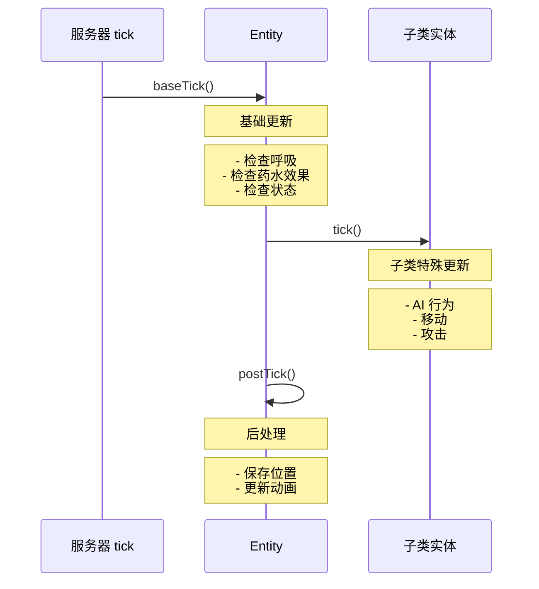

# 第21章 Entity 生命周期——实体的生老病死

> **注意**：以下代码示例基于 CFR 反编译结果，实际 Minecraft 源码可能有所差异。在使用时请以游戏源码为准。

## 目标

- 理解实体的创建、移动、更新、销毁过程
- 掌握 tick() 方法的作用
- 了解实体生命周期各个阶段

## 前置知识

- 了解 Entity 是什么（第20章）
- 了解 Minecraft 的 tick（刻）概念

## 核心概念

### 什么是实体生命周期？

**生命周期**就像人的一生：
- **出生** = 实体被创建
- **成长** = 实体每刻更新（tick）
- **移动** = 实体在世界中移动
- **死亡** = 实体被移除

### Minecraft 中的 tick（刻）

Minecraft 世界每秒钟运行 **20 次 tick**（每 50 毫秒一次）。

```
1 秒 = 20 tick
1 tick = 50 毫秒

游戏运行中...
├── tick 1: 所有实体更新一次
├── tick 2: 所有实体更新一次
├── ...
└── tick 20: 所有实体更新一次
    └── 然后回到 tick 1
```

### 实体生命周期流程图

```
                    ┌─────────────────────────────────────────────────────┐
                    │                   游戏世界                          │
                    └─────────────────────────────────────────────────────┘
                                        │
                                        ▼
                    ┌─────────────────────────────────────────────────────┐
                    │ 1. 创建（Spawn）                                   │
                    │    - /summon 命令                                  │
                    │    - 自然生成                                       │
                    │    - 物品掉落                                       │
                    │    - 玩家投掷                                       │
                    └─────────────────────────┬───────────────────────────┘
                                              │
                                              ▼
                    ┌─────────────────────────────────────────────────────┐
                    │ 2. 初始化（Initialize）                            │
                    │    - 设置属性                                       │
                    │    - 初始化数据                                     │
                    │    - 设置出生特效                                   │
                    └─────────────────────────┬───────────────────────────┘
                                              │
                                              ▼
                    ┌─────────────────────────────────────────────────────┐
                    │ 3. 每刻更新（tick）← 一直循环直到死亡或移除          │
                    │                                                     │
                    │    ┌─────────────┐  ┌─────────────┐  ┌────────────┐│
                    │    │ baseTick()  │→│ tick()      │→│ postTick() ││
                    │    │ 基础更新     │  │ 子类更新    │  │ 后处理     ││
                    │    └─────────────┘  └─────────────┘  └────────────┘│
                    │         ↑                                    │     │
                    │         └──────────── 循环 ───────────────────┘     │
                    └─────────────────────────┬───────────────────────────┘
                                              │
                           ┌──────────────────┼──────────────────┐
                           │                  │                  │
                           ▼                  ▼                  ▼
                    ┌─────────────┐    ┌─────────────┐    ┌─────────────┐
                    │ 自然移除    │    │ 死亡掉落    │    │ 玩家杀死    │
                    │ (远距离)   │    │ (生命值归零)│    │ (玩家攻击)  │
                    └──────┬──────┘    └──────┬──────┘    └──────┬──────┘
                           │                  │                  │
                           └──────────────────┼──────────────────┘
                                              │
                                              ▼
                    ┌─────────────────────────────────────────────────────┐
                    │ 4. 销毁（Remove/Discard）                          │
                    │    - 从世界移除                                      │
                    │    - 触发死亡事件                                    │
                    │    - 掉落物品/经验                                   │
                    └─────────────────────────────────────────────────────┘
```

## 图解

### tick() 方法的执行顺序



### 生活中的比喻：餐厅的一天

```
实体生命周期就像餐厅的一天：

早上开门（创建）
    ↓
服务员准备迎接客人（初始化）
    ↓
一天营业（tick 循环）
    ├── 每桌客人点菜（处理输入）
    ├── 上菜（处理逻辑）
    └── 收拾桌子（清理）
    ↓
打烊（销毁）
```

## 核心代码

> **注意**：以下代码基于 CFR 反编译结果，可能与实际源码略有差异。

### 实体创建

```java
// EntityType.java - 创建实体的工厂方法
public class EntityType<T extends Entity> {

    // 创建实体（但不添加到世界）
    public T create(World world) {
        // 检查特性开关
        if (!this.isEnabled(world.getEnabledFeatures())) {
            return null;
        }
        // 调用工厂方法创建实例
        return this.factory.create(this, world);
    }

    // 创建并生成到世界中
    public T spawn(ServerWorld world, BlockPos pos, SpawnReason reason) {
        T entity = this.create(world);
        if (entity != null) {
            // 设置位置
            entity.setPosition(pos.getX(), pos.getY(), pos.getZ());
            // 添加到世界
            world.spawnEntity(entity);
        }
        return entity;
    }
}
```

### tick() 方法详解

```java
// Entity.java - 每刻更新的核心方法
public abstract class Entity {

    public int age;  // 实体存在的刻数

    // 每刻调用的主方法
    public void baseTick() {
        // 1. 更新前一帧数据（用于插值）
        this.prevX = this.x;
        this.prevY = this.y;
        this.prevZ = this.z;

        // 2. 处理呼吸
        if (!this.isFireImmune()) {
            // 检查是否在水中
            this.updateWaterState();
        }

        // 3. 火焰燃烧
        if (this.isOnFire()) {
            this.tickFire();
        }

        // 4. 更新位置
        this.updatePosition();

        // 5. 碰撞检测
        this.checkBlockCollision();

        // 6. 增加年龄
        this.age++;
    }

    // 子类可以重写这个方法
    public void tick() {
        // 默认空实现
    }
}
```

### MobEntity 的 tick()

```java
// MobEntity.java - 生物的每刻更新
public class MobEntity extends LivingEntity {

    @Override
    public void tick() {
        super.tick();

        // 每5刻更新一次AI目标
        if (this.age % 5 == 0) {
            this.updateGoalControls();
        }
    }

    // AI 更新的核心方法
    @Override
    protected void tickNewAi() {
        // 每刻递增
        ++this.despawnCounter;

        // 感知系统
        this.visibilityCache.clear();

        // 目标选择（选择攻击目标）
        this.targetSelector.tick();

        // AI 行为（移动、攻击等）
        this.goalSelector.tick();

        // 导航系统（寻路）
        this.navigation.tick();

        // 生物特殊逻辑
        this.mobTick();

        // 控制器更新
        this.moveControl.tick();    // 移动控制
        this.lookControl.tick();   // 视角控制
        this.jumpControl.tick();   // 跳跃控制
    }
}
```

### 实体销毁

```java
// Entity.java - 移除实体
public abstract class Entity {

    // 标记移除原因
    public enum RemovalReason {
        KILLED,           // 被杀死
        DISCARDED,        // 被丢弃
        UNLOADED_TO_CHUNK, // 区块卸载
        CHANGED_DIMENSION // 切换维度
    }

    // 移除实体
    public void remove(RemovalReason reason) {
        this.removalReason = reason;
        // 从世界移除
        this.getWorld().removeEntity(this, reason);
    }

    // 丢弃实体（不触发死亡）
    public void discard() {
        this.remove(RemovalReason.DISCARDED);
    }

    // 杀死实体（触发掉落）
    public void kill() {
        this.damage(this.getDamageSources().genericKill(), Float.MAX_VALUE);
    }
}
```

## 实战演示

### 场景：创建一个会移动的实体

```java
public class MovingEntity extends MobEntity {

    private int moveTimer = 0;
    private static final int MOVE_INTERVAL = 20; // 每秒移动一次

    public MovingEntity(EntityType<?> type, World world) {
        super(type, world);
    }

    @Override
    protected void mobTick() {
        super.mobTick();

        moveTimer++;

        // 每秒移动一次
        if (moveTimer >= MOVE_INTERVAL) {
            moveTimer = 0;

            // 随机选择一个方向
            float randomAngle = this.random.nextFloat() * 360;
            double dx = MathHelper.cos(randomAngle) * 0.5;
            double dz = MathHelper.sin(randomAngle) * 0.5;

            // 设置速度
            this.setVelocity(dx, this.getVelocity().y, dz);
        }
    }

    @Override
    public void tick() {
        super.tick();

        // 检查是否掉落虚空
        if (this.getY() < -64) {
            this.discard(); // 自动移除
        }
    }
}
```

### 场景：实体的出生和死亡特效

```java
public class SpecialEntity extends MobEntity {

    @Override
    public void playSpawnEffects() {
        // 播放生成特效
        if (this.getWorld().isClient) {
            // 生成粒子效果
            for (int i = 0; i < 20; i++) {
                this.getWorld().addParticle(
                    ParticleTypes.POOF,
                    this.getX() + randomGaussian() * 2,
                    this.getY() + randomGaussian() * 2,
                    this.getZ() + randomGaussian() * 2,
                    0, 0, 0
                );
            }
        } else {
            // 服务端发送状态给客户端
            this.getWorld().sendEntityStatus(this, EntityStatuses.PLAY_SPAWN_EFFECTS);
        }
    }

    @Override
    protected void dropLoot(DamageSource source, boolean causedByPlayer) {
        super.dropLoot(source, causedByPlayer);

        // 自定义掉落物
        if (causedByPlayer) {
            // 掉落一个附魔金苹果
            this.dropStack(new ItemStack(Items.ENCHANTED_GOLDEN_APPLE));
        }
    }
}
```

### 场景：检查实体的生命周期状态

```java
public class EntityUtils {

    // 检查实体是否活着
    public static boolean isAlive(Entity entity) {
        return entity != null && !entity.isRemoved() && entity.isAlive();
    }

    // 检查实体是否刚出生（第一刻）
    public static boolean isNewborn(Entity entity) {
        return entity.age < 5;
    }

    // 获取实体存活时间（秒）
    public static int getAliveTime(Entity entity) {
        return entity.age / 20; // 20 tick = 1 秒
    }

    // 检查实体是否太老（可能被移除）
    public static boolean isOld(Entity entity, int maxSeconds) {
        return entity.age > maxSeconds * 20;
    }
}
```

## 小结

1. **实体生命周期四个阶段**
   - **创建**：使用 EntityType 创建实例
   - **初始化**：设置属性、播放出生特效
   - **tick 循环**：每刻调用 baseTick() → tick() → postTick()
   - **销毁**：remove() 或 discard()

2. **tick() 是实体的"心跳"**
   - 每秒执行 20 次
   - 包含所有逻辑更新

3. **MobEntity 的 tickNewAi() 包含**
   - 目标选择（targetSelector）
   - AI 行为（goalSelector）
   - 导航系统（navigation）
   - 控制器（move/look/jump control）

4. **RemovalReason 决定移除方式**
   - KILLED：触发死亡，掉落战利品
   - DISCARDED：不掉落任何东西

## 练习

### 练习 1：打印实体年龄

```java
// 在 mod 中创建一个实体，每秒打印一次自己的年龄
// 格式："实体已存活 X 秒"
// 提示：age / 20 = 秒数
```

### 练习 2：实现"限时实体"

```java
// 创建一个只能在世界上存活 60 秒的实体
// 60 秒后自动消失（不掉落任何东西）
// 提示：在 tick() 中检查 age
```

### 练习 3：实现"移动寻路"

```java
// 创建一个会随机移动的生物
// 使用 navigation.startMovingTo() 方法
// 让它随机找一个位置然后走过去
```

## 相关链接

### 源码文件位置

| 文件 | 源码路径 | 说明 |
|------|----------|------|
| Entity.java | `net/minecraft/entity/Entity.java` | 包含 tick() 方法 |
| ServerWorld.java | `net/minecraft/server/world/ServerWorld.java` | 包含 spawnEntity() |

- **上一章**：[第20章 Entity 简介](./20-entity-intro.md)
- **下一章**：[第22章 LivingEntity](./22-living-entity.md)
- **相关源码**：
  - `net/minecraft/entity/Entity.java` - tick()、baseTick()
  - `net/minecraft/entity/mob/MobEntity.java` - tickNewAi()
  - `net/minecraft/entity/EntityType.java` - create()、spawn()
