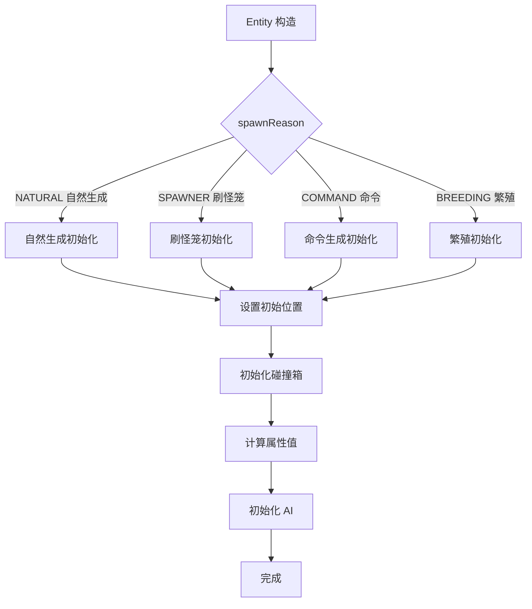
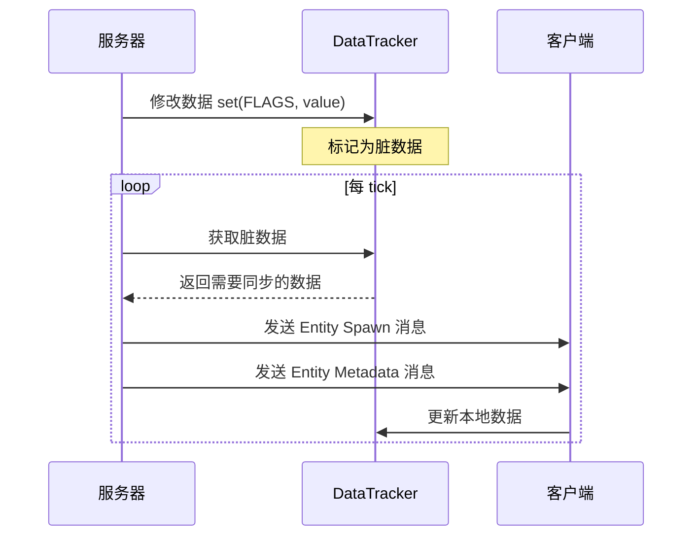
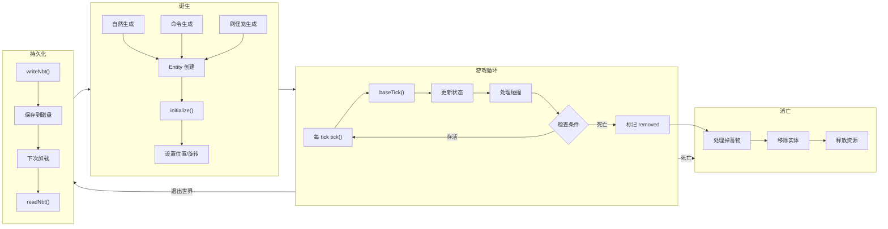

# 第 22 章：实体生命周期（Entity Lifecycle）

> 了解 Entity 从诞生到消亡的完整过程

---

## 章节目标

- 理解 Entity 的完整生命周期
- 掌握 Entity 的创建和初始化过程
- 了解 Entity 的数据持久化（NBT 读写）
- 理解 Entity 的移除机制

## 前置知识

- 熟悉 Entity 基础概念
- 了解 Minecraft 的 Tick 机制

## 核心概念

### Entity 生命周期 = 实体的"生老病死"

```
┌─────────────────────────────────────────────────────────────────────┐
│                        Entity 完整生命周期                              │
├─────────────────────────────────────────────────────────────────────┤
│                                                                     │
│  诞生 ──► 初始化 ──► 数据同步 ──► 游戏循环 ──► 数据保存 ──► 消亡    │
│    │         │            │            │            │            │       │
│    ▼         ▼            ▼            ▼            ▼            ▼       │
│  ┌────┐  ┌────┐     ┌────┐      ┌────┐      ┌────┐      ┌────┐       │
│  │spawn│  │init│     │sync │      │tick │      │save │      │kill │       │
│  └────┘  └────┘     └────┘      └────┘      └────┘      └────┘       │
│                                                                     │
└─────────────────────────────────────────────────────────────────────┘
```

## 1. Entity 的诞生（Spawn）

Entity 的创建有两种方式：

### 1.1 自然生成

```java
// 服务器每 tick 检查并生成实体
public void serverTick(ServerWorld world) {
    // SpawnHelper 处理自然生成
    SpawnHelper.spawn(world, chunk, spawnInfo, ...);
}
```

### 1.2 命令/刷怪笼生成

```java
// 使用 EntityType 创建实体
public Entity create(World world) {
    Entity entity = this.factory.create(this, world);
    return entity;
}

// 常见生成方法
world.spawnEntity(new ZombieEntity(EntityType.ZOMBIE, world));
```

### 1.3 投射物生成

```java
// 箭矢生成示例
ArrowEntity arrow = new ArrowEntity(EntityType.ARROW, world);
arrow.setPositionAndAngles(x, y, z, yaw, pitch);
arrow.setVelocity(vx, vy, vz);
world.spawnEntity(arrow);
```

## 2. Entity 的初始化（Initialize）

Entity 创建后会经历完整的初始化过程：

```java
// Entity 构造后调用 initialize
public EntityData initialize(
    ServerWorldAccess world,
    DifficultyInstance difficulty,
    SpawnReason spawnReason,
    @Nullable EntityData entityData
) {
    // 1. 初始化碰撞箱
    this.setBoundingBox(this.calculateBoundingBox());
    
    // 2. 初始化属性（根据难度调整）
    if (this instanceof Zombie zombie) {
        // 困难模式下可能生成装备
    }
    
    // 3. 初始化 AI（生物）
    if (this instanceof MobEntity mob) {
        mob.initializeBrain();
    }
    
    return entityData;
}
```

### 初始化流程图



## 3. Entity 的 Tick（游戏循环）

每个游戏 tick，Entity 都会执行 `tick()` 方法：

```java
// Entity.tick()
public void tick() {
    this.baseTick();
}

// Entity.baseTick() - 基础 tick 逻辑
public void baseTick() {
    // 1. 检查骑乘状态
    if (this.hasVehicle() && this.getVehicle().isRemoved()) {
        this.stopRiding();
    }
    
    // 2. 处理门户传送冷却
    this.tickPortalTeleportation();
    
    // 3. 处理水分状态
    this.updateWaterState();
    this.updateSubmergedInWaterState();
    this.updateSwimming();
    
    // 4. 处理火焰状态
    if (this.fireTicks > 0) {
        // 服务器端燃烧伤害处理
    } else if (this.getWorld().isClient) {
        // 客户端熄灭
        this.extinguish();
    }
}
```

### LivingEntity 的 tick

```java
// LivingEntity 扩展了基础的 tick
@Override
public void baseTick() {
    this.lastHandSwingProgress = this.handSwingProgress;
    
    // 窒息伤害检测
    if (this.isInsideWall()) {
        this.damage(this.getDamageSources().inWall(), 1.0f);
    }
    
    // 水下呼吸
    if (this.isSubmergedIn(FluidTags.WATER) && !this.canBreatheInWater()) {
        this.setAir(this.getNextAirUnderwater(this.getAir()));
        if (this.getAir() == -20) {
            this.damage(this.getDamageSources().drown(), 2.0f);
        }
    }
    
    // 更新药水效果
    this.tickStatusEffects();
    
    super.baseTick();  // 调用 Entity.baseTick()
}
```

## 4. Entity 的数据同步（DataTracker）

Entity 的状态需要同步给客户端：

```java
// 定义需要同步的数据
protected static final TrackedData<Byte> FLAGS = 
    DataTracker.registerData(Entity.class, TrackedDataHandlerRegistry.BYTE);

// 常用标志位
private static final int ON_FIRE_FLAG_INDEX = 0;        // 燃烧
private static final int SNEAKING_FLAG_INDEX = 1;      // 下蹲
private static final int SPRINTING_FLAG_INDEX = 3;     // 冲刺
private static final int SWIMMING_FLAG_INDEX = 4;      // 游泳

// 设置标志
public void setFlag(int index, boolean value) {
    byte b = this.dataTracker.get(FLAGS);
    if (value) {
        b = (byte)(b | 1 << index);
    } else {
        b = (byte)(b & ~(1 << index));
    }
    this.dataTracker.set(FLAGS, b);
}

// 获取标志
public boolean getFlag(int index) {
    return (this.dataTracker.get(FLAGS) & 1 << index) != 0;
}
```

### 数据同步流程



## 5. Entity 的数据持久化（NBT）

### 保存到 NBT

```java
// Entity.writeNbt()
public void writeNbt(NbtCompound nbt) {
    // 1. 保存类型
    nbt.putString("id", Registries.ENTITY_TYPE.getId(this.type).toString());
    
    // 2. 保存 UUID
    nbt.putUuid("UUID", this.uuid);
    
    // 3. 保存位置
    nbt.putDouble("Pos", new double[]{this.x, this.y, this.z});
    
    // 4. 保存旋转
    nbt.putFloat("YRot", this.yaw);
    nbt.putFloat("XRot", this.pitch);
    
    // 5. 保存速度
    nbt.putDouble("Motion", new double[]{
        this.velocity.x, this.velocity.y, this.velocity.z
    });
    
    // 6. 保存状态
    nbt.putFloat("FallDistance", this.fallDistance);
    nbt.putShort("Fire", (short)this.fireTicks);
    nbt.putShort("Air", (short)this.getAir());
    nbt.putBoolean("OnGround", this.onGround);
    
    // 7. 保存骑乘信息
    if (!this.passengerList.isEmpty()) {
        NbtList passengers = new NbtList();
        for (Entity passenger : this.passengerList) {
            NbtCompound passengerNbt = new NbtCompound();
            passenger.writeNbt(passengerNbt);
            passengers.add(passengerNbt);
        }
        nbt.put("Passengers", passengers);
    }
}
```

### 从 NBT 加载

```java
// Entity.readNbt()
public void readNbt(NbtCompound nbt) {
    // 1. 读取位置
    double[] pos = nbt.getDoubleArray("Pos");
    this.setPosition(pos[0], pos[1], pos[2]);
    
    // 2. 读取旋转
    this.yaw = nbt.getFloat("YRot");
    this.pitch = nbt.getFloat("XRot");
    
    // 3. 读取速度
    double[] motion = nbt.getDoubleArray("Motion");
    this.setVelocity(motion[0], motion[1], motion[2]);
    
    // 4. 读取状态
    this.fireTicks = nbt.getShort("Fire");
    this.setAir(nbt.getShort("Air"));
    this.setOnGround(nbt.getBoolean("OnGround"));
    
    // 5. 读取骑乘信息
    if (nbt.contains("Passengers")) {
        NbtList passengers = nbt.getList("Passengers");
        for (NbtElement element : passengers) {
            Entity passenger = loadEntity((NbtCompound) element, this.world);
            this.addPassenger(passenger);
        }
    }
}
```

## 6. Entity 的移除（Removal）

### 移除原因

```java
// RemovalReason.java
public class RemovalReason {
    public static final RemovalReason KILLED = new RemovalReason("killed");
    public static final RemovalReason DISCARDED = new RemovalReason("discarded");
    public static final RemovalReason UNLOADED_TO_CHUNK = new RemovalReason("unloaded");
    public static final RemovalReason CHANGED_DIMENSION = new RemovalReason("changed_dimension");
    
    // 检查是否真的移除
    public boolean shouldDestroy() {
        return this != UNLOADED_TO_CHUNK;
    }
}
```

### 移除流程

```java
// 通用移除方法
public void remove(RemovalReason reason) {
    this.setRemoved(reason);
    this.emitGameEvent(GameEvent.ENTITY_DIE);
}

// 死亡处理
public void onDeath(DamageSource source) {
    // 1. 标记为死亡
    this.dead = true;
    
    // 2. 触发游戏事件
    this.emitGameEvent(GameEvent.ENTITY_DIE);
    
    // 3. 处理掉落物
    this.drop(source);
    
    // 4. 处理经验值
    if (this instanceof ExperienceDropEntity) {
        this.dropXp();
    }
    
    // 5. 清除药水效果
    this.clearStatusEffects();
    
    // 6. 清除骑乘
    this.getPassengerList().forEach(Entity::stopRiding);
    if (this.getVehicle() != null) {
        this.stopRiding();
    }
}
```

## 实战演示：监听实体生成和死亡

```java
// 事件监听器示例
public class MyEntityEvents {
    
    @SubscribeEvent
    public static void onEntitySpawn(EntityJoinLevelEvent event) {
        Entity entity = event.getEntity();
        
        if (entity instanceof ZombieEntity) {
            // 僵尸生成时
            LOGGER.info("一只僵尸在 {} 生成", entity.getBlockPos());
        }
    }
    
    @SubscribeEvent
    public static void onEntityDeath(LivingDeathEvent event) {
        LivingEntity entity = event.getEntity();
        DamageSource source = event.getSource();
        
        if (entity instanceof PlayerEntity player) {
            // 玩家死亡时
            LOGGER.info("玩家 {} 被 {} 杀死", 
                player.getName().getString(),
                source.getDeathMessage(entity).getString()
            );
        }
    }
    
    @SubscribeEvent
    public static void onEntityDamage(LivingDamageEvent event) {
        LivingEntity entity = event.getEntity();
        float damage = event.getAmount();
        
        if (entity instanceof PlayerEntity && damage > 5.0f) {
            // 玩家受到高伤害时
            LOGGER.warn("玩家受到大量伤害: {} 点", damage);
        }
    }
}
```

## Mermaid 图表：实体生命周期



## 课后自查

完成本章学习后，你应该能够：

- [ ] 说出 Entity 创建的 3 种方式
- [ ] 解释 `initialize()` 方法的作用
- [ ] 理解 Entity tick 的基本流程
- [ ] 知道 DataTracker 的同步机制
- [ ] 能够读写 Entity 的 NBT 数据
- [ ] 理解不同 RemovalReason 的区别

## 关键术语表

| 术语 | 英文 | 解释 |
|------|------|------|
| 生成 | Spawn | Entity 进入世界的过程 |
| 初始化 | Initialize | Entity 创建后的设置过程 |
| Tick | Tick | 游戏循环的最小单位（1/20 秒） |
| 数据追踪 | DataTracker | 实体状态的客户端-服务端同步 |
| NBT | Named Binary Tag | Minecraft 的数据持久化格式 |
| 移除原因 | RemovalReason | 实体离开世界的原因 |

---

**参考源码路径**：

- `D:\Minecraft-Learning\assets\mc\1.21\net\minecraft\entity\Entity.java`
- `D:\Minecraft-Learning\assets\mc\1.21\net\minecraft\entity\LivingEntity.java`
- `D:\Minecraft-Learning\assets\mc\1.21\net\minecraft\entity\data\DataTracker.java`
