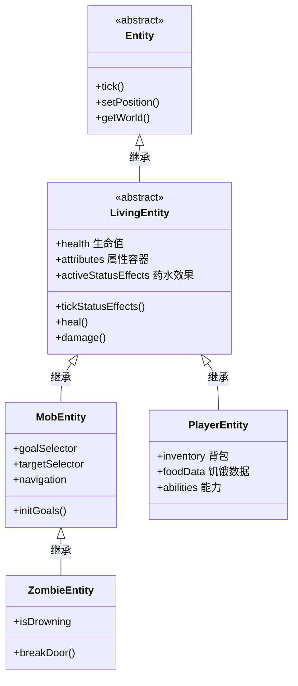
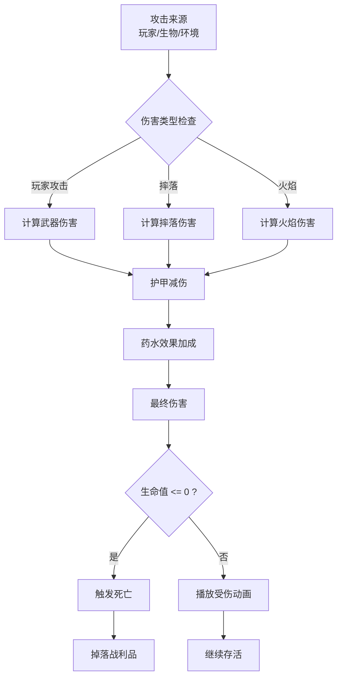

# 第22章 LivingEntity——有血有肉的活物

> **注意**：以下代码示例基于 CFR 反编译结果，实际 Minecraft 源码可能有所差异。在使用时请以游戏源码为准。

## 目标

- 理解 LivingEntity 是什么
- 掌握生命值、饥饿值的概念
- 了解药水效果系统
- 学会处理实体的死亡

## 前置知识

- 了解 Entity 基础（第20章）
- 了解实体生命周期（第21章）

## 核心概念

### 什么是 LivingEntity？

**LivingEntity（有生命实体）** 是 Entity 的子类，代表所有"有血条、会受伤、能死亡"的实体。

```
Entity（实体）
    │
    └── LivingEntity（有生命的）
            │
            ├── 生命值（Health）
            ├── 饥饿值（Food/ Saturation）
            ├── 药水效果（Status Effects）
            ├── 盔甲（Armor）
            └── 装备（Equipment）
```

### 生活中的比喻

```
LivingEntity 就像一个有血有肉的人：

- 有生命值（HP）= 有血条，被打会掉血
- 有饥饿值 = 需要吃饭来补充能量
- 有药水效果 = 吃了药会有不同的状态
- 会死亡 = 血量归零就死了
```

### LivingEntity 的核心功能

```
┌─────────────────────────────────────────────────────────────┐
│                      LivingEntity                           │
├─────────────────────────────────────────────────────────────┤
│ ❤️  生命值系统                                               │
│    - getHealth() / setHealth()                             │
│    - heal() / damage()                                     │
│    - getMaxHealth() / setMaxHealth()                       │
├─────────────────────────────────────────────────────────────┤
│ 🍖 饥饿值系统                                               │
│    - getHunger() / setFoodLevel()                         │
│    - getSaturation() / addSaturation()                     │
├─────────────────────────────────────────────────────────────┤
│ 🧪 药水效果系统                                             │
│    - addEffect() / removeEffect()                          │
│    - hasEffect() / getActiveEffects()                      │
├─────────────────────────────────────────────────────────────┤
│ ⚔️  伤害系统                                                │
│    - damage() / damage sources                              │
│    - hurt() / die()                                        │
├─────────────────────────────────────────────────────────────┤
│ 🛡️  盔甲系统                                                │
│    - getArmor() / damageArmor()                            │
│    - getAbsorption()                                       │
└─────────────────────────────────────────────────────────────┘
```

## 图解

### LivingEntity 继承关系



### 伤害流程图



## 核心代码

> **注意**：以下代码基于 CFR 反编译结果，可能与实际源码略有差异。

### 生命值系统

```java
// LivingEntity.java - 生命值核心代码
public abstract class LivingEntity extends Entity {

    // 生命值相关
    private static final TrackedData<Float> HEALTH =
        DataTracker.registerData(LivingEntity.class, TrackedDataHandlerRegistry.FLOAT);

    // 吸收值（额外血量，如金苹果产生的）
    private float absorptionAmount;

    // 获取当前生命值
    public float getHealth() {
        return this.dataTracker.get(HEALTH);
    }

    // 设置生命值
    public void setHealth(float health) {
        this.dataTracker.set(HEALTH, MathHelper.clamp(health, 0.0f, this.getMaxHealth()));
    }

    // 获取最大生命值
    public float getMaxHealth() {
        return (float)this.getAttributeValue(EntityAttributes.GENERIC_MAX_HEALTH);
    }

    // 治疗（加血）
    public void heal(float amount) {
        if (amount < 0.0f) {
            throw new IllegalArgumentException("Amount cannot be negative");
        }
        float f = this.getHealth();
        if (f > 0.0f) {
            this.setHealth(f + amount);
        }
    }

    // 受伤
    public boolean damage(DamageSource source, float amount) {
        // 检查是否无敌
        if (this.isInvulnerableTo(source)) {
            return false;
        }

        // 检查是否免疫
        if (this.getWorld().isClient) {
            return false;
        }

        // 记录受伤时间
        this.hurtTime = this.maxHurtTime;

        // 计算实际伤害
        float damage = this.applyDamageProtection(amount, source);

        // 扣除护甲
        damage = this.applyArmorToDamage(source, damage);

        // 扣除吸收值
        damage = this.applyEnchantmentDamageProtections(source, damage);

        // 扣除生命值
        this.setHealth(this.getHealth() - damage);

        // 记录伤害来源
        this.damageTracker.trackDamage(source, damage, amount);

        // 检查死亡
        if (damage > 0.0f) {
            this.applyDamageEffects(this, source);
            if (this.shouldDamage(source)) {
                this.lastDamageTaken = damage;
                this.lastDamageSource = source;
                this.lastDamageTime = this.age;
            }
        }

        return true;
    }
}
```

### 饥饿值系统（玩家专属）

```java
// PlayerEntity.java - 饥饿值
public class PlayerEntity extends LivingEntity {

    private int foodLevel = 20;        // 饱食度 0-20
    private float saturationLevel = 5.0f;  // 饱和度
    private float exhaustionLevel = 0.0f;  // 疲劳度

    // 获取饱食度
    public int getHunger() {
        return this.foodLevel;
    }

    // 获取饱和度
    public float getSaturation() {
        return this.saturationLevel;
    }

    // 消耗饥饿值（移动、跳跃等会调用）
    public void addExhaustion(float exhaustion) {
        this.exhaustionLevel += exhaustion;

        // 疲劳度达到4时消耗1点饱食度
        while (this.exhaustionLevel >= 4.0f) {
            this.exhaustionLevel -= 4.0f;
            if (this.foodLevel > 0) {
                this.foodLevel--;
            }
        }
    }

    // 吃东西恢复饥饿值
    public void eatFood(World world, ItemStack stack) {
        FoodComponent food = stack.getOrDefault(DataComponentTypes.FOOD, FoodComponent.DEFAULT);

        // 恢复饱食度
        this.foodLevel = Math.min(this.foodLevel + food.nutrition(), 20);

        // 恢复饱和度（饱和度决定饱食度能恢复多少）
        this.saturationLevel = Math.min(this.saturationLevel +
            food.saturation() * 2.0f * (float)food.nutrition(), (float)this.foodLevel);

        // 消耗物品
        stack.decrement(1);
    }
}
```

### 药水效果系统

```java
// LivingEntity.java - 药水效果
public abstract class LivingEntity extends Entity {

    // 当前生效的药水效果
    private final Map<RegistryEntry<StatusEffect>, StatusEffectInstance> activeStatusEffects;

    // 添加药水效果
    public boolean addStatusEffect(StatusEffectInstance effect) {
        StatusEffect type = effect.getEffectType().value();

        // 如果已有同类效果，检查是否覆盖
        StatusEffectInstance existing = this.activeStatusEffects.get(type);
        if (existing != null) {
            // 新效果更强或时间更长才替换
            if (effect.getAmplifier() > existing.getAmplifier() ||
                (effect.getAmplifier() == existing.getAmplifier() &&
                 effect.getDuration() > existing.getDuration())) {
                // 替换
                this.activeStatusEffects.put(type, effect);
                return true;
            }
            return false;
        }

        // 添加新效果
        this.activeStatusEffects.put(type, effect);
        return true;
    }

    // 移除药水效果
    public void removeStatusEffect(RegistryEntry<StatusEffect> effect) {
        this.activeStatusEffects.remove(effect);
    }

    // 检查是否有某种药水效果
    public boolean hasStatusEffect(RegistryEntry<StatusEffect> effect) {
        return this.activeStatusEffects.containsKey(effect);
    }

    // 获取药水效果
    public StatusEffectInstance getStatusEffect(RegistryEntry<StatusEffect> effect) {
        return this.activeStatusEffects.get(effect);
    }

    // 每刻更新药水效果
    protected void tickStatusEffects() {
        Iterator<Map.Entry<RegistryEntry<StatusEffect>, StatusEffectInstance>> iterator =
            this.activeStatusEffects.entrySet().iterator();

        while (iterator.hasNext()) {
            StatusEffectInstance effect = iterator.next().getValue();

            // 每 tick 减少时间
            if (!effect.update()) {
                // 效果结束
                this.onStatusEffectRemoved(effect);
                iterator.remove();
            } else {
                // 效果还在，检查是否触发特殊行为
                this.onStatusEffectApplied(effect);
            }
        }
    }
}
```

### 死亡处理

```java
// LivingEntity.java - 死亡处理
public abstract class LivingEntity extends Entity {

    protected boolean dead = false;
    public int deathTime = 0;      // 死亡动画时间
    protected int despawnCounter = 0;  // 消失计数器

    // 死亡
    protected void die(DamageSource source) {
        if (this.dead) return;  // 已经死了

        this.dead = true;
        this.deathTime = 0;

        // 触发死亡游戏事件
        this.emitGameEvent(GameEvent.ENTITY_DIE);

        // 播放死亡音效
        this.playDeathSound();

        // 触发死亡回调
        this.onDeath(source);

        // 在服务端：掉落战利品
        if (!this.getWorld().isClient) {
            this.dropLoot(source, this.lastAttacker == this.getAttacker());
            this.dropEquipment(this.lastAttacker == this.getAttacker());
            this.dropXp();
        }
    }

    // 子类可以重写这个方法处理死亡逻辑
    protected void onDeath(DamageSource source) {
        // 默认空实现
    }

    // 僵尸死亡变村民等特殊逻辑
    @Override
    protected void dropEquipment(boolean causedByPlayer) {
        // 掉落装备
    }

    // 掉落经验
    protected void dropXp() {
        if (this.getWorld().isClient) return;
        // 掉落经验球
    }
}
```

## 实战演示

### 场景：创建一个自定义的治疗药水

```java
public class CustomHealingPotion extends Item {

    public CustomHealingPotion(Settings settings) {
        super(settings);
    }

    @Override
    public TypedActionResult<ItemStack> use(World world, PlayerEntity user, Hand hand) {
        ItemStack stack = user.getStackInHand(hand);

        // 检查是否已经有50%的生命值
        if (user.getHealth() < user.getMaxHealth() * 0.5f) {
            // 治愈到50%
            float targetHealth = user.getMaxHealth() * 0.5f;
            float healAmount = targetHealth - user.getHealth();
            if (healAmount > 0) {
                user.heal(healAmount);
                stack.decrement(1);
                return TypedActionResult.success(stack);
            }
        }

        return TypedActionResult.pass(stack);
    }
}
```

### 场景：创建一个"虚弱"药水效果

```java
public class WeaknessEffect extends StatusEffect {

    public WeaknessEffect() {
        super(StatusEffectType.HARMFUL, Color.fromRGB(85, 85, 85)); // 灰色
    }

    @Override
    public boolean canApplyUpdateEffect(int duration, int amplifier) {
        // 每 tick 都检查
        return true;
    }

    @Override
    public void applyUpdateEffect(LivingEntity entity, int amplifier) {
        // 减少攻击伤害
        double attackDamage = entity.getAttributeValue(EntityAttributes.GENERIC_ATTACK_DAMAGE);
        entity.setAttributeValue(EntityAttributes.GENERIC_ATTACK_DAMAGE,
            attackDamage * (1.0 - 0.5 * (amplifier + 1)));  // 每次-50%
    }

    @Override
    public void onRemoved(LivingEntity entity, int amplifier) {
        // 效果结束时恢复攻击力
        // 实际游戏中是通过 AttributeModifier 实现的
    }
}
```

### 场景：处理实体受伤事件

```java
public class EntityDamageHandler {

    // 处理僵尸受伤
    public static void onZombieHurt(LivingEntity entity, DamageSource source, float damage) {
        // 检查是否是火焰伤害
        if (source.isIn(DamageTypeTags.IS_FIRE)) {
            // 僵尸怕火，所以火焰伤害增加
            damage *= 1.5f;
        }

        // 检查是否有凋零效果
        if (entity.hasStatusEffect(StatusEffects.WITHER)) {
            // 凋零效果额外伤害
            damage += 1.0f;
        }

        return damage;
    }

    // 检查实体是否应该死亡
    public static boolean shouldDie(LivingEntity entity, DamageSource source) {
        // 检查是否是和平模式
        if (entity.getWorld().getDifficulty() == Difficulty.PEACEFUL) {
            // 和平模式下，非敌对生物不受伤害
            if (!(entity instanceof HostileEntity)) {
                return false;
            }
        }
        return true;
    }
}
```

## 小结

1. **LivingEntity = 有生命的实体**
   - 有生命值（可以受伤、治疗）
   - 有饥饿值（玩家专属）
   - 有药水效果
   - 能死亡

2. **生命值核心操作**
   - `getHealth()` / `setHealth()` - 获取/设置生命值
   - `heal(amount)` - 治疗
   - `damage(source, amount)` - 受伤

3. **伤害流程**
   - 伤害来源 → 护甲减伤 → 吸收值 → 扣除生命值
   - 生命值归零 → 触发死亡 → 掉落战利品

4. **药水效果**
   - `addStatusEffect()` - 添加效果
   - `removeStatusEffect()` - 移除效果
   - `hasStatusEffect()` - 检查是否有效果
   - 每 tick 自动更新

5. **死亡流程**
   - `die(source)` - 标记死亡
   - `onDeath(source)` - 可重写的死亡回调
   - `dropLoot()` - 掉落战利品
   - `dropXp()` - 掉落经验

## 练习

### 练习 1：创建一个治疗药水

```java
// 创建一个物品，使用后恢复 10 点生命值
// 提示：重写 use() 方法，调用 entity.heal()
```

### 练习 2：创建一个特殊状态

```java
// 创建一个"狂暴"状态效果
// 效果：攻击力翻倍，但每秒失去 1 点生命值
// 提示：继承 StatusEffect，重写 applyUpdateEffect()
```

### 练习 3：自定义死亡掉落

```java
// 创建一个生物，死亡时总是掉落一个钻石
// 提示：重写 getLootTableId() 或 onDeath()
```

## 相关链接

### 源码文件位置

| 文件 | 源码路径 | 说明 |
|------|----------|------|
| LivingEntity.java | `net/minecraft/entity/LivingEntity.java` | 有生命实体基类 |
| EntityDamageHandler.java | `net/minecraft/entity/damage/EntityDamageHandler.java` | 伤害处理 |

- **上一章**：[第21章 实体生命周期](./21-entity-lifecycle.md)
- **下一章**：[第23章 MobEntity](./23-mob-entity.md)
- **相关源码**：
  - `net/minecraft/entity/LivingEntity.java` - 生命值、药水效果
  - `net/minecraft/entity/damage/DamageSource.java` - 伤害来源
  - `net/minecraft/entity/effect/StatusEffect.java` - 药水效果
