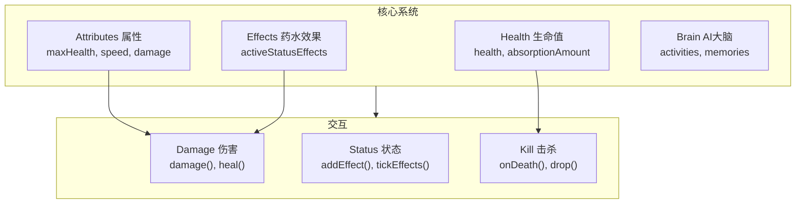

# 第 23 章：LivingEntity 有生命实体（LivingEntity）

> 深入了解所有"活的"实体的共同基类

---

## 章节目标

- 理解 LivingEntity 的核心职责
- 掌握属性系统（Attributes）的基本概念
- 了解生命值和伤害机制
- 理解药水效果系统的运作原理
- 掌握 Brain（AI 大脑）的基础概念

## 前置知识

- 熟悉 Entity 基础概念
- 了解继承层次结构

## 核心概念

### LivingEntity = 有"生命"的实体

如果说 Entity 是一个城市里所有会动的东西，那么 **LivingEntity** 就是城市里所有**有生命的个体**：

- ✅ 有人体健康（生命值）
- ✅ 能被攻击受伤
- ✅ 能吃药（药水效果）
- ✅ 有脑子（AI）
- ✅ 能打别人（攻击）

❌ 不是 LivingEntity：物品掉落、箭矢、TNT（这些是普通 Entity）

## 继承层次

```
┌─────────────────────────────────────────────────────────────────┐
│                         Entity (基类)                            │
│           位置、速度、旋转、碰撞、生命周期                        │
└─────────────────────────────────────────────────────────────────┘
                              │
                              ▼
┌─────────────────────────────────────────────────────────────────┐
│                      LivingEntity (有生命实体)                   │
├─────────────────────────────────────────────────────────────────┤
│  + health: float                    生命值                      │
│  + brain: Brain                    AI 大脑                      │
│  + attributes: AttributeContainer  属性容器                     │
│  + activeStatusEffects: Map         药水效果                    │
│  + handSwingProgress: float        手挥动进度                   │
├─────────────────────────────────────────────────────────────────┤
│  + damage()                        造成伤害                    │
│  + heal()                          治疗                        │
│  + addStatusEffect()                添加药水效果                  │
│  + getAttributeValue()              获取属性值                  │
└─────────────────────────────────────────────────────────────────┘
                              │
          ┌─────────────────────┼─────────────────────┐
          ▼                     ▼                     ▼
┌───────────────┐     ┌───────────────┐     ┌───────────────┐
│  MobEntity   │     │ PlayerEntity │     │ AmbientEntity │
│   (生物)     │     │   (玩家)    │     │  (环境生物)  │
└───────────────┘     └───────────────┘     └───────────────┘
```

## 1. 生命值系统（Health）

### 核心字段

```java
// LivingEntity.java
public static final TrackedData<Float> HEALTH = 
    DataTracker.registerData(LivingEntity.class, TrackedDataHandlerRegistry.FLOAT);

// 当前生命值
protected float health;

// 吸收值（额外生命，如金苹果）
protected float absorptionAmount;

// 无敌时间
protected int invulnerableTimer;
private static final int INVULNERABLE_TIME = 20;  // 10 秒无敌
```

### 生命值相关方法

```java
// 获取当前生命值
public float getHealth() {
    return this.health;
}

// 设置生命值
public void setHealth(float health) {
    this.health = MathHelper.clamp(health, 0.0f, this.getMaxHealth());
}

// 获取最大生命值（通过属性系统）
public float getMaxHealth() {
    return (float) this.getAttributeValue(EntityAttributes.GENERIC_MAX_HEALTH);
}

// 治疗
public void heal(float amount) {
    if (amount > 0.0f) {
        this.setHealth(this.getHealth() + amount);
    }
}

// 检查是否死亡
public boolean isDead() {
    return this.health <= 0.0f;
}
```

### 生命值流程图

```mermaid
flowchart TD
    Start["伤害发生"] --> Check1{"无敌时间?"}
    
    Check1 -->|"是| bypass"| Skip["跳过伤害"]
    Check1 -->|"否| 继续"| Check2{"伤害 > 0?"}
    
    Check2 -->|"否| Skip"
    Check2 -->|"是| Continue
    
    Continue --> DamageCalc["伤害计算"]
    DamageCalc --> Apply["应用伤害"]
    
    Apply --> Absorb{"吸收值 > 0?"}
    Absorb -->|"是| UseAbsorb["消耗吸收值"]
    Absorb -->|"否| ReduceHP["减少生命值"]
    
    UseAbsorb --> ReduceAbsorb["absorption -= damage"]
    ReduceAbsorb --> Zero{"absorption = 0?"}
    Zero -->|"是| ReduceHP
    Zero -->|"否| End
    
    ReduceHP --> HPZero{"health <= 0?"}
    HPZero -->|"是| Death["触发 onDeath()"]
    HPZero -->|"否| End["返回"]
    
    Death --> Drop["掉落物品"]
    Drop --> XP["掉落经验"]
```

## 2. 属性系统（Attributes）

### 什么是属性？

**属性 = 生物的能力数值**

就像游戏角色的属性点：
- 生命值上限 → `MAX_HEALTH`
- 移动速度 → `MOVEMENT_SPEED`
- 攻击力 → `ATTACK_DAMAGE`
- 防御力 → `ARMOR`

### 常用属性

```java
// EntityAttributes.java
public static final EntityAttribute GENERIC_MAX_HEALTH;        // 最大生命
public static final EntityAttribute GENERIC_FOLLOW_RANGE;      // 追踪范围
public static final EntityAttribute GENERIC_KNOCKBACK_RESISTANCE; // 击退抗性
public static final EntityAttribute GENERIC_MOVEMENT_SPEED;     // 移动速度
public static final EntityAttribute GENERIC_ARMOR;             // 护甲
public static final EntityAttribute GENERIC_ARMOR_TOUGHNESS;   // 护甲韧性
public static final EntityAttribute GENERIC_ATTACK_DAMAGE;    // 攻击伤害
public static final EntityAttribute GENERIC_ATTACK_KNOCKBACK;  // 攻击击退
public static final EntityAttribute GENERIC_MAX_ABSORPTION;    // 最大吸收值
```

### 属性容器

```java
// 属性容器管理实体的所有属性
private final AttributeContainer attributes;

// 获取属性值
public double getAttributeValue(EntityAttribute attribute) {
    EntityAttributeInstance instance = this.attributes.get(attribute);
    return instance != null ? instance.getValue() : attribute.getDefaultValue();
}

// 获取特定实例（用于修改）
public EntityAttributeInstance getAttributeInstance(EntityAttribute attribute) {
    return this.attributes.get(attribute);
}
```

### 属性修饰符

属性可以通过**修饰符**临时或永久改变：

```java
// 修饰符操作类型
public enum Operation {
    ADD_VALUE,           // 加法 (base + modifier)
    MULTIPLY_BASE,       // 乘法 (base * (1 + modifier))
    MULTIPLY_TOTAL       // 乘法 (final * (1 + modifier))
}

// 示例：疾跑速度加成
public static final EntityAttributeModifier SPRINTING_SPEED_BOOST = 
    new EntityAttributeModifier(
        Identifier.ofVanilla("sprinting"), 
        0.3f, 
        EntityAttributeModifier.Operation.ADD_MULTIPLIED_TOTAL
    );

// 添加修饰符
public void addAttributeModifiers(AttributeModifiers modifiers) {
    this.attributes.addTemporaryModifiers(modifiers.getModifiers());
}

// 常见修饰符来源
// - 装备物品
// - 药水效果
// - 附魔
// - 药水/药水箭
```

### 属性计算流程

```
基础值 (base)
    │
    ├──► + 加法修饰符 (ADD_VALUE)
    │
    ├──► × 乘法修饰符基础 (MULTIPLY_BASE)
    │
    └──► × (1 + 乘法修饰符总数) (MULTIPLY_TOTAL)
```

## 3. 药水效果系统（Status Effects）

### 核心字段

```java
// 活跃的药水效果
private final Map<RegistryEntry<StatusEffect>, StatusEffectInstance> activeStatusEffects;

// 药水粒子效果（客户端渲染用）
protected static final TrackedData<List<ParticleEffect>> POTION_SWIRLS = 
    DataTracker.registerData(LivingEntity.class, TrackedDataHandlerRegistry.PARTICLE_LIST);
```

### 添加药水效果

```java
// 添加药水效果
public void addStatusEffect(StatusEffectInstance effect) {
    this.addStatusEffect(effect, EntityPoses.DEFAULT);
}

public void addStatusEffect(StatusEffectInstance effect, EntityPose pose) {
    // 1. 检查是否会被效果影响
    if (!this.isAffectedBy(effect)) {
        return;
    }
    
    // 2. 获取已有效果
    StatusEffectInstance existingEffect = 
        this.activeStatusEffects.get(effect.getEffectType());
    
    if (existingEffect == null) {
        // 3. 添加新效果
        this.activeStatusEffects.put(effect.getEffectType(), effect);
        this.onStatusEffectApplied(effect, pose);
    } else {
        // 4. 合并效果（升级或刷新时间）
        existingEffect.combine(effect);
        this.onStatusEffectUpdated(existingEffect, true, pose);
    }
    
    this.effectsChanged = true;
}
```

### 药水效果Tick

```java
// 每 tick 调用
private void tickStatusEffects() {
    // 遍历所有活跃效果
    for (Iterator it = this.activeStatusEffects.entrySet().iterator(); it.hasNext(); ) {
        StatusEffectInstance effectInstance = it.next();
        StatusEffect effect = effectInstance.getEffectType().value();
        
        // 检查效果是否结束
        if (!effectInstance.tick(this)) {
            // 效果结束，移除
            this.onStatusEffectRemoved(effectInstance);
            it.remove();
            this.effectsChanged = true;
        } else if (effectInstance.shouldTick()) {
            // 每刻应用效果
            effect.applyUpdateEffect(this);
        }
    }
    
    if (this.effectsChanged) {
        this.onStatusEffectsChanged();
        this.effectsChanged = false;
    }
}
```

### 常用药水效果

| 效果 | 英文 | 作用 |
|------|------|------|
| 速度 | Speed | 移动速度 +20% 每级 |
| 缓慢 | Slowness | 移动速度 -15% 每级 |
| 力量 | Strength | 攻击伤害 +3 每级 |
| 虚弱 | Weakness | 攻击伤害 -20% 每级 |
| 抗性 | Resistance | 伤害减免 20% 每级 |
| 生命恢复 | Regeneration | 每 50 ticks 恢复半颗心/级 |
| 夜视 | Night Vision | 黑暗中正常视野 |
| 隐身 | Invisibility | 隐身（但攻击时失效） |

## 4. Brain AI 大脑（预览）

LivingEntity 拥有 Brain（大脑）来控制 AI 行为：

```java
// AI 大脑
protected Brain<?> brain;

// 初始化大脑
public Brain<D> initializeBrain() {
    this.brain = this.createBrain(this.getBrainFactory());
    return this.brain;
}

// 创建大脑（由子类实现）
protected Brain.Provider<D> getBrainFactory() {
    return Brain::new;
}
```

Brain 的详细内容将在 Part-5 AI 系统中深入讲解。

## 5. 伤害系统基础

### 伤害流程

```java
// 造成伤害
public boolean damage(DamageSource source, float amount) {
    // 1. 检查免疫
    if (this.isInvulnerableTo(source)) {
        return false;
    }
    
    // 2. 如果在睡觉则唤醒
    if (this.isSleeping() && !this.getWorld().isClient) {
        this.wakeUp();
    }
    
    // 3. 计算实际伤害
    float damage = amount;
    damage = this.modifyAppliedDamage(source, damage);
    
    // 4. 检查伤害是否有效
    if (damage <= 0.0f) {
        return false;
    }
    
    // 5. 应用伤害
    return this.applyDamage(source, damage);
}
```

### 伤害修改

```java
// 修改伤害值（护甲、附魔、药水）
protected float modifyAppliedDamage(DamageSource source, float damage) {
    // 1. 护甲减免
    damage = this.getDamageReduction(source, damage);
    
    // 2. 附魔保护
    damage = this.applyEnchantmentDamage(source, damage);
    
    // 3. 药水效果修改
    damage = this.applyStatusEffectDamage(source, damage);
    
    return damage;
}
```

### 护甲计算

```java
// 护甲减免公式
// reduction = (armor * 4) / (20 + armor * 4 + toughness²)
private float getDamageReduction(DamageSource source, float damage) {
    if (source.isIn(DamageTypeTags.DAMAGE_BYPASSES_ARMOR)) {
        return damage;
    }
    
    float armor = (float) this.getAttributeValue(EntityAttributes.GENERIC_ARMOR);
    float toughness = (float) this.getAttributeValue(EntityAttributes.GENERIC_ARMOR_TOUGHNESS);
    
    float reduction = (armor * 4.0f) / (20.0f + armor * 4.0f + toughness * toughness);
    
    return damage * (1.0f - reduction);
}
```

## Mermaid 图表：LivingEntity 核心系统



## 实战演示：创建带属性修改的 Entity

```java
public class MyLivingEntity extends LivingEntity {
    
    public MyLivingEntity(EntityType<?> type, World world) {
        super(type, world);
        
        // 初始化自定义属性
        this.getAttributeInstance(EntityAttributes.GENERIC_MAX_HEALTH)
            .setBaseValue(100.0);  // 100 生命值（50 颗心）
        
        this.getAttributeInstance(EntityAttributes.GENERIC_ATTACK_DAMAGE)
            .setBaseValue(10.0);  // 10 攻击伤害
        
        this.setHealth(this.getMaxHealth());  // 满血
    }
    
    @Override
    protected void addStatusEffectModifiers(AttributeModifiers.Builder builder) {
        // 添加基于装备的属性加成
        builder.add(
            EntityAttributes.GENERIC_MOVEMENT_SPEED,
            new EntityAttributeModifier(
                Identifier.ofVanilla("equippable_boots"),
                0.1,  // +10% 速度
                EntityAttributeModifier.Operation.ADD_MULTIPLY_TOTAL
            )
        );
    }
}
```

## 课后自查

完成本章学习后，你应该能够：

- [ ] 解释 LivingEntity 和 Entity 的区别
- [ ] 说出 LivingEntity 的 4 个核心子系统
- [ ] 理解属性系统的工作原理
- [ ] 知道护甲减免的计算公式
- [ ] 了解药水效果的基本流程
- [ ] 能够创建具有自定义属性的 LivingEntity

## 关键术语表

| 术语 | 英文 | 解释 |
|------|------|------|
| 生命值 | Health | 实体的生命/血量 |
| 吸收值 | Absorption | 额外的临时生命 |
| 属性 | Attribute | 实体的能力数值 |
| 属性修饰符 | AttributeModifier | 临时改变属性的机制 |
| 药水效果 | Status Effect | 临时的 buffs/debuffs |
| AI 大脑 | Brain | 控制实体行为的 AI 模块 |

---

**参考源码路径**：

- `D:\Minecraft-Learning\assets\mc\1.21\net\minecraft\entity\LivingEntity.java`
- `D:\Minecraft-Learning\assets\mc\1.21\net\minecraft\entity\attribute\EntityAttributes.java`
- `D:\Minecraft-Learning\assets\mc\1.21\net\minecraft\entity\effect\StatusEffect.java`
