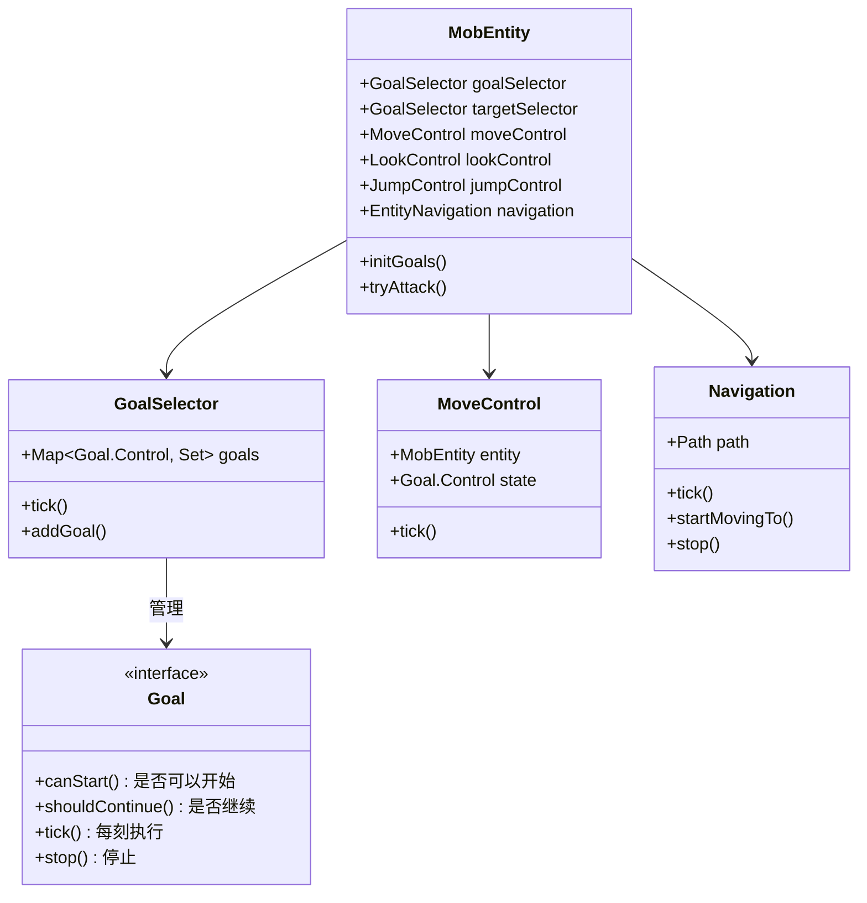
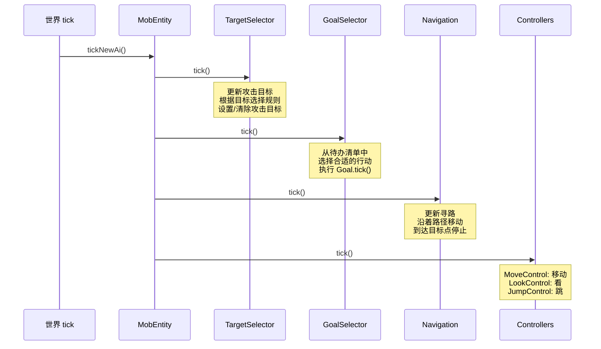
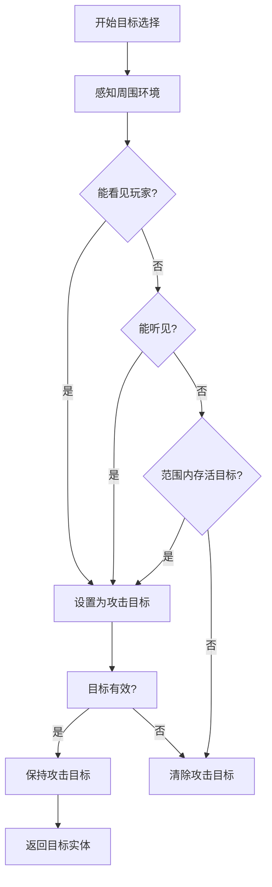

# 第23章 MobEntity——会思考的生物

> **注意**：以下代码示例基于 CFR 反编译结果，实际 Minecraft 源码可能有所差异。在使用时请以游戏源码为准。

## 目标

- 理解 MobEntity 是什么
- 掌握 AI 系统：GoalSelector 和 TargetSelector
- 了解导航系统（PathNavigator）
- 了解移动控制（MoveControl）

## 前置知识

- 了解 LivingEntity（第22章）
- 了解实体生命周期（第21章）

## 核心概念

### 什么是 MobEntity？

**MobEntity（生物实体）** 是 LivingEntity 的子类，代表所有"会自己移动、有 AI 行为"的实体。

```
Entity（实体）
    │
    └── LivingEntity（有生命的）
            │
            └── MobEntity（会思考的生物）
                    │
                    ├── 移动控制系统
                    │   ├── MoveControl（移动控制）
                    │   ├── LookControl（视角控制）
                    │   └── JumpControl（跳跃控制）
                    │
                    ├── 导航系统
                    │   └── Navigation（PathNavigator）
                    │
                    ├── AI 目标系统
                    │   ├── GoalSelector（行为目标）
                    │   └── TargetSelector（攻击目标）
                    │
                    └── 装备系统
                        ├── 手持物品
                        └── 盔甲装备
```

### 生活中的比喻

```
MobEntity 就像一个有自己的"小脑子"的生物：

- MoveControl = 腿，告诉它怎么走路
- LookControl = 脖子，告诉它往哪看
- Navigation = 导航系统，告诉它怎么去目的地
- GoalSelector = 待办清单，要做的事情
- TargetSelector = 目标清单，要攻击/跟随的对象
```

### MobEntity 的核心组件

```
┌────────────────────────────────────────────────────────────────┐
│                        MobEntity                               │
├────────────────────────────────────────────────────────────────┤
│ 🦵 移动控制系统                                                 │
│    ┌──────────────┐  ┌──────────────┐  ┌──────────────┐       │
│    │ MoveControl │  │ LookControl  │  │ JumpControl  │       │
│    │ 移动指令    │  │ 看向哪里    │  │ 跳跃指令    │       │
│    └──────────────┘  └──────────────┘  └──────────────┘       │
├────────────────────────────────────────────────────────────────┤
│ 🧭 导航系统                                                    │
│    ┌──────────────────────────────────────────────┐           │
│    │           Navigation（PathNavigator）        │           │
│    │  - startMovingTo() 开始移动到目标          │           │
│    │  - stop() 停止移动                          │           │
│    │  - isIdle() 是否空闲                        │           │
│    └──────────────────────────────────────────────┘           │
├────────────────────────────────────────────────────────────────┤
│ 🎯 AI 目标系统                                                 │
│    ┌────────────────────┐  ┌────────────────────┐            │
│    │    GoalSelector    │  │  TargetSelector    │            │
│    │    行为目标列表     │  │  攻击目标列表      │            │
│    │    (做什么)        │  │  (打谁)            │            │
│    └────────────────────┘  └────────────────────┘            │
└────────────────────────────────────────────────────────────────┘
```

## 图解

### MobEntity 系统架构



### AI 执行流程



### 目标选择系统



## 核心代码

> **注意**：以下代码基于 CFR 反编译结果，可能与实际源码略有差异。

### MobEntity 的构造函数

```java
// MobEntity.java - 生物实体的初始化
public abstract class MobEntity extends LivingEntity {

    // 目标选择器
    protected final GoalSelector goalSelector;
    protected final GoalSelector targetSelector;

    // 控制器
    protected LookControl lookControl;
    protected MoveControl moveControl;
    protected JumpControl jumpControl;
    protected final BodyControl bodyControl;

    // 导航系统
    protected EntityNavigation navigation;

    // 攻击目标
    @Nullable
    private LivingEntity target;

    public MobEntity(EntityType<?> entityType, World world) {
        super(entityType, world);

        // 初始化 AI 选择器
        this.goalSelector = new GoalSelector(world.getProfilerSupplier());
        this.targetSelector = new GoalSelector(world.getProfilerSupplier());

        // 初始化控制器
        this.lookControl = new LookControl(this);
        this.moveControl = new MoveControl(this);
        this.jumpControl = new JumpControl(this);
        this.bodyControl = this.createBodyControl();

        // 初始化导航
        this.navigation = this.createNavigation(world);

        // 在服务端初始化 AI 目标
        if (world != null && !world.isClient) {
            this.initGoals();
        }
    }

    // 子类重写这个方法来添加 AI 目标
    protected void initGoals() {
        // 默认空实现
    }

    // 创建导航系统
    protected EntityNavigation createNavigation(World world) {
        return new MobNavigation(this, world);
    }

    // 创建身体控制器（子类可以重写）
    protected BodyControl createBodyControl() {
        return new BodyControl(this);
    }
}
```

### GoalSelector（行为目标选择器）

```java
// GoalSelector.java - 行为目标管理器
public class GoalSelector {

    // 按优先级分组的目标
    private final Map<Goal.Control, Set<Goal>> goalMap = new EnumMap<>(Goal.Control.class);

    // 添加目标
    public void addGoal(int priority, Goal goal) {
        // priority 越小优先级越高
        for (Goal.Control control : goal.getControls()) {
            Set<Goal> goals = this.goalMap.computeIfAbsent(control, k -> new ObjectLinkedOpenHashSet<>());
            goals.removeIf(g -> g.getPriority() == priority);
            goals.add(goal);
        }
        goal.setPriority(priority);
    }

    // 每刻更新
    public void tick() {
        // 遍历所有目标
        for (Goal goal : this.getRunningGoals()) {
            // 检查是否可以运行
            if (goal.canStart()) {
                // 执行目标
                goal.tick();
            } else {
                // 停止目标
                goal.stop();
            }
        }
    }

    // 获取正在运行的目标
    public Iterable<Goal> getRunningGoals() {
        return this.goalMap.values().stream()
            .flatMap(Collection::stream)
            .filter(Goal::isRunning)
            .sorted(Comparator.comparingInt(Goal::getPriority));
    }
}
```

### 目标选择器（TargetSelector）

```java
// MobEntity.java - 目标选择相关代码
public abstract class MobEntity extends LivingEntity {

    // 攻击目标
    @Nullable
    private LivingEntity target;

    // 获取攻击目标
    @Override
    @Nullable
    public LivingEntity getTarget() {
        return this.target;
    }

    // 设置攻击目标
    public void setTarget(@Nullable LivingEntity target) {
        this.target = target;
    }

    // 检查能否将某实体设为目标
    @Override
    public boolean canTarget(EntityType<?> type) {
        // 默认可以攻击除了末影人之外的所有生物
        return type != EntityType.GHAST;
    }

    // 检查是否在攻击范围内
    public boolean isInAttackRange(LivingEntity entity) {
        return this.getAttackBox().intersects(entity.getHitbox());
    }

    // 获取攻击范围
    protected Box getAttackBox() {
        return this.getBoundingBox().expand(ATTACK_RANGE, 0.0, ATTACK_RANGE);
    }
}
```

### 移动控制（MoveControl）

```java
// MoveControl.java - 移动控制器
public class MoveControl {

    public enum State {
        WAIT,       // 等待
        MOVE_TO,    // 移动到目标
        JUMPING,    // 跳跃中
        STRAFE      // 横向移动
    }

    private final MobEntity entity;
    private State state = State.WAIT;
    private double targetX, targetY, targetZ;
    private float speed;

    // 设置移动目标
    public void moveTo(double x, double y, double z, float speed) {
        this.targetX = x;
        this.targetY = y;
        this.targetZ = z;
        this.speed = speed;
        this.state = State.MOVE_TO;
    }

    // 每刻更新
    public void tick() {
        switch (state) {
            case MOVE_TO -> {
                // 计算方向
                double dx = targetX - entity.getX();
                double dy = targetY - entity.getY();
                double dz = targetZ - entity.getZ();

                // 如果很接近目标，停止移动
                if (dx * dx + dy * dy + dz * dz < 0.25) {
                    entity.setMovementSpeed(0);
                    state = State.WAIT;
                    return;
                }

                // 设置移动方向和速度
                entity.setForwardSpeed(speed);
                entity.setUpwardSpeed(dy > 0 ? 1 : 0);
            }
            case JUMPING -> {
                // 跳跃中...
            }
        }
    }
}
```

### 导航系统（Navigation）

```java
// MobNavigation.java - 陆地导航
public class MobNavigation extends EntityNavigation {

    private final MobEntity mob;

    public MobNavigation(MobEntity mob, World world) {
        super(mob, world);
        this.mob = mob;
    }

    // 开始移动到目标位置
    public void startMovingTo(double x, double y, double z, double speed) {
        this.start(
            new PathickeNodeEvaluator(),
            new Path(x, y, z),
            speed
        );
    }

    // 开始追踪实体
    public void startMovingTo(Entity entity, double speed) {
        this.start(
            new PathickeNodeEvaluator(),
            new EntityPath(entity),
            speed
        );
    }

    // 停止移动
    public void stop() {
        this.currentPath = null;
    }

    // 检查是否在移动
    public boolean isIdle() {
        return this.currentPath == null;
    }

    // 每刻更新
    @Override
    public void tick() {
        if (this.isIdle()) return;

        // 沿路径移动
        this.doTick();
    }
}
```

### 攻击逻辑

```java
// MobEntity.java - 攻击相关
public abstract class MobEntity extends LivingEntity {

    private static final double ATTACK_RANGE = Math.sqrt(2.04f) - 0.6;

    // 尝试攻击
    public boolean tryAttack(Entity target) {
        // 获取攻击力
        float attackDamage = (float)this.getAttributeValue(EntityAttributes.GENERIC_ATTACK_DAMAGE);

        // 获取伤害来源
        DamageSource damageSource = this.getDamageSources().mobAttack(this);

        // 附加附魔伤害
        if (this.getWorld() instanceof ServerWorld serverWorld) {
            attackDamage = EnchantmentHelper.getDamage(
                serverWorld,
                this.getWeaponStack(),  // 主手物品
                target,
                damageSource,
                attackDamage
            );
        }

        // 造成伤害
        boolean hit = target.damage(damageSource, attackDamage);

        if (hit) {
            // 击退
            float knockback = (float)this.getAttributeValue(EntityAttributes.GENERIC_ATTACK_KNOCKBACK);
            if (target instanceof LivingEntity living) {
                living.takeKnockback(
                    knockback * 0.5f,
                    MathHelper.sin(this.getYaw() * 0.017453292f),
                    -MathHelper.cos(this.getYaw() * 0.017453292f)
                );
            }

            // 附加附魔效果
            if (this.getWorld() instanceof ServerWorld serverWorld) {
                EnchantmentHelper.onTargetDamaged(serverWorld, target, damageSource);
            }

            // 后摇
            this.setAttacking(false);
        }

        return hit;
    }
}
```

## 实战演示

### 场景：创建一个简单的巡逻 AI

```java
public class PatrolGoal extends Goal {

    private final MobEntity mob;
    private final double speed;
    private final float maxDistance;
    private Vec3d targetPos;

    public PatrolGoal(MobEntity mob, double speed, float maxDistance) {
        this.mob = mob;
        this.speed = speed;
        this.maxDistance = maxDistance;
        this.setControls(EnumSet.of(Goal.Control.MOVE));
    }

    @Override
    public boolean canStart() {
        // 总是可以开始巡逻
        return true;
    }

    @Override
    public boolean shouldContinue() {
        // 如果有目标且还没到达，继续
        if (!this.mob.getNavigation().isIdle()) {
            return true;
        }
        return this.mob.squaredDistanceTo(targetPos) > 1.0;
    }

    @Override
    public void start() {
        // 随机选择一个巡逻点
        this.targetPos = this.getRandomPosition();
        this.mob.getNavigation().startMovingTo(
            targetPos.x, targetPos.y, targetPos.z,
            this.speed
        );
    }

    @Override
    public void tick() {
        // 每刻检查是否到达
        if (this.mob.squaredDistanceTo(targetPos) < 2.0) {
            this.stop();
        }
    }

    @Override
    public void stop() {
        this.mob.getNavigation().stop();
        // 选择下一个目标
        this.start();
    }

    private Vec3d getRandomPosition() {
        double x = this.mob.getX() + (this.mob.random.nextFloat() * 2 - 1) * this.maxDistance;
        double z = this.mob.getZ() + (this.mob.random.nextFloat() * 2 - 1) * this.maxDistance;
        return new Vec3d(x, this.mob.getY(), z);
    }
}
```

### 场景：创建一个攻击目标的 AI

```java
public class MeleeAttackGoal extends Goal {

    private final MobEntity mob;
    private final double speed;
    private final float attackRange;
    private int cooldown = 0;

    public MeleeAttackGoal(MobEntity mob, double speed, float attackRange) {
        this.mob = mob;
        this.speed = speed;
        this.attackRange = attackRange;
        this.setControls(EnumSet.of(Goal.Control.MOVE, Goal.Control.LOOK));
    }

    @Override
    public boolean canStart() {
        // 需要有攻击目标
        LivingEntity target = this.mob.getTarget();
        return target != null && target.isAlive();
    }

    @Override
    public boolean shouldContinue() {
        return this.canStart();
    }

    @Override
    public void start() {
        this.cooldown = 0;
    }

    @Override
    public void tick() {
        LivingEntity target = this.mob.getTarget();

        // 看向目标
        this.mob.getLookControl().lookAt(target, 30.0f, 30.0f);

        // 接近目标
        double distance = this.mob.squaredDistanceTo(target);
        if (distance > this.attackRange * this.attackRange) {
            // 距离太远，移动过去
            this.mob.getNavigation().startMovingTo(target, this.speed);
        } else {
            // 停止移动
            this.mob.getNavigation().stop();

            // 攻击冷却
            if (this.cooldown <= 0) {
                // 攻击
                this.mob.tryAttack(target);
                this.cooldown = 20; // 1秒冷却
            }
        }

        if (this.cooldown > 0) {
            this.cooldown--;
        }
    }

    @Override
    public void stop() {
        this.mob.getNavigation().stop();
        this.cooldown = 0;
    }
}
```

### 场景：初始化生物的 AI

```java
public class ExampleMobEntity extends MobEntity {

    public ExampleMobEntity(EntityType<?> type, World world) {
        super(type, world);
    }

    @Override
    protected void initGoals() {
        // 创建目标选择器
        this.targetSelector.addGoal(0, new ActiveTargetGoal<>(
            this,
            PlayerEntity.class,
            true  // 检查可见性
        ));

        // 创建行为目标
        this.goalSelector.addGoal(1, new MeleeAttackGoal(this, 1.2, 2.0));
        this.goalSelector.addGoal(2, new PatrolGoal(this, 0.8, 10.0));
        this.goalSelector.addGoal(3, new LookAtPlayerGoal(this, PlayerEntity.class, 8.0f));
        this.goalSelector.addGoal(4, new RandomLookAroundGoal(this));
    }
}
```

## 小结

1. **MobEntity = 有 AI 的生物**
   - 继承了 LivingEntity 的所有功能
   - 添加了 AI 系统来控制行为

2. **四大控制系统**
   - `MoveControl` - 控制移动方向和速度
   - `LookControl` - 控制看向哪里
   - `JumpControl` - 控制跳跃
   - `BodyControl` - 控制身体旋转

3. **AI 目标系统**
   - `GoalSelector` - 管理行为目标（做什么）
   - `TargetSelector` - 管理攻击目标（打谁）
   - 优先级数字越小，优先级越高

4. **导航系统**
   - `Navigation` - 寻路移动
   - `startMovingTo()` - 开始追踪
   - `stop()` - 停止移动

5. **AI 开发流程**
   - 创建 Goal 类定义行为
   - 在 `initGoals()` 中注册
   - Goal 会自动执行

## 练习

### 练习 1：创建跟随目标 AI

```java
// 创建一个 FollowOwnerGoal
// 功能：生物始终跟随玩家
// 提示：使用 Entity.getControllingPlayer() 获取主人
```

### 练习 2：创建范围巡逻 AI

```java
// 创建一个原地转圈巡逻的 AI
// 功能：在原地随机方向移动
// 提示：使用 setForwardSpeed() 和 setSidewaysSpeed()
```

### 练习 3：创建逃跑 AI

```java
// 创建一个当生命值低时逃跑的 AI
// 功能：生命值低于50%时远离攻击者
// 提示：在 tick() 中检查 mob.getHealth()
```

## 相关链接

### 源码文件位置

| 文件 | 源码路径 | 说明 |
|------|----------|------|
| MobEntity.java | `net/minecraft/entity/mob/MobEntity.java` | 生物实体基类 |
| GoalSelector.java | `net/minecraft/entity/ai/GoalSelector.java` | 目标选择器 |
| TargetSelector.java | `net/minecraft/entity/ai/TargetSelector.java` | 目标选择器 |
| Navigation.java | `net/minecraft/entity/ai/Navigation.java` | 导航系统 |

- **上一章**：[第22章 LivingEntity](./22-living-entity.md)
- **下一章**：[第24章 实体属性系统](./24-entity-attributes.md)
- **相关源码**：
  - `net/minecraft/entity/mob/MobEntity.java` - MobEntity 主类
  - `net/minecraft/entity/ai/goal/Goal.java` - Goal 接口
  - `net/minecraft/entity/ai/control/*.java` - 控制器
  - `net/minecraft/entity/ai/pathing/*.java` - 导航系统
