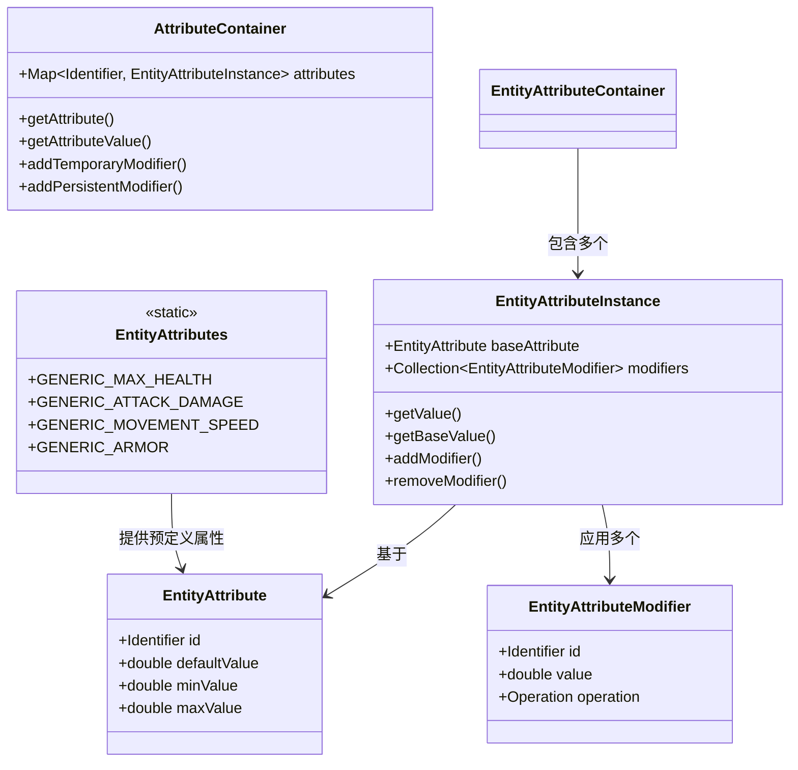

# 第24章 实体属性系统——角色的能力数值

> **注意**：以下代码示例基于 CFR 反编译结果，实际 Minecraft 源码可能有所差异。在使用时请以游戏源码为准。

## 目标

- 理解属性系统是什么
- 掌握 Attribute 和 AttributeModifier
- 了解常见属性及其作用
- 学会使用属性系统

## 前置知识

- 了解 LivingEntity（第22章）
- 了解 Java 基础（接口、修饰符）

## 核心概念

### 什么是实体属性系统？

**实体属性系统（Entity Attributes）** 是 Minecraft 用来表示实体"能力值"的机制——比如生命值上限、移动速度、攻击伤害等。

```
属性系统 = 属性 + 修饰符

┌─────────────────────────────────────────────────────────────┐
│                    属性容器（AttributeContainer）              │
│  ┌──────────────┐  ┌──────────────┐  ┌──────────────┐     │
│  │ GENERIC_     │  │ GENERIC_     │  │ GENERIC_     │     │
│  │ MAX_HEALTH   │  │ ATTACK_DAMAGE│  │ MOVEMENT_    │     │
│  │              │  │              │  │ SPEED        │     │
│  │ 基础值: 20   │  │ 基础值: 2    │  │ 基础值: 0.7  │     │
│  │ 当前值: 20   │  │ 当前值: 5    │  │ 当前值: 0.8  │     │
│  └──────┬───────┘  └──────┬───────┘  └──────┬───────┘     │
│         │                 │                 │               │
│         ▼                 ▼                 ▼               │
│  ┌──────────────┐  ┌──────────────┐  ┌──────────────┐   │
│  │ Modifier: +5 │  │ Modifier: +3 │  │ Modifier: +0.1│   │
│  │ (装备加成)   │  │ (药水效果)   │  │ (附魔加成)   │   │
│  └──────────────┘  └──────────────┘  └──────────────┘   │
└─────────────────────────────────────────────────────────────┘
```

### 生活中的比喻

```
属性系统就像 RPG 游戏中的角色面板：

- 生命值上限（MAX_HEALTH）= HP 槽的长度
- 攻击伤害（ATTACK_DAMAGE）= 攻击力
- 移动速度（MOVEMENT_SPEED）= 敏捷度
- 护甲值（ARMOR）= 防御力

修饰符就像是各种 BUFF：
- 装备加成 = 穿上装备后的提升
- 药水效果 = 喝药后的提升
- 附魔加成 = 武器附魔后的提升
```

### Minecraft 中的常见属性

| 属性名 | 中文名 | 默认值 | 说明 |
|--------|--------|--------|------|
| GENERIC_MAX_HEALTH | 最大生命值 | 20 | 生命值上限 |
| GENERIC_ARMOR | 护甲值 | 0 | 减伤百分比 |
| GENERIC_ARMOR_TOUGHNESS | 护甲韧性 | 0 | 对高伤害的额外减伤 |
| GENERIC_ATTACK_DAMAGE | 攻击伤害 | 2 | 基础攻击力 |
| GENERIC_ATTACK_KNOCKBACK | 攻击击退 | 0 | 击退力度 |
| GENERIC_ATTACK_SPEED | 攻击速度 | 4 | 每秒攻击次数 |
| GENERIC_MOVEMENT_SPEED | 移动速度 | 0.7 | 每刻移动距离 |
| GENERIC_FOLLOW_RANGE | 追踪范围 | 32 | 怪物感知玩家的范围 |
| GENERIC_KNOCKBACK_RESISTANCE | 击退抗性 | 0 | 被击退时减少的百分比 |
| GENERIC_LUCK | 运气 | 0 | 战利品运气 |
| ZOMBIE_SPAWN_REINFORCEMENTS | 僵尸增援 | 0 | 僵尸呼叫同伴的概率 |

## 图解

### 属性系统架构



### 属性计算流程

```mermaid
flowchart TD
    A[获取属性值] --> B[获取基础值]
    B --> C[应用所有修饰符]

    C --> D{修饰符类型}

    D -->|ADD_VALUE<br/>加法| E[基础值 + 修饰符值]
    E --> F[累加到结果]

    D -->|ADD_MULTIPLIED_BASE<br/>基础比例| G[基础值 × (1 + 修饰符值)]
    G --> F

    D -->|ADD_MULTIPLIED_TOTAL<br/>最终比例| H[结果 × (1 + 修饰符值)]
    H --> F

    F --> I[返回最终值]
```

### 生活中的比喻

```
计算属性就像算工资：

基础工资（基础值）
    │
    ├── 绩效奖金（ADD_VALUE）= 基础 + 1000
    │
    ├── 全勤奖（ADD_MULTIPLIED_BASE）= 基础 × (1 + 10%)
    │     └── 全勤后再计算
    │
    └── 年终奖（ADD_MULTIPLIED_TOTAL）= (基础+之前所有) × (1 + 20%)
          └── 最后一次性发放

最终工资 = 各种加成后的结果
```

## 核心代码

> **注意**：以下代码基于 CFR 反编译结果，可能与实际源码略有差异。

### EntityAttributes - 预定义属性

```java
// EntityAttributes.java - 属性定义
public class EntityAttributes {

    // 最大生命值：默认值20，范围1-1024
    public static final RegistryEntry<EntityAttribute> GENERIC_MAX_HEALTH =
        EntityAttributes.register("generic.max_health",
            new ClampedEntityAttribute(
                "attribute.name.generic.max_health",
                20.0, 1.0, 1024.0
            ).setTracked(true));

    // 攻击伤害：默认值2，范围0-2048
    public static final RegistryEntry<EntityAttribute> GENERIC_ATTACK_DAMAGE =
        EntityAttributes.register("generic.attack_damage",
            new ClampedEntityAttribute(
                "attribute.name.generic.attack_damage",
                2.0, 0.0, 2048.0
            ));

    // 移动速度：默认值0.7，范围0-1024
    public static final RegistryEntry<EntityAttribute> GENERIC_MOVEMENT_SPEED =
        EntityAttributes.register("generic.movement_speed",
            new ClampedEntityAttribute(
                "attribute.name.generic.movement_speed",
                0.7, 0.0, 1024.0
            ).setTracked(true));

    // 护甲值：默认值0，范围0-30
    public static final RegistryEntry<EntityAttribute> GENERIC_ARMOR =
        EntityAttributes.register("generic.armor",
            new ClampedEntityAttribute(
                "attribute.name.generic.armor",
                0.0, 0.0, 30.0
            ).setTracked(true));

    // 护甲韧性：默认值0，范围0-20
    public static final RegistryEntry<EntityAttribute> GENERIC_ARMOR_TOUGHNESS =
        EntityAttributes.register("generic.armor_toughness",
            new ClampedEntityAttribute(
                "attribute.name.generic.armor_toughness",
                0.0, 0.0, 20.0
            ).setTracked(true));

    // 追踪范围：默认值32，范围0-2048
    public static final RegistryEntry<EntityAttribute> GENERIC_FOLLOW_RANGE =
        EntityAttributes.register("generic.follow_range",
            new ClampedEntityAttribute(
                "attribute.name.generic.follow_range",
                32.0, 0.0, 2048.0
            ));

    // 击退抗性：默认值0，范围0-1（0%-100%）
    public static final RegistryEntry<EntityAttribute> GENERIC_KNOCKBACK_RESISTANCE =
        EntityAttributes.register("generic.knockback_resistance",
            new ClampedEntityAttribute(
                "attribute.name.generic.knockback_resistance",
                0.0, 0.0, 1.0
            ));

    // 幸运值：默认值0，范围-1024到1024
    public static final RegistryEntry<EntityAttribute> GENERIC_LUCK =
        EntityAttributes.register("generic.luck",
            new ClampedEntityAttribute(
                "attribute.name.generic.luck",
                0.0, -1024.0, 1024.0
            ).setTracked(true));
}
```

### 修饰符操作类型

```java
// EntityAttributeModifier.java - 修饰符定义
public class EntityAttributeModifier {

    // 修饰符操作类型
    public enum Operation {
        ADD_VALUE,           // 加法：最终值 = 基础值 + 所有修饰符
        ADD_MULTIPLIED_BASE, // 基础比例：最终值 = 基础值 × (1 + 所有修饰符之和)
        ADD_MULTIPLIED_TOTAL // 最终比例：最终值 = 当前值 × (1 + 修饰符)
    }

    // 修饰符结构
    private final Identifier id;           // 唯一标识符
    private final double value;            // 修饰符值
    private final Operation operation;     // 操作类型
}
```

### 使用属性系统

```java
// LivingEntity.java - 实体属性使用
public abstract class LivingEntity extends Entity {

    // 属性容器
    private final AttributeContainer attributes;

    // 获取属性值
    public double getAttributeValue(RegistryEntry<EntityAttribute> attribute) {
        EntityAttributeInstance instance = this.attributes.getAttributeInstance(attribute);
        return instance != null ? instance.getValue() : attribute.value().getDefault();
    }

    // 设置属性基础值
    public void setAttributeValue(RegistryEntry<EntityAttribute> attribute, double value) {
        EntityAttributeInstance instance = this.attributes.getAttributeInstance(attribute);
        if (instance != null) {
            instance.setBaseValue(value);
        }
    }

    // 添加临时修饰符（会随时间消失，如药水效果）
    public void addTemporaryModifier(RegistryEntry<EntityAttribute> attribute,
                                    EntityAttributeModifier modifier) {
        EntityAttributeInstance instance = this.attributes.getAttributeInstance(attribute);
        if (instance != null) {
            instance.addTemporaryModifier(modifier);
        }
    }

    // 添加永久修饰符（装备附魔等）
    public void addPersistentModifier(RegistryEntry<EntityAttribute> attribute,
                                      EntityAttributeModifier modifier) {
        EntityAttributeInstance instance = this.attributes.getAttributeInstance(attribute);
        if (instance != null) {
            instance.addPersistentModifier(modifier);
        }
    }
}
```

### 创建自定义属性

```java
// 注册自定义属性
public class MyModAttributes {

    // 创建自定义属性：火抗性
    public static final RegistryEntry<EntityAttribute> FIRE_RESISTANCE =
        EntityAttributes.register("example.fire_resistance",
            new ClampedEntityAttribute(
                "attribute.name.example.fire_resistance",
                0.0,   // 默认值0
                0.0,   // 最小值0
                1.0    // 最大值1（100%）
            ).setTracked(true));

    // 创建自定义属性：暴击率
    public static final RegistryEntry<EntityAttribute> CRITICAL_CHANCE =
        EntityAttributes.register("example.critical_chance",
            new ClampedEntityAttribute(
                "attribute.name.example.critical_chance",
                0.0,   // 默认0%
                0.0,   // 最小0%
                1.0    // 最大100%
            ));
}
```

### 添加修饰符

```java
// 创建和使用修饰符
public class AttributeExample {

    // 创建加法修饰符：+5攻击力
    public static EntityAttributeModifier addAttackDamage(double amount) {
        return new EntityAttributeModifier(
            Identifier.ofVanilla("bonus_attack"),  // 唯一ID
            amount,                               // +5
            EntityAttributeModifier.Operation.ADD_VALUE
        );
    }

    // 创建乘法修饰符：攻击速度+50%
    public static EntityAttributeModifier multiplyAttackSpeed(double amount) {
        return new EntityAttributeModifier(
            Identifier.ofVanilla("speed_enchant"),
            amount,  // 0.5 = +50%
            EntityAttributeModifier.Operation.ADD_MULTIPLIED_TOTAL
        );
    }

    // 应用到实体
    public static void applyModifiers(LivingEntity entity) {
        // 添加永久修饰符
        entity.getAttributeInstance(EntityAttributes.GENERIC_ATTACK_DAMAGE)
            .addPersistentModifier(addAttackDamage(5.0));

        // 添加临时修饰符（药水效果）
        entity.getAttributeInstance(EntityAttributes.GENERIC_MOVEMENT_SPEED)
            .addTemporaryModifier(multiplyAttackSpeed(0.2));
    }
}
```

## 实战演示

### 场景：创建一把增强攻击力的武器

```java
// 创建自定义武器，使用属性修饰符
public class PowerSwordItem extends SwordItem {

    private static final double BONUS_DAMAGE = 10.0; // +10攻击力

    public PowerSwordItem(ToolMaterial material, Settings settings) {
        super(material, settings);
    }

    @Override
    public boolean postNbtComponentInit(ItemStack stack) {
        // 添加工具的默认属性修饰符
        stack.addAttributeModifier(
            EntityAttributes.GENERIC_ATTACK_DAMAGE,
            new EntityAttributeModifier(
                Identifier.of("power_sword", "attack_damage"),
                BONUS_DAMAGE,
                EntityAttributeModifier.Operation.ADD_VALUE
            ),
            EquipmentSlot.MAINHAND
        );
        return true;
    }
}
```

### 场景：创建药水效果改变属性

```java
// 创建自定义药水效果：增加移动速度
public class SpeedBoostStatusEffect extends StatusEffect {

    private static final double SPEED_BOOST = 0.2; // +20%速度

    public SpeedBoostStatusEffect() {
        super(StatusEffectType.BENEFICIAL, Color.fromRGB(100, 100, 255));
    }

    @Override
    public boolean canApplyUpdateEffect(int duration, int amplifier) {
        return true; // 每 tick 更新
    }

    @Override
    public void applyUpdateEffect(LivingEntity entity, int amplifier) {
        // 获取或创建属性实例
        EntityAttributeInstance speedAttr =
            entity.getAttributeInstance(EntityAttributes.GENERIC_MOVEMENT_SPEED);

        if (speedAttr != null) {
            // 计算速度加成：每级 +20%
            double bonus = SPEED_BOOST * (amplifier + 1);

            // 添加临时修饰符
            speedAttr.addTemporaryModifier(new EntityAttributeModifier(
                Identifier.of("speed_boost"),
                bonus,
                EntityAttributeModifier.Operation.ADD_MULTIPLIED_TOTAL
            ));
        }
    }
}
```

### 场景：创建自定义生物的属性

```java
// 创建自定义僵尸，设置更高的属性
public class PowerZombieEntity extends ZombieEntity {

    public PowerZombieEntity(EntityType<?> type, World world) {
        super(type, world);

        // 在构造函数中修改属性
        // 注意：需要在 initialize 之后调用才有效
    }

    @Override
    public void initialize(ServerWorldAccess world, LocalDifficulty difficulty,
                         SpawnReason spawnReason, @Nullable EntityData entityData) {
        super.initialize(world, difficulty, spawnReason, entityData);

        // 增加生命值上限
        this.getAttributeInstance(EntityAttributes.GENERIC_MAX_HEALTH)
            .setBaseValue(40.0); // 40点生命值（普通僵尸是20）

        // 增加攻击力
        this.getAttributeInstance(EntityAttributes.GENERIC_ATTACK_DAMAGE)
            .setBaseValue(5.0); // 5点攻击力（普通僵尸是3）

        // 增加击退抗性
        this.getAttributeInstance(EntityAttributes.GENERIC_KNOCKBACK_RESISTANCE)
            .setBaseValue(0.5); // 50%击退抗性

        // 设置当前生命值到最大值
        this.setHealth(this.getMaxHealth());
    }
}
```

## 小结

1. **属性系统是实体的"能力值"**
   - 每个属性有基础值和修饰符
   - 最终值 = 基础值 + 所有修饰符

2. **三种修饰符操作**
   - `ADD_VALUE`：加法，直接加到基础值上
   - `ADD_MULTIPLIED_BASE`：基础比例，先乘再加
   - `ADD_MULTIPLIED_TOTAL`：最终比例，在最后乘

3. **临时 vs 永久修饰符**
   - 临时修饰符：药水效果，会随时间消失
   - 永久修饰符：装备、附魔，一直存在

4. **属性范围限制**
   - 每个属性有最小值和最大值
   - 超过范围会被自动限制

5. **获取属性值**
   - `getAttributeValue(attribute)` 获取最终值
   - `getAttributeBaseValue(attribute)` 获取基础值

## 练习

### 练习 1：创建减益效果

```java
// 创建一个"虚弱"药水效果
// 功能：降低目标50%的攻击力
// 提示：使用 ADD_MULTIPLIED_TOTAL，值为 -0.5
```

### 练习 2：创建自定义装备属性

```java
// 创建一件增加护甲值的胸甲
// 功能：穿戴后护甲值+8
// 提示：在 postNbtComponentInit 中添加修饰符
```

### 练习 3：创建"超级怪物"

```java
// 创建一个所有属性都翻倍的僵尸
// 提示：在 initialize 中使用 getAttributeValue * 2 设置基础值
```

## 相关链接

### 源码文件位置

| 文件 | 源码路径 | 说明 |
|------|----------|------|
| EntityAttribute.java | `net/minecraft/entity/attribute/EntityAttribute.java` | 属性基类 |
| EntityAttributes.java | `net/minecraft/entity/attribute/EntityAttributes.java` | 属性常量 |
| EntityAttributeModifier.java | `net/minecraft/entity/attribute/EntityAttributeModifier.java` | 属性修饰器 |

- **上一章**：[第23章 MobEntity](./23-mob-entity.md)
- **下一章**：[第25章 伤害系统](./25-damage-system.md)
- **相关源码**：
  - `net/minecraft/entity/attribute/EntityAttributes.java` - 属性定义
  - `net/minecraft/entity/attribute/EntityAttribute.java` - 属性接口
  - `net/minecraft/entity/attribute/EntityAttributeModifier.java` - 修饰符
  - `net/minecraft/entity/attribute/AttributeContainer.java` - 属性容器
