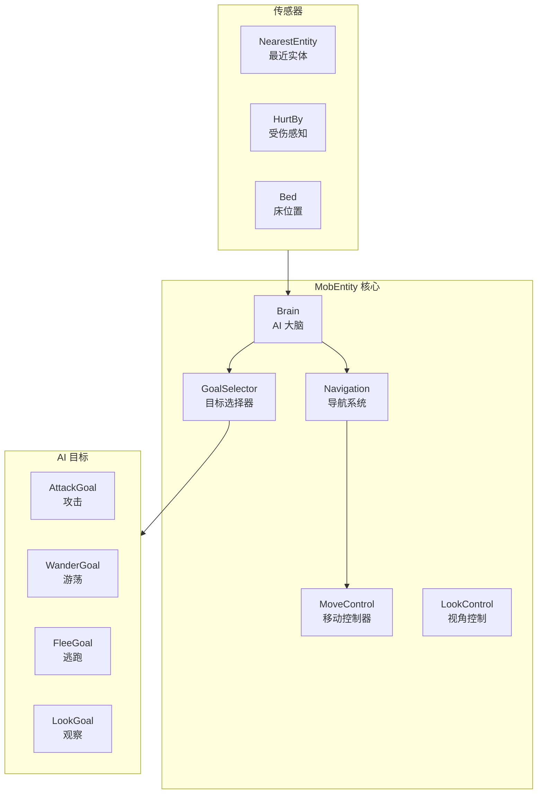

# 第 24 章：MobEntity 生物实体（MobEntity）

> 深入了解所有"会动的生物"的共同基类

---

## 章节目标

- 理解 MobEntity 的核心职责和组成部分
- 掌握 GoalSelector（目标选择器）的工作原理
- 了解 Navigation（导航系统）的基础概念
- 理解 HostileEntity（敌对生物）的特性
- 掌握常见生物的实现细节

## 前置知识

- 熟悉 LivingEntity 的概念
- 了解继承层次结构

## 核心概念

### MobEntity = 会"自主移动"的生物

如果说 LivingEntity 是所有有生命的个体，那么 **MobEntity** 就是那些**有自己想法、会自己动的生物**：

- ✅ 有 AI 目标（Goal）
- ✅ 会自己移动（Navigation）
- ✅ 会攻击或逃跑（Behavior）
- ✅ 会感知周围环境（Sensor）
- ✅ 能做决定（Brain）

❌ 不是 MobEntity：玩家（虽然有 AI，但由玩家控制）、物品掉落

## 继承层次

```
┌─────────────────────────────────────────────────────────────────┐
│                      LivingEntity (有生命实体)                   │
│           生命值、属性、药水效果、伤害                          │
└─────────────────────────────────────────────────────────────────┘
                              │
                              ▼
┌─────────────────────────────────────────────────────────────────┐
│                        MobEntity (生物实体)                       │
├─────────────────────────────────────────────────────────────────┤
│  + goalSelector: GoalSelector         AI 目标选择器            │
│  + targetSelector: GoalSelector       攻击目标选择器           │
│  + navigation: Navigation            导航系统                  │
│  + moveControl: MoveControl          移动控制器                │
│  + lookControl: LookControl          视角控制器                │
│  + brain: Brain                      AI 大脑                    │
│  + jumpControl: JumpControl          跳跃控制器                │
├─────────────────────────────────────────────────────────────────┤
│  + getActiveSensorTypes()            获取激活的传感器          │
│  + getSensor Frenzied()              获取感知目标列表          │
│  + initializeBrain()                 初始化大脑                │
│  + updateNavigation()                更新导航                  │
└─────────────────────────────────────────────────────────────────┘
                              │
          ┌─────────────────────┼─────────────────────┐
          ▼                     ▼                     ▼
┌───────────────┐     ┌───────────────┐     ┌───────────────┐
│HostileEntity  │     │ AnimalEntity │     │   TameableEntity│
│  (敌对生物)  │     │   (动物)    │     │   (可驯服生物) │
└───────────────┘     └───────────────┘     └───────────────┘
          │
          ▼
    ┌───────────┐     ┌───────────┐     ┌───────────┐
    │  Zombie  │     │  Spider   │     │  Enderman │
    │  (僵尸)  │     │  (蜘蛛)  │     │ (末影人)  │
    └───────────┘     └───────────┘     └───────────┘
```

## 1. GoalSelector 目标选择器

### 什么是 Goal？

**Goal = 生物要做的"事情"**

就像人类的待办事项：
- Goal 1: 攻击附近的敌人
- Goal 2: 如果被攻击就逃跑
- Goal 3: 漫无目的地游荡
- Goal 4: 保持不动

### GoalSelector 结构

```java
// MobEntity.java
public class MobEntity extends LivingEntity {
    // 普通行为目标选择器
    protected final GoalSelector goalSelector;
    // 攻击目标选择器
    protected final GoalSelector targetSelector;
}
```

### Goal 接口

```java
// Goal.java
public abstract class Goal {
    // 启动条件：是否可以开始执行
    public abstract boolean canStart();
    
    // 是否应该继续执行
    public boolean shouldContinue() {
        return this.canStart();
    }
    
    // 开始执行
    public void start() {}
    
    // 停止执行
    public void stop() {}
    
    // 每 tick 执行（核心逻辑）
    public void tick() {}
}
```

### 常用 Goal 示例

```java
// 攻击目标
new NearestAttackableTargetGoal<>(
    this,                    // 执行者
    PlayerEntity.class,      // 目标类型
    0,                       // 最小目标距离（0=总是）
    true,                    // 需要可见
    true,                    // 可以穿墙
    EntityPredicate.DEFAULT  // 目标条件
);

// 接近目标
new MeleeAttackGoal(this, 1.0, false);

// 游荡
new WanderAroundGoal(this, 0.8);

// 看向玩家
new LookAtEntityGoal(this, PlayerEntity.class, 8.0f);

// 跳跃
new JumpGoal(this);

// 逃跑
new EscapeDangerGoal(this, 1.25);
```

### GoalSelector 实现

```java
// GoalSelector.java
public class GoalSelector {
    // 可用的目标列表
    private final List<Goal> goals = new ArrayList<>();
    // 正在运行的目标
    private final Set<Goal> runningGoals = new LinkedHashSet<>();
    
    // 添加目标（带优先级）
    public void add(int priority, Goal goal) {
        this.goals.add(goal);
        goal.setPriority(priority);
    }
    
    // tick 时调用
    public void tick() {
        // 1. 停止不应该继续的目标
        for (Goal goal : this.runningGoals) {
            if (!goal.shouldContinue()) {
                goal.stop();
                goal.setRunning(false);
            }
        }
        this.runningGoals.removeIf(g -> !g.isRunning());
        
        // 2. 尝试启动更高优先级的目标
        for (Goal goal : this.goals) {
            if (!goal.isRunning() && goal.canStart()) {
                // 停止冲突的目标
                this.stopMatching(goal.getMutexFlags());
                // 启动新目标
                goal.start();
                goal.setRunning(true);
                this.runningGoals.add(goal);
            }
        }
    }
}
```

### Goal 优先级

```java
// 优先级规则
// 数字越小，优先级越高

// 示例：僵尸的 AI 目标
this.goalSelector.add(1, new FloatGoal(this));           // 优先级 1: 漂浮在水里
this.goalSelector.add(2, new SpiderAttackGoal(this));    // 优先级 2: 蜘蛛攻击
this.goalSelector.add(3, new LookAtEntityGoal(this, ...)); // 优先级 3: 看玩家
this.goalSelector.add(5, new WanderAroundGoal(this));    // 优先级 5: 游荡
this.goalSelector.add(6, new LookAtEntityGoal(this, ...)); // 优先级 6: 观察玩家

// Mutex flags：控制哪些目标可以同时运行
// Movement = 1：不能和移动目标同时运行
// Look = 2：不能和视角目标同时运行
// Jump = 4：不能和跳跃目标同时运行
```

## 2. Navigation 导航系统

### 什么是 Navigation？

**Navigation = 生物找路的能力**

就像真人会看地图找路：
- 计算到目标的最短路径
- 避开障碍物（墙壁、水、岩浆）
- 选择可以行走的地面

### Navigation 接口

```java
// Navigation.java
public class Navigation {
    protected final MobEntity entity;
    protected final PathNodeNavigator navigator;
    protected Path currentPath;
    
    // 开始寻路到目标位置
    public void startMovingTo(double x, double y, double z, double speed) {
        // 创建路径
        this.currentPath = this.findPathTo(x, y, z);
        // 开始移动
        this.startNavigation();
    }
    
    // 开始追踪实体
    public void startTrackingEntity(Entity target, double speed) {
        // 创建追踪路径
        this.currentPath = this.findPathTo(target);
        this.startNavigation();
    }
    
    // 检查是否在移动
    public boolean isIdle() {
        return !this.isFollowingPath();
    }
    
    // 停止移动
    public void stop() {
        this.currentPath = null;
        this.entity.getMoveControl().setWantedPosition(
            this.entity.getX(), 
            this.entity.getY(), 
            this.entity.getZ(),
            0
        );
    }
}
```

### 寻路流程图

```mermaid
flowchart TD
    A["请求移动到目标"] --> B["计算当前位置"]
    
    B --> C["创建 PathNode"]
    C --> D["A* 寻路算法"]
    
    D --> E{"找到路径?"}
    E -->|"是| Path["返回路径"]
    E -->|"否| NoPath["返回 null"]
    
    Path --> F["逐节点移动"]
    F --> G{"到达目标?"}
    G -->|"是| Done["完成"]
    G -->|"否| F
    G -->|"卡住| H["重新寻路或停止"]
    
    NoPath --> I["原地等待"]
```

## 3. MoveControl 移动控制器

### MoveControl 类型

```java
// MoveControl.java - 基类
public class MoveControl {
    protected final MobEntity entity;
    protected double wantedX, wantedY, wantedZ;
    protected double speed;
    
    public void setWantedPosition(double x, double y, double z, double speed) {
        this.wantedX = x;
        this.wantedY = y;
        this.wantedZ = z;
        this.speed = speed;
    }
    
    public abstract void tick();
}

// OrdinaryMoveControl - 陆地行走
public class OrdinaryMoveControl extends MoveControl {
    @Override
    public void tick() {
        // 直线移动到目标位置
        // 处理转向
    }
}

// SwimMoveControl - 游泳
public class SwimMoveControl extends MoveControl {
    @Override
    public void tick() {
        // 上下调整位置以保持水中
        // 正常水平移动
    }
}

// SpiderMoveControl - 蜘蛛特殊移动
public class SpiderMoveControl extends MoveControl {
    // 蜘蛛可以在墙上行走
}
```

## 4. HostileEntity 敌对生物

### HostileEntity 特性

```java
// HostileEntity.java
public abstract class HostileEntity extends MobEntity {
    // 敌对生物的共同特性
    // 1. 阳光下燃烧
    // 2. 可以生成装备
    // 3. 有更复杂的 AI
    
    @Override
    public void tick() {
        super.tick();
        // 检查阳光燃烧
        this.tickSunBurn();
    }
    
    // 阳光下燃烧逻辑
    protected void tickSunBurn() {
        if (this.isOnFire() && this.isExposedToSun()) {
            this.damage(this.getDamageSources().onFire(), 1.0f);
        }
    }
}
```

### 常见 HostileEntity 子类

#### Zombie 僵尸

```java
// ZombieEntity.java
public class ZombieEntity extends HostileEntity {
    // 僵尸特性
    // 1. 阳光下燃烧
    // 2. 会破门
    // 3. 可以生成装备
    // 4. 可以感染村民
    
    @Override
    protected void initGoals() {
        super.initGoals();
        // 攻击目标
        this.goalSelector.add(1, new ByteSearchGoal(this, ...));
        // 破门
        this.goalSelector.add(2, new BreakDoorGoal(this, ...));
        // 游荡
        this.goalSelector.add(8, new WanderAroundGoal(this, 0.8));
    }
}
```

#### Skeleton 骷髅

```java
// SkeletonEntity.java
public class SkeletonEntity extends HostileEntity {
    // 骷髅特性
    // 1. 远程攻击
    // 2. 阳光下燃烧
    // 3. 装备弓
    
    @Override
    protected void initGoals() {
        super.initGoals();
        // 弓射击
        this.goalSelector.add(4, new RangedBowAttackGoal<>(this, 1.0, 20, 15.0f));
        // 移动到玩家附近
        this.goalSelector.add(5, new GoToTargetGoal(this, 0.8));
    }
}
```

#### Creeper 苦力怕

```java
// CreeperEntity.java
public class CreeperEntity extends HostileEntity {
    // 苦力怕特性
    // 1. 跟踪玩家
    // 2. 膨胀
    // 3. 爆炸
    
    private int fuseTime = 30;  // 引信时间
    private int maxFuseTime = 30;
    
    @Override
    public void tick() {
        super.tick();
        // 检查是否应该爆炸
        if (this.isIgnited()) {
            this.fuseTime--;
            if (this.fuseTime <= 0) {
                this.explode();
            }
        }
    }
    
    private void explode() {
        float explosionRadius = 3.0f;
        // 创建爆炸
        this.getWorld().createExplosion(
            this, this.getX(), this.getY(), this.getZ(),
            explosionRadius, 
            World.ExplosionSourceType.MOB
        );
    }
}
```

## 5. AnimalEntity 动物

### AnimalEntity 特性

```java
// AnimalEntity.java
public abstract class AnimalEntity extends MobEntity {
    // 动物的共同特性
    // 1. 可以繁殖
    // 2. 喜欢进入 love mode
    // 3. 不会主动攻击
    
    private int loveTimer;  // 繁殖冷却
    
    // 检查是否在 love mode
    public boolean isInLove() {
        return this.loveTimer > 0;
    }
    
    // 检查是否有伴侣
    @Nullable
    public AnimalEntity getBreedingParent() {
        // 查找同类伴侣
    }
}
```

## Mermaid 图表：MobEntity 系统架构



## 实战演示：创建一个自定义 Mob

```java
public class MyMobEntity extends HostileEntity {
    
    public MyMobEntity(EntityType<?> type, World world) {
        super(type, world);
    }
    
    @Override
    protected void initGoals() {
        super.initGoals();
        
        // 1. 漂浮（在水里不沉）
        this.goalSelector.add(0, new FloatGoal(this));
        
        // 2. 近战攻击
        this.goalSelector.add(1, new MeleeAttackGoal(this, 1.2, false));
        
        // 3. 看向玩家
        this.goalSelector.add(2, new LookAtEntityGoal(
            this, PlayerEntity.class, 8.0f
        ));
        
        // 4. 游荡
        this.goalSelector.add(3, new WanderAroundGoal(this, 0.8));
        
        // 5. 追踪玩家
        this.targetSelector.add(1, new NearestAttackableTargetGoal<>(
            this, PlayerEntity.class, true
        ));
    }
    
    @Override
    public void tick() {
        super.tick();
        // 自定义逻辑
    }
}
```

## 课后自查

完成本章学习后，你应该能够：

- [ ] 解释 MobEntity 和 LivingEntity 的区别
- [ ] 理解 GoalSelector 的工作原理
- [ ] 知道不同类型的 Goal 及其用途
- [ ] 理解 Navigation 导航系统
- [ ] 掌握 MoveControl 的使用
- [ ] 了解 HostileEntity 的特性
- [ ] 能够创建具有自定义 AI 的 Mob

## 关键术语表

| 术语 | 英文 | 解释 |
|------|------|------|
| 目标 | Goal | 生物要执行的行为任务 |
| 目标选择器 | GoalSelector | 管理 Goal 执行顺序的组件 |
| 导航 | Navigation | 寻路和移动系统 |
| 移动控制 | MoveControl | 控制实体移动方式的组件 |
| 敌对生物 | HostileEntity | 会主动攻击的生物 |

---

**参考源码路径**：

- `D:\Minecraft-Learning\assets\mc\1.21\net\minecraft\entity\MobEntity.java`
- `D:\Minecraft-Learning\assets\mc\1.21\net\minecraft\entity\ai\goal\GoalSelector.java`
- `D:\Minecraft-Learning\assets\mc\1.21\net\minecraft\entity\ai\goal\Goal.java`
- `D:\Minecraft-Learning\assets\mc\1.21\net\minecraft\entity\HostileEntity.java`
- `D:\Minecraft-Learning\assets\mc\1.21\net\minecraft\entity\mob\ZombieEntity.java`
