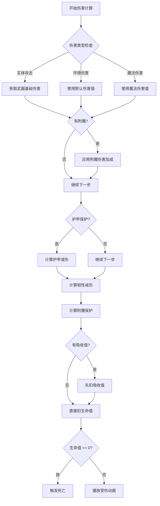
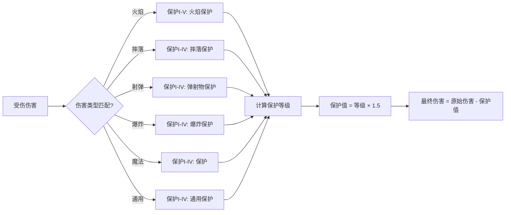

# 第25章 伤害系统——攻击与防御的机制

> **注意**：以下代码示例基于 CFR 反编译结果，实际 Minecraft 源码可能有所差异。在使用时请以游戏源码为准。

## 目标

- 理解伤害如何计算
- 掌握 DamageSource（伤害来源）
- 了解护甲计算机制
- 了解附魔保护机制

## 前置知识

- 了解 LivingEntity（第22章）
- 了解实体属性系统（第24章）

## 核心概念

### 什么是伤害系统？

**伤害系统** 是 Minecraft 中决定"攻击造成多少伤害"的机制。它涉及到攻击者、被攻击者、武器、防具、药水效果等多个因素。

```
伤害计算流程：

攻击者 ──→ 武器伤害 ──→ 附魔加成 ──→ 基础伤害
                                    │
                                    ▼
                              护甲减伤 ──→ 韧性减伤 ──→ 吸收值减伤 ──→ 最终伤害
                                    │
                                    ▼
                              生命值扣除 ──→ 受伤动画 ──→ 死亡判定
```

### 生活中的比喻

```
伤害系统就像打架：

- 攻击者 = 出拳的人
- 武器 = 拳头硬度（拳头 vs 刀子）
- 附魔 = 武术技巧加成
- 护甲 = 防具保护
- 韧性 = 防具质量
- 吸收值 = 额外血量

最终扣血 = 攻击伤害 - 防具保护
```

### 伤害来源分类

| 伤害类型 | 中文名 | 示例 | 特点 |
|---------|--------|------|------|
| mobAttack | 生物攻击 | 被僵尸打 | 可格挡 |
| playerAttack | 玩家攻击 | 被玩家打 | 可格挡 |
| projectile | 抛射物 | 被箭射 | 可格挡 |
| fallDamage | 摔落伤害 | 跳崖 | 护甲不保护 |
| inFire | 火焰伤害 | 站在火里 | 护甲保护 |
| onFire | 燃烧伤害 | 着火持续掉血 | 护甲保护 |
| drowning | 溺水伤害 | 在水下太久 | 护甲不保护 |
| magic | 魔法伤害 | 药水伤害 | 部分保护 |
| explosion | 爆炸伤害 | 苦力怕爆炸 | 护甲保护 |
| wither | 凋零伤害 | 凋零效果 | 部分保护 |
| generic | 一般伤害 | kill 命令 | 无敌也死 |

## 图解

### 伤害计算流程图



### 护甲减伤公式

```
护甲减伤公式：

减伤百分比 = (护甲值 × 4) / (护甲值 × 4 + 8)

护甲韧性影响（高伤害时）：

有效护甲 = 护甲值 + (4 × 护甲韧性) / (护甲韧性 + 4)
减伤百分比 = (有效护甲 × 4) / (有效护甲 × 4 + 8)
```

### 附魔保护计算



## 核心代码

> **注意**：以下代码基于 CFR 反编译结果，可能与实际源码略有差异。

### DamageSource（伤害来源）

```java
// DamageSource.java - 伤害来源
public class DamageSource {

    // 伤害来源类型
    private final RegistryEntry<DamageType> type;

    // 攻击者（造成伤害的实体）
    @Nullable
    private final Entity attacker;

    // 伤害来源（武器/工具）
    @Nullable
    private final Entity source;

    // 伤害位置（用于爆炸等）
    @Nullable
    private final Vec3d position;

    // 创建伤害来源
    public DamageSource(RegistryEntry<DamageType> type, @Nullable Entity source,
                       @Nullable Entity attacker) {
        this.type = type;
        this.source = source;
        this.attacker = attacker;
    }

    // 获取攻击者
    @Nullable
    public Entity getAttacker() {
        return this.attacker;
    }

    // 获取武器
    @Nullable
    public ItemStack getWeaponStack() {
        if (this.source != null) {
            return this.source.getWeaponStack();
        }
        return null;
    }

    // 是否是直接攻击
    public boolean isDirect() {
        return this.attacker == this.source;
    }
}
```

### DamageSources（伤害来源工厂）

```java
// DamageSources.java - 预定义的伤害来源
public class DamageSources {

    // 生物攻击
    public DamageSource mobAttack(LivingEntity attacker) {
        return new DamageSource(DamageTypes.MOB_ATTACK, attacker, attacker);
    }

    // 玩家攻击
    public DamageSource playerAttack(PlayerEntity attacker) {
        return new DamageSource(DamageTypes.PLAYER_ATTACK, attacker, attacker);
    }

    // 射弹攻击
    public DamageSource projectile(ProjectileEntity projectile, @Nullable Entity attacker) {
        return new DamageSource(DamageTypes.PROJECTILE, projectile, attacker);
    }

    // 火焰伤害
    public DamageSource inFire() {
        return new DamageSource(DamageTypes.IN_FIRE);
    }

    // 燃烧伤害
    public DamageSource onFire() {
        return new DamageSource(DamageTypes.ON_FIRE);
    }

    // 摔落伤害
    public DamageSource fall() {
        return new DamageSource(DamageTypes.FALL);
    }

    // 溺水伤害
    public DamageSource drown() {
        return new DamageSource(DamageTypes.DROWN);
    }

    // 魔法伤害
    public DamageSource magic(@Nullable LivingEntity attacker) {
        return new DamageSource(DamageTypes.MAGIC, null, attacker);
    }

    // 凋零伤害
    public DamageSource wither() {
        return new DamageSource(DamageTypes.WITHER);
    }

    // 通用伤害（用于 kill 命令）
    public DamageSource genericKill() {
        return new DamageSource(DamageTypes.GENERIC);
    }
}
```

### 伤害计算过程

```java
// LivingEntity.java - 伤害处理
public abstract class LivingEntity extends Entity {

    // 吸收值（额外血量）
    private float absorptionAmount;

    // 受到伤害
    public boolean damage(DamageSource source, float amount) {

        // 1. 检查无敌
        if (this.isInvulnerableTo(source)) {
            return false;
        }

        // 2. 客户端不处理伤害（服务端处理）
        if (this.getWorld().isClient) {
            return false;
        }

        // 3. 重置受伤时间
        this.hurtTime = this.maxHurtTime = 10;

        // 4. 计算最终伤害
        float damage = amount;

        // 5. 应用护甲减伤
        damage = this.applyArmorToDamage(source, damage);

        // 6. 应用附魔保护
        damage = this.applyEnchantmentDamageProtections(source, damage);

        // 7. 获取韧性减伤
        float armorToughness = (float)this.getAttributeValue(EntityAttributes.GENERIC_ARMOR_TOUGHNESS);
        damage = DamageUtil.getDamageLeft(damage, (float)this.getAttributeValue(EntityAttributes.GENERIC_ARMOR), armorToughness);

        // 8. 应用击退抗性
        damage = this.applyKnockbackResistance(damage, source);

        // 9. 扣除吸收值
        if (damage > 0) {
            this.absorptionAmount -= damage;
            if (this.absorptionAmount < 0) {
                damage += this.absorptionAmount;
                this.absorptionAmount = 0;
            }
        }

        // 10. 扣除生命值
        float healthBefore = this.getHealth();
        this.setHealth(healthBefore - damage);

        // 11. 记录伤害追踪
        this.damageTracker.trackDamage(source, damage, amount);

        // 12. 播放受伤效果
        if (damage > 0) {
            this.applyDamageEffects(source);
            this.lastDamageTaken = damage;
            this.lastDamageSource = source;
            this.lastDamageTime = this.age;
        }

        // 13. 检查死亡
        if (damage >= healthBefore) {
            this.die(source);
        }

        return true;
    }

    // 应用护甲减伤
    protected float applyArmorToDamage(DamageSource source, float damage) {
        // 检查是否可以通过护甲保护
        if (!source.isUnblockable() && !source.isSourceCreativePlayer()) {
            int armor = (int)this.getAttributeValue(EntityAttributes.GENERIC_ARMOR);
            float toughness = (float)this.getAttributeValue(EntityAttributes.GENERIC_ARMOR_TOUGHNESS);

            // 护甲减伤公式
            damage = DamageUtil.getDamageLeft(damage, armor, toughness);
        }
        return damage;
    }
}
```

### 护甲减伤公式实现

```java
// DamageUtil.java - 伤害计算工具
public class DamageUtil {

    // 护甲减伤计算
    public static float getDamageLeft(float damage, float armor, float armorToughness) {
        // 应用韧性修正
        float effectiveArmor = Math.min(armor, 20.0f + armorToughness * 4.0f);

        // 护甲减伤百分比公式
        // 20 点护甲 = 80% 减伤
        // 10 点护甲 = 40% 减伤
        // 5 点护甲 = 25% 减伤
        float damageReduction = effectiveArmor / (effectiveArmor + 8.0f);

        return damage * (1.0f - damageReduction);
    }
}
```

### 附魔保护计算

```java
// EnchantmentHelper.java - 附魔效果
public class EnchantmentHelper {

    // 计算附魔保护
    public static float getProtectionAmount(LivingEntity entity, DamageSource source) {
        // 检查护甲上的附魔保护
        Iterable<ItemStack> armor = entity.getArmorItems();
        float protection = 0;

        for (ItemStack stack : armor) {
            if (stack.hasEnchantments()) {
                protection += getProtectionAmount(stack, source);
            }
        }

        // 限制最大保护值
        return Math.min(protection, 25.0f); // 最高25点保护
    }

    // 获取单个物品的保护值
    public static float getProtectionAmount(ItemStack stack, DamageSource source) {
        // 获取物品上的附魔
        // 根据伤害类型匹配不同的保护附魔

        float totalProtection = 0;

        // 遍历物品上的每个附魔
        for (Enchantment enchantment : stack.getEnchantments()) {
            if (enchantment instanceof ProtectionEnchantment protection) {
                // 检查是否匹配伤害类型
                if (protection.applicableTo(source)) {
                    int level = EnchantmentHelper.getLevel(stack, enchantment);
                    totalProtection += protection.getProtectionAmount(level);
                }
            }
        }

        return totalProtection;
    }
}
```

## 实战演示

### 场景：创建自定义伤害来源

```java
// 注册自定义伤害类型
public class MyDamageTypes {

    // 在 BootstrapTypes 中注册
    public static final RegistryKey<DamageType> CUSTOM_HOLY =
        RegistryKey.of(RegistryKeys.DAMAGE_TYPE, Identifier.of("mymod", "holy"));

    // 创建伤害来源工厂方法
    public DamageSource holyDamage(LivingEntity attacker) {
        return new DamageSource(
            RegistryEntry.of(DamageTypes.CUSTOM_HOLY),
            attacker,
            attacker
        );
    }
}
```

### 场景：创建一个造成真实伤害的武器

```java
// 创建一把穿透护甲的剑
public class TrueDamageSwordItem extends SwordItem {

    public TrueDamageSwordItem(ToolMaterial material, Settings settings) {
        super(material, settings);
    }

    @Override
    public boolean postNbtComponentInit(ItemStack stack) {
        // 添加真实伤害属性
        stack.addAttributeModifier(
            EntityAttributes.GENERIC_ATTACK_DAMAGE,
            new EntityAttributeModifier(
                Identifier.of("true_damage_sword", "damage"),
                10.0,  // 10点伤害
                EntityAttributeModifier.Operation.ADD_VALUE
            ),
            EquipmentSlot.MAINHAND
        );
        return true;
    }

    // 重写攻击方法，让伤害不可格挡
    @Override
    public boolean postHit(ItemStack stack, LivingEntity target, LivingEntity attacker) {
        // 造成额外的真实伤害（不计算护甲）
        DamageSource source = attacker.getDamageSources().mobAttack(attacker);
        // 由于护甲已经在 damage 方法中计算，我们需要手动绕过
        target.setHealth(target.getHealth() - 5.0f);
        return true;
    }
}
```

### 场景：创建免疫特定伤害的护甲

```java
// 创建防火护甲
public class FireproofArmorItem extends ArmorItem {

    public FireproofArmorItem(ArmorMaterial material, ArmorSlot slot, Settings settings) {
        super(material, slot, settings);
    }

    @Override
    public boolean isEnchantable(ItemStack stack) {
        return true;
    }

    @Override
    public boolean isValidEnchantment(Enchantment enchantment) {
        // 只能附魔火焰保护
        return enchantment instanceof FireProtectionEnchantment;
    }
}

// 或者通过属性实现
public class FireproofLivingEntity extends LivingEntity {

    @Override
    protected boolean isAffectedByArmor(DamageSource source) {
        // 火焰伤害不能通过护甲减少
        return !source.isIn(DamageTypeTags.BYPASSES_ARMOR);
    }
}
```

### 场景：计算最终伤害

```java
public class DamageCalculator {

    // 计算玩家对僵尸造成的伤害
    public static float calculatePlayerDamage(PlayerEntity player, ZombieEntity zombie) {
        // 1. 获取武器基础伤害
        ItemStack weapon = player.getMainHandStack();
        float baseDamage = weapon.isEmpty() ? 1.0f :
            (float)weapon.getAttributeValue(EntityAttributes.GENERIC_ATTACK_DAMAGE);

        // 2. 计算附魔加成
        float enchantBonus = EnchantmentHelper.getAttackDamage(weapon,
            EntityType.ZOMBIE, player);

        float totalDamage = baseDamage + enchantBonus;

        // 3. 应用难度缩放
        Difficulty difficulty = player.getWorld().getDifficulty();
        if (difficulty == Difficulty.EASY) {
            totalDamage *= 0.5f;
        } else if (difficulty == Difficulty.HARD) {
            totalDamage *= 1.5f;
        }

        // 4. 僵尸的护甲减伤
        float zombieArmor = (float)zombie.getAttributeValue(EntityAttributes.GENERIC_ARMOR);
        float zombieToughness = (float)zombie.getAttributeValue(EntityAttributes.GENERIC_ARMOR_TOUGHNESS);
        float afterArmor = DamageUtil.getDamageLeft(totalDamage, zombieArmor, zombieToughness);

        // 5. 僵尸的附魔保护
        float protection = EnchantmentHelper.getProtectionAmount(zombie,
            player.getDamageSources().playerAttack(player));
        float finalDamage = Math.max(0, afterArmor - protection);

        return finalDamage;
    }
}
```

## 小结

1. **伤害来源（DamageSource）**
   - 记录是谁造成的伤害
   - 决定哪些保护附魔有效
   - 决定是否可以格挡/保护

2. **伤害计算流程**
   - 基础伤害 → 护甲减伤 → 韧性减伤 → 吸收值 → 生命值扣除

3. **护甲减伤公式**
   - 减伤百分比 = (护甲 × 4) / (护甲 × 4 + 8)
   - 20点护甲 = 80%减伤
   - 韧性可以提高高伤害时的有效护甲

4. **附魔保护**
   - 不同伤害类型对应不同保护附魔
   - 每级保护 = 1.5 点保护
   - 最大25点保护

5. **无敌帧（假）**
   - 受伤后有一段时间的受伤动画
   - 可以检查 `hurtTime > 0` 来判断

## 练习

### 练习 1：创建无敌武器

```java
// 创建一个造成 9999 伤害的武器
// 提示：设置 GENERIC_ATTACK_DAMAGE 属性
```

### 练习 2：创建护甲套装效果

```java
// 创建一套护甲，穿戴满4件后获得额外减伤
// 提示：在装备变化时检查套装数量
```

### 练习 3：创建火抗药水

```java
// 创建一个药水，使用后对火焰伤害免疫
// 提示：修改 isAffectedByArmor 对火焰伤害返回 false
```

## 相关链接

### 源码文件位置

| 文件 | 源码路径 | 说明 |
|------|----------|------|
| DamageSource.java | `net/minecraft/entity/damage/DamageSource.java` | 伤害来源 |
| EntityDamageHandler.java | `net/minecraft/entity/damage/EntityDamageHandler.java` | 伤害处理 |
| DamageTypes.java | `net/minecraft/world/DamageTypes.java` | 原版伤害类型 |

- **上一章**：[第24章 实体属性系统](./24-entity-attributes.md)
- **下一章**：[第26章 生成系统](./26-spawn-system.md)
- **相关源码**：
  - `net/minecraft/entity/damage/DamageSource.java` - 伤害来源
  - `net/minecraft/entity/damage/DamageSources.java` - 伤害来源工厂
  - `net/minecraft/entity/DamageUtil.java` - 伤害计算工具
  - `net/minecraft/enchantment/EnchantmentHelper.java` - 附魔计算
