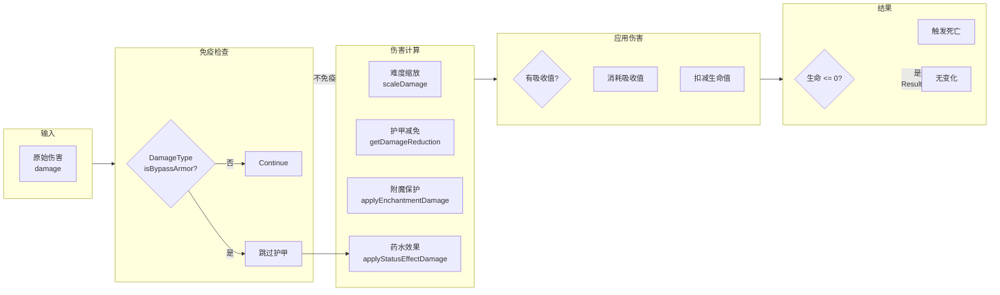

# 第 26 章：伤害系统（Damage System）

> 深入了解 Minecraft 中的伤害计算、护甲机制和死亡处理

---

## 章节目标

- 理解 DamageSource 和 DamageType 的概念
- 掌握伤害计算的全流程
- 了解护甲和护甲韧性的计算公式
- 理解附魔保护机制
- 掌握药水效果对伤害的影响
- 理解死亡处理和死亡消息

## 前置知识

- 熟悉 LivingEntity 的概念
- 了解属性系统的基础

## 核心概念

### 伤害 = Minecraft 的"战斗系统"

想象真实的战斗场景：
- 🔪 敌人攻击 → 造成伤害
- 🛡️ 穿上护甲 → 减少伤害
- ✨ 喝下药水 → 获得保护
- 💀 生命归零 → 死亡

**Minecraft 的伤害系统就是处理这一切的机制**

## 1. DamageSource 伤害来源

### DamageSource 结构

```java
// DamageSource.java
public class DamageSource {
    private final DamageType type;  // 伤害类型（数据驱动）
    private final Entity attacker;  // 攻击者（可能为 null）
    private final Vec3d damageSourcePosition;  // 伤害来源位置
    
    // 创建伤害来源
    public static DamageSource of(DamageType type) {
        return new DamageSource(type, null, null);
    }
    
    public static DamageSource fromEntity(DamageType type, Entity entity) {
        return new DamageSource(type, entity, entity.getPos());
    }
    
    public static DamageSource fromPosition(DamageType type, Vec3d position) {
        return new DamageSource(type, null, position);
    }
}
```

### 常用 DamageSource 工厂

```java
// LivingEntity 中获取 DamageSource
public DamageSources getDamageSources() {
    return new DamageSources(this.getWorld().getRegistryWrapper());
}

// 常见伤害来源
DamageSource mob = this.getDamageSources().mob(this);           // 生物攻击
DamageSource player = this.getDamageSources().player(this);     // 玩家攻击
DamageSource fall = this.getDamageSources().fall();            // 摔落伤害
DamageSource inWall = this.getDamageSources().inWall();        // 窒息伤害
DamageSource drowning = this.getDamageSources().drown();       // 溺水伤害
DamageSource onFire = this.getDamageSources().onFire();        // 燃烧伤害
DamageSource fireball = this.getDamageSources().fireball(fireball);  // 火球
DamageSource explosion = this.getDamageSources().explosion(explosion); // 爆炸
DamageSource magic = this.getDamageSources().magic();          // 魔法伤害
DamageSource wither = this.getDamageSources().wither();       // 凋零伤害
DamageSource starve = this.getDamageSources().starve();        // 饥饿伤害
DamageSource anvil = this.getDamageSources().anvil();         // 铁砧伤害
DamageSource fallingBlock = this.getDamageSources().fallingBlock(); // 掉落方块
```

## 2. DamageType 伤害类型（1.19+）

### DamageType 结构（数据驱动）

```java
// DamageType.java (在 worldgen/data 目录下定义)
/*
{
    "exhaustion": 0.1,        // 饥饿消耗
    "message_id": "mob",       // 死亡消息 ID
    "scaling": "always",      // 缩放方式
    "effects": "hurt"         // 效果：hurt/damage/thorns
}
*/
```

### 伤害类型数据文件示例

```json
// data/minecraft/damage_type/mob.json
{
    "exhaustion": 0.1,
    "message_id": "mob",
    "scaling": "always",
    "effects": "hurt"
}

// data/minecraft/damage_type/fall.json
{
    "exhaustion": 0.0,
    "message_id": "fall",
    "scaling": "when_caused_by_living_non_player"
}

// data/minecraft/damage_type/fire.json
{
    "exhaustion": 0.0,
    "message_id": "fire",
    "scaling": "never"
}
```

### Scaling（缩放方式）

```java
public enum Scaling {
    ALWAYS,           // 总是缩放（按难度）
    NEVER,            // 从不缩放（固定伤害）
    WHEN_CAUSED_BY_LIVING_NON_PLAYER,  // 只有非玩家生物造成时缩放
    WHEN_CAUSED_BY_LIVING_PLAYER  // 只有玩家造成时缩放
}
```

## 3. 伤害计算全流程

### 流程图

```mermaid
flowchart TD
    Start["攻击/伤害发生"] --> Check1{"免疫检查?"}
    
    Check1 -->|"免疫| End["无伤害"]
    Check1 -->|"不免疫| Check2{"困难难度?"}
    
    Check2 -->|"是| Scale["×难度缩放"]
    Check2 -->|"否| Calc
    
    Scale --> Calc
    
    Calc --> Armor["护甲减免"]
    Armor --> Toughness["护甲韧性"]
    Toughness --> Enchant["附魔保护"]
    Enchant --> Potion["药水效果"]
    Potion --> Absorb["吸收值检查"]
    
    Absorb --> Reduce{"absorption > 0?"}
    Reduce -->|"是| Use["消耗吸收值"]
    Reduce -->|"否| HP["health -= final"]
    
    Use --> Zero{"absorption = 0?"}
    Zero -->|"是| HP
    Zero -->|"否| Final["不扣血"]
    
    HP --> Dead{"health <= 0?"}
    Dead -->|"是| Death["触发 onDeath()"]
    Dead -->|"否| End
    Death --> End
```

### 完整伤害计算代码

```java
// LivingEntity.java
public boolean damage(DamageSource source, float amount) {
    // 1. 免疫检查
    if (this.isInvulnerableTo(source)) {
        return false;
    }
    
    // 2. 如果在睡觉则唤醒
    if (this.isSleeping() && !this.getWorld().isClient) {
        this.wakeUp();
    }
    
    // 3. 标记受伤
    this.shouldAnimateDamage(source);
    
    // 4. 计算实际伤害
    float damage = amount;
    damage = this.modifyAppliedDamage(source, damage);
    
    // 5. 检查伤害是否有效
    if (damage <= 0.0f) {
        return false;
    }
    
    // 6. 应用伤害
    return this.applyDamage(source, damage);
}

// 修改伤害值
protected float modifyAppliedDamage(DamageSource source, float damage) {
    // 1. 难度缩放
    damage = this.scaleDamage(source, damage);
    
    // 2. 护甲减免
    damage = this.getDamageReduction(source, damage);
    
    // 3. 附魔保护
    damage = this.applyEnchantmentDamage(source, damage);
    
    // 4. 药水效果修改
    damage = this.applyStatusEffectDamage(source, damage);
    
    return damage;
}
```

## 4. 护甲系统

### 护甲减免公式

```java
// 护甲减免计算
// reduction = (armor * 4) / (20 + armor * 4 + toughness²)
private float getDamageReduction(DamageSource source, float damage) {
    // 某些伤害类型无视护甲
    if (source.isIn(DamageTypeTags.DAMAGE_BYPASSES_ARMOR)) {
        return damage;
    }
    
    float armor = (float) this.getAttributeValue(EntityAttributes.GENERIC_ARMOR);
    float toughness = (float) this.getAttributeValue(EntityAttributes.GENERIC_ARMOR_TOUGHNESS);
    
    // 护甲减免公式
    // 当 armor = 20, toughness = 0 时，reduction ≈ 0.8 (80%)
    // 当 armor = 20, toughness = 8 时，reduction ≈ 0.91 (91%)
    float reduction = (armor * 4.0f) / (20.0f + armor * 4.0f + toughness * toughness);
    
    return damage * (1.0f - reduction);
}
```

### 护甲减免曲线图

```
护甲减免率
    │
100%│                           ● (toughness=8)
    │                      ●
 80%│                 ●
    │            ●
 60%│       ●
    │   ●
 40%│●
    │
 20%│
    │
  0%│──────────────────────────────► 护甲值
    0   5   10   15   20   25   30
```

### 护甲类型

| 护甲类型 | 护甲值 | 韧性值 |
|----------|--------|--------|
| 皮革 | 3-7 | 0 |
| 铁 | 5-15 | 0 |
| 金 | 5-7 | 0 |
| 钻石 | 11-20 | 2 |
| 下界合金 | 11-20 | 3 |
| 鞘翅 | 0 | 0 (额外保护) |

## 5. 附魔保护

### ProtectionEnchantment

```java
// ProtectionEnchantment.java
public class ProtectionEnchantment extends Enchantment {
    
    @Override
    public int getProtectionAmount(int level, DamageSource source) {
        if (source.isIn(DamageTypeTags.BYPASSES_ENCHANT_PROTECTION)) {
            return 0;
        }
        
        // 不同伤害类型有不同的保护效果
        if (source.isIn(DamageTypeTags.IS_FIRE)) {
            return level * 1;  // 火焰保护：每级 1 点
        }
        if (source.isIn(DamageTypeTags.IS_EXPLOSION)) {
            return level * 2;  // 爆炸保护：每级 2 点
        }
        if (source.isIn(DamageTypeTags.IS_PROJECTILE)) {
            return level * 2;  // 弹射物保护：每级 2 点
        }
        
        return level * 1;  // 一般保护：每级 1 点
    }
}
```

### 保护点数计算

```java
// 附魔保护减免公式
// reductionPoints = Σ(protection) * 0.04
// 减免上限 = 80%（20 点保护）

// 4 点保护 = 4 × 0.04 = 0.16 = 16% 减免
// 10 点保护 = 10 × 0.04 = 0.40 = 40% 减免
// 20 点保护 = 20 × 0.04 = 0.80 = 80% 减免（上限）
```

### 其他保护附魔

| 附魔 | 保护类型 | 效果 |
|------|----------|------|
| 火焰保护 | 火焰伤害 | 每级 -4 点火焰伤害 |
| 爆炸保护 | 爆炸伤害 | 每级 -2 点爆炸伤害 |
| 弹射物保护 | 箭矢等 | 每级 -2 点弹射伤害 |
| 摔落保护 | 摔落伤害 | 每级 -3 点摔落伤害 |
| 保护 | 一般 | 每级 -1 点各类伤害 |

## 6. 药水效果影响

```java
// 药水效果对伤害的修改
protected float applyStatusEffectDamage(DamageSource source, float amount) {
    // 抗性效果
    if (this.hasStatusEffect(StatusEffects.RESISTANCE)) {
        int amplifier = this.getStatusEffect(StatusEffects.RESISTANCE)
            .map(StatusEffectInstance::getAmplifier)
            .orElse(0);
        // 每级抗性 -20% 伤害
        amount *= 1.0f - (amplifier + 1) * 0.2f;
    }
    
    // 吸收效果
    if (this.hasStatusEffect(StatusEffects.ABSORPTION)) {
        // 吸收药水提供额外的黄色生命值
    }
    
    return amount;
}
```

### 抗性效果

```
抗性等级    伤害减免
无          0%
I           20%
II          40%
III         60%
IV          80%
```

## 7. 吸收值系统

```java
// 吸收值（额外生命，如金苹果效果）
protected float absorptionAmount;

// 获取吸收值
public float getAbsorptionAmount() {
    return this.absorptionAmount;
}

// 设置吸收值
public void setAbsorptionAmount(float amount) {
    this.absorptionAmount = amount;
}

// 获取有效生命值
public float getHealth() {
    return this.health + this.absorptionAmount;
}
```

### 吸收值流程

```
受伤 10 点伤害
    │
    ├──► 吸收值 = 4
    │         │
    │         ▼
    │    吸收值 -= 10 → 吸收值 = -6（不够扣）
    │         │
    │         ▼
    │    剩余伤害 = 10 - 4 = 6
    │         │
    │         ▼
    │    health -= 6
    │
    └──► 吸收值 = 0
              │
              ▼
         直接 health -= 10
```

## 8. 死亡处理

```java
// 死亡流程
public void onDeath(DamageSource source) {
    // 1. 标记死亡
    this.dead = true;
    this.getCombatTracker().onDeath(source);
    
    // 2. 触发游戏事件
    this.emitGameEvent(GameEvent.ENTITY_DIE);
    
    // 3. 处理掉落物
    this.drop(source);
    
    // 4. 处理经验值
    if (this instanceof ExperienceDropEntity xp) {
        int exp = this.calculateXp(source);
        this.dropXp(exp);
    }
    
    // 5. 清除药水效果
    this.clearStatusEffects();
    
    // 6. 清除骑乘
    this.stopRiding();
}
```

### 死亡消息

```java
// DeathMessage 相关
public Text getDeathMessage() {
    // 获取攻击者
    Entity attacker = this.getDamageSource().getAttacker();
    
    if (attacker != null) {
        return Text.translatable(
            "death.attack." + this.getDamageSource().getType().getMessageId(),
            this.getDisplayName(),
            attacker.getDisplayName()
        );
    }
    
    return Text.translatable(
        "death.attack." + this.getDamageSource().getType().getMessageId(),
        this.getDisplayName()
    );
}
```

## Mermaid 图表：完整伤害计算



## 实战演示：创建自定义伤害类型

### 1. 定义伤害类型

```json
// data/mymod/damage_type/magic_missile.json
{
    "exhaustion": 0.1,
    "message_id": "magic_missile",
    "scaling": "always",
    "effects": "hurt"
}
```

### 2. 创建魔法伤害来源

```java
public class MagicDamageSource {
    
    public static DamageSource createMagicDamageSource(Entity caster) {
        DamageType type = Registries.DAMAGE_TYPE.get(
            Identifier.of("mymod", "magic_missile")
        );
        return new DamageSource(type, caster, caster.getPos());
    }
}
```

### 3. 在 Mod 中应用

```java
public class MagicProjectileEntity extends ProjectileEntity {
    
    @Override
    protected void onHit(LivingEntity entity, HitResult result) {
        super.onHit(entity, result);
        
        // 造成魔法伤害
        DamageSource source = MagicDamageSource.createMagicDamageSource(this.getOwner());
        entity.damage(source, 6.0f);
    }
}
```

## 课后自查

完成本章学习后，你应该能够：

- [ ] 解释 DamageSource 和 DamageType 的区别
- [ ] 理解伤害计算的完整流程
- [ ] 知道护甲减免的计算公式
- [ ] 理解附魔保护的工作方式
- [ ] 知道不同药水效果对伤害的影响
- [ ] 理解吸收值系统
- [ ] 能够创建自定义伤害类型

## 关键术语表

| 术语 | 英文 | 解释 |
|------|------|------|
| 伤害来源 | DamageSource | 谁/什么造成了伤害 |
| 伤害类型 | DamageType | 伤害的分类（数据驱动） |
| 护甲减免 | Armor Reduction | 护甲减少伤害的机制 |
| 护甲韧性 | Armor Toughness | 减少高伤害的减免效果 |
| 吸收值 | Absorption | 额外的临时生命值 |
| 保护附魔 | Protection | 减少伤害的附魔 |

---

**参考源码路径**：

- `D:\Minecraft-Learning\assets\mc\1.21\net\minecraft\entity\LivingEntity.java`
- `D:\Minecraft-Learning\assets\mc\1.21\net\minecraft\entity\damage\DamageSource.java`
- `D:\Minecraft-Learning\assets\mc\1.21\net\minecraft\entity\damage\DamageType.java`
- `D:\Minecraft-Learning\assets\mc\1.21\net\minecraft\entity\damage\DamageSources.java`
- `D:\Minecraft-Learning\assets\mc\1.21\net\minecraft\enchantment\ProtectionEnchantment.java`
