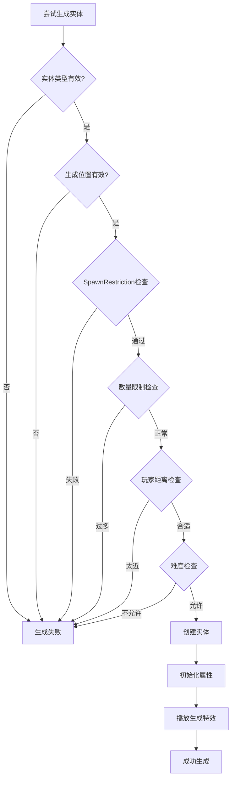
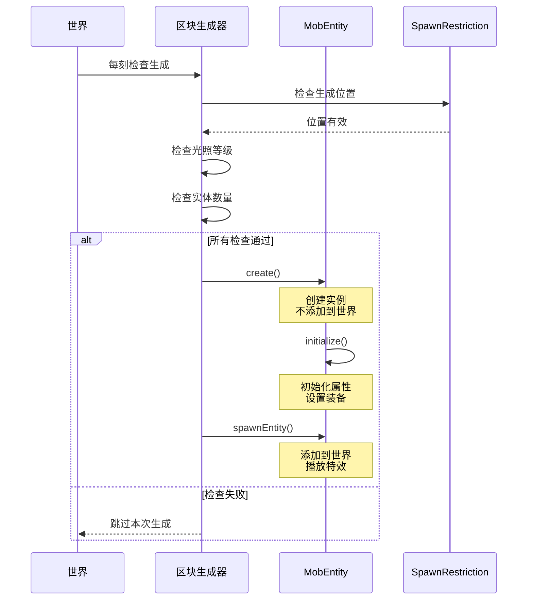

# 第26章 生成系统——生物是如何出现在世界上的

> **注意**：以下代码示例基于 CFR 反编译结果，实际 Minecraft 源码可能有所差异。在使用时请以游戏源码为准。

## 目标

- 理解实体是如何生成的
- 掌握 SpawnRestriction（生成限制）
- 了解 SpawnReason（生成原因）
- 学会自定义生成条件

## 前置知识

- 了解 MobEntity（第23章）
- 了解世界和区块的概念

## 核心概念

### 什么是生成系统？

**生成系统（Spawn System）** 是 Minecraft 决定"在哪里、什么时候、如何生成实体"的机制。无论是自然生成的僵尸，还是玩家用命令召唤的实体，都需要经过这个系统的检查。

```
生成流程：

1. 位置检查
   - 是否有有效的生成位置？
   - 地面是否可以站立？

2. 环境检查
   - 光照等级是否足够？
   - 是否在水中/空气中？

3. 条件检查
   - 难度是否允许？
   - 玩家距离是否合适？

4. 数量检查
   - 当前区域实体数量是否过多？

5. 生成
   - 创建实体
   - 初始化属性
   - 播放生成特效
```

### 生活中的比喻

```
生成系统就像开一家餐厅：

1. 位置检查 = 餐厅地址是否有效
2. 环境检查 = 周围环境是否适合开餐厅
3. 条件检查 = 营业执照是否齐全
4. 数量检查 = 同一条街已经有太多餐厅了
5. 正式开业 = 餐厅开门迎客

只有所有检查都通过了，餐厅才能开业！
```

### 生成原因（SpawnReason）

| SpawnReason | 中文名 | 说明 |
|------------|--------|------|
| NATURAL | 自然生成 | 怪物自然刷出 |
| JOCKEY | 骑乘生成 | 蜘蛛骑士等 |
| SPAWNER | 生成器生成 | 刷怪笼生成 |
| EVENT | 事件生成 | 生物群系事件 |
| REINFORCEMENT | 增援生成 | 僵尸呼叫同伴 |
| BREEDING | 繁殖生成 | 动物繁殖 |
| MOB_SUMMONED | 指令生成 | /summon 命令 |
| CONVERSION | 转化生成 | 僵尸变村民 |
| CUSTOM | 自定义生成 | 模组自定义 |

### 生成位置类型（SpawnLocation）

| 类型 | 说明 | 示例 |
|------|------|------|
| ON_GROUND | 地面上 | 僵尸、骷髅 |
| IN_WATER | 水中 | 鱼、鱿鱼 |
| IN_LAVA | 岩浆中 | 岩浆怪 |
| UNRESTRICTED | 无限制 | 唤魔者 |

## 图解

### 生成检查流程



### 自然生成流程



### 生物群系与生成群体

```
生成群体（SpawnGroup）：

CREATURE（动物）
├── 猪、牛、鸡、羊
├── 兔子、狐狸、狼
└── 熊猫、猫、鹦鹉

AMBIENT（环境生物）
└── 蝙蝠

MONSTER（怪物）
├── 僵尸、骷髅、蜘蛛
├── 苦力怕、女巫
└── 岩浆怪、史莱姆

WATER_CREATURE（水生生物）
├── 海豚、鱿鱼
└── 守卫者

WATER_AMBIENT（水环境生物）
├── 鱼
└── 河豚

AXOLOTLS（美西螈）
└── 美西螈

UNDERGROUND_WATER_CREATURE（地下水生生物）
└── 发光鱿鱼
```

## 核心代码

> **注意**：以下代码基于 CFR 反编译结果，可能与实际源码略有差异。

### SpawnRestriction（生成限制）

```java
// SpawnRestriction.java - 生成限制系统
public class SpawnRestriction {

    // 存储所有实体的生成限制
    private static final Map<EntityType<?>, Entry> RESTRICTIONS = Maps.newHashMap();

    // 注册生成限制
    public static <T extends MobEntity> void register(
        EntityType<T> type,
        SpawnLocation location,           // 生成位置类型
        Heightmap.Type heightmapType,    // 使用的高度图
        SpawnPredicate<T> predicate      // 自定义检查条件
    ) {
        Entry entry = RESTRICTIONS.put(type, new Entry(heightmapType, location, predicate));
    }

    // 检查生成位置是否有效
    public static boolean isSpawnPosAllowed(EntityType<?> type, WorldView world, BlockPos pos) {
        return SpawnRestriction.getLocation(type).isSpawnPositionOk(world, pos, type);
    }

    // 执行完整的生成检查
    public static <T extends Entity> boolean canSpawn(
        EntityType<T> type,
        ServerWorldAccess world,
        SpawnReason spawnReason,
        BlockPos pos,
        Random random
    ) {
        Entry entry = RESTRICTIONS.get(type);
        // 调用自定义的检查条件
        return entry == null || entry.predicate.test(type, world, spawnReason, pos, random);
    }

    // 获取高度图类型
    public static Heightmap.Type getHeightmapType(@Nullable EntityType<?> type) {
        Entry entry = RESTRICTIONS.get(type);
        return entry == null ? Heightmap.Type.MOTION_BLOCKING_NO_LEAVES : entry.heightmapType;
    }
}
```

### 注册默认生成限制

```java
// SpawnRestriction.java - 默认注册
static {
    // 动物 - 地面上生成，需要足够光照
    SpawnRestriction.register(
        EntityType.COW,
        SpawnLocationTypes.ON_GROUND,
        Heightmap.Type.MOTION_BLOCKING_NO_LEAVES,
        AnimalEntity::isValidNaturalSpawn
    );

    // 僵尸 - 地面上生成，暗处
    SpawnRestriction.register(
        EntityType.ZOMBIE,
        SpawnLocationTypes.ON_GROUND,
        Heightmap.Type.MOTION_BLOCKING_NO_LEAVES,
        HostileEntity::canSpawnInDark
    );

    // 鱼 - 水中生成
    SpawnRestriction.register(
        EntityType.COD,
        SpawnLocationTypes.IN_WATER,
        Heightmap.Type.MOTION_BLOCKING_NO_LEAVES,
        WaterCreatureEntity::canSpawn
    );

    // 烈焰人 - 地面上生成，忽略光照
    SpawnRestriction.register(
        EntityType.BLAZE,
        SpawnLocationTypes.ON_GROUND,
        Heightmap.Type.MOTION_BLOCKING_NO_LEAVES,
        HostileEntity::canSpawnIgnoreLightLevel
    );
}
```

### 自定义生成检查条件

```java
// 动物的标准生成条件
public class AnimalEntity extends PassiveEntity {

    // 动物可以自然生成的条件
    public static boolean isValidNaturalSpawn(
        EntityType<AnimalEntity> type,
        ServerWorldAccess world,
        SpawnReason reason,
        BlockPos pos,
        Random random
    ) {
        // 1. 检查生成位置
        if (!SpawnRestriction.isSpawnPosAllowed(type, world, pos)) {
            return false;
        }

        // 2. 检查是否有足够的空间
        if (!world.isSpaceEmpty(pos, type.getWidth(), type.getHeight())) {
            return false;
        }

        // 3. 检查地面是否是固体
        BlockState ground = world.getBlockState(pos.down());
        if (!ground.isSolid()) {
            return false;
        }

        // 4. 检查光照等级（动物需要足够的光照）
        int lightLevel = world.getLightLevel(pos);
        if (lightLevel < 8) {
            return false;
        }

        return true;
    }
}
```

```java
// 敌对生物的生成条件
public class HostileEntity {

    // 在黑暗中生成
    public static boolean canSpawnInDark(
        EntityType<? extends HostileEntity> type,
        ServerWorldAccess world,
        SpawnReason reason,
        BlockPos pos,
        Random random
    ) {
        // 1. 检查基础条件
        if (!MobEntity.canMobSpawn(type, world, reason, pos, random)) {
            return false;
        }

        // 2. 检查光照等级（敌对生物需要在暗处）
        int lightLevel = world.getLightLevel(pos);
        if (lightLevel > 7) {
            return false;
        }

        return true;
    }

    // 忽略光照等级生成
    public static boolean canSpawnIgnoreLightLevel(
        EntityType<? extends HostileEntity> type,
        ServerWorldAccess world,
        SpawnReason reason,
        BlockPos pos,
        Random random
    ) {
        return MobEntity.canMobSpawn(type, world, reason, pos, random);
    }
}
```

```java
// 水生生物的生成条件
public class WaterCreatureEntity extends MobEntity {

    public static boolean canSpawn(
        EntityType<WaterCreatureEntity> type,
        ServerWorldAccess world,
        SpawnReason reason,
        BlockPos pos,
        Random random
    ) {
        // 检查是否在水中
        if (!world.getBlockState(pos).isOf(Blocks.WATER)) {
            return false;
        }

        // 检查水深
        int waterDepth = world.getWaterHeight(pos);
        if (waterDepth < 0) {
            return false;
        }

        return MobEntity.canMobSpawn(type, world, reason, pos, random);
    }
}
```

### 生成实体

```java
// EntityType.java - 生成实体
public class EntityType<T extends Entity> {

    // 创建并生成实体
    public T spawn(ServerWorld world, BlockPos pos, SpawnReason reason) {
        return this.spawn(world, null, pos, reason, false, false);
    }

    // 完整的生成方法
    public T spawn(ServerWorld world, @Nullable Consumer<T> afterConsumer,
                   BlockPos pos, SpawnReason reason,
                   boolean alignPosition, boolean invertY) {

        // 1. 创建实体
        T entity = this.create(world, afterConsumer, pos, reason, alignPosition, invertY);

        if (entity != null) {
            // 2. 添加到世界
            world.spawnEntityAndPassengers((Entity)entity);
        }

        return entity;
    }

    // 创建实体的详细过程
    public T create(ServerWorld world, @Nullable Consumer<T> afterConsumer,
                   BlockPos pos, SpawnReason reason,
                   boolean alignPosition, boolean invertY) {

        // 创建实例
        T entity = this.create(world);
        if (entity == null) {
            return null;
        }

        // 设置位置
        if (alignPosition) {
            ((Entity)entity).setPosition(pos.getX() + 0.5, pos.getY() + 1, pos.getZ() + 0.5);
            double originY = EntityType.getOriginY(world, pos, invertY, ((Entity)entity).getBoundingBox());
        } else {
            ((Entity)entity).refreshPositionAndAngles(
                pos.getX() + 0.5, pos.getY(), pos.getZ() + 0.5,
                world.random.nextFloat() * 360.0f, 0.0f
            );
        }

        // 如果是生物，初始化
        if (entity instanceof MobEntity mobEntity) {
            mobEntity.headYaw = mobEntity.getYaw();
            mobEntity.bodyYaw = mobEntity.getYaw();
            mobEntity.initialize(world, world.getLocalDifficulty(mobEntity.getBlockPos()), reason, null);
            mobEntity.playAmbientSound();
        }

        return entity;
    }
}
```

### MobEntity 的生成检查

```java
// MobEntity.java - 生物生成基础检查
public abstract class MobEntity extends LivingEntity {

    // 通用的生物生成检查
    public static boolean canMobSpawn(
        EntityType<? extends MobEntity> type,
        WorldAccess world,
        SpawnReason spawnReason,
        BlockPos pos,
        Random random
    ) {
        // 1. 检查生成原因
        // 刷怪笼生成可以直接生成
        if (spawnReason == SpawnReason.SPAWNER) {
            return true;
        }

        // 2. 检查下方是否是固体方块
        BlockPos belowPos = pos.down();
        BlockState belowState = world.getBlockState(belowPos);
        return belowState.allowsSpawning(world, belowPos, type);
    }

    // 实体级别的生成检查
    public boolean canSpawn(WorldAccess world, SpawnReason spawnReason) {
        // 检查位置和碰撞
        return !world.containsFluid(this.getBoundingBox()) &&
               world.doesNotIntersectEntities(this);
    }
}
```

## 实战演示

### 场景：注册自定义生物的生成限制

```java
// 在 mod 初始化时注册
public class MyMod implements Initializable {

    @Override
    public void onInitialize() {
        // 注册自定义僵尸的生成限制
        SpawnRestriction.register(
            EntityType.ZOMBIE,  // 或者你自定义的实体类型
            SpawnLocationTypes.ON_GROUND,
            Heightmap.Type.MOTION_BLOCKING_NO_LEAVES,
            (type, world, reason, pos, random) -> {
                // 自定义生成条件

                // 1. 基础检查
                if (!MobEntity.canMobSpawn(type, world, reason, pos, random)) {
                    return false;
                }

                // 2. 只在夜晚生成
                if (world.getWorld().isDay()) {
                    return false;
                }

                // 3. 只在森林生物群系生成
                if (!(world.getBiome(pos).value().getCategory() == Biome.Category.FOREST)) {
                    return false;
                }

                // 4. 50% 的概率跳过
                if (random.nextFloat() < 0.5f) {
                    return false;
                }

                return true;
            }
        );
    }
}
```

### 场景：使用命令生成实体

```java
// 在命令中生成实体
public class SpawnCommand {

    public static int execute(ServerCommandSource source, EntityType<?> entityType,
                             BlockPos pos, SpawnReason reason) {
        ServerWorld world = source.getWorld();

        // 创建并生成实体
        Entity entity = entityType.spawn(
            world,
            pos,                    // 生成位置
            reason                  // 生成原因
        );

        if (entity != null) {
            // 可以对实体进行额外设置
            if (entity instanceof LivingEntity living) {
                // 设置生命值
                living.setHealth(living.getMaxHealth());

                // 设置名称
                living.setCustomName(Text.literal("Custom Mob"));
                living.setCustomNameVisible(true);
            }

            source.sendFeedback(() -> Text.literal("已生成 " + entityType.getName()), true);
        }

        return 1;
    }
}
```

### 场景：程序化生成实体

```java
// 在世界中程序化生成一群实体
public class MobSpawner {

    // 生成一群猪
    public static void spawnPigGroup(ServerWorld world, BlockPos center, int count) {
        Random random = world.getRandom();

        for (int i = 0; i < count; i++) {
            // 围绕中心随机偏移
            int offsetX = random.nextInt(10) - 5;
            int offsetZ = random.nextInt(10) - 5;
            BlockPos spawnPos = center.add(offsetX, 0, offsetZ);

            // 获取高度图位置
            spawnPos = world.getTopPosition(
                Heightmap.Type.MOTION_BLOCKING_NO_LEAVES,
                spawnPos
            );

            // 尝试生成
            EntityType<PigEntity> pigType = EntityType.PIG;
            if (SpawnRestriction.isSpawnPosAllowed(pigType, world, spawnPos)) {
                pigType.spawn(world, spawnPos, SpawnReason.NATURAL);
            }
        }
    }

    // 生成一匹马
    public static void spawnHorse(ServerWorld world, BlockPos pos) {
        EntityType<HorseEntity> horseType = EntityType.HORSE;

        // 创建马
        HorseEntity horse = horseType.create(world);
        if (horse != null) {
            // 设置位置
            horse.setPosition(pos.getX() + 0.5, pos.getY(), pos.getZ() + 0.5);

            // 初始化属性
            horse.initialize(world, world.getLocalDifficulty(pos),
                           SpawnReason.NATURAL, null);

            // 设置颜色
            horse.setColor(HorseColor.CHESTNUT);
            horse.setStyle(HorseStyle.NONE);

            // 设置驯服状态
            horse.setTamed(true);

            // 添加到世界
            world.spawnEntity(horse);
        }
    }
}
```

### 场景：自定义刷怪笼

```java
// 创建自定义刷怪笼
public class CustomSpawnerBlock extends SpawnerBlock {

    @Override
    public void onScheduledTick(BlockState state, ServerWorld world, BlockPos pos, Random random) {
        // 获取刷怪笼的实体
        Entity entity = world.getBlockEntity(pos);
        if (!(entity instanceof SpongeBlockEntity spawner)) {
            return;
        }

        // 获取要生成的实体类型
        EntityType<?> entityType = spawner.getEntityType();

        // 检查延迟
        if (spawner.getDelay() > 0) {
            spawner.setDelay(spawner.getDelay() - 1);
            return;
        }

        // 检查附近实体数量
        int currentCount = world.getEntitiesByType(
            entityType,
            Box.from(pos.toCenterPos()).expand(16)
        ).size();

        if (currentCount >= spawner.getMaxCount()) {
            return;
        }

        // 在附近找一个有效的生成位置
        BlockPos spawnPos = findValidSpawnPos(world, pos, entityType);
        if (spawnPos != null) {
            // 使用 SPAWNER 原因生成
            entityType.spawn(world, spawnPos, SpawnReason.SPAWNER);
            spawner.setDelay(spawner.getMinDelay());
        }
    }

    private BlockPos findValidSpawnPos(ServerWorld world, BlockPos center, EntityType<?> type) {
        Random random = world.getRandom();

        // 尝试多次找位置
        for (int i = 0; i < 10; i++) {
            int x = center.getX() + random.nextInt(5) - 2;
            int y = center.getY() + random.nextInt(3) - 1;
            int z = center.getZ() + random.nextInt(5) - 2;

            BlockPos pos = new BlockPos(x, y, z);

            if (SpawnRestriction.isSpawnPosAllowed(type, world, pos)) {
                return pos;
            }
        }

        return null;
    }
}
```

## 小结

1. **生成系统决定实体如何出现**
   - 位置检查 → 环境检查 → 条件检查 → 数量检查

2. **SpawnRestriction 控制生成条件**
   - `SpawnLocation` - 生成位置类型（地上/水中）
   - `Heightmap.Type` - 使用的高度图
   - `SpawnPredicate` - 自定义检查条件

3. **SpawnReason 说明生成原因**
   - `NATURAL` - 自然刷怪
   - `SPAWNER` - 刷怪笼
   - `JOCKEY` - 骑乘生成
   - `MOB_SUMMONED` - /summon 命令

4. **生成检查流程**
   - `SpawnRestriction.isSpawnPosAllowed()` - 位置检查
   - `MobEntity.canMobSpawn()` - 基础检查
   - 实体自身的 `canSpawn()` - 额外检查

5. **生成实体**
   - `EntityType.spawn()` - 创建并添加
   - `EntityType.create()` - 仅创建
   - `initialize()` - 初始化属性

## 练习

### 练习 1：创建一个只在天黑时生成的生物

```java
// 注册一个生物，只在夜晚生成
// 提示：检查 world.getWorld().isDay()
```

### 练习 2：限制生物生成数量

```java
// 让一个生物最多生成 5 个
// 提示：在 SpawnPredicate 中检查附近实体数量
```

### 练习 3：创建一个自定义刷怪区

```java
// 创建一个方块，放置后会在周围生成特定生物
// 提示：使用 onPlaced 和 scheduledTick
```

## 相关链接

### 源码文件位置

| 文件 | 源码路径 | 说明 |
|------|----------|------|
| SpawnHelper.java | `net/minecraft/world/SpawnHelper.java` | 生成辅助 |
| SpawnRestriction.java | `net/minecraft/world/SpawnRestriction.java` | 生成限制 |
| MobSpawner.java | `net/minecraft/world/MobSpawner.java` | 刷怪笼 |

- **上一章**：[第25章 伤害系统](./25-damage-system.md)
- **下一章**：[第27章 AI大脑介绍](../Part-5-AI/27-ai-brain-intro.md)
- **相关源码**：
  - `net/minecraft/entity/SpawnRestriction.java` - 生成限制
  - `net/minecraft/entity/SpawnReason.java` - 生成原因
  - `net/minecraft/entity/SpawnLocation.java` - 生成位置
  - `net/minecraft/entity/EntityType.java` - 实体创建和生成
  - `net/minecraft/entity/mob/MobEntity.java` - 生物生成检查
