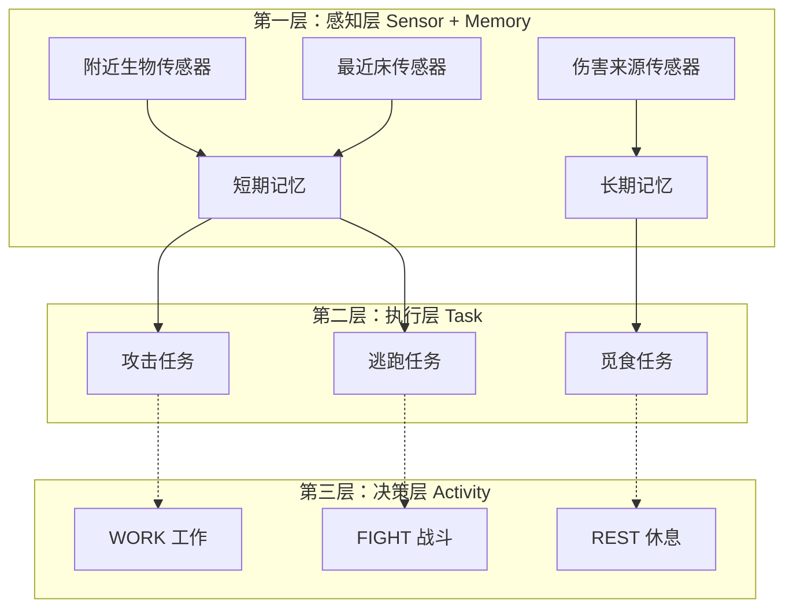
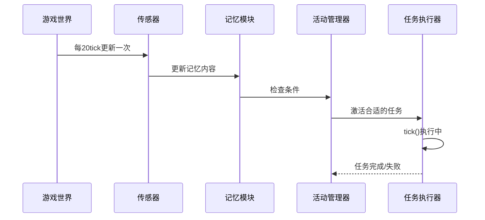
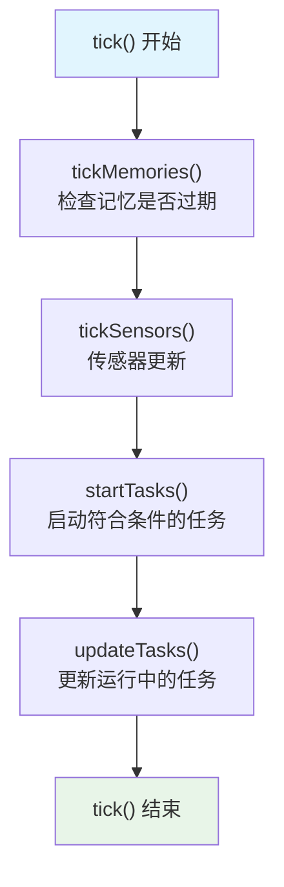
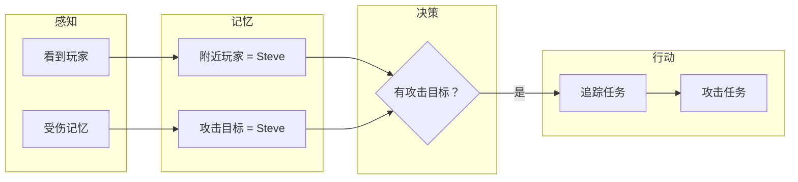

# 第27章：AI大脑 - 生物的"思考中心"

> **注意**：以下代码示例基于 CFR 反编译结果，实际 Minecraft 源码可能有所差异。在使用时请以游戏源码为准。

## 目标

- 理解 AI 大脑是什么
- 掌握 Brain、Task、Activity 三者的关系
- 能够画出 AI 三层架构图

## 前置知识

- 了解什么是实体（Entity）
- 知道生物是 LivingEntity 的子类
- 具备基本的面向对象概念

## 核心概念：什么是AI大脑？

### 生活比喻

想象你是一只僵尸。你需要思考：

- "前面有人吗？"（感知）
- "我要追过去打他！"（决策）
- "先迈左脚，再迈右脚..."（行动）

**AI大脑** 就是生物的"大脑"，它负责：
1. **感知** - 通过传感器收集周围信息
2. **记忆** - 记住重要的事情
3. **决策** - 决定做什么
4. **行动** - 执行具体的任务

> **一句话理解**：AI大脑就是生物的"指挥官"，协调感知、记忆、决策和行动。

### 源码解读

在 Minecraft 中，每个 `LivingEntity`（活着的生物）都有一个大脑：

```java
public class Brain<E extends LivingEntity> {
    // 记忆存储 - 生物记住的信息
    private final Map<MemoryModuleType<?>, Optional<? extends Memory<?>>> memories;

    // 传感器列表 - 生物的"感官"
    private final Map<SensorType<? extends Sensor<? super E>>, Sensor<? super E>> sensors;

    // 任务映射 - 按优先级组织的行为
    private final Map<Integer, Map<Activity, Set<Task<? super E>>>> tasks;

    // 日程表 - 生物的时间表
    private Schedule schedule;
}
```

**源码位置**：`net/minecraft/entity/ai/brain/Brain.java`

## 图解：AI三层架构

Minecraft 的 AI 系统分为三层，从底层到顶层：



### 层次详解

| 层级 | 组件 | 作用 | 类比 |
|------|------|------|------|
| 第三层 | Activity（活动） | 生物当前的状态 | "我现在在做什么" |
| 第二层 | Task（任务） | 具体的行为动作 | "我要攻击他" |
| 第一层 | Sensor + Memory | 感知和记忆 | "眼睛看到敌人" |

## 图解：生物的"思考"流程



## 图解：Brain的tick循环

每一刻（tick），大脑都会执行一次完整的思考循环：



## 核心代码：创建一个简单的大脑

### 1. 创建大脑配置

```java
// 定义需要的记忆模块类型
Collection<MemoryModuleType<?>> memoryModules = ImmutableList.of(
    MemoryModuleType.NEAREST_VISIBLE_ATTACKABLE,
    MemoryModuleType.WALK_TARGET,
    MemoryModuleType.HURT_BY_ENTITY
);

// 定义需要的传感器
Collection<SensorType<? extends Sensor<?>>> sensorTypes = ImmutableList.of(
    SensorType.NEAREST_LIVING_ENTITIES,
    SensorType.HURT_BY
);

// 创建大脑配置
Profile<E> profile = Brain.createProfile(memoryModules, sensorTypes);

// 使用配置创建大脑
Brain<E> brain = profile.deserialize(data);
```

### 2. 设置活动

```java
// 设置核心活动（始终运行）
brain.setCoreActivities(ImmutableSet.of(Activity.CORE));

// 设置默认活动
brain.setDefaultActivity(Activity.IDLE);

// 为活动添加任务
brain.setTaskList(Activity.IDLE, 0, ImmutableList.of(
    new IdleWanderTask(),
    new LookAtEntityTask(5)
));
```

### 3. 大脑的tick方法

```java
public void tick(ServerWorld world, E entity) {
    this.tickMemories();      // 检查记忆过期
    this.tickSensors(world, entity);  // 更新传感器
    this.startTasks(world, entity);   // 启动新任务
    this.updateTasks(world, entity);  // 更新运行中的任务
}
```

## 实战演示：僵尸的行为

让我们看一个具体的例子——僵尸是如何"思考"的：



### 僵尸大脑的核心代码

```java
// 为僵尸设置战斗AI
brain.setTaskList(Activity.CORE, 0, ImmutableList.of(
    new LookAtEntityTask(EntityPredicate.IS_VISIBLE),
    new MoveToTargetTask()
));

brain.setTaskList(Activity.FIGHT, 0, ImmutableList.of(
    new MeleeAttackTask(20),
    new BackUpIfTooCloseTask(20)
));
brain.setTaskList(Activity.FIGHT, 5, ImmutableList.of(
    new JumpOnHurtByTargetTask()
), MemoryModuleType.HURT_BY_ENTITY);
```

## 重要概念：Activity vs Task

萌新经常搞混这两个概念：

| 概念 | 英文 | 作用 | 例子 |
|------|------|------|------|
| Activity | 活动 | 表示"状态" | WORK（工作）、REST（休息） |
| Task | 任务 | 执行"动作" | 攻击、逃跑、觅食 |

**简单理解**：
- Activity = "我现在是员工"（状态）
- Task = "我现在在写代码"（动作）

一个 Activity 可以包含多个 Task，就像"工作"状态包含"写代码"、"开会"、"吃饭"等任务。

## 小结

1. **AI大脑**是生物的思考中心，管理感知、记忆、决策和行动
2. **三层架构**：感知层(Sensor) → 执行层(Task) → 决策层(Activity)
3. **记忆模块**存储生物的各种信息（位置、目标、状态等）
4. **传感器**定期更新感知信息到记忆
5. **活动**表示生物的当前状态，**任务**是具体的行为
6. **tick循环**：每tick执行一次完整的思考流程

## 练习

1. **思考题**：如果僵尸找不到攻击目标，它会处于什么Activity？
2. **动手题**：查看村民（Villager）有哪些Activity
3. **挑战题**：尝试理解 `Brain.tick()` 方法的执行顺序

## 相关链接

- **上一章**：[第26章 生成系统](../Part-4-Entity/26-spawn-system.md)
- **下一章**：[第28章 记忆系统](./28-memory-system.md)
- **相关源码**：
  - `net/minecraft/entity/ai/brain/Brain.java`
  - `net/minecraft/entity/ai/brain/Activity.java`

### 源码文件位置

| 文件 | 源码路径 | 说明 |
|------|----------|------|
| Brain.java | `net/minecraft/entity/ai/brain/Brain.java` | AI大脑基类 |
| Activity.java | `net/minecraft/entity/ai/brain/Activity.java` | 活动定义 |
| Task.java | `net/minecraft/entity/ai/brain/task/Task.java` | 任务基类 |
