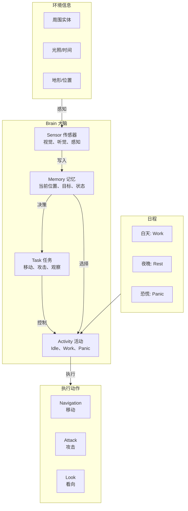

# 第 28 章：AI Brain 大脑入门（AI Brain Introduction）

> ⭐ Minecraft 最有趣的系统 - 深入了解实体的"大脑"

---

## 章节目标

- 理解 Brain 系统的核心概念
- 掌握 Memory（记忆）系统的原理
- 了解 Activity（活动）和 Schedule（日程）的基础
- 理解 Sensor（传感器）和 Task（任务）的协作
- 能够创建简单的自定义 AI 行为

## 前置知识

- 熟悉 MobEntity 的概念
- 了解 Java 面向对象编程

## 核心概念

### Brain = 实体的"大脑/CPU"

想象你是一个僵尸：
- 👁️ 你的眼睛告诉你："前方有个玩家"
- 🧠 你的大脑记住这个信息（Memory）
- 🤔 你思考："我应该追上去攻击他"
- 🏃 你执行："移动到玩家位置"（Task）
- ⏰ 你知道现在是白天，阳光很刺眼（Schedule）

**Brain 系统就是 Minecraft 生物的"思考"机制！**

## 1. Brain 系统概述

### 为什么需要 Brain？

在 Minecraft 1.15 之前，生物使用旧的 Goal 系统：
- ✅ 简单直接
- ❌ 行为僵硬，没有"记忆"
- ❌ 不能根据环境变化做出反应
- ❌ 生物之间没有"社交"

**Brain 系统解决了这些问题！**

### Brain vs Goal 系统对比

| 特性 | Goal 系统（旧） | Brain 系统（新） |
|------|----------------|-----------------|
| 记忆 | ❌ 无 | ✅ 有（Memory） |
| 感知 | ❌ 有限 | ✅ 多样化（Sensor） |
| 行为 | 固定 | ✅ 可组合（Activity） |
| 日程 | ❌ 无 | ✅ 有（Schedule） |
| 学习 | ❌ 无 | ✅ 可训练 |

## 2. Brain 核心结构

### Brain 类定义

```java
// Brain.java
public class Brain<D extends Entity> {
    // 记忆模块
    private final Map<MemoryModuleType<?>, Optional<?>> memories = new EnumMap<>(MemoryModuleType.class);
    
    // 传感器列表
    private final List<Sensor<D>> sensors = new ArrayList<>();
    
    // 活动（行为状态）
    private final Map<Activity, BrainTaskGroup> activities = new EnumMap<>(Activity.class);
    
    // 日程安排
    private Schedule schedule;
    
    // 当前时间
    private long gameTime;
}
```

### Brain 与 Entity 的关系

```java
// LivingEntity.java
public abstract class LivingEntity extends Entity {
    // AI 大脑
    protected Brain<?> brain;
    
    // 初始化大脑
    public Brain<D> initializeBrain() {
        this.brain = this.createBrain(this.getBrainFactory());
        return this.brain;
    }
    
    // 创建大脑（由子类实现）
    protected Brain.Provider<D> getBrainFactory() {
        return Brain::new;
    }
}
```

### 继承层次

```
┌─────────────────────────────────────────────────────────────────┐
│                      LivingEntity (有生命实体)                   │
├─────────────────────────────────────────────────────────────────┤
│  + brain: Brain                 AI 大脑                          │
│  + initializeBrain()            初始化大脑                        │
│  + tickBrain()                  更新大脑                          │
└─────────────────────────────────────────────────────────────────┘
                              │
          ┌─────────────────────┼─────────────────────┐
          ▼                     ▼                     ▼
┌───────────────┐     ┌───────────────┐     ┌───────────────┐
│  MobEntity   │     │ PlayerEntity │     │ AmbientEntity │
│   (生物)     │     │   (玩家)    │     │  (蝙蝠等)    │
└───────────────┘     └───────────────┘     └───────────────┘
```

## 3. Memory 记忆系统

### 什么是 Memory？

**Memory = 实体的"记忆"**

就像人类的短期和长期记忆：
- 🧠 **短期记忆**：刚刚看到的玩家、刚受到的伤害
- 📚 **长期记忆**：家在哪里、攻击者是谁、逃跑路线

### MemoryModuleType 记忆类型

```java
// MemoryModuleType.java
public class MemoryModuleType<V> {
    // 位置相关
    public static final MemoryModuleType<GlobalPos> HOME = 
        MemoryModuleType.createCodec("home", 1, GlobalPos.CODEC);
    
    public static final MemoryModuleType<GlobalPos> JOB_SITE = 
        MemoryModuleType.createCodec("job_site", 1, GlobalPos.CODEC);
    
    public static final MemoryModuleType<GlobalPos> MEETING_POINT = 
        MemoryModuleType.createCodec("meeting_point", 1, GlobalPos.CODEC);
    
    // 实体相关
    public static final MemoryModuleType<LivingEntity> NEAREST_ATTACKABLE = 
        MemoryModuleType.createCodec("nearest_attackable", 1, LivingEntity.CODEC);
    
    public static final MemoryModuleType<LivingEntity> NEAREST_VISIBLE_PLAYER = 
        MemoryModuleType.createCodec("nearest_visible_player", 1, LivingEntity.CODEC);
    
    public static final MemoryModuleType<List<LivingEntity>> NEAREST_VISIBLE_HOSTILE = 
        MemoryModuleType.createCodec("nearest_visible_hostile", 1, 
            LivingEntity.LIST_CODEC);
    
    // 状态相关
    public static final MemoryModuleType<Integer> UNIQUE_EMIT_STRENGTH = 
        MemoryModuleType.createCodec("unique_emit_strength", 1, IntCodecs.POSITIVE_INT);
    
    public static final MemoryModuleType<Long> LAST_SLEPT = 
        MemoryModuleType.createCodec("last_slept", 1, LongCodecs.NON_NEGATIVE_LONG);
    
    public static final MemoryModuleType<Long> LAST_WOKEN = 
        MemoryModuleType.createCodec("last_woken", 1, LongCodecs.NON_NEGATIVE_LONG);
}
```

### 常用 Memory 类型一览

| 记忆类型 | 内存类型 | 用途 |
|----------|----------|------|
| `NEAREST_VISIBLE_PLAYER` | LivingEntity | 最近可见的玩家 |
| `NEAREST_VISIBLE_HOSTILE` | List | 可见的敌对实体 |
| `HOME` | GlobalPos | 家的位置 |
| `JOB_SITE` | GlobalPos | 工作站点位置 |
| `WALK_TARGET` | BlockPos | 行走目标位置 |
| `LOOK_TARGET` | BlockPos | 看向目标位置 |
| `ATTACK_TARGET` | LivingEntity | 攻击目标 |
| `HURT_BY` | LivingEntity | 攻击者 |
| `HURT_BY_ENTITY` | LivingEntity | 伤害来源 |
| `IS_PANICKING` | Boolean | 是否恐慌 |
| `IS_SITTING` | Boolean | 是否坐下 |

### Memory 操作

```java
// Brain 类中的 Memory 操作
public class Brain<D extends Entity> {
    
    // 设置记忆
    public <V> void remember(MemoryModuleType<V> type, @Nullable V value) {
        this.memories.put(type, Optional.ofNullable(value));
    }
    
    // 获取记忆
    public <V> Optional<V> getMemory(MemoryModuleType<V> type) {
        return (Optional<V>) this.memories.get(type);
    }
    
    // 检查是否有记忆
    public <V> boolean hasMemory(MemoryModuleType<V> type) {
        return this.getMemory(type).isPresent();
    }
    
    // 获取记忆或默认值
    public <V> V getMemoryOrDefault(MemoryModuleType<V> type, V defaultValue) {
        return this.getMemory(type).orElse(defaultValue);
    }
    
    // 清除记忆
    public <V> void forget(MemoryModuleType<V> type) {
        this.memories.put(type, Optional.empty());
    }
    
    // 设置记忆过期时间
    public <V> void remember(MemoryModuleType<V> type, @Nullable V value, int ticks) {
        this.remember(type, value);
        // 内部会设置过期时间
    }
}
```

### Memory 使用示例

```java
// 在 Task 中使用 Memory
public class WalkToTargetTask extends Task<CreatureEntity> {
    
    @Override
    public void tick(ServerWorld world, CreatureEntity entity, long time) {
        // 获取记忆中的目标位置
        Optional<BlockPos> targetOpt = entity.getBrain().getMemory(MemoryModuleType.WALK_TARGET);
        
        if (targetOpt.isPresent()) {
            BlockPos target = targetOpt.get();
            
            // 移动到目标
            entity.getNavigation().startMovingTo(
                target.getX(), target.getY(), target.getZ(),
                1.0
            );
        }
    }
}
```

## 4. Activity 活动系统

### 什么是 Activity？

**Activity = 生物的"行为状态"**

就像人类有不同的工作状态：
- 🏠 在家休息
- 💼 去上班
- 🍽️ 吃饭时间
- 😴 睡觉时间

### Activity 枚举

```java
// Activity.java
public enum Activity {
    CORE,       // 核心活动（始终运行）
    IDLE,       // 空闲
    WORK,       // 工作
    REST,       // 休息
    MEET,       // 社交
    PANIC,      // 恐慌
    PREY,       // 捕猎
    FIGHT,      // 战斗
    ROAM,       // 漫游
    JUMP,       // 跳跃
    LONG_JUMP,  // 远跳
    BREED,      // 繁殖
    RIDE,       // 骑乘
    TAKEOFF,   // 起飞（蝙蝠）
    GLIDE,     // 滑翔
    LAND,      // 降落
    CROUCHING,  // 蹲伏
    INFLUENCE_VILLAGER_HOSTILES,  // 影响村民敌对
    INFLUENCE_VILLAGER_REPUTATION, // 影响村民声望
    SLEEP,     // 睡觉
    WALK,      // 行走
}
```

### Activity 优先级

```
Activity 优先级（高 → 低）：

PANIC (恐慌)    ████████████████████████████████████████ 最高
FIGHT (战斗)    ███████████████████████████████████
PREY (捕猎)     ███████████████████████████
WORK (工作)     ███████████████████
BREED (繁殖)    ████████████████
IDLE (空闲)    ████████████ 最低
```

### Activity 注册

```java
// 在 Brain 中注册 Activity
public class VillagerEntity extends MerchantEntity {
    
    @Override
    protected Brain<?> getBrain() {
        return (Brain<VillagerEntity>) super.getBrain();
    }
    
    @Override
    protected Brain.Profile<VillagerEntity> getBrainProfile() {
        return Brain.Profile.create(
            "villager_brain",
            // 默认传感器
            ImmutableList.of(
                Sensor.NEAREST_VISIBLE_PLAYER,
                Sensor.NEAREST_VISIBLE_HOSTILE,
                Sensor.HURT_BY,
                Sensor.VILLAGER_HOSTILES,
                Sensor.GOLEM_DETECTED
            ),
            // 默认记忆类型
            ImmutableList.of(
                MemoryModuleType.HOME,
                MemoryModuleType.JOB_SITE,
                MemoryModuleType.MEETING_POINT,
                MemoryModuleType.MOBS,
                MemoryModuleType.VISIBLE_MOBS,
                MemoryModuleType.HURT_BY,
                MemoryModuleType.HURT_BY_ENTITY
            )
        );
    }
    
    public void initBrain() {
        Brain<VillagerEntity> brain = this.getBrain();
        
        // 注册 Core 活动
        brain.addActivity(Activity.CORE, ImmutableList.of(
            // 核心任务：看向攻击者
            new LookAtEntityTask(
                predicate -> predicate.entityOf(
                    EntityType.PLAYER
                ),
                8.0f
            )
        ));
        
        // 注册 Idle 活动
        brain.addActivity(Activity.IDLE, ImmutableList.of(
            new WalkRandomlyTask(0.6),
            new IdleTask(20, 40)
        ));
        
        // 设置日程
        brain.setSchedule(Schedule.VILLAGER_DEFAULT);
    }
}
```

## 5. Sensor 传感器系统

### 什么是 Sensor？

**Sensor = 实体的"感觉器官"**

就像人类的五官：
- 👀 视觉：看到附近有什么
- 👂 听觉：听到声音
- 🖐️ 触觉：受到伤害

### 内置传感器

```java
// SensorType.java
public class SensorType<D extends Entity> {
    public static final SensorType<DummySensor> DUMMY = 
        SensorType.create("dummy", DummySensor::new);
    
    public static final SensorType<NearestVisibleLivingEntitySensor> NEAREST_LIVING = 
        SensorType.create("nearest_visible_living", NearestVisibleLivingEntitySensor::new);
    
    public static final SensorType<HurtBySensor> HURT_BY = 
        SensorType.create("hurt_by", HurtBySensor::new);
    
    public static final SensorType<NearestBedSensor> NEAREST_BED = 
        SensorType.create("nearest_bed", NearestBedSensor::new);
    
    public static final SensorType<GolemSensor> GOLEM_DETECTED = 
        SensorType.create("golem_detected", GolemSensor::new);
    
    public static final SensorType<VillagerHostilesSensor> VILLAGER_HOSTILES = 
        SensorType.create("villager_hostiles", VillagerHostilesSensor::new);
}
```

### Sensor 示例：NearestVisibleLivingEntitySensor

```java
// NearestVisibleLivingEntitySensor.java
public class NearestVisibleLivingEntitySensor extends Sensor<CreatureEntity> {
    
    @Override
    protected void sense(ServerWorld world, CreatureEntity entity) {
        // 获取可见的最近实体
        List<LivingEntity> visibleEntities = this.getVisibleEntities(entity);
        
        // 设置记忆
        brain.remember(MemoryModuleType.NEAREST_VISIBLE_PLAYER, 
            this.getNearestPlayer(entity, visibleEntities));
        
        brain.remember(MemoryModuleType.NEAREST_VISIBLE_HOSTILE,
            this.getNearestHostile(entity, visibleEntities));
        
        brain.remember(MemoryModuleType.NEAREST_VISIBLE_PIG,
            this.getNearestType(entity, visibleEntities, EntityType.PIG));
    }
    
    private List<LivingEntity> getVisibleEntities(CreatureEntity entity) {
        // 视线检测
        Box box = new Box(
            entity.getX() - 16, entity.getY() - 4, entity.getZ() - 16,
            entity.getX() + 16, entity.getY() + 4, entity.getZ() + 16
        );
        
        return entity.getWorld().getEntitiesByType(
            EntityType.PLAYER,
            box,
            entityx -> this.isVisible(entity, (LivingEntity) entityx)
        );
    }
}
```

### Sensor 范围配置

```java
// Sensor 配置
public class NearestVisibleLivingEntitySensor extends Sensor<CreatureEntity> {
    // 默认检测范围：16 格
    public static final int DEFAULT_RANGE = 16;
    
    public NearestVisibleLivingEntitySensor() {
        // 可配置范围
        super(DEFAULT_RANGE);
    }
    
    public NearestVisibleLivingEntitySensor(int range) {
        super(range);
    }
}
```

## 6. Task 任务系统

### 什么是 Task？

**Task = 大脑下达的"指令"**

就像具体的待办事项：
- 任务 1：走到坐标 (100, 64, 200)
- 任务 2：攻击玩家
- 任务 3：看向最近的村民

### Task 类型

```java
// Task.java
public abstract class Task<E extends Entity> {
    // 任务运行间隔（ticks）
    private final int ticksInterval;
    
    // 开始条件
    public abstract boolean shouldRun(ServerWorld world, E entity);
    
    // 开始执行
    public void start(ServerWorld world, E entity, long time) {}
    
    // 每 tick 执行
    public abstract void tick(ServerWorld world, E entity, long time);
    
    // 停止执行
    public void stop(ServerWorld world, E entity, long time) {}
    
    // 运行间隔
    public int getTicksInterval() {
        return this.ticksInterval;
    }
}
```

### 常用 Task

```java
// 移动任务
new WalkToTargetTask(1.0f)
new StrollTask(0.6f)
new PanicTask(1.6f)
new SwimTask(1.0f)
new JumpToTargetTask(1.0f)

// 攻击任务
new MeleeAttackTask(1.0f)
new RangedAttackTask<>(1.0f, 10.0f, 20)

// 观察任务
new LookAtEntityTask(playerPredicate, 8.0f)
new LookAtMobTask(8.0f)

// 社交任务
new SocializeTask(0.6f)

// 工作任务
new WorkAtJobSiteTask(0.5f)
new WalkToJobSiteTask(1.0f)
```

## Mermaid 图表：Brain 系统架构



## 7. Schedule 日程系统

### Schedule 定义

```java
// Schedule.java
public class Schedule {
    public static final Schedule VILLAGER_DEFAULT = Schedule.create("villager_default", 
        builder -> builder
            .changeActivityAt(25000, Activity.IDLE)           // 午夜后进入空闲
            .changeActivityAt(30000, Activity.WORK)            // 早上开始工作
            .changeActivityAt(50000, Activity.IDLE)            // 中午休息
            .changeActivityAt(65000, Activity.WORK)          // 下午继续工作
            .changeActivityAt(75000, Activity.REST)          // 晚上回家休息
    );
}
```

### 日程安排

```
Villager Default Schedule:

00:00 - 05:00 │ IDLE   │ 睡觉或四处走动
05:00 - 10:00 │ WORK   │ 去工作地点工作
10:00 - 13:00 │ IDLE   │ 午餐休息
13:00 - 19:00 │ WORK   │ 继续工作
19:00 - 24:00 │ REST   │ 回家休息
```

## 实战演示：创建一个简单的自定义 Brain

### 1. 定义 Brain Profile

```java
public class MyCreatureBrain {
    
    public static Brain.Profile<MyCreatureEntity> createBrainProfile() {
        return Brain.Profile.create(
            "my_creature_brain",
            // 传感器列表
            ImmutableList.of(
                Sensor.NEAREST_LIVING,
                Sensor.NEAREST_VISIBLE_PLAYER,
                Sensor.HURT_BY
            ),
            // 记忆类型
            ImmutableList.of(
                MemoryModuleType.NEAREST_VISIBLE_PLAYER,
                MemoryModuleType.HURT_BY_ENTITY,
                MemoryModuleType.IS_PANICKING,
                MemoryModuleType.WALK_TARGET,
                MemoryModuleType.LOOK_TARGET
            ),
            // 传感器范围
            ImmutableSet.of()
        );
    }
}
```

### 2. 初始化 Brain

```java
public class MyCreatureEntity extends CreatureEntity {
    
    @Override
    protected Brain<?> getBrain() {
        return super.getBrain();
    }
    
    @Override
    protected void initGoals() {
        // 调用父类初始化
        super.initGoals();
        
        Brain<MyCreatureEntity> brain = this.getBrain();
        
        // 注册 Core 活动
        brain.addActivity(Activity.CORE, ImmutableList.of(
            // 看向伤害来源
            new LookAtEntityTask(
                entity -> entity.getBrain().hasMemory(MemoryModuleType.HURT_BY_ENTITY),
                8.0f,
                30
            )
        ));
        
        // 注册 Idle 活动
        brain.addActivity(Activity.IDLE, ImmutableList.of(
            new StrollTask(0.6f),
            new IdleTask(30, 60)
        ));
        
        // 注册 Panic 活动
        brain.addActivity(Activity.PANIC, ImmutableList.of(
            new PanicTask(1.6f),
            new ForgetTask<>(MemoryModuleType.HURT_BY_ENTITY)
        ));
    }
}
```

### 3. Tick Brain

```java
@Override
public void tick() {
    super.tick();
    
    // 更新大脑
    this.getBrain().tick(
        this.getWorld(),
        this
    );
    
    // 检查是否恐慌
    if (this.getHealth() < this.getMaxHealth() * 0.5f) {
        this.getBrain().remember(MemoryModuleType.IS_PANICKING, true);
    }
}
```

## 课后自查

完成本章学习后，你应该能够：

- [ ] 解释 Brain 和 Goal 系统的区别
- [ ] 理解 Memory 记忆系统的作用
- [ ] 知道常见 MemoryModuleType 的用途
- [ ] 理解 Activity 活动状态的概念
- [ ] 了解 Sensor 传感器的工作原理
- [ ] 掌握 Task 任务的使用方法
- [ ] 能够创建简单的自定义 Brain

## 关键术语表

| 术语 | 英文 | 解释 |
|------|------|------|
| 大脑 | Brain | 控制实体 AI 的核心组件 |
| 记忆 | Memory | 实体的环境信息存储 |
| 活动 | Activity | 生物的行为状态 |
| 传感器 | Sensor | 收集环境信息的组件 |
| 任务 | Task | 具体的行为指令 |
| 日程 | Schedule | 基于时间的活动安排 |

---

**参考源码路径**：

- `D:\Minecraft-Learning\assets\mc\1.21\net\minecraft\entity\ai\brain\Brain.java`
- `D:\Minecraft-Learning\assets\mc\1.21\net\minecraft\entity\ai\brain\memory\MemoryModuleType.java`
- `D:\Minecraft-Learning\assets\mc\1.21\net\minecraft\entity\ai\brain\sensor\Sensor.java`
- `D:\Minecraft-Learning\assets\mc\1.21\net\minecraft\entity\ai\brain\task\Task.java`
- `D:\Minecraft-Learning\assets\mc\1.21\net\minecraft\entity\ai\brain\Activity.java`
