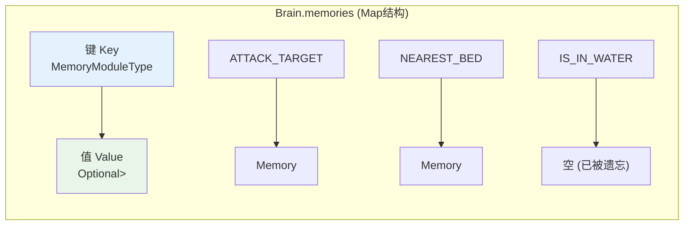
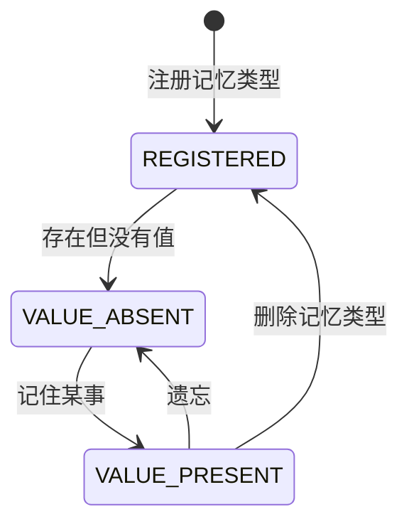
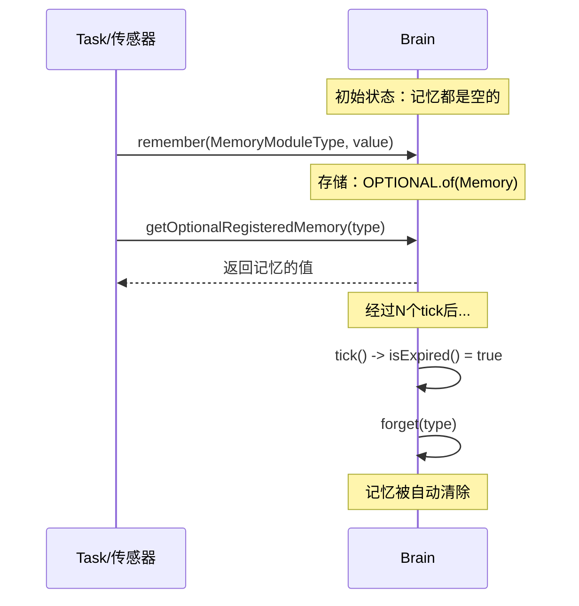
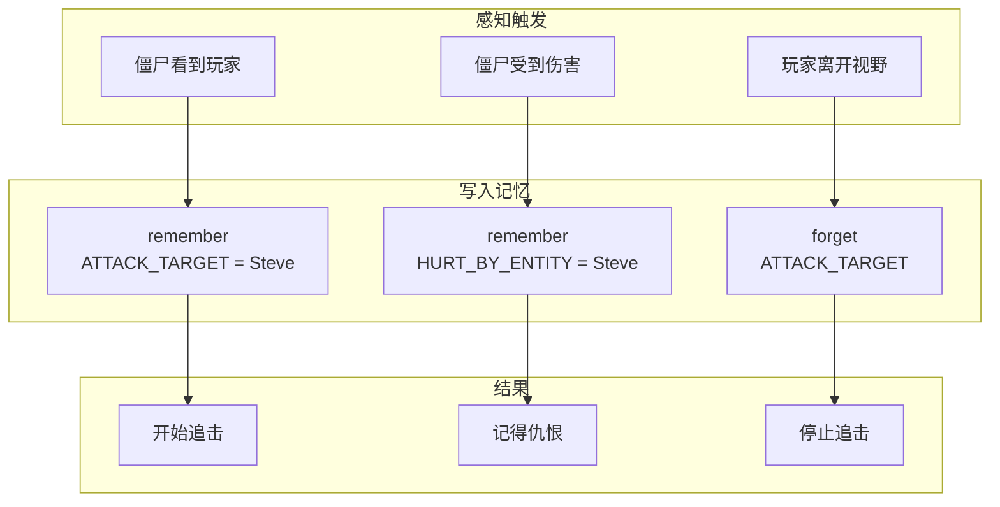

# 第28章：记忆系统 - 生物的"记忆库"

> **注意**：以下代码示例基于 CFR 反编译结果，实际 Minecraft 源码可能有所差异。在使用时请以游戏源码为准。

## 目标

- 理解什么是记忆（Memory）
- 掌握短期记忆和长期记忆的区别
- 学会使用 MemoryModuleType 存储和读取数据
- 理解记忆的过期机制

## 前置知识

- 了解 Brain 的基本结构（见第二十七章）
- 知道什么是 HashMap（键值对存储）

## 核心概念：什么是记忆？

### 生活比喻

人的记忆有两种：

1. **短期记忆** - "我刚才把钥匙放哪儿了？"（过一会儿就忘）
2. **长期记忆** - "我妈妈叫什么名字？"（记一辈子）

Minecraft 的生物也有类似的记忆系统：

| 记忆类型 | 生命周期 | 例子 | 对应代码 |
|----------|----------|------|----------|
| 临时记忆 | 几秒~几分钟 | "刚才听到铃声" | `Memory.timed(value, expiry)` |
| 永久记忆 | 永远 | "我的家在哪里" | `Memory.permanent(value)` |

> **一句话理解**：记忆就是生物"知道"的各种信息，有的时间短，有的时间长。

### 源码解读

#### Memory 类 - 记忆的容器

```java
public class Memory<T> {
    private final T value;      // 记忆的内容
    private long expiry;        // 过期时间（tick数）

    // 创建永久记忆
    public static <T> Memory<T> permanent(T value) {
        return new Memory<T>(value, Long.MAX_VALUE);
    }

    // 创建临时记忆（会过期）
    public static <T> Memory<T> timed(T value, long expiry) {
        return new Memory<T>(value, expiry);
    }

    // 每tick减少1
    public void tick() {
        if (this.isTimed()) {
            --this.expiry;
        }
    }

    // 检查是否过期
    public boolean isExpired() {
        return this.expiry <= 0L;
    }
}
```

**源码位置**：`net/minecraft/entity/ai/brain/Memory.java`

#### MemoryModuleType - 记忆的类型

每种记忆都有一个类型，比如：

```java
public class MemoryModuleType<U> {
    // 攻击目标
    public static final MemoryModuleType<LivingEntity> ATTACK_TARGET = ...;

    // 走路目标
    public static final MemoryModuleType<WalkTarget> WALK_TARGET = ...;

    // 最近的床
    public static final MemoryModuleType<BlockPos> NEAREST_BED = ...;

    // 受到的伤害来源
    public static final MemoryModuleType<DamageSource> HURT_BY = ...;

    // 是否在水中
    public static final MemoryModuleType<Unit> IS_IN_WATER = ...;
}
```

**源码位置**：`net/minecraft/entity/ai/brain/MemoryModuleType.java`

## 图解：记忆存储结构

Brain 中记忆的存储方式是一个 Map（键值对）：



### 记忆的三种状态



## 图解：记忆的读写流程



## 核心代码：记忆的基本操作

### 1. 写入记忆（记住）

```java
Brain<?> brain = entity.getBrain();

// 永久记住（不会自动消失）
brain.remember(MemoryModuleType.HOME, homePosition);

// 临时记住（会在指定tick后自动消失）
// 例如：记住30秒（30秒 × 20tick/秒 = 600tick）
brain.remember(MemoryModuleType.HEARD_BELL_TIME, world.getTime(), 600L);
```

### 2. 读取记忆（回忆）

```java
Brain<?> brain = entity.getBrain();

// 安全读取（推荐）：返回 Optional
Optional<BlockPos> home = brain.getOptionalRegisteredMemory(MemoryModuleType.HOME);
home.ifPresent(pos -> {
    // 找到家了！去那里
    brain.remember(MemoryModuleType.WALK_TARGET, new WalkTarget(pos, speed, 5));
});

// 或者直接获取值
if (brain.hasMemoryModule(MemoryModuleType.HOME)) {
    BlockPos home = brain.getOptionalRegisteredMemory(MemoryModuleType.HOME).get();
    // 使用 home...
}
```

### 3. 清除记忆（遗忘）

```java
Brain<?> brain = entity.getBrain();

// 忘记某个记忆
brain.forget(MemoryModuleType.ATTACK_TARGET);

// 忘记所有记忆
brain.forgetAll();
```

### 4. 检查记忆是否存在

```java
Brain<?> brain = entity.getBrain();

// 检查是否有某个记忆
if (brain.hasMemoryModule(MemoryModuleType.NEAREST_BED)) {
    // 有床的记忆
}

// 检查是否有特定值的记忆
if (brain.hasMemoryModuleWithValue(MemoryModuleType.HURT_BY_ENTITY, attacker)) {
    // 记得被这个人攻击过
}
```

## 实战演示：僵尸的记忆



### 完整例子

```java
public class ZombieBrain {
    public static void initialize(Brain<ZombieEntity> brain) {
        // 添加需要的记忆类型
        brain.setTaskList(Activity.CORE, 0, ImmutableList.of(
            // 检查是否有攻击目标
            new CustomTask<ZombieEntity>() {
                @Override
                public boolean check() {
                    return brain.hasMemoryModule(MemoryModuleType.ATTACK_TARGET);
                }

                @Override
                public void execute(ZombieEntity zombie) {
                    // 回忆攻击目标
                    Optional<LivingEntity> target =
                        brain.getOptionalRegisteredMemory(MemoryModuleType.ATTACK_TARGET);

                    target.ifPresent(entity -> {
                        // 设置走路目标
                        brain.remember(MemoryModuleType.WALK_TARGET,
                            new WalkTarget(entity, 1.0f, 3));
                    });
                }
            }
        ));
    }
}
```

## 重要概念：记忆模块类型列表

### 目标类记忆

| 记忆类型 | 存储内容 | 用途 |
|----------|----------|------|
| `ATTACK_TARGET` | 攻击目标实体 | 僵尸、骷髅等记得要打谁 |
| `NEAREST_VISIBLE_PLAYER` | 最近可见的玩家 | 感知玩家 |
| `NEAREST_BED` | 最近的床位置 | 村民回家睡觉 |
| `BREED_TARGET` | 繁殖目标 | 动物配对 |

### 位置类记忆

| 记忆类型 | 存储内容 | 用途 |
|----------|----------|------|
| `HOME` | 家（世界坐标） | 记得出生地 |
| `JOB_SITE` | 工作站点 | 村民记得自己的工作台 |
| `MEETING_POINT` | 聚集点 | 村民记得会议地点 |
| `HIDING_PLACE` | 藏身处 | 逃跑时的躲避点 |

### 状态类记忆

| 记忆类型 | 存储内容 | 用途 |
|----------|----------|------|
| `IS_IN_WATER` | 是否在水中 | 触发游泳行为 |
| `IS_PANICKING` | 是否恐慌 | 触发逃跑 |
| `DANCING` | 是否在跳舞 | 村民庆祝 |

## 小结

1. **记忆**是 Brain 中存储信息的结构，分永久和临时两种
2. **Memory** 类包含值和过期时间
3. **MemoryModuleType** 是记忆的类型标识符
4. **remember()** 写入记忆，**forget()** 清除记忆
5. **临时记忆**会随着 tick 自动过期
6. 记忆让多个 Task 可以共享信息，避免重复计算

## 练习

1. **思考题**：村民如何记得自己要去哪张床睡觉？
2. **动手题**：写代码让生物记住一个位置，5秒后自动忘记
3. **挑战题**：查看还有哪些记忆类型是你感兴趣的？

## 相关链接

- **上一章**：[第27章 AI大脑介绍](./27-ai-brain-intro.md)
- **下一章**：[第29章 传感器系统](./29-sensor-system.md)
- **相关源码**：
  - `net/minecraft/entity/ai/brain/Memory.java`
  - `net/minecraft/entity/ai/brain/MemoryModuleType.java`
  - `net/minecraft/entity/ai/brain/MemoryModuleState.java`

### 源码文件位置

| 文件 | 源码路径 | 说明 |
|------|----------|------|
| MemoryModuleType.java | `net/minecraft/entity/ai/brain/MemoryModuleType.java` | 记忆模块类型 |
| MemoryModuleState.java | `net/minecraft/entity/ai/brain/MemoryModuleState.java` | 记忆状态 |
| Brain.java | `net/minecraft/entity/ai/brain/Brain.java` | 包含记忆管理方法 |
