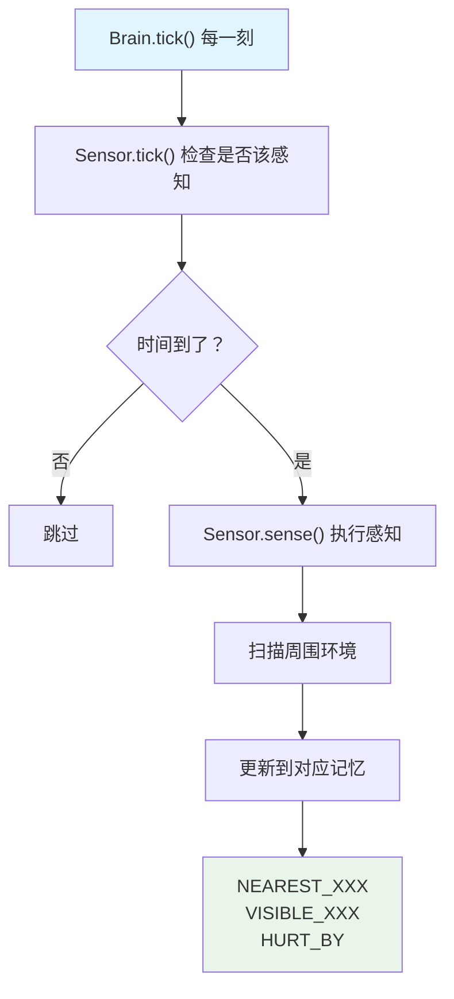
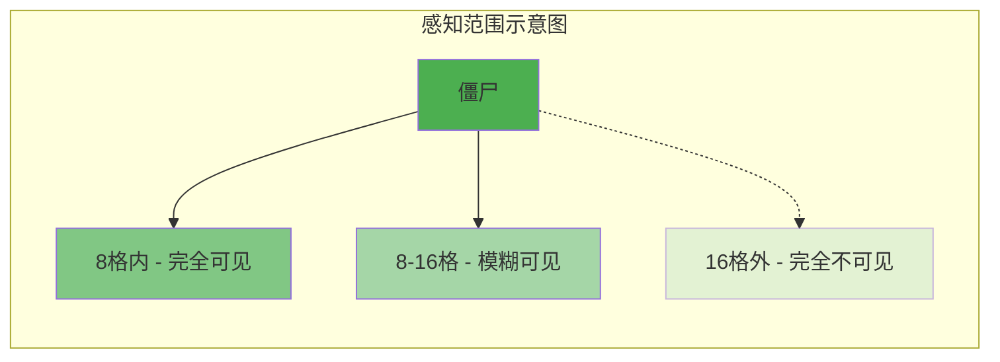
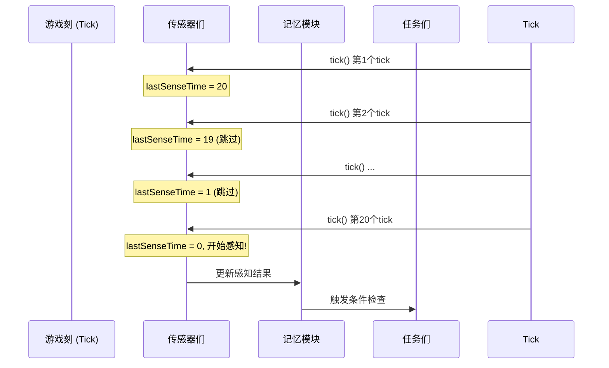
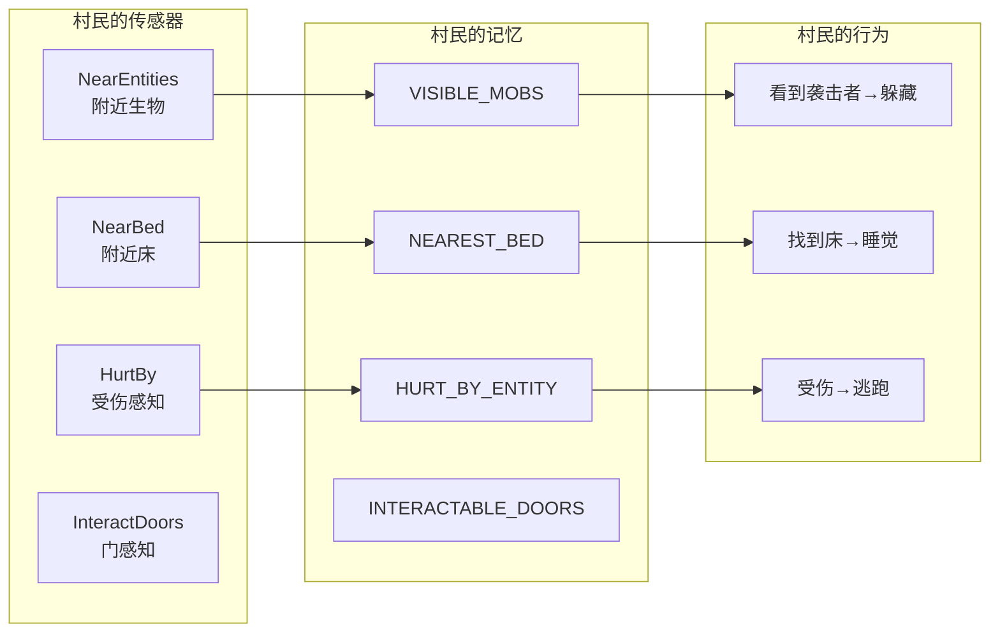
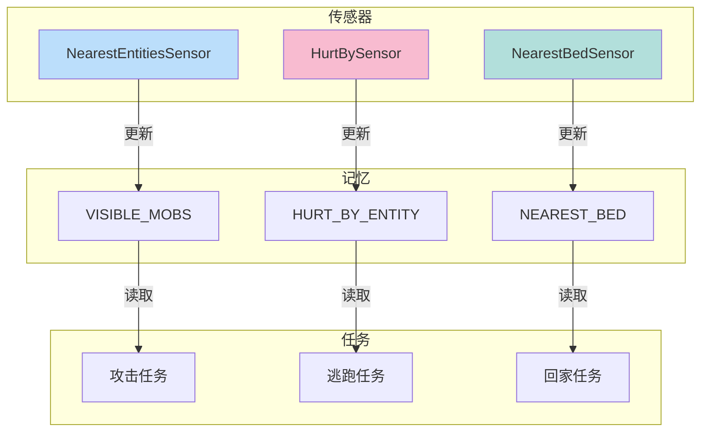

# 第二十九章：传感器系统 - 生物的"感官"

> **注意**：以下代码示例基于 CFR 反编译结果，实际 Minecraft 源码可能有所差异。在使用时请以游戏源码为准。

## 目标

- 理解传感器是什么
- 掌握常见传感器的功能
- 了解感知范围和更新频率
- 能够为自己的生物添加传感器

## 前置知识

- 了解记忆系统（见第二十八章）
- 理解 Brain 的基本结构

## 核心概念：什么是传感器？

### 生活比喻

你的身体有各种感官：

- **眼睛** → 看到东西
- **耳朵** → 听到声音
- **鼻子** → 闻到气味
- **皮肤** → 感到疼痛

传感器就是生物的"五官"：

| 传感器 | 相当于 | 功能 |
|--------|--------|------|
| NearestEntitiesSensor | 眼睛 | 看到附近的生物 |
| NearestBedSensor | 触觉 | 感知附近的床 |
| HurtBySensor | 痛感神经 | 感知受到的伤害 |
| InteractableDoorsSensor | 触觉 | 感知可交互的门 |

> **一句话理解**：传感器就是生物的"感官器官"，负责收集周围世界的信息。

### 源码解读

```java
public abstract class Sensor<E extends LivingEntity> {
    // 感知间隔（默认20tick = 1秒）
    private static final int DEFAULT_RUN_TIME = 20;

    // 基础最大感知距离（默认16格）
    private static final int BASE_MAX_DISTANCE = 16;

    // 上一次感知的时间
    private long lastSenseTime;

    // 感知间隔
    private final int senseInterval;

    // 每tick执行一次
    public final void tick(ServerWorld world, E entity) {
        if (--this.lastSenseTime <= 0L) {
            this.lastSenseTime = this.senseInterval;
            this.sense(world, entity);  // 执行实际的感知
        }
    }

    // 子类实现具体的感知逻辑
    protected abstract void sense(ServerWorld world, E entity);

    // 返回这个传感器会更新哪些记忆
    public abstract Set<MemoryModuleType<?>> getOutputMemoryModules();
}
```

**源码位置**：`net/minecraft/entity/ai/brain/sensor/Sensor.java`

## 图解：感知流程



## 图解：感知范围

Minecraft 中的感知范围是**球形**的：



## 图解：传感器更新时序



## 核心代码：传感器使用

### 1. 创建大脑时添加传感器

```java
// 创建大脑配置，包含传感器
Profile<E> profile = Brain.createProfile(
    memoryModules,                                    // 需要哪些记忆
    ImmutableList.of(
        SensorType.NEAREST_LIVING_ENTITIES,           // 最近生物
        SensorType.NEAREST_PLAYERS,                   // 最近玩家
        SensorType.HURT_BY                            // 伤害感知
    )
);
```

### 2. 内置传感器类型

Minecraft 提供了一系列内置传感器：

| 传感器类型 | 作用 | 更新记忆 |
|-----------|------|----------|
| `NEAREST_LIVING_ENTITIES` | 检测附近所有活着的生物 | `VISIBLE_MOBS`, `NEAREST_HOSTILE` |
| `NEAREST_PLAYERS` | 检测附近玩家 | `NEAREST_PLAYERS` |
| `HURT_BY` | 感知伤害来源 | `HURT_BY_ENTITY`, `HURT_BY` |
| `NEAREST_BED` | 感知附近的床 | `NEAREST_BED` |
| `INTERACTABLE_DOORS` | 感知可交互的门 | `INTERACTABLE_DOORS` |
| `NEAREST_VISIBLE_ADULT_PIGLINS` | 检测附近猪灵 | `NEAREST_VISIBLE_ADULT_PIGLINS` |
| `NEAREST_VISIBLE_HUNTABLE_HOGLIN` | 检测可狩猎的疣猪兽 | `NEAREST_VISIBLE_HUNTABLE_HOGLIN` |

### 3. 自定义传感器

```java
public class NearestGolemSensor extends Sensor<PassiveEntity> {

    private static final int DETECTION_RANGE = 10;

    public NearestGolemSensor() {
        super(40);  // 每40tick感知一次（2秒）
    }

    @Override
    protected void sense(ServerWorld world, PassiveEntity entity) {
        // 扫描附近范围内的铁傀儡
        List<IronGolemEntity> golems = world.getEntitiesByClass(
            IronGolemEntity.class,
            entity.getBoundingBox().expand(DETECTION_RANGE),
            golem -> golem.isAlive()
        );

        // 如果找到铁傀儡，记住它
        if (!golems.isEmpty()) {
            entity.getBrain().remember(MemoryModuleType.NEAREST_VISIBLE_ADULT, golems.get(0));
        } else {
            entity.getBrain().forget(MemoryModuleType.NEAREST_VISIBLE_ADULT);
        }
    }

    @Override
    public Set<MemoryModuleType<?>> getOutputMemoryModules() {
        return ImmutableSet.of(MemoryModuleType.NEAREST_VISIBLE_ADULT);
    }
}
```

## 实战演示：村民的感知

村民（Villager）有多个传感器协同工作：



### 村民传感器的配置

```java
// 村民的大脑配置
public class VillagerBrain {
    public static Brain.Profile<VillagerEntity> createProfile() {
        return Brain.createProfile(
            // 需要的记忆模块
            ImmutableList.of(
                MemoryModuleType.HOME,
                MemoryModuleType.JOB_SITE,
                MemoryModuleType.MEETING_POINT,
                MemoryModuleType.HURT_BY_ENTITY,
                MemoryModuleType.NEAREST_BED
            ),
            // 传感器列表
            ImmutableList.of(
                SensorType.NEAREST_LIVING_ENTITIES,
                SensorType.NEAREST_BED,
                SensorType.HURT_BY,
                SensorType.INTERACTABLE_DOORS
            )
        );
    }
}
```

## 重要概念：感知优先级

当多个目标同时存在时，传感器如何选择？

```java
public class NearestLivingEntitySensor extends Sensor<LivingEntity> {

    protected void sense(ServerWorld world, LivingEntity entity) {
        List<LivingEntity> entities = world.getEntities(
            entity,
            entity.getBoundingBox().expand(16.0),
            target -> target.isAlive() && this.canSense(target, entity)
        );

        // 按距离排序，取最近的
        entities.sort(Comparator.comparingDouble(entity::squaredDistanceTo));

        if (!entities.isEmpty()) {
            // 记住最近的那个
            entity.getBrain().remember(MemoryModuleType.NEAREST_VISIBLE_ADULT, entities.get(0));
        }
    }
}
```

**排序规则**：通常是**距离优先**，取最近的实体。

## 图解：传感器与记忆的关系



## 性能优化：为什么用传感器？

### 对比：传感器 vs 直接计算

**方式1：不使用传感器（低效）**

```java
// 每个任务都单独计算附近实体
public class AttackTask extends Task<VillagerEntity> {
    @Override
    public void tick() {
        // 每个tick都要扫描附近！
        List<PlayerEntity> players = world.getPlayers();
        // 计算距离、判断可见性...
    }
}

public class FleeTask extends Task<VillagerEntity> {
    @Override
    public void tick() {
        // 又要扫描一次附近！
        List<PlayerEntity> players = world.getPlayers();
        // 计算距离、判断威胁...
    }
}
```

**方式2：使用传感器（高效）**

```java
// 传感器只计算一次
public class NearestPlayerSensor extends Sensor {
    @Override
    public void sense() {
        // 计算一次，结果存入记忆
        brain.remember(MemoryModuleType.NEAREST_PLAYERS, players);
    }
}

// 所有任务共享记忆
public class AttackTask extends Task {
    @Override
    public void tick() {
        // 直接读取记忆，O(1)复杂度
        Optional<PlayerEntity> target = brain.getOptionalRegisteredMemory(
            MemoryModuleType.NEAREST_VISIBLE_PLAYER
        );
    }
}
```

> **核心优势**：传感器让多个任务共享感知结果，避免重复计算！

## 小结

1. **传感器**是生物的感官，负责收集周围世界的信息
2. 传感器将感知结果**写入记忆**，供任务读取
3. 传感器有**感知间隔**（默认1秒），不会每tick都执行
4. 常见传感器：附近生物、最近床、伤害来源等
5. 使用传感器的目的是**性能优化**——多个任务共享感知结果
6. 感知范围默认是**16格**的球形区域

## 练习

1. **思考题**：如果怪物找不到玩家，它会一直搜索吗？
2. **动手题**：查看 `NearestBedSensor` 是如何感知床的
3. **挑战题**：创建一个能感知附近钻石的传感器

## 相关链接

- **上一章**：[第28章 记忆系统](./28-memory-system.md)
- **下一章**：[第30章 任务系统](./30-task-system.md)
- **相关源码**：
  - `net/minecraft/entity/ai/brain/sensor/Sensor.java`
  - `net/minecraft/entity/ai/brain/sensor/SensorType.java`

### 源码文件位置

| 文件 | 源码路径 | 说明 |
|------|----------|------|
| Sensor.java | `net/minecraft/entity/ai/sensing/Sensor.java` | 传感器基类 |
| SensorType.java | `net/minecraft/entity/ai/sensing/SensorType.java` | 传感器类型 |
| NearestLivingEntitySensor.java | `net/minecraft/entity/ai/sensing/NearestLivingEntitySensor.java` | 最近生物传感器 |
