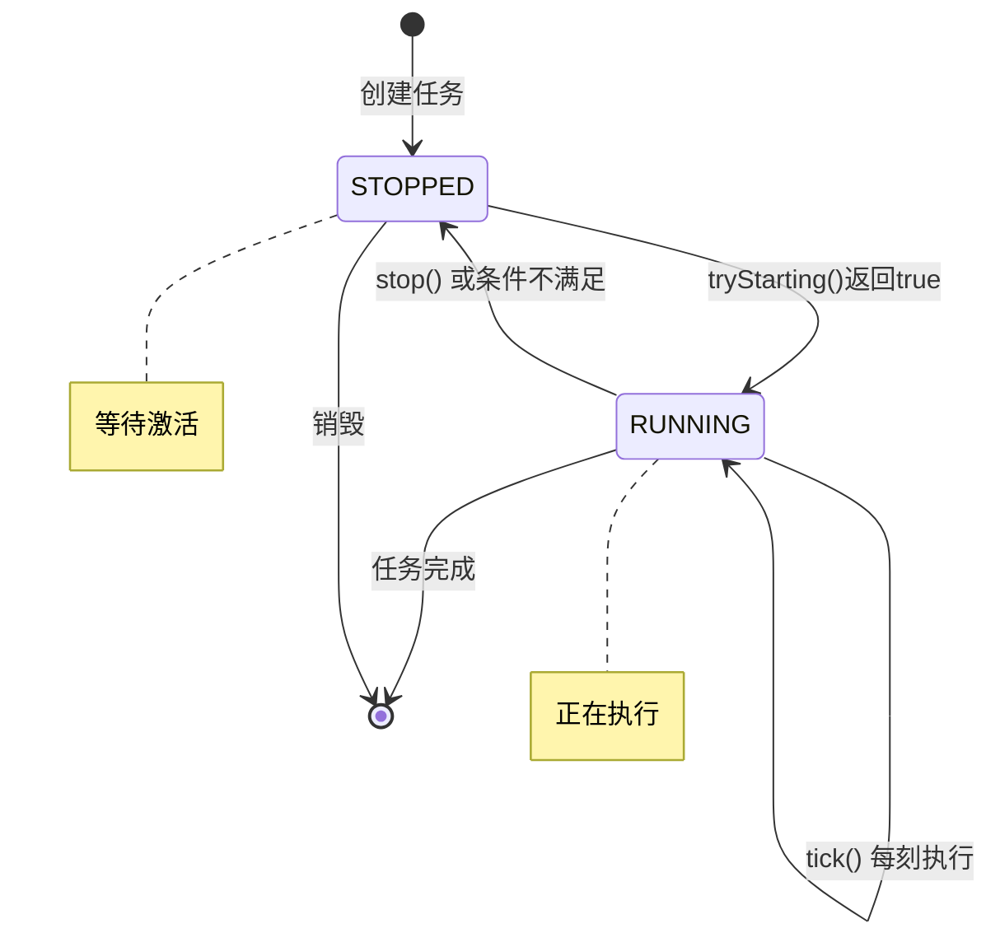
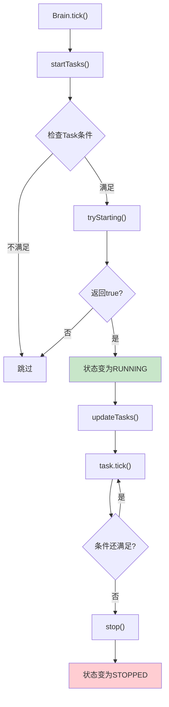
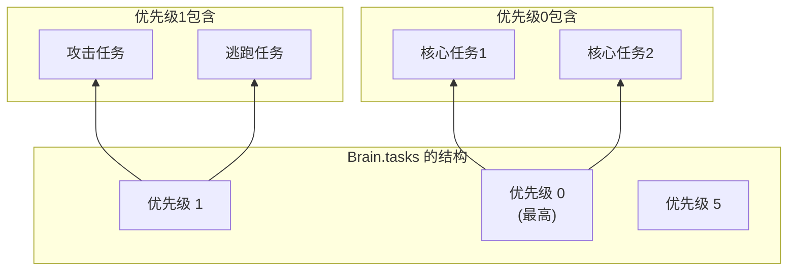
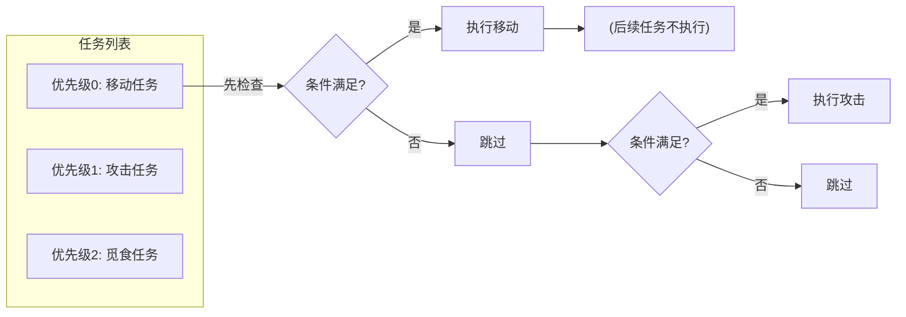
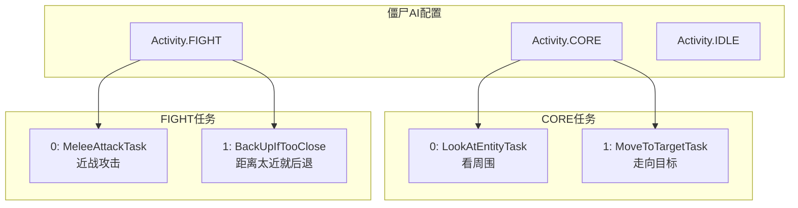
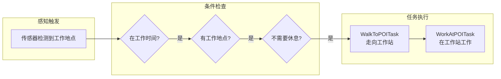

# 第30章：任务系统 - 生物的"行为动作"

> **注意**：以下代码示例基于 CFR 反编译结果，实际 Minecraft 源码可能有所差异。在使用时请以游戏源码为准。

## 目标

- 理解 Task 是什么
- 掌握 Task 的生命周期（开始、执行、结束）
- 学会创建自定义任务
- 理解任务优先级机制

## 前置知识

- 了解 Brain 和 Activity 的关系
- 理解记忆系统的读写操作

## 核心概念：什么是任务？

### 生活比喻

"任务"就像你的一天：

| 活动 | 具体任务 |
|------|----------|
| 早上起床 | 睁眼 → 起床 → 穿衣 → 洗漱 |
| 去上班 | 出门 → 等公交 → 坐车 → 到达 |
| 工作 | 打开电脑 → 写代码 → 开会 → 吃饭 |

**Activity（活动）** = 你的"身份"（我是上班族）
**Task（任务）** = 你做的具体"事情"（我在写代码）

> **一句话理解**：Task 是生物的具体行为，比如"攻击"、"逃跑"、"寻找食物"。

### 源码解读

```java
public interface Task<E extends LivingEntity> {
    
    // 获取任务当前状态
    MultiTickTask.Status getStatus();
    
    // 尝试开始任务
    boolean tryStarting(ServerWorld world, E entity, long time);
    
    // 每tick执行一次
    void tick(ServerWorld world, E entity, long time);
    
    // 停止任务
    void stop(ServerWorld world, E entity, long time);
    
    // 任务名称
    String getName();
}
```

**源码位置**：`net/minecraft/entity/ai/brain/task/Task.java`

## 图解：Task 的生命周期



## 图解：任务执行流程



## 核心代码：创建任务

### 1. 简单的单刻任务

继承 `SingleTickTask`，适合只需要执行一次的行为：

```java
public class LookAtEntityTask<E extends LivingEntity> extends SingleTickTask<E> {
    
    private final EntityPredicate predicate;
    private final int duration;
    
    public LookAtEntityTask(EntityPredicate predicate, int duration) {
        this.predicate = predicate;
        this.duration = duration;
    }
    
    @Override
    public boolean shouldRun(ServerWorld world, E entity) {
        // 检查是否有需要注视的目标
        return entity.getBrain().hasMemoryModule(MemoryModuleType.LOOK_TARGET);
    }
    
    @Override
    public void run(ServerWorld world, E entity, long time) {
        // 获取注视目标
        Optional<LookTarget> target = entity.getBrain()
            .getOptionalRegisteredMemory(MemoryModuleType.LOOK_TARGET);
        
        target.ifPresent(lookTarget -> {
            // 执行注视行为
            lookTarget.lookAt(entity);
        });
        
        // 任务完成
        entity.getBrain().forget(MemoryModuleType.LOOK_TARGET);
    }
}
```

### 2. 多刻任务（持续行为）

继承 `MultiTickTask`，适合需要持续执行的行为：

```java
public class MeleeAttackTask<E extends LivingEntity> extends MultiTickTask<E> {
    
    private final int cooldownTicks;
    
    public MeleeAttackTask(int cooldownTicks) {
        super(cooldownTicks);
        this.cooldownTicks = cooldownTicks;
    }
    
    @Override
    public boolean shouldRun(ServerWorld world, E entity) {
        // 检查是否有攻击目标
        return entity.getBrain().hasMemoryModule(MemoryModuleType.ATTACK_TARGET);
    }
    
    @Override
    public void start(ServerWorld world, E entity, long time) {
        // 开始攻击
        entity.getBrain().remember(MemoryModuleType.ATTACK_COOLING_DOWN, false);
    }
    
    @Override
    public void tick(ServerWorld world, E entity, long time) {
        // 每tick执行一次
        Optional<LivingEntity> target = entity.getBrain()
            .getOptionalRegisteredMemory(MemoryModuleType.ATTACK_TARGET);
        
        target.ifPresent(targetEntity -> {
            // 检查是否在攻击范围内
            if (entity.squaredDistanceTo(targetEntity) < 4.0) {
                // 攻击！
                entity.tryAttack(targetEntity);
            } else {
                // 追逐目标
                entity.getNavigation().startMovingTo(targetEntity, 1.0);
            }
        });
    }
    
    @Override
    public void stop(ServerWorld world, E entity, long time) {
        // 清理
        entity.getBrain().forget(MemoryModuleType.ATTACK_TARGET);
    }
}
```

### 3. 任务条件检查

```java
// 带时间范围的条件
public class WalkToPOITask extends MultiTickTask<VillagerEntity> {
    
    @Override
    public boolean shouldRun(ServerWorld world, VillagerEntity entity) {
        // 条件1：有工作地点
        boolean hasJobSite = entity.getBrain()
            .hasMemoryModule(MemoryModuleType.JOB_SITE);
        
        // 条件2：还没有在工作
        boolean notWorking = !entity.getBrain()
            .hasActivity(Activity.WORK);
        
        return hasJobSite && notWorking;
    }
}
```

## 图解：任务优先级

### 任务列表的组织方式



### 优先级的执行顺序



## 实战演示：僵尸的AI任务



### 完整配置代码

```java
public class ZombieBrain {
    public static void initialize(Brain<ZombieEntity> brain) {
        // 核心任务（始终运行）
        brain.setCoreActivities(ImmutableSet.of(Activity.CORE));
        brain.setTaskList(Activity.CORE, 0, ImmutableList.of(
            new LookAtEntityTask(
                EntityPredicate.nonAttackable().range(8.0),  // 看8格内的非攻击实体
                40                                                    // 注视时间
            ),
            new MoveToTargetTask(20)                         // 每20tick更新导航
        ));
        
        // 战斗任务
        brain.setTaskList(Activity.FIGHT, 0, ImmutableList.of(
            new MeleeAttackTask<>(20),                        // 冷却时间20tick
            new BackUpIfTooCloseTask<>(8)                    // 8格内则后退
        ));
        
        // 默认空闲任务
        brain.setTaskList(Activity.IDLE, ImmutableList.of(
            new IdleWonderTask(30, 60)                       // 30-60tick的漫游
        ));
        
        brain.setDefaultActivity(Activity.IDLE);
    }
}
```

## 实战演示：村民的工作任务



### 代码实现

```java
// 工作任务
public class WorkTask extends MultiTickTask<VillagerEntity> {
    
    private long workStartTime;
    
    @Override
    public boolean shouldRun(ServerWorld world, VillagerEntity villager) {
        // 检查条件：正在WORK活动，有工作地点，需要工作
        return villager.getBrain().hasActivity(Activity.WORK)
            && villager.getBrain().hasMemoryModule(MemoryModuleType.JOB_SITE)
            && villager.getBrain().hasMemoryModuleWithValue(
                MemoryModuleType.TIME_TRYING_TO_REACH_ADMIRE_ITEM, false
            );
    }
    
    @Override
    public void start(ServerWorld world, VillagerEntity villager, long time) {
        this.workStartTime = time;
        
        // 走向工作地点
        villager.getBrain().getOptionalRegisteredMemory(MemoryModuleType.JOB_SITE)
            .ifPresent(pos -> {
                villager.getBrain().remember(MemoryModuleType.WALK_TARGET, 
                    new WalkTarget(pos.getPos(), 0.8f, 2));
            });
    }
    
    @Override
    public void tick(ServerWorld world, VillagerEntity villager, long time) {
        // 检查是否到达工作地点
        villager.getBrain().getOptionalRegisteredMemory(MemoryModuleType.JOB_SITE)
            .ifPresent(pos -> {
                if (villager.getBlockPos().equals(pos.getPos())) {
                    // 开始工作！
                    villager.playWorkSound();
                    villager.getBrain().remember(MemoryModuleType.LAST_WORKED_AT_POI, time);
                }
            });
    }
}
```

## 重要概念：Task vs MultiTickTask vs SingleTickTask

| 类 | 用途 | 使用场景 |
|-----|------|----------|
| `SingleTickTask` | 只执行一次的瞬时行为 | 看一眼、发送一次交互 |
| `MultiTickTask` | 持续多刻的行为 | 攻击、逃跑、漫游 |
| `Task` | 基础接口 | 通常用上面的两个抽象类 |

### SingleTickTask 例子

```java
// 瞬时任务：看向某个实体然后结束
public class LookAtEntityTask extends SingleTickTask<VillagerEntity> {
    
    @Override
    public boolean shouldRun(ServerWorld world, VillagerEntity villager) {
        return villager.getBrain().hasMemoryModule(MemoryModuleType.LOOK_TARGET);
    }
    
    @Override
    public void run(ServerWorld world, VillagerEntity villager, long time) {
        // 看向目标，一次完成
        villager.getBrain().getOptionalRegisteredMemory(MemoryModuleType.LOOK_TARGET)
            .ifPresent(villager::lookAtEntity);
        
        // 任务结束（不需要stop方法）
    }
}
```

## 小结

1. **Task（任务）**是生物的具体行为动作
2. 任务有**生命周期**：STOPPED → RUNNING → STOPPED
3. `shouldRun()` 检查是否应该执行，`tick()` 执行具体行为
4. 任务按**优先级**组织，高优先级任务先执行
5. `SingleTickTask` 适合瞬时行为，`MultiTickTask` 适合持续行为
6. 任务通过**读写记忆**来获取信息和状态

## 练习

1. **思考题**：为什么战斗任务比漫游任务优先级高？
2. **动手题**：创建一个让生物原地跳跃的任务
3. **挑战题**：实现一个"看到钻石就捡起来"的任务

## 相关链接

- **上一章**：[第29章 传感器系统](./29-sensor-system.md)
- **下一章**：[第31章 活动与日程](./31-activity-schedule.md)
- **相关源码**：
  - `net/minecraft/entity/ai/brain/task/Task.java`
  - `net/minecraft/entity/ai/brain/task/MultiTickTask.java`
  - `net/minecraft/entity/ai/brain/task/SingleTickTask.java`

### 源码文件位置

| 文件 | 源码路径 | 说明 |
|------|----------|------|
| Task.java | `net/minecraft/entity/ai/brain/task/Task.java` | 任务基类 |
| SingleTickTask.java | `net/minecraft/entity/ai/brain/task/SingleTickTask.java` | 单刻任务 |
| MultiTickTask.java | `net/minecraft/entity/ai/brain/task/MultiTickTask.java` | 多刻任务 |
