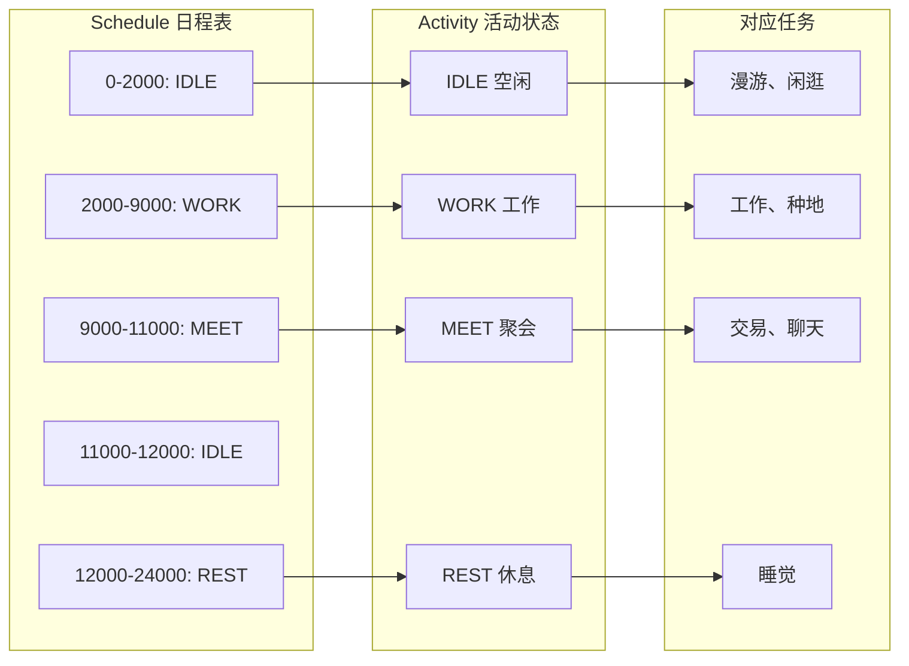
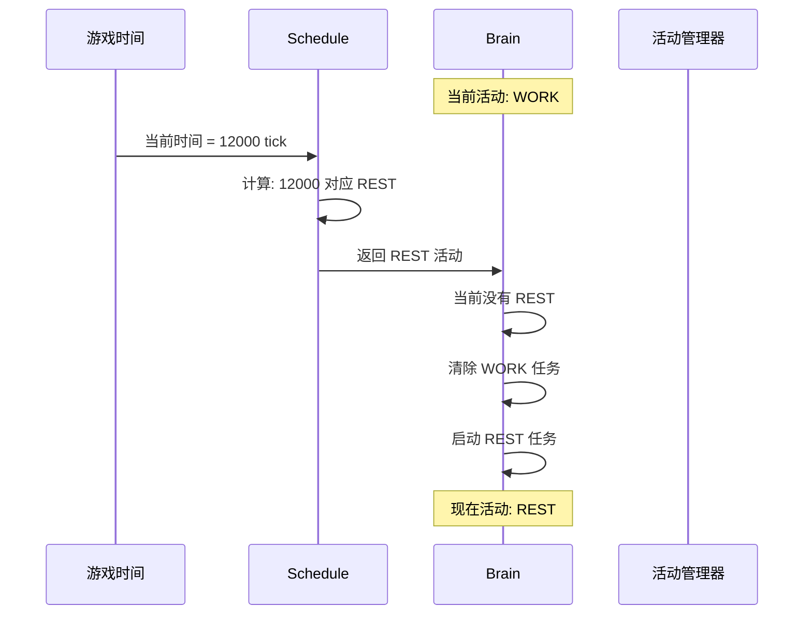
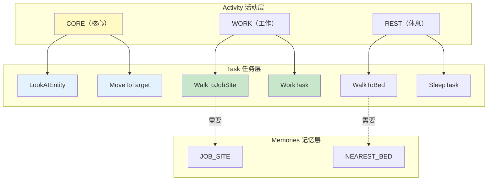
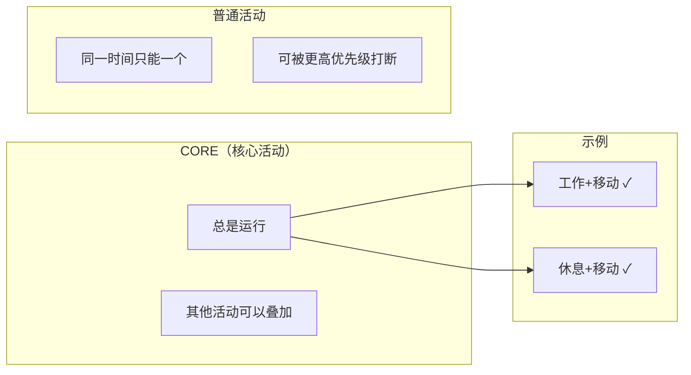
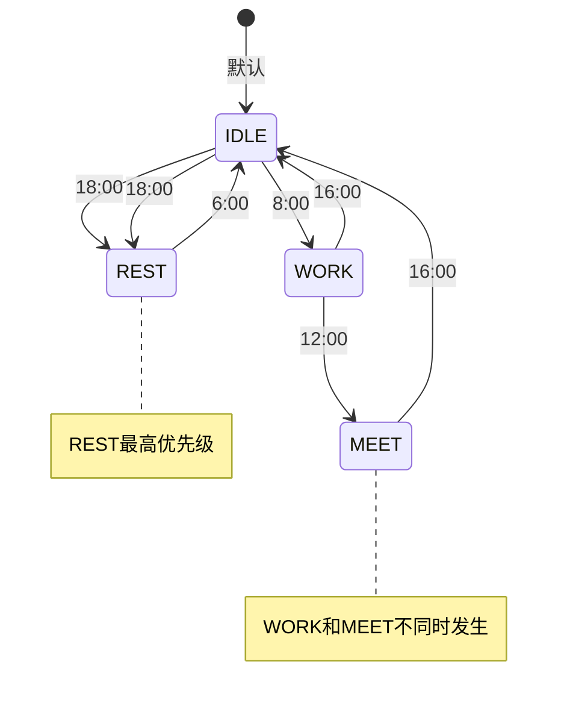
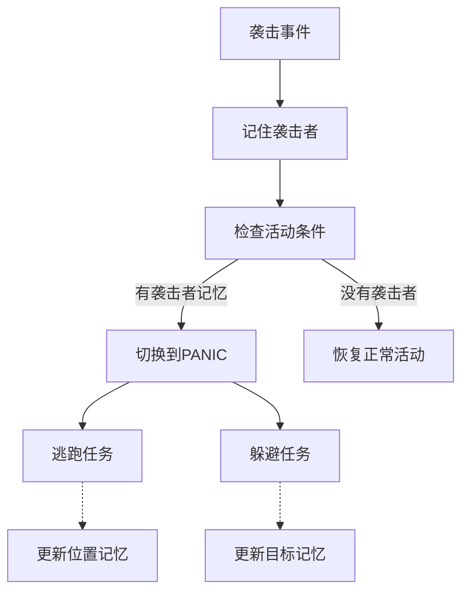

# 第31章：活动与日程 - 生物的"作息表"

> **注意**：以下代码示例基于 CFR 反编译结果，实际 Minecraft 源码可能有所差异。在使用时请以游戏源码为准。

## 目标

- 理解 Activity 是什么
- 掌握 Schedule 日程表的使用
- 学会配置生物的作息规律
- 理解活动的切换机制

## 前置知识

- 了解 Brain、Task 的基本概念
- 知道记忆系统的读写操作

## 核心概念：什么是活动？

### 生活比喻

想象你是上班族的一天：

| 时间段 | 活动（Activity） | 具体任务（Task） |
|--------|------------------|------------------|
| 早上8-12点 | WORK（工作） | 开会、写代码、回邮件 |
| 中午12-13点 | REST（休息） | 吃饭、午休 |
| 下午13-18点 | WORK（工作） | 写代码、提交代码 |
| 晚上 | REST（休息） | 下班回家 |

**Activity（活动）** = 你当前在做什么（工作/休息/娱乐）
**Schedule（日程表）** = 你什么时间做什么

> **一句话理解**：Activity 是生物的"状态"，Schedule 是让生物按时间自动切换状态。

### 源码解读

#### Activity 类 - 活动定义

```java
public class Activity {
    // Minecraft 内置的活动类型
    public static final Activity CORE = Activity.register("core");      // 核心活动
    public static final Activity IDLE = Activity.register("idle");    // 空闲
    public static final Activity WORK = Activity.register("work");     // 工作
    public static final Activity REST = Activity.register("rest");     // 休息
    public static final Activity PLAY = Activity.register("play");     // 玩耍
    public static final Activity FIGHT = Activity.register("fight");  // 战斗
    public static final Activity PANIC = Activity.register("panic");  // 恐慌
    public static final Activity HIDE = Activity.register("hide");    // 躲藏
    public static final Activity SWIM = Activity.register("swim");    // 游泳
    // ... 更多活动类型
    
    private final String id;
    
    private static Activity register(String id) {
        return Registry.register(Registries.ACTIVITY, id, new Activity(id));
    }
}
```

**源码位置**：`net/minecraft/entity/ai/brain/Activity.java`

#### Schedule 类 - 日程表

```java
public class Schedule {
    // 村民默认日程：白天工作，晚上休息
    public static final Schedule VILLAGER_DEFAULT = Schedule.register("villager_default")
        .withActivity(10, Activity.IDLE)        // 0:00 - 休息
        .withActivity(2000, Activity.WORK)     // 8:00 - 工作
        .withActivity(9000, Activity.MEET)     // 12:00 - 聚会
        .withActivity(11000, Activity.IDLE)    // 16:00 - 空闲
        .withActivity(12000, Activity.REST)    // 18:00 - 休息
        .build();
}
```

**源码位置**：`net/minecraft/entity/ai/brain/Schedule.java`

## 图解：Activity 和 Schedule 的关系



## 图解：活动切换流程



## 图解：活动与任务的关系



## 核心代码：配置活动

### 1. 设置核心活动

核心活动（Core Activity）是**始终运行**的活动：

```java
// 设置核心活动
brain.setCoreActivities(ImmutableSet.of(Activity.CORE));

// CORE 活动包含基础行为（总是要做的）
brain.setTaskList(Activity.CORE, 0, ImmutableList.of(
    new LookAtEntityTask(8.0f, 40),  // 看周围的实体
    new MoveToTargetTask(20)         // 移动到目标
));
```

### 2. 设置普通活动

```java
// 工作活动
brain.setTaskList(Activity.WORK, 0, ImmutableList.of(
    new WalkToJobSiteTask(20),   // 走向工作站
    new WorkTask()                // 执行工作
));

// 休息活动
brain.setTaskList(Activity.REST, 0, ImmutableList.of(
    new WalkToBedTask(),          // 走向床
    new SleepTask()               // 睡觉
));
```

### 3. 设置日程表

```java
// 为生物设置日程表
brain.setSchedule(Schedule.VILLAGER_DEFAULT);
```

### 4. 活动切换条件

```java
// 设置活动时指定所需记忆
brain.setTaskList(
    Activity.FIGHT,                              // 活动名称
    0,                                           // 优先级
    ImmutableList.of(new MeleeAttackTask(20)),  // 任务列表
    MemoryModuleType.ATTACK_TARGET               // 所需记忆
);

// 这意味着：只有当 ATTACK_TARGET 存在时，才能进入 FIGHT 活动
```

## 实战演示：村民的一天

村民（Villager）是最典型的日程系统例子：

### 日程表详解

```mermaid
gantt
    title 村民的一天
    dateFormat X
    axisFormat %H:%M
    
    section 活动
    REST (睡觉)       :0, 08:00
    IDLE (空闲)       :10, 08:00
    WORK (工作)       :2000, 12:00
    MEET (聚会)       :9000, 16:00
    IDLE (空闲)       :10000, 18:00
    REST (休息)       :12000, 24:00
    
    section 游戏时间
    0:00             :0, 08:00
    8:00              :2000, 12:00
    12:00             :9000, 16:00
    18:00             :12000, 24:00
```

### 村民日程代码

```java
public class VillagerSchedule {
    public static final Schedule VILLAGER_DEFAULT = Schedule.register("villager_default")
        .withActivity(10, Activity.IDLE)        // 0:00 - 起床，空闲
        .withActivity(2000, Activity.WORK)     // 8:00 - 开始工作
        .withActivity(9000, Activity.MEET)     // 12:00 - 去聚集点聚会
        .withActivity(11000, Activity.IDLE)    // 16:00 - 离开聚会
        .withActivity(12000, Activity.REST)     // 18:00 - 回家休息
        .build();
}
```

### 活动时间转换

| 游戏刻 (tick) | 时间 | 村民活动 |
|---------------|------|----------|
| 0 - 10 | 0:00 | REST（睡觉） |
| 10 - 2000 | 0:00 - 8:00 | IDLE（醒来，准备工作） |
| 2000 - 9000 | 8:00 - 12:00 | WORK（工作） |
| 9000 - 11000 | 12:00 - 16:00 | MEET（聚会） |
| 11000 - 12000 | 16:00 - 18:00 | IDLE（自由活动） |
| 12000+ | 18:00+ | REST（回家睡觉） |

## 核心代码：自定义日程

### 创建新的日程表

```java
public class PandaSchedule {
    public static final Schedule PANDA_SCHEDULE = Schedule.register("panda_schedule")
        // 早上觅食
        .withActivity(0, Activity.IDLE)           // 夜晚休息
        .withActivity(3000, Activity.WORK)        // 中午开始觅食
        .withActivity(9000, Activity.PLAY)        // 中午玩耍
        .withActivity(11000, Activity.IDLE)       // 下午自由活动
        .withActivity(12000, Activity.REST)       // 傍晚休息
        .build();
}
```

### 活动时间优先级的计算

```java
// ScheduleRule 控制每个时间段的优先级
public class ScheduleRule {
    // 每个时间段有优先级
    public float getPriority(int time) {
        // 返回当前时间点的优先级
        // 优先级高的活动会被选中
    }
}
```

## 重要概念：活动优先级

### CORE 活动的特殊性



### 活动互斥



## 实战演示：创建恐慌状态

当村民受到袭击时，会切换到 PANIC 状态：

```java
// 监听袭击事件
public class RaidEventHandler {
    public void onRaiderAttack(Mob mob, Villager villager) {
        Brain<Villager> brain = villager.getBrain();
        
        // 记住袭击者
        brain.remember(MemoryModuleType.HURT_BY_ENTITY, mob);
        brain.remember(MemoryModuleType.AVOID_TARGET, mob);
        
        // 切换到恐慌状态（高优先级）
        brain.setPossibleActivities(ImmutableSet.of(
            Activity.CORE,
            Activity.PANIC
        ));
    }
}

// PANIC 活动的任务
brain.setTaskList(Activity.PANIC, 0, ImmutableList.of(
    new AvoidEntityTask<>(entity -> entity instanceof Monster, 8.0f),
    new RunAwayFromMemoryTask(MemoryModuleType.HURT_BY_ENTITY, 1.6f, 2.4f, false)
));
```



## 小结

1. **Activity（活动）**是生物的状态，如 WORK、REST、FIGHT
2. **Schedule（日程表）**控制活动随时间的切换
3. **CORE 活动**始终运行，其他活动同一时间只能有一个
4. 活动可以指定**所需记忆**，没有对应记忆则无法进入该活动
5. 村民是最典型的日程系统例子：白天工作，晚上休息
6. 活动之间可以**相互切换**，根据时间或条件触发

## 练习

1. **思考题**：村民晚上为什么要睡觉？睡不够会发生什么？
2. **动手题**：为你的自定义生物创建一个日程表
3. **挑战题**：实现一个"听到铃声就聚集"的机制

## 相关链接

- **上一章**：[第30章 任务系统](./30-task-system.md)
- **下一章**：[第32章 路径导航](./32-pathfinding.md)
- **相关源码**：
  - `net/minecraft/entity/ai/brain/Activity.java`
  - `net/minecraft/entity/ai/brain/Schedule.java`
  - `net/minecraft/entity/ai/brain/ScheduleRule.java`

### 源码文件位置

| 文件 | 源码路径 | 说明 |
|------|----------|------|
| Schedule.java | `net/minecraft/entity/ai/brain/Schedule.java` | 日程表 |
| ScheduleRule.java | `net/minecraft/entity/ai/brain/ScheduleRule.java` | 日程规则 |
| Activity.java | `net/minecraft/entity/ai/brain/Activity.java` | 活动 |
