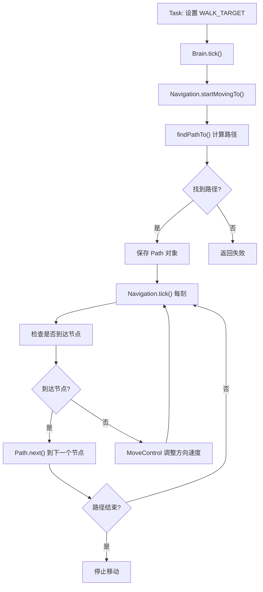
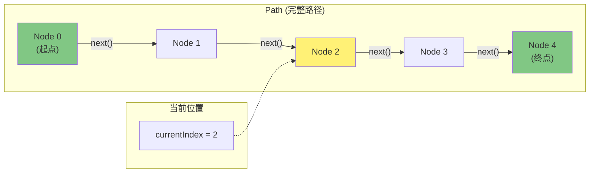
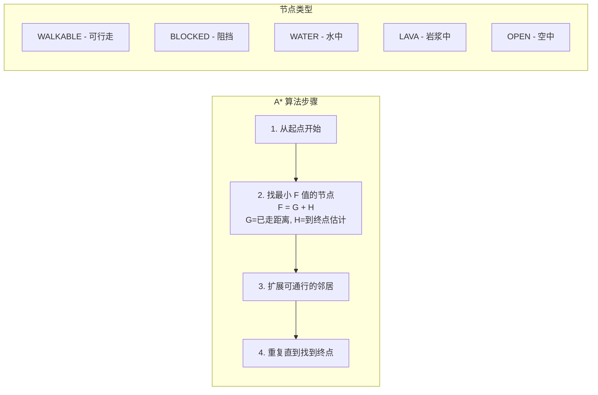
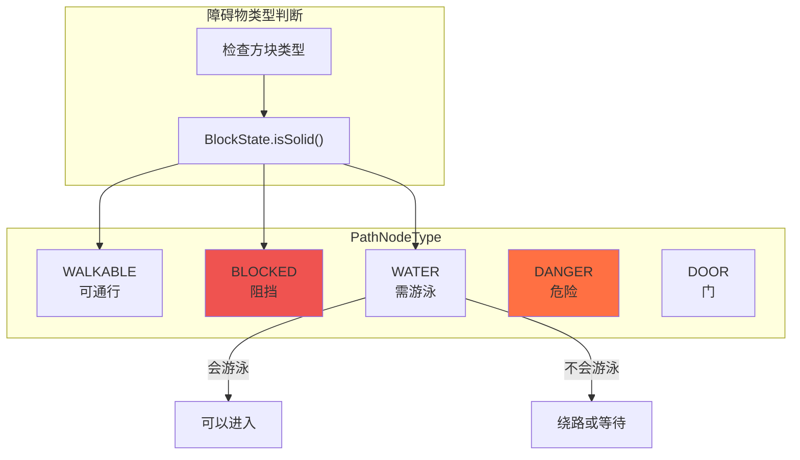
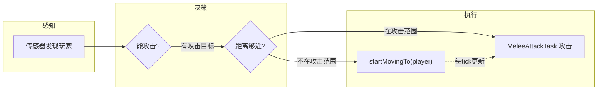

# 第32章：路径导航 - 生物的"GPS导航"

> **注意**：以下代码示例基于 CFR 反编译结果，实际 Minecraft 源码可能有所差异。在使用时请以游戏源码为准。

## 目标

- 理解路径导航是什么
- 掌握 Path、PathNode 的结构
- 学会使用 MoveControl 控制移动
- 了解障碍物处理机制

## 前置知识

- 了解 Task 任务系统
- 理解实体（Entity）的基本概念

## 核心概念：什么是路径导航？

### 生活比喻

想象你要去一个陌生的地方：

1. **打开地图** → 计算从当前位置到目的地的路线
2. **按路线走** → 沿着导航给的路线前进
3. **遇到障碍** → 绕路或者重新计算
4. **到达终点** → 完成任务

Minecraft 的路径导航就是生物的"GPS"：

| GPS 功能 | Minecraft 实现 | 说明 |
|----------|----------------|------|
| 地图规划 | PathNode、Path | 规划路线 |
| 实时导航 | EntityNavigation | 引导移动 |
| 障碍处理 | PathNodeType | 判断能否通行 |
| 运动控制 | MoveControl | 控制速度和方向 |

> **一句话理解**：路径导航让生物知道"怎么走"，MoveControl 让生物"走起来"。

### 源码解读

#### PathNode 类 - 路径节点

```java
public class PathNode {
    public final int x, y, z;  // 节点坐标
    public float pathLength;    // 从起点到该节点的距离
    public float penalty;        // 惩罚值（越难走的路惩罚越高）
    public PathNodeType type;   // 节点类型（能否通行）
    public boolean visited;     // 是否已访问（A*算法用）
    
    // 计算到另一个节点的曼哈顿距离
    public float getManhattanDistance(PathNode node) {
        return Math.abs(node.x - this.x) + Math.abs(node.y - this.y) + Math.abs(node.z - this.z);
    }
}
```

**源码位置**：`net/minecraft/entity/ai/pathing/PathNode.java`

#### Path 类 - 完整路径

```java
public class Path {
    private final List<PathNode> nodes;  // 路径节点列表
    private int currentNodeIndex;        // 当前到达第几个节点
    private final BlockPos target;      // 目标位置
    
    // 获取当前位置对应的目标点
    public Vec3d getNodePosition(Entity entity) {
        PathNode node = nodes.get(currentNodeIndex);
        return new Vec3d(node.x + 0.5, node.y, node.z + 0.5);
    }
    
    // 移动到下一个节点
    public void next() {
        currentNodeIndex++;
    }
    
    // 检查路径是否走完
    public boolean isFinished() {
        return currentNodeIndex >= nodes.size();
    }
}
```

**源码位置**：`net/minecraft/entity/ai/pathing/Path.java`

#### EntityNavigation 类 - 导航系统

```java
public abstract class EntityNavigation {
    protected final MobEntity entity;    // 被控制的生物
    protected final World world;        // 所在世界
    protected Path currentPath;          // 当前路径
    protected double speed;             // 移动速度
    
    // 找路
    public Path findPathTo(BlockPos target, int distance) {
        // 使用 A* 算法计算最短路径
    }
    
    // 开始移动
    public boolean startMovingTo(Entity target, double speed) {
        Path path = findPathTo(target, 1);
        return startMovingAlong(path, speed);
    }
    
    // 每tick调用
    public void tick() {
        if (isIdle()) return;
        
        // 沿路径继续移动
        continueFollowingPath();
        
        // 通知 MoveControl 移动
        Vec3d targetPos = currentPath.getNodePosition(entity);
        entity.getMoveControl().moveTo(targetPos.x, targetPos.y, targetPos.z, speed);
    }
}
```

**源码位置**：`net/minecraft/entity/ai/pathing/EntityNavigation.java`

## 图解：路径导航流程



## 图解：Path 和 PathNode 的关系



## 图解：A* 寻路算法



## 核心代码：导航使用

### 1. 让生物走向目标

```java
// 方式1：通过记忆设置走路目标（推荐）
public class WalkToTargetTask extends MultiTickTask<VillagerEntity> {
    @Override
    public void tick(ServerWorld world, VillagerEntity villager) {
        // 从记忆中获取目标位置
        villager.getBrain().getOptionalRegisteredMemory(MemoryModuleType.WALK_TARGET)
            .ifPresent(target -> {
                // 让导航系统移动到目标
                villager.getNavigation().startMovingTo(
                    target.getLookTarget().getBlockPos(),  // 目标位置
                    target.getSpeed()                     // 移动速度
                );
            });
    }
}
```

### 2. 直接导航到位置

```java
// 方式2：直接调用导航
public void moveToWork(VillagerEntity villager, BlockPos workSite) {
    // 开始移动到工作地点
    boolean success = villager.getNavigation().startMovingTo(
        workSite.getX(), workSite.getY(), workSite.getZ(),
        0.8  // 速度：0.8 = 80% 正常速度
    );
    
    if (!success) {
        // 导航失败（比如距离太远）
        villager.getBrain().remember(MemoryModuleType.CANT_REACH_WALK_TARGET_SINCE, 
            villager.getWorld().getTime());
    }
}
```

### 3. 导航到实体

```java
// 让生物追着另一个实体跑
public void chaseTarget(MobEntity mob, LivingEntity target) {
    mob.getNavigation().startMovingTo(
        target,           // 目标实体
        1.2              // 1.2倍速度（比正常快）
    );
}
```

### 4. 停止移动

```java
// 停止当前导航
mob.getNavigation().stop();

// 检查是否在移动
boolean isMoving = !mob.getNavigation().isIdle();
```

## 核心代码：MoveControl 运动控制

### MoveControl 的状态

```java
public class MoveControl {
    // 运动状态枚举
    enum State {
        WAIT,      // 等待（不移动）
        MOVE_TO,   // 移动到目标
        STRAFE,    // 横扫移动（玩家控制用）
        JUMPING    // 跳跃中
    }
    
    public void moveTo(double x, double y, double z, double speed) {
        this.targetX = x;
        this.targetY = y;
        this.targetZ = z;
        this.speed = speed;
        this.state = State.MOVE_TO;
    }
    
    // 每tick执行
    public void tick() {
        switch (state) {
            case MOVE_TO:
                // 计算方向角
                float angle = MathHelper.atan2(dz, dx);
                // 转向目标
                entity.setYaw(wrapDegrees(entity.getYaw(), angle, 90));
                // 调整速度
                entity.setMovementSpeed(speed * entity.getAttributeValue(GENERIC_MOVEMENT_SPEED));
                // 跳跃检测
                if (needToJump) {
                    entity.getJumpControl().setActive();
                }
                break;
            case JUMPING:
                // 跳跃中等待落地
                if (entity.isOnGround()) {
                    state = State.WAIT;
                }
                break;
        }
    }
}
```

### 不同的 MoveControl 实现

| 类 | 适用生物 | 特点 |
|----|----------|------|
| `MoveControl` | 陆地生物 | 普通行走 |
| `AquaticMoveControl` | 水中生物 | 游泳控制 |
| `FlightMoveControl` | 飞行生物 | 空中飞行 |
| `LookControl` | 所有生物 | 控制头部转向 |

## 图解：障碍物处理



### 障碍物处理代码

```java
// 自定义障碍物感知
public class CustomPathNodeMaker extends LandPathNodeMaker {
    
    @Override
    public PathNodeType getDefaultNodeType(WorldView world, int x, int y, int z) {
        BlockState state = world.getBlockState(new BlockPos(x, y, z));
        
        // 自定义逻辑：蜜蜂不能穿过玻璃
        if (state.isOf(Blocks.GLASS) || state.isOf(Blocks.GLASS_PANE)) {
            return PathNodeType.BLOCKED;
        }
        
        // 其他使用默认逻辑
        return super.getDefaultNodeType(world, x, y, z);
    }
}
```

## 实战演示：追踪和逃跑

### 僵尸追玩家



```java
// 僵尸追踪任务
public class ZombieChaseTask extends MultiTickTask<ZombieEntity> {
    
    @Override
    public void tick(ServerWorld world, ZombieEntity zombie) {
        // 获取攻击目标
        Optional<LivingEntity> target = zombie.getBrain()
            .getOptionalRegisteredMemory(MemoryModuleType.ATTACK_TARGET);
        
        target.ifPresent(enemy -> {
            // 计算距离
            double distance = zombie.squaredDistanceTo(enemy);
            
            if (distance < 4.0) {  // 攻击范围 2 格
                // 停止移动，准备攻击
                zombie.getNavigation().stop();
                // 攻击
                zombie.tryAttack(enemy);
            } else {
                // 继续追踪
                zombie.getNavigation().startMovingTo(enemy, 1.0);
            }
        });
    }
}
```

### 动物逃跑

```java
// 兔子逃跑
public class RabbitFleeTask extends MultiTickTask<RabbitEntity> {
    
    @Override
    public void tick(ServerWorld world, RabbitEntity rabbit) {
        Optional<LivingEntity> threat = rabbit.getBrain()
            .getOptionalRegisteredMemory(MemoryModuleType.AVOID_TARGET);
        
        threat.ifPresent(danger -> {
            // 计算逃跑方向（远离威胁）
            Vec3d away = rabbit.getPos().subtract(danger.getPos()).normalize();
            Vec3d runTo = rabbit.getPos().add(away.multiply(10));  // 跑10格外
            
            // 逃跑！
            rabbit.getNavigation().startMovingTo(runTo.x, runTo.y, runTo.z, 1.5);
        });
    }
}
```

## 重要概念：导航失败处理

### 路径计算失败的常见原因

| 原因 | 表现 | 处理方式 |
|------|------|----------|
| 距离太远 | findPathTo 返回 null | 记录 `CANT_REACH_WALK_TARGET_SINCE` |
| 被困住 | 路径全是 BLOCKED | 尝试跳跃或等待 |
| 目标不可达 | 无法到达终点 | 寻找附近可达点 |

### 超时检测

```java
public void tick() {
    // 超过100tick还没走完
    if (tickCount - pathStartTime > 100) {
        // 检查是否真的在移动
        if (currentPos.squaredDistanceTo(pathStartPos) < expectedDistance) {
            // 没移动，停止导航
            navigation.stop();
            brain.remember(MemoryModuleType.CANT_REACH_WALK_TARGET_SINCE, world.getTime());
        }
    }
}
```

## 小结

1. **PathNode** 是路径上的一个点（坐标），**Path** 是完整路线
2. **EntityNavigation** 负责找路和引导移动
3. **MoveControl** 控制生物的具体运动（速度、方向、跳跃）
4. 导航会每tick检查是否到达节点，到达后移动到下一个
5. **PathNodeType** 判断每个位置是否可通行
6. 导航失败时要记录到记忆中，让AI做出相应调整

## 练习

1. **思考题**：为什么僵尸能绕过障碍物追你？
2. **动手题**：写一个让生物在两点之间来回巡逻的代码
3. **挑战题**：实现一个"找最近的安全位置躲避"的AI

## 相关链接

- **上一章**：[第31章 活动与日程](./31-activity-schedule.md)
- **相关源码**：
  - `net/minecraft/entity/ai/pathing/Path.java`
  - `net/minecraft/entity/ai/pathing/PathNode.java`
  - `net/minecraft/entity/ai/pathing/EntityNavigation.java`
  - `net/minecraft/entity/ai/control/MoveControl.java`

### 源码文件位置

| 文件 | 源码路径 | 说明 |
|------|----------|------|
| Path.java | `net/minecraft/entity/Path.java` | 路径 |
| PathNode.java | `net/minecraft/entity/PathNode.java` | 路径节点 |
| EntityNavigation.java | `net/minecraft/entity/ai/Navigation.java` | 实体导航 |
| PathfindingNodeEvaluator.java | `net/minecraft/entity/ai/pathing/PathfindingNodeEvaluator.java` | 寻路评估器 |
