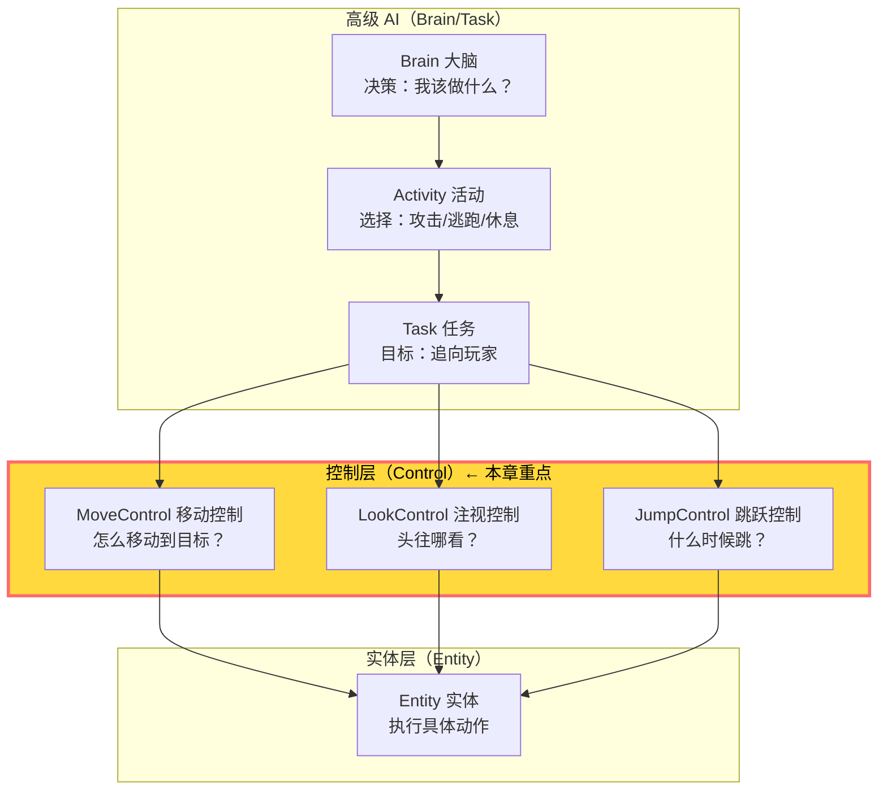
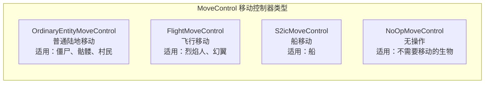
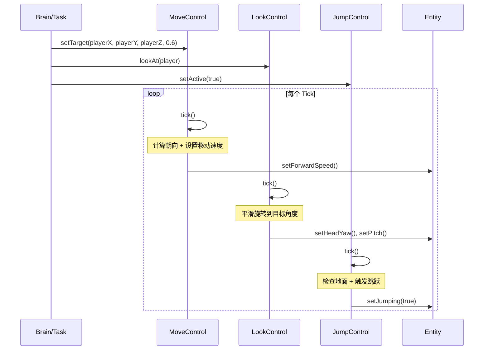
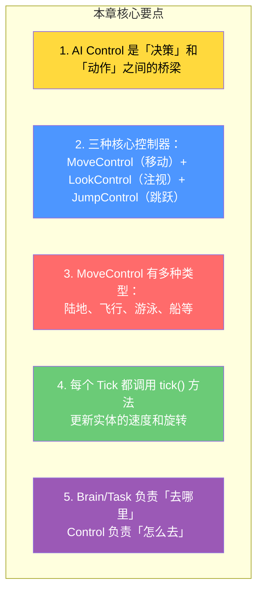

# 第 34 章：AI 控制系统（AI Control）

> **理解这章，你就理解了生物是怎么「动起来」的——AI 决策转化为实体动作的桥梁！**

> ⚠️ **注意**：以下源码示例来源于 CFR 反编译代码，变量名和方法名可能与原始源码有所差异。部分代码经过简化以便于理解。

---

## 目标

学完本章后，你将理解：

1. **AI 控制系统的定位**：它处于 Brain/Task 之下、Entity 之上的中间层
2. **三种核心控制器**：MoveControl、LookControl、JumpControl
3. **为什么需要控制层**：Brain 决策「去哪里」，Control 负责「怎么去」
4. **常见控制类型**：普通陆地移动、飞行移动、船移动等
5. **如何扩展自定义 AI 控制**

---

## 前置知识

- 了解 AI 大脑的基本架构（第 27～32 章）
- 了解什么是 `MobEntity`（第 23 章）
- 知道实体的基本属性（位置、旋转、速度）

---

## 核心概念：AI 决策的桥梁

### 比喻：大脑与身体

```
现实世界中的例子：

大脑（Brain/Task）
    │
    │ 决定「我要去厨房」
    ▼
神经中枢（Control System）   ← 本章重点
    │
    │ 控制「迈左脚、迈右脚、转头」
    ▼
身体（Entity/LivingEntity）
    │
    │ 执行具体动作
    ▼
移动、转身、跳跃
```

### 层级关系图



---

## 三种核心控制器

### 控制器的共同结构

```mermaid
flowchart TB
    subgraph MoveControl["MoveControl 移动控制"]
        direction TB
        M1["关联的 MobEntity"]
        M2["目标位置 (targetX, targetY, targetZ)"]
        M3["移动速度 speed"]
        M4["停止标志 stopped"]
        M5["tick() - 每 Tick 执行"]
    end

    subgraph LookControl["LookControl 注视控制"]
        direction TB
        L1["关联的 MobEntity"]
        L2["目标旋转 (targetYaw, targetPitch)"]
        L3["注视速度"]
        L4["tick() - 每 Tick 执行"]
    end

    subgraph JumpControl["JumpControl 跳跃控制"]
        direction TB
        J1["关联的 MobEntity"]
        J2["是否激活 active"]
        J3["跳跃速度"]
        J4["tick() - 每 Tick 执行"]
    end
```



### MoveControl：移动控制

#### 类结构

```java
// net/minecraft/entity/ai/control/MoveControl.java
public abstract class MoveControl {

    // 关联的生物实体
    protected final MobEntity entity;

    // 目标位置
    protected double targetX;
    protected double targetY;
    protected double targetZ;

    // 移动速度
    protected double speed;

    // 停止标志
    protected boolean stopped;

    // 设置新的移动目标
    public void setTarget(double x, double y, double z, double speed) {
        this.targetX = x;
        this.targetY = y;
        this.targetZ = z;
        this.speed = speed;
        this.stopped = false;
    }

    // 停止移动
    public void stop() {
        this.stopped = true;
    }

    // 每 Tick 执行（子类必须实现）
    public abstract void tick();
}
```

#### OrdinaryEntityMoveControl：普通陆地移动

这是最常用的移动控制器，适用于在陆地上行走的生物：

```java
public class OrdinaryEntityMoveControl extends MoveControl {

    // 旋转速度限制
    private static final float MAX_ROTATION_SPEED = 10.0f;

    @Override
    public void tick() {
        if (this.stopped) {
            // 停止时降低速度
            this.entity.setMovementSpeed(0.0f);
            return;
        }

        // 计算朝向目标的旋转角度
        double dx = this.targetX - this.entity.getX();
        double dz = this.targetZ - this.entity.getZ();
        double targetYaw = MathHelper.wrapDegrees(
            (float)(MathHelper.atan2(dz, dx) * 57.2957763671875) - 90.0f
        );

        // 平滑旋转到目标角度
        this.entity.yaw = this.method_39493(this.entity.yaw, targetYaw, MAX_ROTATION_SPEED);

        // 计算前后移动速度
        this.entity.forwardSpeed = (float)(this.speed * this.method_39492(
            this.entity.yaw, targetYaw, this.entity.sideSpeed
        ));

        // 上下移动（楼梯/台阶）
        if (this.targetY - this.entity.getY() > 1.0) {
            this.entity.jumping = true;
        }
    }
}
```

### LookControl：注视控制

```java
public class LookControl extends Controller {

    protected final MobEntity entity;

    // 目标旋转
    protected float targetYaw;
    protected float targetPitch;

    // 是否激活
    protected boolean active;

    // 设置注视目标
    public void lookAt(Entity target) {
        this.lookAt(
            target.getX(),
            target.getY() + target.getStandingEyeHeight(),
            target.getZ()
        );
    }

    public void lookAt(double x, double y, double z) {
        this.targetYaw = (float)(MathHelper.atan2(
            x - this.entity.getX(),
            z - this.entity.getZ()
        ) * 57.2957763671875);
        this.targetPitch = (float)(MathHelper.atan2(
            y - this.entity.getY() - this.entity.getStandingEyeHeight(),
            this.entity.getHorizontalDistanceTo(Vec3d.of(x, y, z))
        ) * 57.2957763671875);
        this.active = true;
    }

    @Override
    public void tick() {
        if (!this.active) {
            return;
        }

        // 平滑旋转到目标角度
        this.entity.headYaw = this.smoothRotate(this.entity.headYaw, this.targetYaw, 30.0f);
        this.entity.pitch = this.smoothRotate(this.entity.pitch, this.targetPitch, 30.0f);
    }
}
```

### JumpControl：跳跃控制

```java
public class JumpControl extends Controller {

    protected final MobEntity entity;

    // 是否激活跳跃
    protected boolean active;

    // 目标高度
    protected double targetY;

    @Override
    public void tick() {
        if (!this.active) {
            // 如果脚下方块不是固体，触发跳跃
            if (!this.entity.isOnGround() && this.entity.getVelocity().y < 0.01) {
                this.entity.setJumping(false);
            }
            return;
        }

        // 检查是否可以跳跃（地面上方有空间）
        if (this.entity.isOnGround()) {
            this.entity.jumping = true;
            this.active = false;
        }
    }
}
```

---

## 移动控制器的类型

### 类型一览



### 适用场景对照表

| 控制器类型 | 适用生物 | 特点 |
|---------|---------|------|
| `OrdinaryEntityMoveControl` | 僵尸、骷髅、村民、蜘蛛 | 普通行走、楼梯、跳跃 |
| `FlightMoveControl` | 烈焰人、幻翼、恶魂 | 可以垂直飞行 |
| `SwimmingMoveControl` | 鱿鱼、鳕鱼 | 水中游泳 |
| `BoatMoveControl` | 船 | 左右转向、前后加速 |
| `NoOpMoveControl` | 铁傀儡、雪傀儡 | 不自动移动 |

---

## 控制系统的协同工作

### 示例：僵尸追赶玩家



### 代码示例：Task 如何使用控制

```java
// 一个简单的追逐任务的伪代码
public class ChaseTargetTask extends Task<MobEntity> {

    @Override
    public void tick(ServerWorld world, MobEntity entity, long time) {
        // 获取目标（玩家或其他实体）
        LivingEntity target = entity.getBrain().getMemory(MemoryModuleType.ATTACK_TARGET);

        if (target != null) {
            // 1. 设置移动目标：朝向目标，速度 0.6
            entity.getMoveControl().setTarget(
                target.getX(),
                target.getY(),
                target.getZ(),
                0.6
            );

            // 2. 设置注视目标：看着目标
            entity.getLookControl().lookAt(target);

            // 3. 检查是否需要跳跃（前方有障碍物）
            if (前方有障碍物 && entity.isOnGround()) {
                entity.getJumpControl().setActive(true);
            }
        }
    }
}
```

---

## 实战：扩展自定义 AI 控制

### 示例：创建飞行生物的移动控制

```java
// 自定义飞行移动控制
public class CustomFlyingMoveControl extends MoveControl {

    private static final float HOVER_SPEED = 0.5f;
    private static final float VERTICAL_SPEED = 0.3f;

    public CustomFlyingMoveControl(MobEntity entity) {
        super(entity);
    }

    @Override
    public void tick() {
        if (this.stopped) {
            this.entity.setMovementSpeed(0.0f);
            return;
        }

        // 水平方向：朝向目标
        double dx = this.targetX - this.entity.getX();
        double dz = this.targetZ - this.entity.getZ();
        double distance = Math.sqrt(dx * dx + dz * dz);

        if (distance > 0.1) {
            // 水平移动
            this.entity.setMovementSpeed((float) this.speed);

            // 计算目标朝向
            float targetYaw = (float)(MathHelper.atan2(dz, dx) * 57.2957763671875) - 90.0f;
            this.entity.yaw = this.smoothRotate(this.entity.yaw, targetYaw, 10.0f);
        } else {
            this.entity.setMovementSpeed(0.0f);
        }

        // 垂直方向：悬停或朝向目标高度
        double dy = this.targetY - this.entity.getY();
        if (Math.abs(dy) > 0.1) {
            // 垂直移动
            Vec3d velocity = this.entity.getVelocity();
            this.entity.setVelocity(
                velocity.x,
                MathHelper.clamp(dy * VERTICAL_SPEED, -HOVER_SPEED, HOVER_SPEED),
                velocity.z
            );
        }
    }
}
```

---

## 小结



---

## 练习

### 练习 1：识别控制器类型

以下生物应该使用哪种 MoveControl？

- 鱿鱼 → ?
- 恶魂 → ?
- 村民 → ?
- 铁傀儡 → ?

### 练习 2：追踪代码

在源码中找到 `OrdinaryEntityMoveControl.java`，阅读 `tick()` 方法，理解它是如何计算旋转角度的。

### 练习 3：理解协同

描述当一个骷髅追赶玩家时，Brain/Task 如何协调三种控制器的。

---

## 相关链接

| 文件 | 路径 | 作用 |
|------|------|------|
| `MoveControl.java` | `net/minecraft/entity/ai/control/MoveControl.java` | 移动控制基类 |
| `LookControl.java` | `net/minecraft/entity/ai/control/LookControl.java` | 注视控制基类 |
| `JumpControl.java` | `net/minecraft/entity/ai/control/JumpControl.java` | 跳跃控制基类 |
| `MobEntity.java` | `net/minecraft/entity/MobEntity.java` | 持有控制器的实体 |

---

> 💡 **提示**：理解 AI Control 系统对于创建自定义生物行为至关重要。你可以为不同类型的生物设计不同的控制策略，让它们的行为更加真实。

---

*文档版本：Minecraft 1.21, Protocol 767, World Version 3953*
*最后更新：2026-03-25*
