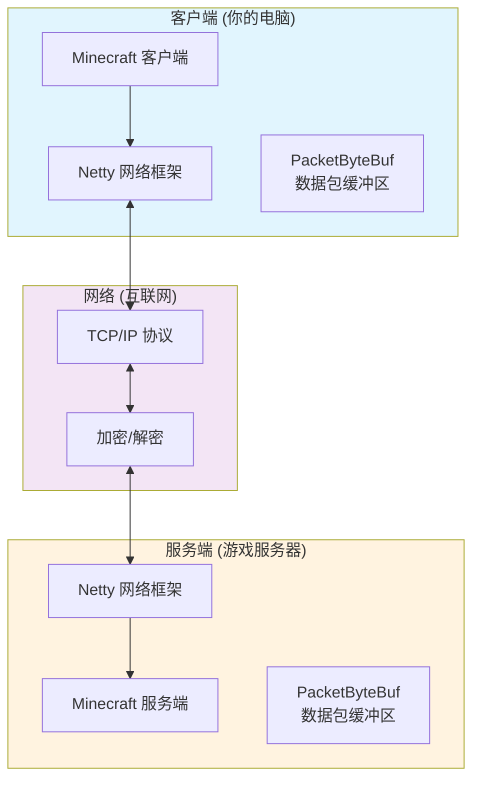
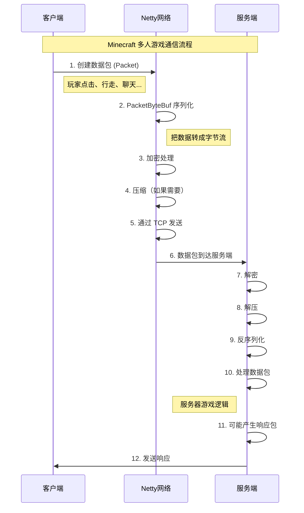

# 第33章 网络基础入门

## 目标

- 理解什么是网络通信
- 了解 Minecraft 客户端与服务端的通信方式
- 认识数据包（Packet）的概念
- 掌握 Minecraft 网络架构的基本组成

## 前置知识

- 了解 Java 基础语法
- 知道什么是客户端和服务端
- 理解 TCP/IP 协议的基本概念（可选）

## 核心概念

> **注意**：以下源码示例基于 CFR 反编译代码，实际源码可能略有差异。代码逻辑是正确的，但字段和方法名称可能因混淆而有所不同。

### 什么是网络？

想象一下你和朋友通过手机聊天：

- **你** = 客户端（Client）
- **朋友** = 服务端（Server）
- **发送的消息** = 数据包（Packet）
- **网络** = 手机信号/Wi-Fi

在 Minecraft 中，情况完全一样：

```
┌─────────────┐                    ┌─────────────┐
│             │  ──── 数据包 ────> │             │
│   客户端      │  <─── 数据包 ──── │   服务端     │
│  (你的电脑)   │                    │  (服务器)    │
└─────────────┘                    └─────────────┘
```

### 为什么 Minecraft 需要网络？

Minecraft 支持两种模式：

| 模式 | 说明 | 需要网络吗 |
|------|------|-----------|
| **单人游戏** | 自己玩自己的世界 | 不需要（逻辑上模拟成客户端+服务端） |
| **多人游戏** | 和其他玩家一起玩 | **必须！** |

多人游戏时，所有玩家都需要知道：
- 谁在哪里移动
- 哪个方块被破坏
- 发生了什么事件

这些信息都要通过网络传递！

### 网络在哪里？

源码路径：`..../source/net/minecraft/network/`

关键文件：

| 文件 | 作用 |
|------|------|
| `ClientConnection.java` | 管理网络连接（发送/接收数据） |
| `Packet.java` | 数据包接口 |
| `PacketByteBuf.java` | 数据包缓冲区（序列化/反序列化） |
| `NetworkState.java` | 协议状态定义 |
| `NetworkPhase.java` | 连接阶段（握手、登录、游戏等） |

## 图解（Mermaid）

### Minecraft 网络架构图



### 数据包流动图



## 核心代码

### ClientConnection 客户端连接

```java
// 源码位置: ClientConnection.java

// 创建客户端连接
ClientConnection connection = new ClientConnection(NetworkSide.CLIENTBOUND);

// 连接到服务器
connection.connect("server.example.com", 25565, loginPacketListener);

// 发送数据包
connection.send(packet);

// 接收数据包会自动调用 listener 的方法
```

### 关键概念：NetworkSide（网络方向）

```java
// 源码位置: NetworkSide.java

public enum NetworkSide {
    SERVERBOUND,   // 发送给服务端的包（客户端 -> 服务端）
    CLIENTBOUND;   // 发送给客户端的包（服务端 -> 客户端）
}
```

### 数据包流动示意

```java
// 发送数据包
public void send(Packet<?> packet) {
    if (this.isOpen()) {
        // 检查连接是否打开
        this.sendImmediately(packet, null, true);
    } else {
        // 连接未开，排队等待
        this.queuedTasks.add(connection -> 
            connection.sendImmediately(packet, null, true));
    }
}
```

## 实战演示

### 场景：玩家按下移动键

1. **玩家操作**：按 W 键向前走
2. **客户端处理**：计算新位置
3. **创建数据包**：`PlayerMoveC2SPacket`
4. **序列化成字节**：通过 `PacketByteBuf` 写入位置
5. **发送**：`connection.send(movePacket)`
6. **网络传输**：TCP 发送到服务器
7. **服务端处理**：验证并更新玩家位置
8. **广播**：向周围玩家发送新位置

### 网络延迟

网络不是即时的，有延迟：

```
延迟 = 数据包从客户端到服务端的时间

-  localhost (本机): ~0ms
-  局域网:           ~1-5ms
-  国内服务器:       ~20-50ms
-  海外服务器:       ~100-300ms
```

## 小结

1. **网络通信** = 客户端和服务端之间发送数据包
2. **Packet（数据包）** = 承载游戏信息的"快递包裹"
3. **ClientConnection** = 管理网络连接的对象
4. **PacketByteBuf** = 打包/拆包的工具
5. **NetworkSide** = 区分数据包方向（Serverbound / Clientbound）

## 练习

1. 在源码中找到 `ClientConnection.java`，尝试理解 `send()` 方法
2. 思考：为什么需要区分 Serverbound 和 Clientbound？
3. 查找代码中的 `packetsReceivedCounter` 和 `packetsSentCounter`，了解统计方式

## 相关链接

- 上一章：[第32章 路径导航](../Part-5-AI/32-pathfinding.md) - AI系统最后一章
- 下一章：[第34章 数据包系统](./34-packet-system.md) - 深入了解 Packet
- Netty 框架文档：https://netty.io/

### 源码文件位置

| 文件 | 源码路径 | 说明 |
|------|----------|------|
| NetworkInteractionHandler.java | `net/minecraft/network/NetworkInteractionHandler.java` | 网络交互处理器 |
| ClientConnection.java | `net/minecraft/network/ClientConnection.java` | 客户端连接管理 |
| NetworkState.java | `net/minecraft/network/NetworkState.java` | 网络状态定义 |
| PlayPackets.java | `net/minecraft/network/packet/PlayPackets.java` | 游戏数据包类型 |

> **注意**：本文中的部分源码示例基于 CFR 反编译结果，实际源码可能略有差异。

---

**关键词**：网络通信、客户端、服务端、Packet、ClientConnection、TCP/IP
