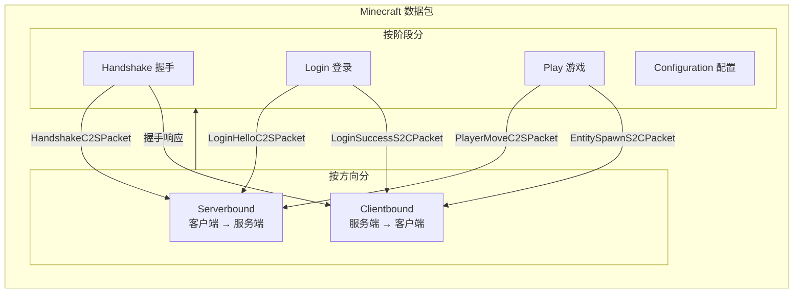
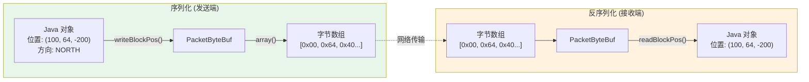
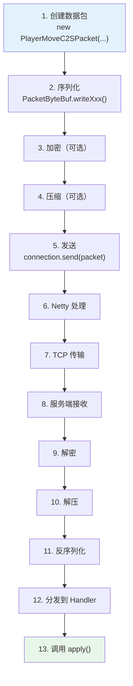
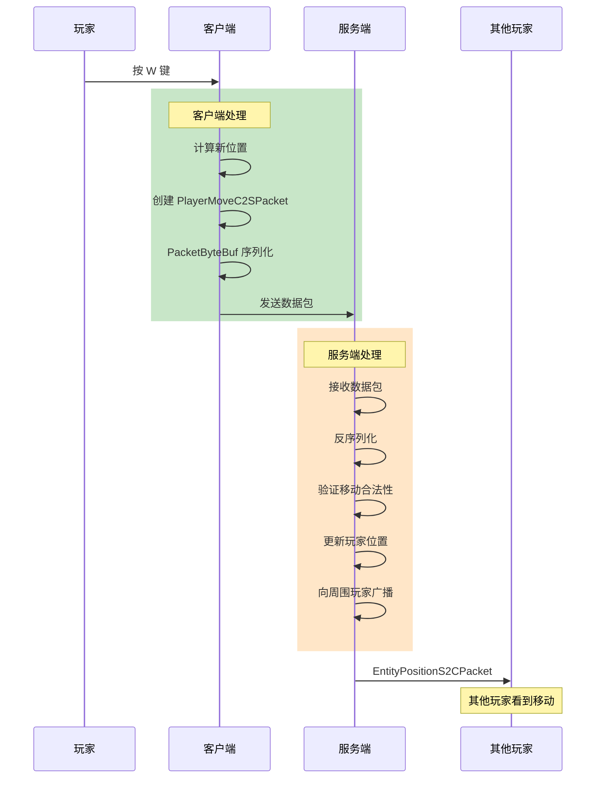

# 第34章 数据包系统详解

## 目标

- 理解 Packet（数据包）是什么
- 掌握 Serverbound 和 Clientbound 的区别
- 学会使用 PacketByteBuf 进行数据序列化
- 了解数据包的发送和接收流程

## 前置知识

- 完成 [第33章 网络基础入门](./33-network-intro.md)
- 了解 Java 接口（Interface）概念

## 核心概念

### Packet 是什么？

**Packet = 数据包 = 快递包裹**

就像寄快递需要：
1. **打包**：把东西装进箱子
2. **填单**：写上收件人、地址
3. **寄出**：交给快递公司

Minecraft 的数据包也一样：

| 快递 | Minecraft Packet |
|------|------------------|
| 箱子里的东西 | 要传输的数据（位置、物品、聊天信息...） |
| 快递单 | 数据包 ID（告诉对方这是什么包） |
| 打包/拆包 | PacketByteBuf 序列化/反序列化 |

### 源码中的 Packet 定义

```java
// 源码位置: Packet.java

public interface Packet<T extends PacketListener> {
    // 获取数据包的唯一标识
    public PacketType<? extends Packet<T>> getPacketId();

    // 处理这个数据包
    public void apply(T listener);
}
```

### Serverbound vs Clientbound

```java
// 源码位置: NetworkSide.java

public enum NetworkSide {
    SERVERBOUND,   // 服务端bound = 发往服务端的包
    CLIENTBOUND;  // 客户端bound = 发往客户端的包
}
```

#### 简单记忆法

```
SERVERBOUND  =  Server Bound  =  绑定到服务端  =  发给服务端
CLIENTBOUND  =  Client Bound  =  绑定到客户端  =  发给客户端
```

#### Minecraft 中的例子

| Serverbound（客户端 → 服务端） | Clientbound（服务端 → 客户端） |
|-------------------------------|-------------------------------|
| `PlayerMoveC2SPacket` - 移动 | `EntityPositionS2CPacket` - 实体位置 |
| `ChatMessageC2SPacket` - 聊天 | `ChatMessageS2CPacket` - 收到消息 |
| `ClickSlotC2SPacket` - 点击物品栏 | `ScreenHandlerSlotUpdateS2CPacket` - 更新物品栏 |
| `PlayerActionC2SPacket` - 破坏方块 | `BlockUpdateS2CPacket` - 方块更新 |

### 数据包存储位置

```
source/net/minecraft/network/packet/
├── c2s/                    # Client to Server = 发给服务端的包
│   ├── play/               # 游戏中的包（移动、攻击等）
│   ├── login/              # 登录时的包
│   ├── handshake/           # 握手包
│   └── config/              # 配置包（1.21新增）
├── s2c/                    # Server to Client = 发给客户端的包
│   ├── play/
│   ├── login/
│   └── ...
└── Packet.java             # 数据包接口
```

## 图解（Mermaid）

### 数据包分类图



### PacketByteBuf 序列化图



### 数据包发送流程图



## 核心代码

### 创建数据包

```java
// 位置数据包
BlockPos pos = new BlockPos(100, 64, -200);
buf.writeBlockPos(pos);

// 字符串
String message = "Hello!";
buf.writeString(message);

// VarInt (可变长整数，省流量)
int id = 42;
buf.writeVarInt(id);

// UUID
UUID uuid = player.getUuid();
buf.writeUuid(uuid);

// NBT 数据
NbtCompound nbt = new NbtCompound();
buf.writeNbt(nbt);
```

### 读取数据包

```java
// 读取顺序必须和写入顺序一致！
BlockPos pos = buf.readBlockPos();
String message = buf.readString();
int id = buf.readVarInt();
UUID uuid = buf.readUuid();
NbtCompound nbt = buf.readNbt();
```

### 发送和接收

```java
// 发送数据包 (在客户端)
ClientConnection connection = ...;
PlayerMoveC2SPacket packet = new PlayerMoveC2SPacket(x, y, z, yaw, pitch, onGround);
connection.send(packet);

// 接收数据包 (在服务端)
public class PlayerMoveC2SPacket implements Packet<ServerPlayPacketListener> {
    @Override
    public void apply(ServerPlayPacketListener listener) {
        // 处理移动
        listener.onPlayerMove(this);
    }
}
```

### PlayPackets 中定义的常用数据包

```java
// 源码位置: PlayPackets.java

public class PlayPackets {
    // ===== 客户端 -> 服务端 (Serverbound) =====
    public static final PacketType<PlayerMoveC2SPacket.PositionAndOnGround> MOVE_PLAYER_POS = 
        PlayPackets.c2s("move_player_pos");
    public static final PacketType<ChatMessageC2SPacket> CHAT = 
        PlayPackets.c2s("chat");
    public static final PacketType<ClickSlotC2SPacket> CONTAINER_CLICK = 
        PlayPackets.c2s("container_click");
    
    // ===== 服务端 -> 客户端 (Clientbound) =====
    public static final PacketType<EntitySpawnS2CPacket> ADD_ENTITY = 
        PlayPackets.s2c("add_entity");
    public static final PacketType<ChunkDataS2CPacket> LEVEL_CHUNK_WITH_LIGHT = 
        PlayPackets.s2c("level_chunk_with_light");
    public static final PacketType<ChatMessageS2CPacket> PLAYER_CHAT = 
        PlayPackets.s2c("player_chat");
}
```

## 实战演示

### 场景：玩家移动

**客户端发送：**

```java
// 1. 创建移动数据包
PlayerMoveC2SPacket packet = new PlayerMoveC2SPacket(
    x, y, z,           // 位置
    yaw, pitch,         // 视角
    onGround            // 是否在地面上
);

// 2. 发送
connection.send(packet);
```

**服务端接收：**

```java
// ServerPlayPacketListener 接口中
public interface ServerPlayPacketListener extends PacketListener {
    void onPlayerMove(PlayerMoveC2SPacket packet);
    void onChatMessage(ChatMessageC2SPacket packet);
    void onClickSlot(ClickSlotC2SPacket packet);
    // ... 更多方法
}
```

### 数据包流向图



## 小结

1. **Packet（数据包）** = 游戏信息的载体
2. **Serverbound** = 从客户端发往服务端（客户端做什么 → 服务端）
3. **Clientbound** = 从服务端发往客户端（服务端通知 → 客户端）
4. **PacketByteBuf** = 序列化工具，把 Java 对象转成字节
5. **apply()** = 数据包的核心方法，定义如何处理这个包

## 练习

1. 找到 `PlayerMoveC2SPacket.java` 源码，理解它包含哪些数据
2. 在 `PlayPackets.java` 中查找一个你感兴趣的包名
3. 思考：为什么移动包是 Serverbound，而不是 Clientbound？

## 相关链接

- 上一章：[第33章 网络基础入门](./33-network-intro.md)
- 下一章：[第35章 协议状态机](./35-protocol-states.md) - 了解连接的不同阶段
- Minecraft 协议文档：https://minecraft.wiki/w/Minecraft_Wiki:Projects/wiki.vg_merge/Protocol

### 源码文件位置

| 文件 | 源码路径 | 说明 |
|------|----------|------|
| Packet.java | `net/minecraft/network/packet/Packet.java` | 数据包接口 |
| ClientBoundPacketType.java | `net/minecraft/network/packet/ClientBoundPacketType.java` | 客户端接收数据包类型 |
| ServerBoundPacketType.java | `net/minecraft/network/packet/ServerBoundPacketType.java` | 服务端接收数据包类型 |
| PacketByteBuf.java | `net/minecraft/network/PacketByteBuf.java` | 数据包缓冲区 |

> **注意**：本文中的部分源码示例基于 CFR 反编译结果，实际源码可能略有差异。
