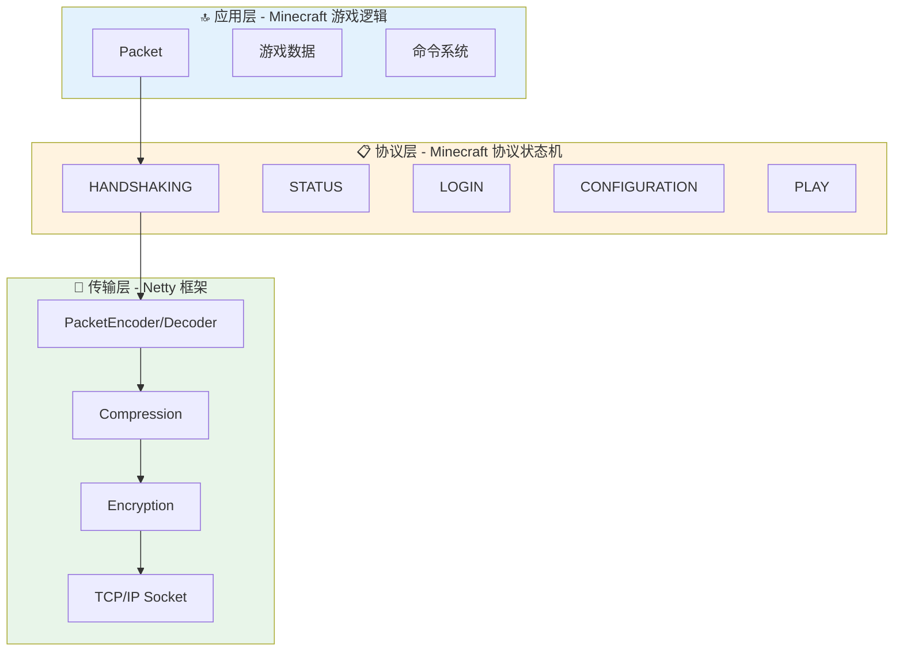

# 第 35 章：网络系统入门（Network Introduction）

## 章节目标

- 理解 Minecraft 网络通信的基本概念
- 掌握客户端与服务端的通信模式
- 了解 Packet（数据包）作为"快递包裹"的比喻
- 认识 Minecraft 网络协议的层次结构

## 前置知识

- 了解 TCP/IP 网络基础知识
- 知道客户端与服务端的基本区别
- 有过 Minecraft 多人游戏经验

## 目录

- [初识网络通信](#初识网络通信)
- [网络协议 = 邮政系统](#网络协议--邮政系统)
- [数据包 = 快递包裹](#数据包--快递包裹)
- [协议层次结构](#协议层次结构)
- [源码解析](#源码解析)
- [实战演示](#实战演示)
- [课后自查](#课后自查)

---

## 初识网络通信

当你点击"加入服务器"按钮，屏幕上发生了一场复杂的"数字对话"：

```
┌─────────────────────────────────────────────────────────────┐
│                                                             │
│   你的电脑 (客户端)          网络传输          服务器        │
│                                                             │
│   ┌─────────┐                                    ┌─────────┐ │
│   │ 正在连接 │ ───────────────────────────────> │ 等待连接 │ │
│   │         │                                    │         │ │
│   │ 验证身份 │ <────────────────────────────── │ 验证身份 │ │
│   │         │                                    │         │ │
│   │ 加载世界 │ <────────────────────────────── │ 发送区块 │ │
│   │         │                                    │         │ │
│   │ 开始游戏 │ <────────────────────────────── │ 同步状态 │ │
│   └─────────┘                                    └─────────┘ │
│                                                             │
└─────────────────────────────────────────────────────────────┘
```

这场对话的本质是：**数据包的交换**。

---

## 网络协议 = 邮政系统

想象一下 Minecraft 的网络协议就像一个**邮政系统**：

| 现实邮政 | Minecraft 网络 |
|---------|---------------|
| 信封 | Packet（数据包） |
| 邮政编码 | 数据包 ID |
| 邮递规则 | 协议状态机 |
| 邮局分拣 | Netty Pipeline |
| 收件人 | PacketListener |

**核心类比**：

> **网络协议 = 邮政系统的规则手册**
> 
> 数据包不能随意发送，必须按照协议规定的格式、顺序、状态进行传输。就像寄信必须按照邮政编码、格式要求来填写一样。

---

## 数据包 = 快递包裹

**Packet（数据包）** 是 Minecraft 网络通信的基本单位，就像快递系统中的包裹：

```
┌─────────────────────────────────────────────────────────────┐
│                      Packet 数据包                           │
├─────────────────────────────────────────────────────────────┤
│  ┌─────────────────────────────────────────────────────┐   │
│  │              包头 (Packet Header)                     │   │
│  │  ┌─────────┐ ┌─────────┐ ┌─────────────────────────┐ │   │
│  │  │ Length  │ │ Packet  │ │     Timestamp (可选)   │ │   │
│  │  │  长度   │ │   ID    │ │        时间戳           │ │   │
│  │  │ VarInt  │ │ VarInt  │ │                        │ │   │
│  │  └─────────┘ └─────────┘ └─────────────────────────┘ │   │
│  └─────────────────────────────────────────────────────┘   │
│  ┌─────────────────────────────────────────────────────┐   │
│  │              包体 (Packet Payload)                   │   │
│  │                                                          │   │
│  │   实际的游戏数据：                                        │   │
│  │   - 玩家位置坐标                                         │   │
│  │   - 聊天消息内容                                         │   │
│  │   - 方块变化信息                                         │   │
│  │   - 实体状态更新                                         │   │
│  │                                                          │   │
│  └─────────────────────────────────────────────────────┘   │
└─────────────────────────────────────────────────────────────┘
```

### 数据包的方向

Minecraft 使用双向通信：

```
┌─────────────────────────────────────────────────────────────┐
│                                                             │
│                    客户端 ← → 服务端                         │
│                                                             │
│    C2S (Client to Server)      服务端接收                    │
│    ┌─────────┐                                                  │
│    │ 玩家操作 │ ──────────────> 移动、攻击、放置方块           │
│    │ 输入指令 │                  聊天、交互...                 │
│    └─────────┘                                                  │
│                                                             │
│    S2C (Server to Client)      客户端接收                      │
│    ┌─────────┐                                                  │
│    │ 世界状态 │ <────────────── 区块数据、实体更新             │
│    │ 同步信息 │                  聊天消息、粒子效果           │
│    └─────────┘                                                  │
│                                                             │
└─────────────────────────────────────────────────────────────┘
```

---

## 协议层次结构

Minecraft 的网络协议分为多个层次，就像 OSI 模型一样：



### 五大协议状态

| 状态 | 描述 | 何时进入 | 何时离开 |
|------|------|---------|---------|
| `HANDSHAKING` | 握手阶段 | 连接建立时 | 发送握手包后 |
| `STATUS` | 服务器状态查询 | 意图=STATUS | Ping 完成后 |
| `LOGIN` | 登录认证 | 意图=LOGIN | 认证成功后 |
| `CONFIGURATION` | 配置阶段 | 登录成功后 | 配置完成后 |
| `PLAY` | 游戏进行中 | 配置完成后 | 断开连接 |

---

## 源码解析

### Packet 接口

数据包的核心接口定义了所有数据包必须实现的方法：

```java
// D:\Minecraft-Learning\assets\mc\1.21\net\minecraft\network\packet\Packet.java
public interface Packet<T extends PacketListener> {
    
    // 获取数据包类型标识
    PacketType<? extends Packet<T>> getPacketId();
    
    // 应用数据包到监听器 (核心方法)
    void apply(T var1);
    
    // 是否允许跳过写入错误
    default boolean isWritingErrorSkippable() {
        return false;
    }
    
    // 是否触发网络状态转换
    default boolean transitionsNetworkState() {
        return false;
    }
}
```

### 网络连接管理

`ClientConnection` 是网络层的核心类，负责管理 Netty 通道：

```java
// D:\Minecraft-Learning\assets\mc\1.21\net\minecraft\network\ClientConnection.java
public class ClientConnection extends SimpleChannelInboundHandler<Packet<?>> {
    
    private final NetworkSide side;  // CLIENT 或 SERVER
    private volatile PacketListener packetListener;
    private Channel channel;
    
    // 发送数据包
    public void send(Packet<?> packet) {
        if (this.isOpen()) {
            this.sendImmediately(packet, null, true);
        }
    }
    
    // 状态转换
    public <T extends PacketListener> void transitionInbound(
            NetworkState<T> state, T packetListener) {
        this.setPacketListener(state, packetListener);
        // 配置数据包捆绑处理器
        PacketBundleHandler bundleHandler = state.bundleHandler();
        // ... 配置 Netty Pipeline
    }
}
```

### 字节缓冲区

`PacketByteBuf` 是 Minecraft 对 Netty ByteBuf 的扩展：

```java
// D:\Minecraft-Learning\assets\mc\1.21\net\minecraft\network\PacketByteBuf.java
public class PacketByteBuf extends ByteBuf {
    
    // 最大 NBT 读取大小
    public static final int MAX_READ_NBT_SIZE = 0x200000;  // 2MB
    
    // 最大字符串长度
    public static final short DEFAULT_MAX_STRING_LENGTH = Short.MAX_VALUE;
    
    // VarInt 读写 - 节省带宽的关键
    public int readVarInt() { ... }
    public PacketByteBuf writeVarInt(int value) { ... }
    
    // Minecraft 特定类型
    public BlockPos readBlockPos() { ... }
    public void writeBlockPos(BlockPos pos) { ... }
    
    public Identifier readIdentifier() { ... }
    public void writeIdentifier(Identifier id) { ... }
}
```

---

## 实战演示

### 查看网络流量

使用 F3 + 调试工具查看 Minecraft 网络状态：

1. 按 `F3 + D` 清空聊天历史
2. 按 `F3 + 3` 打开网络监视器
3. 观察数据包收发情况

### 简单网络延迟测试

```
┌─────────────────────────────────────────────────────────────┐
│  网络延迟测试方法                                            │
├─────────────────────────────────────────────────────────────┤
│  1. 打开聊天窗口                                            │
│  2. 输入: /debug start                                     │
│  3. 等待 30 秒                                             │
│  4. 输入: /debug stop                                      │
│  5. 检查 debug/report 中的网络统计:                          │
│     - packets_sent: 发送数据包数量                           │
│     - packets_received: 接收数据包数量                        │
│     - bytes_sent: 发送字节数                                 │
│     - bytes_received: 接收字节数                             │
└─────────────────────────────────────────────────────────────┘
```

---

## 关键术语表

| 术语 | 英文 | 解释 |
|------|------|------|
| 数据包 | Packet | 网络通信的基本单位 |
| 监听器 | PacketListener | 处理数据包的接口 |
| VarInt | Variable-length Integer | 可变长度整数编码 |
| 状态机 | State Machine | 管理协议不同阶段的状态转换 |
| 编解码器 | Codec | 序列化和反序列化数据 |

---

## 课后自查

- [ ] 能否用自己的话解释什么是 Packet？
- [ ] Minecraft 有哪几种协议状态？按顺序排列
- [ ] C2S 和 S2C 分别代表什么方向？
- [ ] VarInt 编码的优势是什么？
- [ ] 客户端是如何与服务端建立连接的？

---

## 下章预告

下一章我们将深入学习 **数据包系统 (Packet System)**，了解各种常见的数据包类型以及它们是如何工作的。

---

## 参考资料

- [Minecraft Wiki: Protocol](https://minecraft.wiki/w/Minecraft_Wiki:Protocol)
- `D:\Minecraft-Learning\assets\mc\1.21\net\minecraft\network\packet\Packet.java`
- `D:\Minecraft-Learning\assets\mc\1.21\net\minecraft\network\ClientConnection.java`
