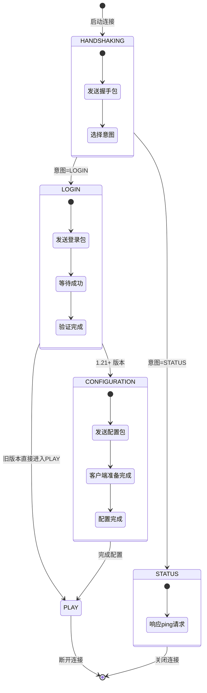
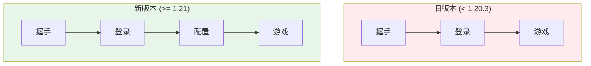
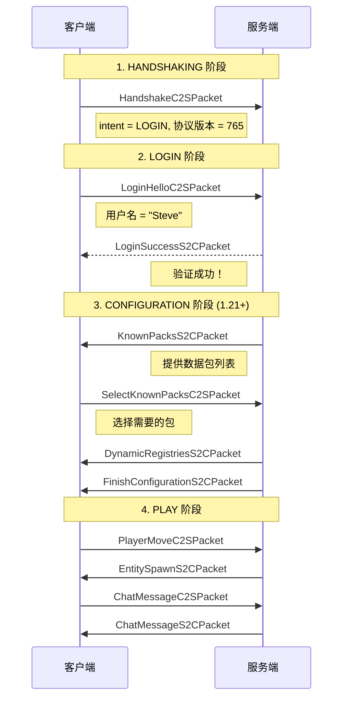

# 第35章 协议状态机详解

## 目标

- 理解 Minecraft 协议的五个状态阶段
- 掌握 HANDSHAKING → LOGIN → CONFIGURATION → PLAY 的转换流程
- 了解 1.21 新增的 CONFIGURATION 阶段的作用
- 理解各阶段发送的不同数据包

## 前置知识

- 完成 [第34章 数据包系统](./34-packet-system.md)
- 理解 Packet 和 PacketListener 的关系

## 核心概念

### 什么是协议状态机？

就像打电话的过程：

```
拿起手机 ──> 拨号 ──> 对方接听 ──> 通话 ──> 挂断
```

Minecraft 连接也有类似的过程：

```
握手 ──> 登录 ──> 配置 ──> 游戏 ──> 断开
```

### 五个协议状态

```java
// 源码位置: NetworkPhase.java

public enum NetworkPhase {
    HANDSHAKING("handshake"),   // 握手 - 建立连接
    PLAY("play"),               // 游戏 - 正常游玩
    STATUS("status"),           // 状态 - 获取服务器信息
    LOGIN("login"),             // 登录 - 验证玩家身份
    CONFIGURATION("configuration"); // 配置 - 1.21新增的阶段
}
```

### 状态转换流程图



## 图解（Mermaid）

### Minecraft 连接状态转换图

```mermaid
flowchart LR
    subgraph Phases["协议状态"]
        HS["HANDSHAKING<br/>握手"]
        ST["STATUS<br/>状态查询"]
        LN["LOGIN<br/>登录验证"]
        CF["CONFIGURATION<br/>配置 (1.21+)"]
        PL["PLAY<br/>游戏"]
    end
    
    HS -->|"HandshakeC2SPacket<br/>intent=LOGIN"| LN
    HS -->|"HandshakeC2SPacket<br/>intent=STATUS"| ST
    
    LN -->|"LoginSuccessS2CPacket"| CF
    LN -->|"LoginSuccessS2CPacket"| PL
    
    CF -->|"FinishConfigurationC2SPacket"| PL
    
    PL -.->|"Disconnect"|[*]
    ST -.->|"断开"|[*]
    
    style HS fill:#bbdefb
    style LN fill:#c8e6c9
    style CF fill:#fff9c4
    style PL fill:#ffcdd2
    style ST fill:#e1bee7
```

### 1.21 新增的 CONFIGURATION 阶段



## 核心代码

### 状态定义

```java
// 源码位置: NetworkPhase.java

public enum NetworkPhase {
    HANDSHAKING("handshake"),
    PLAY("play"),
    STATUS("status"),
    LOGIN("login"),
    CONFIGURATION("configuration");  // 1.21 新增

    private final String id;

    private NetworkPhase(String id) {
        this.id = id;
    }
}
```

### 握手包

```java
// 源码位置: HandshakeC2SPacket.java

public class HandshakeC2SPacket implements Packet<ServerHandshakePacketListener> {
    private final int protocolVersion;   // 协议版本
    private final String serverAddress;  // 服务器地址
    private final int serverPort;        // 服务器端口
    private final ConnectionIntent intent; // 连接意图

    // intent 可以是: HANDSHAKE, STATUS, LOGIN, TRANSFER
}
```

### 状态切换

```java
// 源码位置: ClientConnection.java

// 切换入站协议（接收数据的方向）
public <T extends PacketListener> void transitionInbound(NetworkState<T> state, T packetListener) {
    this.packetListener = packetListener;
    // 更新解码器
    NetworkStateTransitions.DecoderTransitioner decoderTransitioner = 
        NetworkStateTransitions.decoderTransitioner(state);
    // 同步切换
    ClientConnection.syncUninterruptibly(this.channel.writeAndFlush(decoderTransitioner));
}

// 切换出站协议（发送数据的方向）
public void transitionOutbound(NetworkState<?> newState) {
    NetworkStateTransitions.EncoderTransitioner encoderTransitioner = 
        NetworkStateTransitions.encoderTransitioner(newState);
    ClientConnection.syncUninterruptibly(this.channel.writeAndFlush(encoderTransitioner.andThen(context -> {
        this.duringLogin = bl;
    })));
}
```

### 各阶段的监听器

```java
// 源码位置: listener/PacketListener.java

public interface PacketListener {
    NetworkSide getSide();    // 服务端bound 或 客户端bound
    NetworkPhase getPhase();  // 当前处于哪个阶段
    void onDisconnected(DisconnectionInfo info);  // 断开连接回调
}

// 不同阶段的监听器
public interface ServerHandshakePacketListener extends PacketListener {}
public interface ClientLoginPacketListener extends PacketListener {}      // LOGIN
public interface ClientConfigurationPacketListener extends PacketListener {} // CONFIGURATION
public interface ClientPlayPacketListener extends PacketListener {}       // PLAY
```

## 各阶段详解

### 1. HANDSHAKING (握手阶段)

**目的**：建立初始连接，确定后续要做什么

**发送的包**：
- `HandshakeC2SPacket`：包含协议版本、服务器地址、连接意图

### 2. STATUS (状态查询)

**目的**：获取服务器信息（用于服务器列表）

**发送的包**：
- `QueryResponseS2CPacket`：服务器信息
- `PingResultS2CPacket`：ping 结果

### 3. LOGIN (登录阶段)

**目的**：验证玩家身份

**发送的包**：
- 客户端：`LoginHelloC2SPacket`（包含用户名）
- 服务端：`LoginSuccessS2CPacket`（验证成功）或 `LoginDisconnectS2CPacket`（验证失败）

### 4. CONFIGURATION (配置阶段) [1.21+]

**目的**：在游戏开始前完成客户端配置同步

**为什么需要**：将原本在 LOGIN 阶段的一些配置移到独立阶段，让协议更清晰

**发送的包**：
- `DynamicRegistriesS2CPacket`：注册表数据
- `ServerLinksS2CPacket`：服务器链接
- `KnownPacksS2CPacket`：可用数据包列表
- `SelectKnownPacksC2SPacket`：客户端选择的包

### 5. PLAY (游戏阶段)

**目的**：正常游戏

**发送的包**：
- 位置移动、聊天、物品栏、实体更新、方块更新等所有游戏相关包

## 实战演示

### 完整的连接流程



## 小结

1. **协议状态机** = 把连接过程分成多个有序阶段
2. **五个状态**：HANDSHAKING → LOGIN → CONFIGURATION → PLAY（或 STATUS）
3. **CONFIGURATION (1.21+)** = 新增的配置阶段，用于游戏开始前的配置同步
4. **状态切换** = 不同阶段使用不同的 PacketListener 和数据包集合
5. **PacketListener** = 每个阶段有不同的监听器接口

## 练习

1. 在源码中找到 `NetworkPhase.java`，查看所有状态
2. 理解为什么 1.21 要增加 CONFIGURATION 阶段
3. 查找 `LoginPackets.java` 中有哪些登录相关的包

## 相关链接

- 上一章：[第34章 数据包系统](./34-packet-system.md)
- 下一章：[第36章 同步机制](./36-sync-mechanism.md)
- Minecraft Wiki 协议文档

### 源码文件位置

| 文件 | 源码路径 | 说明 |
|------|----------|------|
| NetworkState.java | `net/minecraft/network/NetworkState.java` | 网络状态管理 |
| ConnectionIntent.java | `net/minecraft/network/ConnectionIntent.java` | 连接意图枚举 |
| NetworkPhase.java | `net/minecraft/network/NetworkPhase.java` | 网络阶段定义 |

> **注意**：本文中的部分源码示例基于 CFR 反编译结果，实际源码可能略有差异。

---

**关键词**：协议状态机、握手、登录、配置、游戏、NetworkPhase
