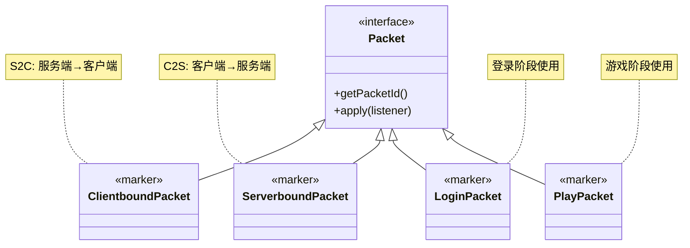

# 第 36 章：数据包Packet系统（Packet System）

## 章节目标

- 深入理解 Packet 接口和类型系统
- 掌握常见数据包的分类和用途
- 学会阅读数据包源码
- 了解数据包编解码原理

## 前置知识

- 完成《网络系统入门》章节
- 理解 C2S 和 S2C 通信方向
- 了解 Java 泛型基础

## 目录

- [Packet = 快递包裹的深层次解](#packet--快递包裹的深层次理解)
- [Packet 接口详解](#packet-接口详解)
- [数据包分类体系](#数据包分类体系)
- [常用数据包详解](#常用数据包详解)
- [源码解析：PacketCodec](#源码解析packetcodec)
- [VarInt 编码原理](#varint-编码原理)
- [实战：自定义数据包](#实战自定义数据包)
- [课后自查](#课后自查)

---

## Packet = 快递包裹的深层次理解

上一章我们把 Packet 比作快递包裹，现在让我们深入理解它的结构：

```
┌─────────────────────────────────────────────────────────────┐
│                    Packet 数据包的一生                        │
├─────────────────────────────────────────────────────────────┤
│                                                             │
│   1️⃣ 创建阶段                                               │
│   ┌─────────────────────────────────────────────────────┐  │
│   │ ServerPlayer player = ...;                           │  │
│   │ PlayerPositionS2CPacket packet =                     │  │
│   │     new PlayerPositionS2CPacket(x, y, z, yaw, pitch);│  │
│   └─────────────────────────────────────────────────────┘  │
│                         ↓                                    │
│   2️⃣ 编码阶段 (服务端)                                       │
│   ┌─────────────────────────────────────────────────────┐  │
│   │ PacketByteBuf buf = PacketByteBuf.wrap();           │  │
│   │ buf.writeVarInt(packetId);  // 邮政编码              │  │
│   │ buf.writeDouble(x);         // 包裹内容              │  │
│   │ buf.writeDouble(y);         // 包裹内容              │  │
│   │ buf.writeDouble(z);         // 包裹内容              │  │
│   └─────────────────────────────────────────────────────┘  │
│                         ↓                                    │
│   3️⃣ 传输阶段                                               │
│   ┌─────────────────────────────────────────────────────┐  │
│   │ [Length][PacketID][Payload]                         │  │
│   │   4字节    1-3字节    N字节                         │  │
│   │   ─────────  ─────────  ─────────                   │  │
│   │   快递单号   邮政编码    实际物品                     │  │
│   └─────────────────────────────────────────────────────┘  │
│                         ↓                                    │
│   4️⃣ 解码阶段 (客户端)                                       │
│   ┌─────────────────────────────────────────────────────┐  │
│   │ PacketByteBuf buf = receiveFromNetwork();           │  │
│   │ int packetId = buf.readVarInt();                   │  │
│   │ double x = buf.readDouble();                       │  │
│   │ double y = buf.readDouble();                       │  │
│   │ double z = buf.readDouble();                       │  │
│   └─────────────────────────────────────────────────────┘  │
│                         ↓                                    │
│   5️⃣ 处理阶段                                               │
│   ┌─────────────────────────────────────────────────────┐  │
│   │ listener.onPlayerPosition(packet);                 │  │
│   │ // 更新玩家在游戏世界中的位置                         │  │
│   └─────────────────────────────────────────────────────┘  │
│                                                             │
└─────────────────────────────────────────────────────────────┘
```

---

## Packet 接口详解

### 接口定义

```java
// D:\Minecraft-Learning\assets\mc\1.21\net\minecraft\network\packet\Packet.java
public interface Packet<T extends PacketListener> {
    
    /**
     * 获取数据包的唯一标识符
     * 每个数据包在当前协议状态下都有唯一的 ID
     */
    PacketType<? extends Packet<T>> getPacketId();
    
    /**
     * 核心方法：应用数据包到监听器
     * 这里定义了数据包的"处理逻辑"
     */
    void apply(T listener);
    
    /**
     * 是否允许跳过写入错误
     * 用于批量发送时忽略失败的数据包
     */
    default boolean isWritingErrorSkippable() {
        return false;
    }
    
    /**
     * 是否触发网络状态转换
     * 例如 LoginSuccess 会触发状态转换
     */
    default boolean transitionsNetworkState() {
        return false;
    }
}
```

### PacketType 定义

```java
// 数据包类型定义
public interface PacketType<T extends Packet<?>> {
    
    /** 数据包 ID (状态内唯一) */
    int getId();
    
    /** 传输方向 */
    NetworkSide getNetworkSide();
    
    /** 编解码器 */
    PacketCodec<ByteBuf, T> getCodec();
}
```

---

## 数据包分类体系

Minecraft 的数据包可以按多个维度分类：



### 按协议状态分类

| 状态 | 数据包示例 | 用途 |
|------|-----------|------|
| HANDSHAKING | `HandshakeC2SPacket` | 连接意图声明 |
| LOGIN | `LoginHelloC2SPacket` | 玩家登录信息 |
| LOGIN | `LoginSuccessS2CPacket` | 登录成功通知 |
| CONFIGURATION | `RegistryDataS2CPacket` | 注册表同步 |
| PLAY | `PlayerMoveC2SPacket` | 玩家移动 |
| PLAY | `ChunkDataS2CPacket` | 区块数据 |

---

## 常用数据包详解

### 玩家移动数据包 (PlayerMoveC2SPacket)

这是游戏中**最高频**的数据包，玩家每次移动、转身都会发送。

```java
// D:\Minecraft-Learning\assets\mc\1.21\net\minecraft\network\packet\c2s\play\PlayerMoveC2SPacket.java

// 移动数据包有四种变体，根据操作类型选择最节省带宽的版本

// 变体1：仅地面状态 (1字节) - 用于跳跃落地
public static class OnGroundOnly extends PlayerMoveC2SPacket {
    public static final PacketCodec<PacketByteBuf, OnGroundOnly> CODEC =
        Packet.createCodec(OnGroundOnly::write, OnGroundOnly::read);
    
    private final boolean onGround;
    // 只需要发送 1 字节: 0x00 或 0x01
}

// 变体2：旋转+地面状态 (9字节)
public static class LookAndOnGround extends PlayerMoveC2SPacket {
    private final float yaw;
    private final float pitch;
    private final boolean onGround;
    // 发送: yaw(4字节) + pitch(4字节) + onGround(1字节)
}

// 变体3：位置+地面状态 (25字节)
public static class PositionAndOnGround extends PlayerMoveC2SPacket {
    private final double x;
    private final double y;
    private final double z;
    private final boolean onGround;
}

// 变体4：完整数据 (33字节)
public static class Full extends PlayerMoveC2SPacket {
    private final double x;
    private final double y;
    private final double z;
    private final float yaw;
    private final float pitch;
    private final boolean onGround;
    // 发送所有 9 个双精度/单精度浮点数 + 1 字节
}
```

### 区块数据包 (ChunkDataS2CPacket)

这是游戏中**体积最大**的数据包，包含整个区块的所有方块数据。

```java
// 区块数据结构
public class ChunkDataS2CPacket {
    private final int chunkX;
    private final int chunkZ;
    private final PacketByteBuf data;
    private final int chunkSectionCount;
    private final boolean noBlockEntities;
    private final boolean skyLight;
    
    // 包含：
    // - 区块段数据 (16x16x16 的方块)
    // - 区块高度图
    // - 区块实体数据 (可选)
    // - 光照数据
}
```

### 实体更新数据包 (EntityS2CPacket)

用于同步实体的位置、旋转和状态变化。

```java
// 实体数据包类型
public static class EntityS2CPacket {
    
    // 实体移动
    public static class AddPlayer extends EntityS2CPacket { ... }
    
    // 实体旋转
    public static class Rotate extends EntityS2CPacket { ... }
    
    // 实体移动+旋转
    public static class Move extends EntityS2CPacket { ... }
    
    // 实体相对移动 (增量更新)
    public static class Delta extends EntityS2CPacket { ... }
}
```

---

## 源码解析：PacketCodec

### 编解码器接口

```java
// D:\Minecraft-Learning\assets\mc\1.21\net\minecraft\network\PacketCodec.java
public interface PacketCodec<B, T> {
    
    /** 解码：从字节到对象 */
    T decode(B buf);
    
    /** 编码：从对象到字节 */
    void encode(B buf, T value);
}

// 组合编解码器
public static <B, T> PacketCodec<B, T> of(
    ValueFirstEncoder<B, T> encoder,
    PacketDecoder<B, T> decoder
) { ... }
```

### 完整数据包示例

```java
// 玩家位置同步数据包
public class PlayerPositionS2CPacket implements Packet<ClientPlayPacketListener> {
    
    private final double x;
    private final double y;
    private final double z;
    private final float yaw;
    private final float pitch;
    private final int teleportId;
    private final boolean dismountVehicle;
    
    // 静态编解码器
    public static final PacketCodec<PacketByteBuf, PlayerPositionS2CPacket> CODEC =
        Packet.createCodec(PlayerPositionS2CPacket::write, PlayerPositionS2CPacket::new);
    
    // 写入方法 (服务端调用)
    private void write(PacketByteBuf buf) {
        buf.writeDouble(this.x);
        buf.writeDouble(this.y);
        buf.writeDouble(this.z);
        buf.writeFloat(this.yaw);
        buf.writeFloat(this.pitch);
        buf.writeVarInt(this.teleportId);
        buf.writeBoolean(this.dismountVehicle);
    }
    
    // 读取方法 (客户端调用)
    private PlayerPositionS2CPacket(PacketByteBuf buf) {
        this.x = buf.readDouble();
        this.y = buf.readDouble();
        this.z = buf.readDouble();
        this.yaw = buf.readFloat();
        this.pitch = buf.readFloat();
        this.teleportId = buf.readVarInt();
        this.dismountVehicle = buf.readBoolean();
    }
    
    // 应用到监听器
    @Override
    public void apply(ClientPlayPacketListener listener) {
        listener.onPlayerPosition(this);
    }
}
```

---

## VarInt 编码原理

VarInt (Variable-length Integer) 是 Minecraft 节省带宽的**关键优化**。

### 编码规则

| 数值范围 | 字节数 | 编码示例 |
|---------|-------|---------|
| -32 ~ 31 | 1 字节 | `0x00` ~ `0x3F` |
| -4096 ~ 4095 | 2 字节 | `0x80 0x20` |
| -524288 ~ 524287 | 3 字节 | `0x80 0x80 0x40` |
| -67108864 ~ 67108863 | 4 字节 | `0x80 0x80 0x80 0x60` |
| 其他范围 | 5 字节 | - |

### 编码原理

```java
// VarInt 编码核心算法
public static int[] encodeVarInt(int value) {
    List<Integer> bytes = new ArrayList<>();
    
    while (true) {
        if ((value & ~0x7F) == 0) {
            bytes.add(value);
            break;
        } else {
            bytes.add((value & 0x7F) | 0x80);  // 设置继续位
            value >>>= 7;
        }
    }
    
    return bytes.toArray(new Integer[0]);
}

// 解码算法
public static int decodeVarInt(PacketByteBuf buf) {
    int value = 0;
    int position = 0;
    byte b;
    
    while ((b = buf.readByte()) >= 0 || position < 21) {
        value |= (b & 0x7F) << position;
        if ((b & 0x80) == 0) break;  // 继续位为0，结束
        position += 7;
    }
    
    return value;
}
```

### VarInt vs 固定长度

```
场景：发送玩家坐标 x=100, y=64, z=-200

固定长度编码:
[100 (8字节)] [64 (8字节)] [-200 (8字节)] = 24 字节

VarInt 编码:
[100 (1字节)] [64 (1字节)] [200 (2字节)] = 4 字节

节省空间: 24 - 4 = 20 字节
节省比例: 83%
```

---

## 实战：自定义数据包

### 需求场景

创建一个简单的"欢迎消息"数据包，从服务端发送到客户端。

### 实现步骤

```java
// Step 1: 定义数据包类
public class WelcomeMessageS2CPacket implements Packet<ClientPlayPacketListener> {
    
    private final Component message;
    private final int playerCount;
    
    public WelcomeMessageS2CPacket(Component message, int playerCount) {
        this.message = message;
        this.playerCount = playerCount;
    }
    
    // Step 2: 定义编解码器
    public static final PacketCodec<PacketByteBuf, WelcomeMessageS2CPacket> CODEC =
        Packet.createCodec(
            WelcomeMessageS2CPacket::write,
            WelcomeMessageS2CPacket::new
        );
    
    // Step 3: 实现序列化
    private void write(PacketByteBuf buf) {
        buf.writeText(this.message);
        buf.writeVarInt(this.playerCount);
    }
    
    private WelcomeMessageS2CPacket(PacketByteBuf buf) {
        this.message = buf.readText();
        this.playerCount = buf.readVarInt();
    }
    
    // Step 4: 实现应用方法
    @Override
    public void apply(ClientPlayPacketListener listener) {
        listener.onWelcomeMessage(this);
    }
    
    // Getter 方法
    public Component getMessage() {
        return this.message;
    }
    
    public int getPlayerCount() {
        return this.playerCount;
    }
}
```

```java
// Step 5: 在监听器中处理
public class MyPacketListener implements ClientPlayPacketListener {
    
    @Override
    public void onWelcomeMessage(WelcomeMessageS2CPacket packet) {
        // 显示欢迎消息
        MinecraftClient.getInstance().inGameHud.getChatHud()
            .addMessage(packet.getMessage());
        
        // 更新玩家数量显示
        System.out.println("当前服务器有 " + packet.getPlayerCount() + " 名玩家");
    }
}
```

```java
// Step 6: 服务端发送数据包
public class MyServerHandler {
    
    public void sendWelcomeMessage(ServerPlayerEntity player) {
        Component message = Text.literal("欢迎来到服务器！");
        int playerCount = player.getServer().getCurrentPlayerCount();
        
        WelcomeMessageS2CPacket packet = 
            new WelcomeMessageS2CPacket(message, playerCount);
        
        // 发送到客户端
        player.networkHandler.sendPacket(packet);
    }
}
```

---

## 关键术语表

| 术语 | 英文 | 解释 |
|------|------|------|
| 编解码器 | Codec | 序列化/反序列化的组合 |
| VarInt | Variable-length Integer | 可变长度整数编码 |
| 变体 | Variant | 同一操作的不同数据包大小 |
| 监听器 | Listener | 处理数据包的回调接口 |
| 负载 | Payload | 数据包中实际传输的数据 |

---

## 课后自查

- [ ] 解释 PlayerMoveC2SPacket 为什么有四种变体？
- [ ] VarInt 编码相比固定长度有什么优势？
- [ ] Packet 接口中的 `apply()` 方法的作用是什么？
- [ ] 如何在服务端向客户端发送自定义数据包？
- [ ] 找出代码中 ChunkDataS2CPacket 的序列化逻辑

---

## 下章预告

下一章我们将学习 **协议状态机 (Protocol States)**，了解 Minecraft 如何管理连接的不同阶段。

---

## 参考资料

- `D:\Minecraft-Learning\assets\mc\1.21\net\minecraft\network\packet\Packet.java`
- `D:\Minecraft-Learning\assets\mc\1.21\net\minecraft\network\PacketCodec.java`
- `D:\Minecraft-Learning\assets\mc\1.21\net\minecraft\network\packet\c2s\play\PlayerMoveC2SPacket.java`
- [wiki.vg Protocol](https://wiki.vg/Protocol)
