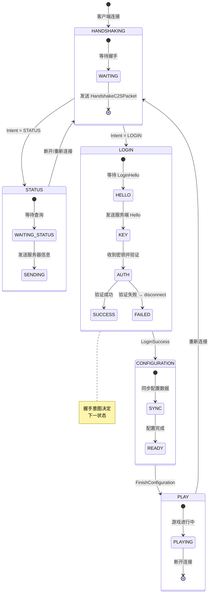
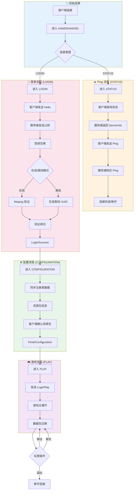
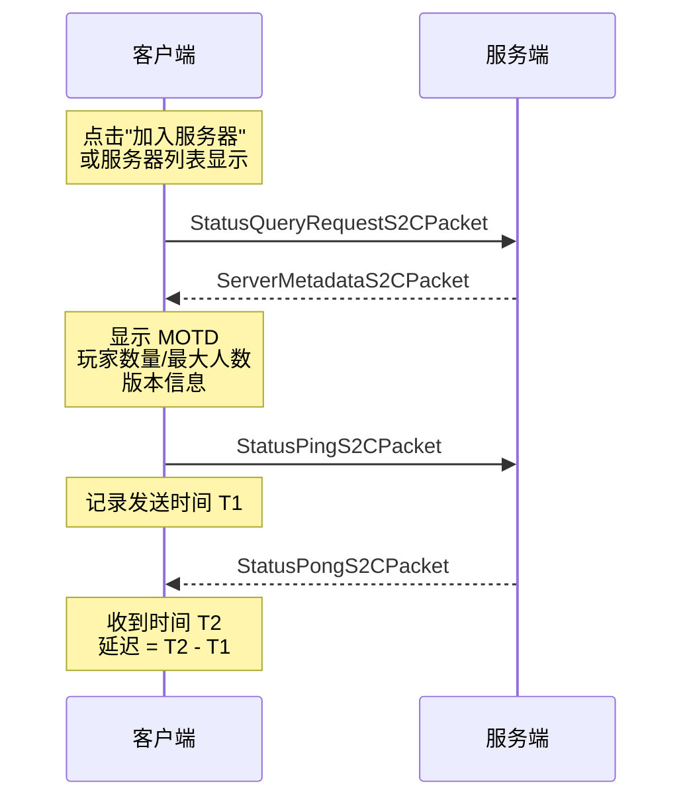
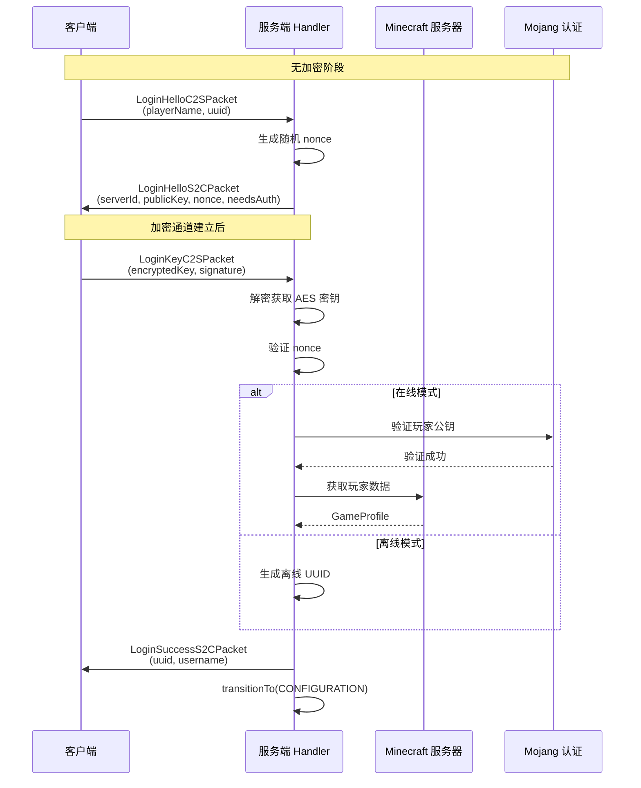
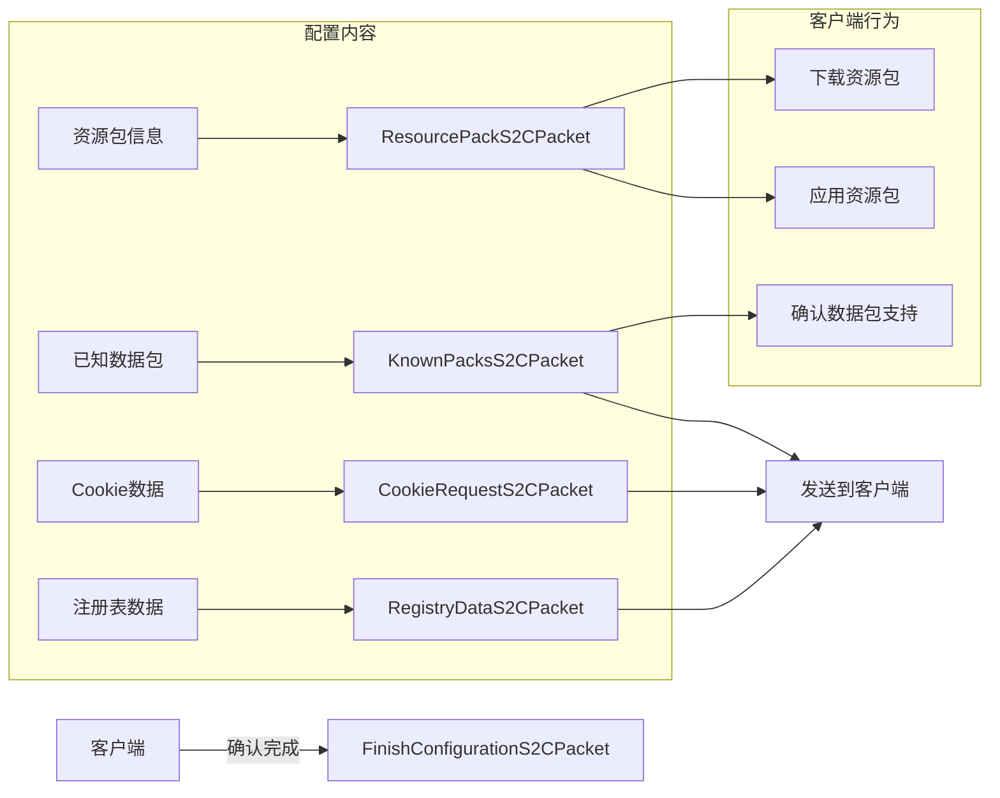

# 第 37 章：协议状态机（Protocol States）

## 章节目标

- 理解 Minecraft 网络协议状态机的概念
- 掌握五种协议状态及其转换关系
- 了解登录流程的完整过程
- 理解配置阶段的作用

## 前置知识

- 完成《网络系统入门》和《数据包系统》
- 理解 Packet 的 C2S/S2C 方向
- 了解基本的网络通信流程

## 目录

- [什么是协议状态机](#什么是协议状态机)
- [五种协议状态](#五种协议状态)
- [状态转换流程图](#状态转换流程图)
- [HANDSHAKING 阶段](#handshaking-阶段)
- [STATUS 阶段](#status-阶段)
- [LOGIN 阶段](#login-阶段)
- [CONFIGURATION 阶段](#configuration-阶段)
- [PLAY 阶段](#play-阶段)
- [实战：理解连接日志](#实战理解连接日志)
- [课后自查](#课后自查)

---

## 什么是协议状态机

**协议状态机**就像游戏中的关卡转换：

```
┌─────────────────────────────────────────────────────────────┐
│                    现实中的状态机例子                          │
├─────────────────────────────────────────────────────────────┤
│                                                             │
│    游戏中的角色状态机:                                        │
│                                                             │
│    ┌─────────┐                                              │
│    │   待机   │ ← 你站在原地不动                              │
│    └────┬────┘                                              │
│         │ 按 W                                              │
│         ↓                                                   │
│    ┌─────────┐                                              │
│    │   行走   │ ← 你正在移动                                  │
│    └────┬────┘                                              │
│         │ 按 Shift                                          │
│         ↓                                                   │
│    ┌─────────┐                                              │
│    │   潜行   │ ← 你正在潜行移动                               │
│    └────┬────┘                                              │
│         │ 松开 W                                            │
│         ↓                                                   │
│    ┌─────────┐                                              │
│    │   待机   │ ← 回到待机状态                                │
│    └─────────┘                                              │
│                                                             │
└─────────────────────────────────────────────────────────────┘
```

**类比**：

> **协议状态机 = 进入不同房间**
> 
> 每个房间（状态）只能进行特定的活动（数据包传输）。你想进游戏？必须先通过大门（HANDSHAKING），再通过安检（LOGIN），最后才能进入游戏大厅（PLAY）。

### Minecraft 状态机的规则

```java
// 状态机的基本规则
public class ProtocolRules {
    
    // 规则1: 每个状态只能发送该状态允许的数据包
    // 例如在 LOGIN 状态不能发送 PLAY 状态的数据包
    
    // 规则2: 必须按顺序进入状态
    // HANDSHAKING → LOGIN → CONFIGURATION → PLAY
    
    // 规则3: 可以从某些状态直接断开连接
    // 任何状态都可以 → 断开连接
    
    // 规则4: 状态转换是双向的
    // PLAY 可以回到 HANDSHAKING (重新连接)
}
```

---

## 五种协议状态



### 状态总览表

| 状态 | 方向 | 用途 | 典型数据包 |
|------|------|------|-----------|
| `HANDSHAKING` | 双向 | 协议版本协商 | `HandshakeC2SPacket` |
| `STATUS` | 双向 | 服务器状态/Ping | `StatusResponseS2CPacket` |
| `LOGIN` | 双向 | 身份认证 | `LoginHelloC2SPacket` |
| `CONFIGURATION` | 双向 | 资源配置同步 | `RegistryDataS2CPacket` |
| `PLAY` | 双向 | 游戏进行中 | 所有游戏数据包 |

---

## 状态转换流程图



---

## HANDSHAKING 阶段

这是连接的第一个阶段，发生在数据包交换之前。

### 握手数据包

```java
// D:\Minecraft-Learning\assets\mc\1.21\net\minecraft\network\packet\c2s\handshake\HandshakeC2SPacket.java
public record HandshakeC2SPacket(
    String hostname,    // 服务器地址
    int port,           // 服务器端口
    ConnectionIntent intent  // 连接意图: STATUS / LOGIN
) {
    // 协议版本 (1.21 = 765)
    private final int protocolVersion;
}

// 连接意图枚举
public enum ConnectionIntent {
    STATUS,      // 1 - 服务器状态查询
    LOGIN,       // 2 - 登录游戏
    TRANSFER     // 3 - 服务器转移
}
```

### 状态流程

```
┌─────────────────────────────────────────────────────────────┐
│  HANDSHAKING 阶段                                            │
├─────────────────────────────────────────────────────────────┤
│                                                             │
│  客户端                                                   │
│  ┌─────────────────────────────────────────────────────┐   │
│  │ HandshakeC2SPacket {                                │   │
│  │   protocolVersion: 765,     // Minecraft 1.21       │   │
│  │   hostname: "localhost",    // 服务器地址           │   │
│  │   port: 25565,              // 服务器端口           │   │
│  │   intent: LOGIN             // 意图：登录游戏       │   │
│  │ }                                                  │   │
│  └─────────────────────────────────────────────────────┘   │
│                         ↓                                    │
│                   网络传输                                   │
│                         ↓                                    │
│  服务端收到后根据 intent 切换到对应状态:                       │
│  - intent = STATUS → 切换到 STATUS 状态                      │
│  - intent = LOGIN  → 切换到 LOGIN 状态                       │
│                                                             │
└─────────────────────────────────────────────────────────────┘
```

---

## STATUS 阶段

STATUS 阶段用于获取服务器信息，主要用于：
- Minecraft 服务器列表显示（Ping）
- 服务器延迟测试

### STATUS 数据包

```java
// 查询请求 (客户端 → 服务端)
public class StatusQueryRequestS2CPacket {
    // 客户端请求服务器信息
}

// 服务器信息 (服务端 → 客户端)
public class ServerMetadataS2CPacket {
    private final Component description;  // MOTD
    private final PlayersData players;     // 玩家信息
    private final VersionData version;      // 版本信息
    private final String favicon;           // Base64 图标
    private final ChatPreviewData preview;  // 聊天预览
}

// Ping 请求 (客户端 → 服务端)
public class StatusPingS2CPacket {
    private final long time;  // 客户端发送的时间戳
}

// Ping 响应 (服务端 → 客户端)
public class StatusPongS2CPacket {
    private final long time;  // 同样的时间戳
}
```

### Ping 流程时序图



---

## LOGIN 阶段

LOGIN 阶段是最复杂的状态之一，负责玩家身份验证。

### 登录流程详解



### 登录数据包详解

```java
// 客户端 Hello (C2S)
public record LoginHelloC2SPacket(String name, UUID profileId)

// 服务端 Hello (S2C)
public record LoginHelloS2CPacket(
    String serverId,       // 服务器唯一标识
    byte[] publicKey,      // RSA 公钥 (X.509)
    byte[] nonce,          // 随机数
    boolean needsAuth      // 是否需要 Mojang 认证
)

// 密钥交换 (C2S)
public record LoginKeyC2SPacket(
    byte[] encryptedSecretKey,  // 加密的 AES 密钥
    byte[] encryptedNonce      // 加密的 nonce
)

// 登录成功 (S2C)
public record LoginSuccessS2CPacket(
    UUID uuid,               // 玩家唯一标识
    String name              // 玩家名称
)
```

### 在线模式 vs 离线模式

```
┌─────────────────────────────────────────────────────────────┐
│                    身份验证对比                               │
├─────────────────────────────────────────────────────────────┤
│                                                             │
│  在线模式 (online-mode=true)                                │
│  ┌─────────────────────────────────────────────────────┐   │
│  │  1. 玩家必须拥有 Microsoft 账号                       │   │
│  │  2. UUID 由 Mojang 服务器分配                        │   │
│  │  3. 皮肤从 Mojang 服务器获取                         │   │
│  │  4. 支持 Xbox Live 好友系统                          │   │
│  │  5. 可连接到 Minecraft Realms                       │   │
│  └─────────────────────────────────────────────────────┘   │
│                                                             │
│  离线模式 (online-mode=false)                               │
│  ┌─────────────────────────────────────────────────────┐   │
│  │  1. 无需网络连接                                     │   │
│  │  2. UUID = SHA1("OfflinePlayer:" + username)       │   │
│  │  3. 皮肤为默认 Steve/Alex                            │   │
│  │  4. 无法使用好友系统                                 │   │
│  │  5. 无法连接 Realms                                  │   │
│  └─────────────────────────────────────────────────────┘   │
│                                                             │
│  ⚠️ 离线模式安全性较低，任何人都可以伪装成其他玩家！           │
│                                                             │
└─────────────────────────────────────────────────────────────┘
```

---

## CONFIGURATION 阶段

CONFIGURATION 是 1.20.2+ 引入的新阶段，用于在游戏开始前同步配置数据。

### 配置阶段的作用



### 主要配置数据包

```java
// 注册表数据同步
public record RegistryDataS2CPacket(
    HolderLookup.RegistryLookup<?> registries
) {
    // 同步所有游戏注册表：
    // - 方块注册表
    // - 物品注册表
    // - 实体类型注册表
    // - 药水效果注册表
    // - ...
}

// 资源包信息
public record ResourcePackS2CPacket(
    String url,           // 资源包下载地址
    String hash,         // SHA1 哈希
    boolean forced,       // 是否强制使用
    Component prompt      // 提示信息 (可选)
)

// 完成配置
public record FinishConfigurationS2CPacket()
// 客户端发送此包表示配置完成，进入 PLAY 阶段
```

---

## PLAY 阶段

PLAY 阶段是游戏的核心阶段，持续时间最长，数据包交换最频繁。

### Play 阶段数据包分类

| 类别 | C2S 数据包 | S2C 数据包 |
|------|-----------|-----------|
| 玩家移动 | `PlayerMoveC2SPacket` | `PlayerPositionS2CPacket` |
| 聊天 | `ChatMessageC2SPacket` | `ChatMessageS2CPacket` |
| 世界 | `QueryBlockNbtC2SPacket` | `ChunkDataS2CPacket` |
| 实体 | `InteractC2SPacket` | `EntityS2CPacket` |
| 物品 | `ClickSlotC2SPacket` | `ScreenHandlerSlotS2CPacket` |
| 命令 | `CommandExecutionC2SPacket` | - |

### Play 阶段的特殊机制

```java
// 数据包捆绑 (1.21+)
public abstract class BundlePacket<T extends PacketListener> 
    implements Packet<T> {
    
    private final Iterable<Packet<? super T>> packets;
    
    // 将多个小数据包合并为一个传输
    public Iterable<Packet<? super T>> getPackets() {
        return this.packets;
    }
}
```

---

## 实战：理解连接日志

当你启动服务器并让玩家连接时，控制台会输出以下日志：

```
┌─────────────────────────────────────────────────────────────┐
│  [服务器控制台日志分析]                                        │
├─────────────────────────────────────────────────────────────┤
│                                                             │
│  [Server thread/INFO]: Starting Minecraft server on *:25565  │
│  → 服务器启动，监听 25565 端口                               │
│                                                             │
│  [Server thread/INFO]: Done (3.5s)! For help, type "help"   │
│  → 服务器就绪                                                │
│                                                             │
│  [Netty Pipeline #1-1/INFO]: [id=0x12345678] REGISTERED    │
│  → 客户端连接通道注册                                         │
│                                                             │
│  [Netty Pipeline #1-1/INFO]: [id=0x12345678] ACTIVE        │
│  → 通道激活，进入 HANDSHAKING                                │
│                                                             │
│  [Server thread/INFO]: Steve[/127.0.0.1:54321] connected    │
│  → 玩家 Steve 连接成功                                        │
│                                                             │
│  [Server thread/INFO]: Steve logging in with entity id @123 │
│  → 分配实体 ID，进入 LOGIN → PLAY                            │
│                                                             │
│  [Server thread/INFO]: Steve[joined the game]               │
│  → 玩家成功加入游戏                                           │
│                                                             │
└─────────────────────────────────────────────────────────────┘
```

---

## 关键术语表

| 术语 | 英文 | 解释 |
|------|------|------|
| 状态机 | State Machine | 管理协议不同阶段的机制 |
| 握手 | Handshake | 建立连接的过程 |
| 意图 | Intent | 客户端声明的连接目的 |
| nonce | Nonce | 随机数，用于安全验证 |
| UUID | UUID | 玩家的唯一标识符 |
| 配置 | Configuration | 游戏开始前的准备阶段 |

---

## 课后自查

- [ ] 按顺序列出 Minecraft 网络协议的五种状态
- [ ] 解释为什么需要 CONFIGURATION 阶段
- [ ] 在线模式和离线模式的主要区别是什么？
- [ ] nonce 在登录过程中起什么作用？
- [ ] 什么情况下会进入 STATUS 状态？

---

## 下章预告

下一章我们将学习 **同步机制 (Sync Mechanism)**，了解服务端和客户端如何保持游戏状态一致。

---

## 参考资料

- `D:\Minecraft-Learning\assets\mc\1.21\net\minecraft\network\NetworkPhase.java`
- `D:\Minecraft-Learning\assets\mc\1.21\net\minecraft\network\state\LoginStates.java`
- `D:\Minecraft-Learning\assets\mc\1.21\net\minecraft\network\packet\c2s\handshake\HandshakeC2SPacket.java`
- [wiki.vg: Protocol Encryption](https://wiki.vg/Protocol_Encryption)
